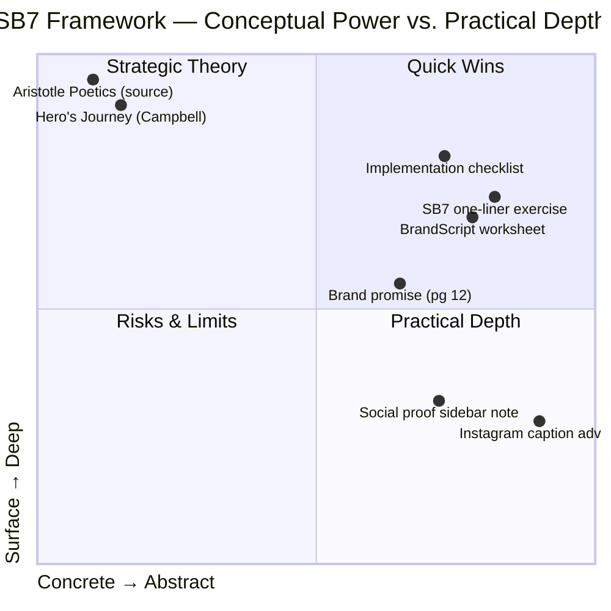

#### Structural Evaluation

**Strengths**

The SB7 framework distills a complex body of narrative theory (Aristotle, Campbell, Vogler, McKee) into a practical check-list format that non-writers can execute. By forcing every brand touchpoint through the same seven-step filter, Miller creates a rare instance of marketing methodology that is both theoretically sound and immediately actionable.

The emphasis on **loss aversion** in Step 6 is counter-intuitively valuable. Most brands hyper-focus on the aspirational payoff and skip the negative outcome, leaving motivational energy on the table. Miller's insistence on naming what's at stake is well-grounded in behavioral economics.

**Limitations**

| Concern | Detail |
|---------|--------|
| Over-simplification | Reduces a rich narrative tradition to a formula; brands with genuinely innovative products may outgrow the hero-journey default |
| Audience ceiling | The framework is optimized for B2C and mid-market B2B; political, artistic, or luxury positioning may not fit a "problem-solution" arc |
| Brand-as-guide dependency | Miller's insistence that brand must always be the guide can feel hollow for brands whose customers want to feel like co-creators, not guided subjects |
|Metric gap | The book is largely qualitative; it offers no controlled study comparing SB7 framing against alternative messaging on conversion rate |

---

#### Conceptual Depth: What Miller Borrows and What He Adds

Miller's debt to Joseph Campbell's **monomyth** is explicit, and to Robert McKee's **story structure** is implicit. Where he truly adds something original is the **operational translation**: turning mythic pattern into a fill-in-the-blank marketing worksheet that a small-business owner without creative training can complete in an afternoon.

The philosophical layer — external, internal, and philosophical problems — is the most teachable kernel. It forces marketers past the habit of naming only the external problem ("you're behind on payroll") and into the deeper motivational territory ("you feel you're failing as a leader") that actually drives buyer decisions.

---

#### Competitive Landscape

In the market for marketing-framework books, Building a StoryBrand occupies a specific niche:

- vs. *Positioning* (Ries & Trout): SB7 adds narrative kinematics to the static claim-owns-the-word model
- vs. *Contagious* (Berger): SB7 is less about virality mechanics and more about foundational message clarity
- vs. *DotCom Secrets* (Russell Brunson): Both frameworks are heavily visual/template-driven; SB7 leans more toward B2B and brand marketing

---

#### Practical Verdict

Recommended as a **first framework** for any team that has not yet formalized its messaging. The BrandScript digital tool (companion website) is worth the price of the book on its own. Teams already fluent in positioning theory will find the framework reassuring rather than revelatory, though the seven-element audit checklist remains genuinely useful as a recurring thought exercise.
