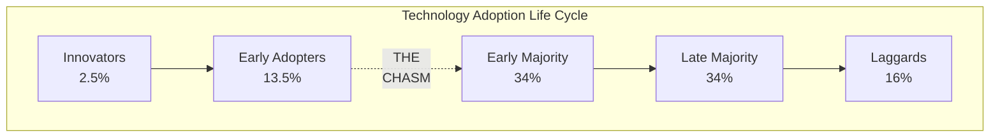
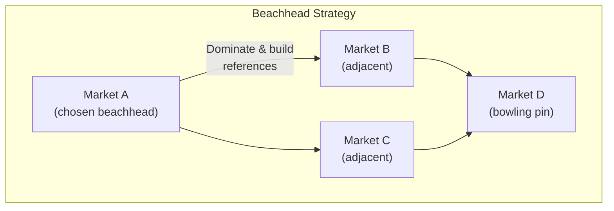

## The Technology Adoption Life Cycle

The bell curve represents how different customer segments adopt
discontinuous innovations over time. Each segment has a distinct
psychographic profile requiring different marketing approaches.

---

## The Five Customer Segments

### Innovators (Technology Enthusiasts)
- **Motivation**: pure curiosity about new technology
- **Buying criteria**: is it new and interesting?
- **Role**: validate your technology, provide early feedback
- **Risk**: will buy even if the product is incomplete

### Early Adopters (Visionaries)
- **Motivation**: gain competitive advantage through early adoption
- **Buying criteria**: does it enable a strategic breakthrough?
- **Role**: high-profile references, buzz generators
- **Risk**: impatient — want results in 6-12 months

### The Chasm — Where Products Die
Visionaries and pragmatists do not trust each other. Visionaries buy
the potential. Pragmatists buy the proof. There is no bridge between
these worldviews — only a chasm.

### Early Majority (Pragmatists)
- **Motivation**: productivity improvement with proven technology
- **Buying criteria**: does it work? Who else uses it?
- **Role**: sustainable revenue, market credibility
- **Risk**: risk-averse; demand references and whole product

### Late Majority (Conservatives)
- **Motivation**: keep up with industry standards
- **Buying criteria**: is it the standard? Is it from a big vendor?
- **Role**: volume revenue
- **Risk**: technology-averse; prefer bundled solutions

### Laggards (Skeptics)
- **Motivation**: avoid technology unless essential
- **Buying criteria**: do I have to?
- **Role**: none — they only adopt when there is no alternative

---

## The Beachhead Strategy

### Steps to Cross the Chasm

1. **Target a beachhead segment.** Choose one narrow, specific market
   where your product solves a compelling problem. Do not try to be
   everything to everyone.

2. **Assemble the whole product.** Identify what the mainstream
   customer needs beyond your core technology — implementation,
   training, support, integrations — and partner or build to fill
   the gaps.

3. **Create the compelling reason to buy.** For the beachhead segment,
   articulate why they must act now. What is the cost of inaction?

4. **Position against competition.** Define the category you lead.
   Frame the incumbent as outdated or inadequate.

5. **Price for the mainstream.** Visionaries pay premium prices.
   Pragmatists pay market-comparable prices for proven value.

6. **Sell through the right channel.** Pragmatists buy from
   established vendors with proven sales channels.

---

## Whole Product Concept

| Component | Description |
|-----------|-------------|
| Generic Product | The core technology (what you build) |
| Expected Product | What the customer expects (minimum viable) |
| Augmented Product | Full solution including training, support, integrations |
| Potential Product | The complete ecosystem the product could become |

Mainstream customers buy the augmented product, not the generic one.
Crossing the chasm requires you to deliver the whole product, even if
you must partner to do it.

---

## Key Lessons

- **Visionaries will kill you with kindness.** They buy early, praise
  loudly, then abandon you when the next shiny thing appears. Build
  your mainstream business on pragmatists, not visionaries.
- **You cannot cross the chasm gradually.** It is a binary transition.
  Either you commit to a beachhead and go all-in, or you remain a
  marginal player.
- **References are the currency of the mainstream.** Pragmatists trust
  other pragmatists. You need case studies, references, and industry
  validation.
- **Positioning determines perception.** If customers see you as a
  niche player, you will remain one. If you define yourself as leading
  a new category, they see you differently.

---

## Practical Applications

### For Startups
- Resist the temptation to target everyone. Pick one vertical.
- Identify 3-5 potential beachhead segments; score them by access,
  compelling reason to buy, and lack of entrenched competition.
- Before expanding, ensure your beachhead is fully won — dominant
  market share in that segment.

### For Product Managers
- Separate features for visionaries (breakthrough demo) from features
  for pragmatists (reliability, support, integration).
- Invest in the whole product — documentation, onboarding, customer
  success — before adding more core features.

### For Marketers
- Create different messaging tracks for early adopters and mainstream
  customers. Do not use the same website or sales deck for both.
- Build a reference program. Make it easy for satisfied customers to
  share their stories.
