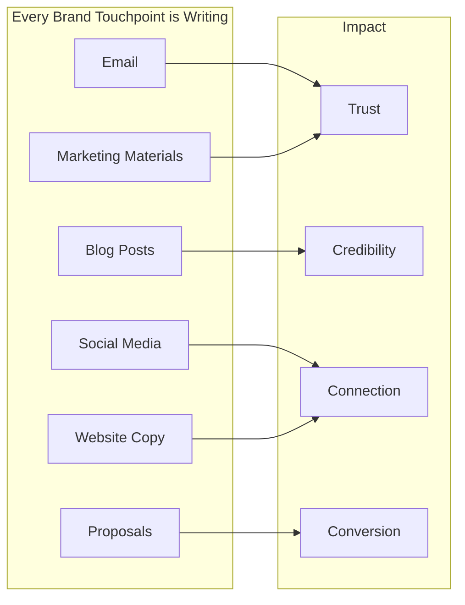
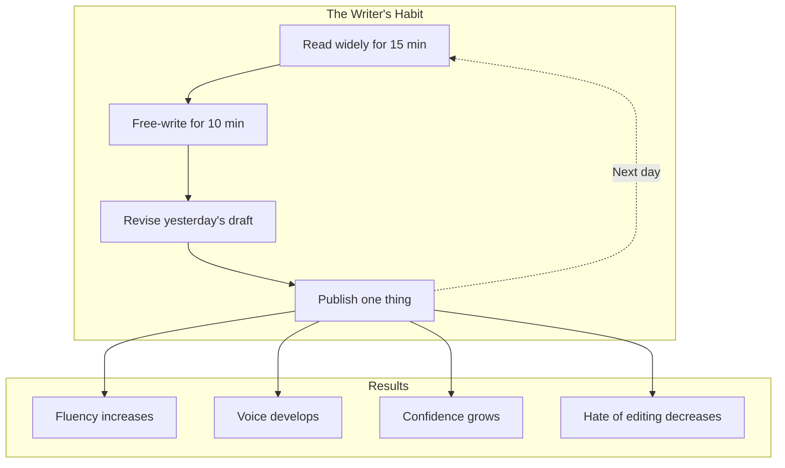
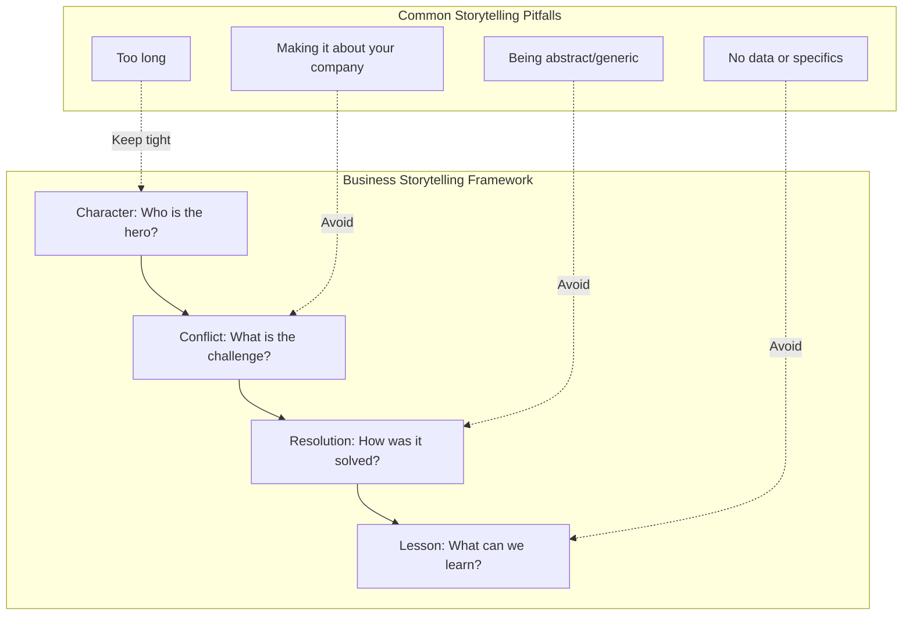

## Why Writing Matters

Handley's central argument: in the digital age, everyone is a
writer. The quality of your writing is the quality of your brand.

---

## The Writing Habit

Handley emphasizes writing as a daily practice, not a special
event:

---

## Readability Rules

Handley provides specific, practical guidelines for making content
easier to read:

| Rule | Why It Works |
|------|-------------|
| One idea per paragraph | Reduces cognitive load |
| Short sentences (14-18 words avg) | Easier to parse |
| Active voice | More direct and energetic |
| Avoid jargon and buzzwords | Sounds human, not corporate |
| Use bullet points and lists | Scannable at a glance |
| Write like you talk | Natural, conversational tone |

---

## Headlines Explained

Handley dedicates significant attention to headlines because they
are the most important sentence you will write:

| Type | Example | Why It Works |
|------|---------|--------------|
| How-to | "How to Write Better Emails in 5 Minutes" | Promise of utility |
| List | "10 Grammar Rules That Will Make You Sound Smarter" | Clear structure |
| Question | "Is Your Content Killing Your Brand?" | Curiosity gap |
| Surprising | "The One Word That Destroys Trust" | Intrigue |
| Direct | "Stop Writing Bad Headlines" | Clear instruction |

**The rule:** your headline should pass the "so what?" test. If a
reader would not care, rewrite.

---

## Storytelling in Business

The best business stories are about the customer, not the company.
The customer is the hero. Your product is the guide.

---

## Key Lessons

- **Writing is a habit, not a gift.** The more you write, the
  better you get. There is no shortcut.
- **Readability is empathy.** If your reader has to work to
  understand you, you have failed.
- **Utility beats promotion.** The best content answers a question
  or solves a problem. Sell later.
- **Grammar builds trust.** Errors signal carelessness. If you
  cannot be bothered to proofread, why should they trust your
  product?
- **Your voice is your differentiator.** In a world of AI content,
  human voice and perspective are more valuable than ever.

---

## Action Plan

1. **Write every day.** Start with 15 minutes of free writing.
   No editing, no judgment. Just write.

2. **Read your draft aloud.** Your ear catches what your eyes miss.
   Awkward phrasing, run-on sentences, and weak spots become
   obvious.

3. **Simplify ruthlessly.** Cut every word that does not do work.
   Shorten sentences. Remove jargon.

4. **Lead with value.** Before you write a word, ask: what does the
   reader get from this?

5. **Build a style guide.** Standardize your brand's voice, tone,
   and grammar rules. Consistency compounds trust.
