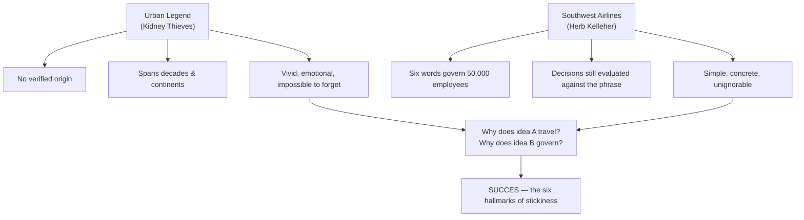
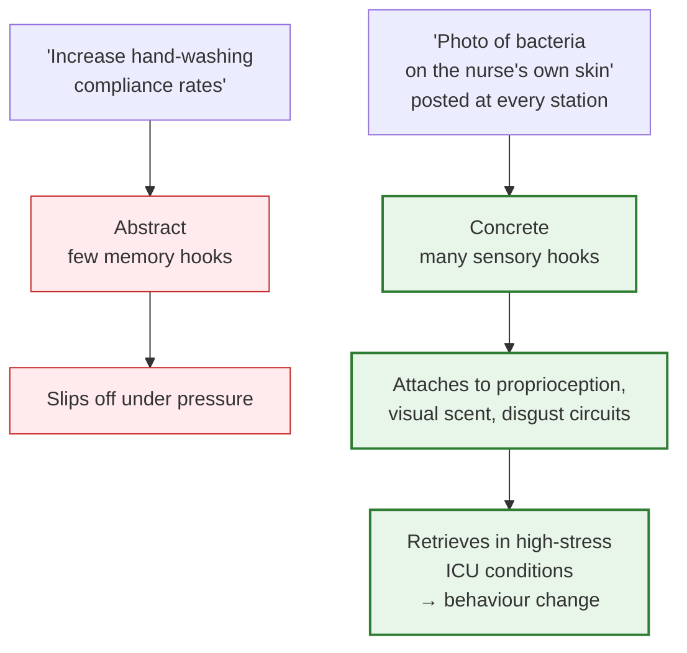
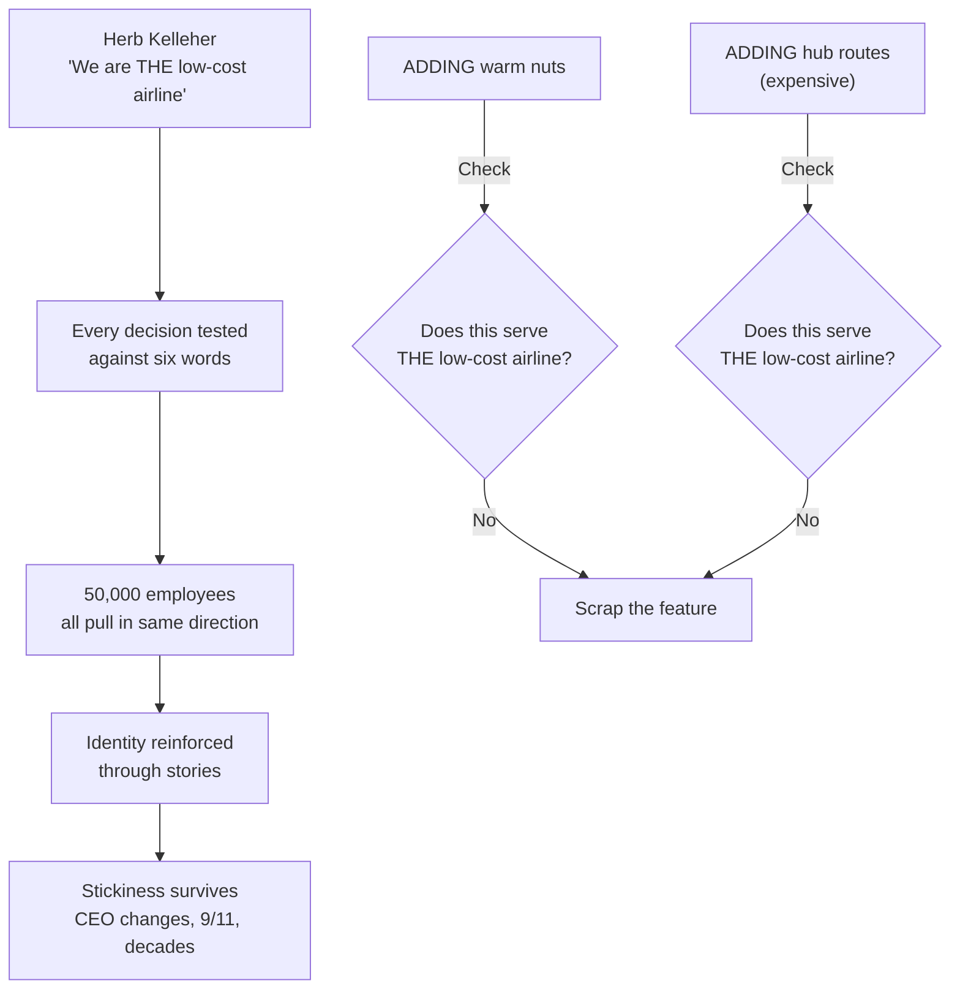

## Prologue: The Kidney Thieves and the Lesson That Stuck

The book opens with two stories designed to make *the question* sticky before introducing the answer. The first is the enduring urban legend of the kidney thieves: the businessman who meets an attractive stranger in a bar, wakes up in a bathtub full of ice with a crudely stitched incision and a phone number for the police. This story has circulated for decades, spanning continents, with no verified origin — yet it travels because it obsessively sticks. The second is the opposite in character but comparable in stickiness: Southwest Airlines CEO Herb Kelleher described the company's business model in six words — **"We are THE low-cost airline."** Same question: *What's the difference between a story that travels the world and a strategy that dies in a binder?*

---

## Chapter 1: Simple

**Problem:** Complexity is the enemy of comprehension. People don't use schemas that try to do everything — they use schemas that are elementary and deep.

**Core Argument:** Find the *one* thing that matters most and say it with ruthless clarity. The authors borrow the military concept of **commander's intent**: a brief statement that tells subordinates what success looks like even when communication breaks down. *"If we can do nothing else, we will…"* — that's the kernel. Everything else supports it.

**Example — Navistar:** CEO Dan Ustian replaced a 400-plus-page strategic plan with 17 priority initiatives with a single sentence: **"Become the global leader in truck manufacturing."** Annual planning collapsed from a four-month exercise to a one-day affair — because the intent was unassailable.

**The Prostate-Specific-Rules Fallacy:** Advocacy messages for prostate-cancer screening promoted a "90% five-year survival rate for men with localised disease" — clinically precise but emotionally limp, sounding to patients like a coin-flip. Organisations reframed it to *"Early detection saves lives."* Same data. Completely different emotional and action-driven impact. Precision that obscures is not clarity.

---

## Chapter 2: Unexpected

**Problem:** Boredom kills attention. Once people predict an experience, their brains stop paying. Messages must violate expectations — not merely with shock value, but by opening something stronger: **curiosity**.

**Curiosity Theory:** When a **knowledge gap** opens, people feel a visceral need to close it. Surprise grabs attention *now*. Curiosity keeps it. The authors cite a classic experimental paradigm: check the Goose/Fox research (liske, Shavelson, and colleagues) where participants shown trivia questions *before* reading the relevant passage retained dramatically more — the pre-exposed questions created loops their brains had to close.

**Expectation Violation — The Popcorn Experiment:** Wansink & van Ittersum found people ate 45% more popcorn when served in *larger* containers — even when the popcorn was deliberately stale. The bigger bucket violated their consumption schema, opened curiosity about the discrepancy, and altered behaviour.

**The M&M's Colour Trick:** When Mars brought back coloured M&M's in 1988 after years of all-brown candies, they released a statement saying: *"M&Ms are the only candy that come in [list of colours]."* Consumers who couldn't name the colours experienced enough uncertainty — paired with brand attachment — to drive a 17-point awareness increase. Uncertainty × Importance = Curiosity.

---

## Chapter 3: Concrete

**Problem:** Ideas are rarely lost in translation — they are lost in abstraction. Experts live in the abstract; novices need concrete entry points.

**The Dalmatian / Dormouse Test:** *"Unity"* is meaningless to most listeners. *"The Dalmatian read the book under the sleeping dormouse"* fires visual and motor simulation regions simultaneously. Concreteness is the only universal language in the brain.

**Bacteria on Hands — The ICU Study:** A major teaching hospital tried *"Wash your hands between patient contacts."* Compliance remained low. Then they posted a close-up photo of bacteria-covered hands at every nursing station. Compliance rose **50%**. Same instruction — the photo created hooks in memory that a memo could not match.

**The Velcro Book of Stories (VBS):** Concreteness is like velcro. Each concrete detail adds a hook. The more hooks an idea provides, the more independently it attaches to the memory mesh. True stickiness is hook-production — not rhetorical polish.

---

## Chapter 4: Credible

**Problem:** People resist ideas that lack external validation. Credibility is the make-or-break node between "interesting" and "accepted."

**Three Credibility Sources:**

1. **External authority** — credentials, institutional backing (doctors with MDs, a Harvard study). Functions but fatigues; people have learned to question authority systematically.
2. **Anti-authority** — the person who *lived* the experience. A paralympic athlete describing contracting polio as a child — the fever, the scrambled sensation, the terror — carries more belief-triggering power than a CDC mortality table.
3. **The Sinatra Test** — *"If I can make it there, I'll make it anywhere."* One incredibly stringent credential substitutes for broader credentialing. A delivery company that successfully moved a package to the Pentagon *the day after 9/11*, when every other carrier network was down, never needed another government credibility signal.

**Vivid Specifics Beat General Claims:** "The intersection is unsafe" — abstract, forgettable. "Cars sit through two full light cycles because the yellow phase is two seconds too short — and that gap has caused 14 accidents in 18 months" — vivid, verifiable, psychologically sticky. Specifics provide their own credibility scaffolding.

---

## Chapter 5: Emotional

**Problem:** Analysis is not a reliable trigger for action. People act on *identity* and *self-interest*, not on cost–benefit calculations. Maslow's hierarchy misleads as a ladder. People operate simultaneously on affiliation, disgust, pride, and belonging.

**The Avocado Nostalgia Study:** Researchers asked self-described *regular avocado consumers* what percentage of their lifetime avocados they had eaten *in their home state*. Their answer was dramatically higher than the national average. Not because they consumed more — but because the identity *"I'm an avocado person"* shaped their self-reported memory. Appeals to *who someone is* shift behaviour in ways pure analysis cannot.

**The GORP Campaign:** A university fundraising campaign that tapped parental identity and legacy — not the "rate of return on endowment" — dramatically outperformed a rational-value campaign. Altruism routed through identity is more powerful than altruism routed through utility.

**The Core Insight:** You cannot out-argue identity. You can only join it or redirect it.

---

## Chapter 6: Stories

**Problem:** Information without context doesn't drive action. People need a **mental simulator** — a way to rehearse responses before acting in the real world.

**Stories as Flight Simulators:** Neuro-imaging research shows that when people hear stories, the same brain regions activate as if they were *physically performing the action themselves*. This creates **procedural memory** — a skill, not just a fact. Explicit instructions verbalise a rule; stories embed an *intuition* that generalises to novel situations.

**Jared Fogle — The Story That Sold Sandwiches:** Jared weighed 425 pounds in 1998. Doctors said he had less than three years to live. He replaced two daily Big Mac meals with Subway sandwiches and started walking. Over 18 months, he lost 200+ pounds. Subway didn't pay for a Super Bowl ad. They amplified one authentic story through local press. Sales grew 20%+ — one of the most cost-effective retail campaigns in history. All six SUCCES principles are active simultaneously: Simple (Subway sandwiches), Unexpected (425 to 200-minus), Concrete (sandwich, no mayo, walking), Credible (Jared told his own story), Emotional (body shame, health crisis, redemption), Stories (the entire content delivery mechanism was narrative).

**Nurse Diane Mathis and the Sepsis Patient:** A vivid real-world account from a healthcare context. ICU nurse Diane Mathis loses a patient to sepsis despite arriving at the hospital and receiving treatment. She tracks down the patient's family, visits their home, and the experience permanently transforms her practice. The story is sticky because nurses reading it intuitively simulate *themselves* in the same position — mental rehearsal before reality, which is exactly what stories are designed to do.

---

## Chapter 8: The Anatomy of Sticky Ideas — Southwest Airlines

Southwest is the book's long-form case study of **organisational stickiness** — an idea that survives across 50,000 employees, decades, CEO changes, and the catastrophic competitive shock of 9/11. Herb Kelleher used only six words at a packed annual meeting: **"We are THE low-cost airline."**

**"THE" matters.** The definite article signals exclusivity and commitment. Not a low-cost airline *among* low-cost airlines. *THE* low-cost airline. One intent. Every decision — menus, routing, staffing, gate spaces — was filtered against that phrase. You want to serve warm nuts? Check against the idea. You want to add a hub airport? Same test.

The chapter traces how sticky ideas survive not through formal systems but through *continuous story reinforcement*. Southwest is as much a tribe as an airline: the stories tell members who they are. Urban legends (the kidney thieves) make the same point in reverse — even *without* deliberate authoring, the right shape of story carries itself across populations and generations.

---

## Key Stories and Their SUCCES Profiles

| Story | Simple | Unexpected | Concrete | Credible | Emotional | Stories | Domain |
|---|---|---|---|---|---|---|---|
| Kidney thieves urban legend | — | ✓ | ✓ | — | ✓ | ✓ | Culture |
| Herb Kelleher: "THE low-cost airline" | ✓ | ✓ | ✓ | ✓ | — | ✓ | Organisation |
| Jared Fogle / Subway | ✓ | ✓ | ✓ | ✓ | ✓ | ✓ | Marketing |
| Tappers & Listeners (Newton study) | ✓ | ✓ | ✓ | ✓ | — | ✓ | Cog. Science |
| ICU bacteria photo (50% compliance lift) | ✓ | ✓ | ✓ | ✓ | — | ✓ | Healthcare |
| Paralympic athlete / polio testimony | ✓ | ✓ | ✓ | ✓ | ✓ | ✓ | Healthcare |
| Post-9/11 Pentagon delivery (Sinatra Test) | ✓ | ✓ | ✓ | ✓ | — | ✓ | Logistics |
| M&M's 1988 colour return | ✓ | ✓ | ✓ | ✓ | ✓ | — | Marketing |
| Popcorn in larger containers | ✓ | ✓ | ✓ | ✓ | — | — | Consumer psych. |
| Navistar one-sentence strategy | ✓ | ✓ | ✓ | ✓ | — | ✓ | Business |
| Avocado nostalgia survey | ✓ | ✓ | ✓ | ✓ | ✓ | — | Psychology |
| Diane Mathis sepsis story | ✓ | ✓ | ✓ | ✓ | ✓ | ✓ | Healthcare |

---

## Chapter 2 (Appendix): How to Write Reports That Get Read

The book closes with a direct-application chapter — how to translate the principles into a practical process for writing professional documents. Key prescriptions: open with the *one* finding, lead with the story (not the methodology), use the present tense, bury the caveats after the promise has been claimed, and **test the message on someone unfamiliar with your field** before circulating it. Every failed annual report, strategy paper, or policy memo in a file cabinet somewhere could be diagnosed against this short checklist.
