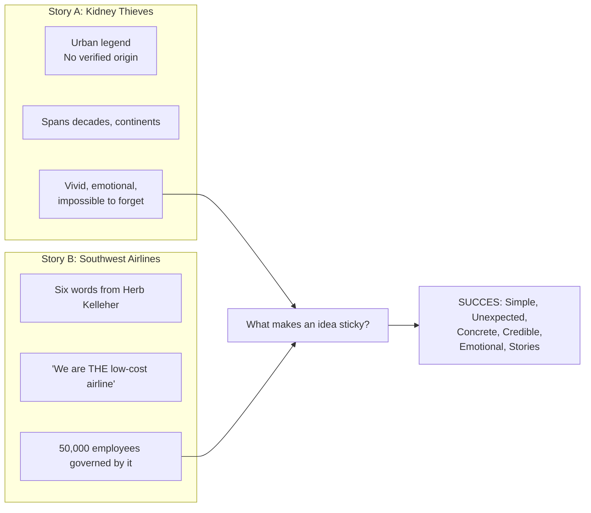
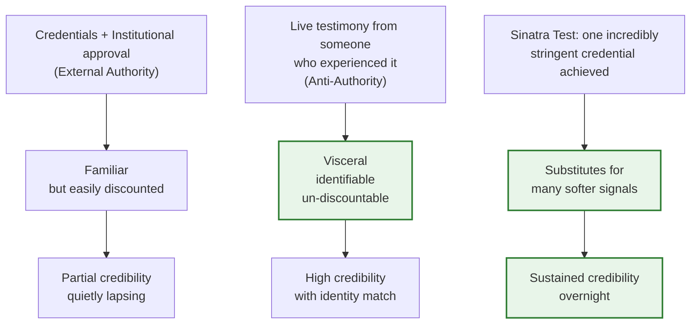
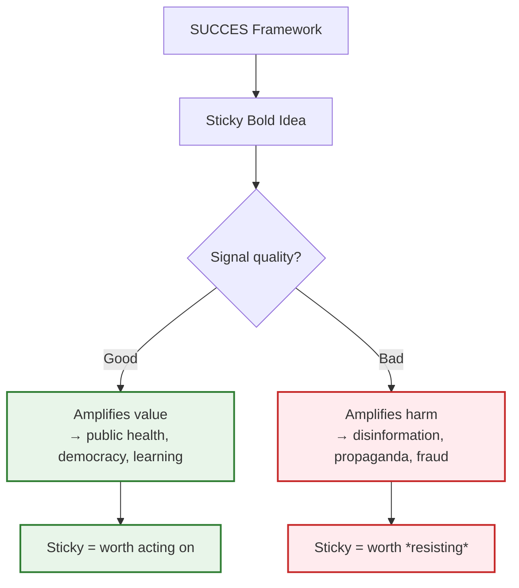

**Morgan**: Welcome back to *Book Dialogue*. I'm Morgan.

**Priya**: And I'm Priya. Today we're talking about *Made to Stick: Why Some Ideas Survive and Others Die* by Chip Heath and Dan Heath. Morgan, this book is hard to summarise in one sentence because the one-sentence summary *of* the book is, self-referentially, a one-sentence summary *of* a one-sentence summary.

**Morgan**: [laughs] Which is also the core insight. Let's start with why you wanted to read this.

**Priya**: Two reasons. Professional — I'm a UX writer now, and every feature doc I'm handed is a wall of jargon. The actual user need is buried on page four. And personal — I taught composition for three years, and the thing that drove me crazy was: I would give what I thought was crystal-clear feedback, and students would come back with revised drafts that showed they'd completely missed what I'd said. I was living the Curse of Knowledge without a name for it.

**Morgan**: That's the book's core diagnosis before it even introduces any framework. Once you know something — the tune to "Happy Birthday" — you genuinely cannot reconstruct what it was like not to know it. There's an actual experiment, right?

**Priya**: The tappers-and-listeners study from Stanford. Tappers tap out a song. Listeners try to name it. Tappers predicted about a 50% success rate — they *heard* the tune so loudly in their head they assumed the listener heard it too. Actual result: 2.5 out of 30 songs correctly identified. One in twelve. That ~20× gap between expected clarity and actual clarity — that's the whole book in one data point.

**Morgan**: So the book's thesis is basically: most communication fails not because the ideas are bad but because the expertise gap is invisible to the expert. What's the prescription?

**Priya**: Six principles — SUCCES. S for Simple, U for Unexpected, C for Concrete, Cr for Credible, E for Emotional, St for Stories. The book is structured around each principle with case studies, and the book *itself* uses all six to explain itself. The opening prologue is a masterclass in it.

---

**Morgan**: The kidney-thief urban legend.

**Priya**: Exactly. The businessman in the bar, the attractive stranger, wakes up in a bathtub full of ice with a phone number scrawled on the wall and a crudely stitched incision. No verified origin. Passed across decades and continents. And immediately after that story, the book says — and this is Herb Kelleher at Southwest Airlines, describing their business model in six words: **"We are THE low-cost airline."** Same question: *why does one story travel the world and another govern 50,000 employees for decades?* The contrast makes the question stick before the theory even starts.

---

**Morgan**: Start with Simple. This is the one people misread most — they think it means dumbing down.

**Priya**: It's the opposite. It means core extraction. Find the *one* deepest meaning and broadcast it at full volume. The military has a concept called *commander's intent*: "If we can do nothing else, we will hold the ridge and withdraw at 1600 hours." No exceptions list, no contingency tree. One sentence. The book's business example: Navistar's CEO Dan Ustian had a 400-page strategic plan covering 17 priority initiatives. He replaced it with: *"Become the global leader in truck manufacturing."* Annual planning collapsed from a four-month exercise to a one-day affair.

**Morgan**: And the prostate screening example really landed for me. "90% five-year survival rate for men with localised disease." Sounds great to a doctor. Sounds like a coin-flip to a frightened patient. They reframed it to *"Early detection saves lives."* Same data. Different emotional and completely different actionability. Precision that obscures is not clarity.

**Priya**: And the prostate-specific-rules fallacy is everywhere in corporate comms. "Engagement rate increased 14.3% quarter over quarter" kills motivation. "We reached 10,000 more people than last month" fires something completely different. Same data, different meaning.

---

**Morgan**: Next principle — Unexpected. This is the one that originally made the book famous in management training.

**Priya**: Because it behaves like a magic trick. The key insight the book adds beyond just "use surprise" is: **curiosity is more powerful than surprise**. Surprise grabs attention right now. But if every email subject line uses ALL CAPS and emoji bomb, it habituates. What doesn't habituate is curiosity. You open a knowledge gap — preview what people don't know, stage the mystery — and the brain's drive to close it does the rest.

**Morgan**: The Goose and the Fox experiment. Tell me that one.

**Priya**: Researchers gave participants a trivia quiz *before* they read the relevant passage — just the questions, not the answers. Retention more than doubled. The pre-exposed questions created loops in the brain that only the correct answer could close. It's basically the intellectual equivalent of a good trailer. You know the question before you know the answer, and your brain can't let it go.

**Morgan**: And the popcorn experiment from Wansink and van Ittersum in 2005. People ate 45% more when served in a *larger* container — even when the popcorn was deliberately made stale. The bigger bucket violated their consumption schema. They had no way to predict their own intake, so an automatic behaviour pattern overrode their conscious judgement.

**Priya**: 45% more stale popcorn. Let that sink in. People ate four and a half family-sized buckets because the bucket looked normal. It's genuinely depressing and genuinely illuminating at the same time.

---

**Morgan**: My favourite principle — Concrete. This is the one I violate most in my own writing.

**Priya**: Me too at first. I thought concrete meant "use examples." It doesn't. It means use specificity at the *Dalmatian level of detail*. "Unity" — abstract, evaporates. "The Dalmatian read the book under the sleeping dormouse" — your brain just saw both animals, didn't it? Fired visual regions. That's the only internal language that doesn't require translation.

**Morgan**: And the healthcare example — the one that proves it in the real world. A major teaching hospital tried the memo approach: *"Wash your hands between patient contacts."* Compliance stayed low. Then a close-up photo of bacteria-covered hands was posted at every nursing station. Compliance rose 50%. Same instruction, completely different outcome.

**Priya**: Same instruction, fundamentally different cognitive processing. The photo is concrete — you can *feel* the bacterial texture. And because it's concrete, it's also more credible. A fact stated in the abstract has to be *believed*. A visual experience of bacteria on the nurse's own skin is just *experienced*. There's no belief step. The hook is already set.

---

**Morgan**: Credible. The Sinatra Test. I think this is the most tactically useful of the six in real business situations.

**Priya**: It's elegant. "If I can make it there, I'll make it anywhere." You pass one incredibly stringent test and that credential substitutes for a thousand softer credibility signals. The book's example: a delivery company that moved a package to the Pentagon the day after September 11, 2001 — when every other commercial carrier network was down. They got the package through. Government clients never needed another reference after that. One hard credential beats a shelf of certifications.

**Morgan**: And anti-authority can be even more powerful. A paralympic athlete telling her own polio story — the fever, the scrambled sensation, her mother's panic — carries more belief-triggering weight than a CDC mortality table. She *is* the live data point.

---

**Morgan**: Emotional is where most corporate communication falls over because people treat it as manipulation.

**Priya**: Because it's misunderstood. The book's deepest point here: Maslow's hierarchy is read as a ladder — if we pay enough, people will be motivated. But Maslow was wrong as *a ladder*. People operate simultaneously on identity, affiliation, disgust, pride, belonging. Every decision already has an emotional component. Ignoring it doesn't make communication ethical — it makes it *dishonest*. You're just pretending the primary operating system of your audience is something it isn't.

**Morgan**: The avocado nostalgia study is my personal core memory from this book.

**Priya**: [laughs] Bring it home.

**Morgan**: Researchers asked people who identified as *regular avocado consumers* what percentage of their lifetime avocados they'd eaten *in their home state*. Their answers were dramatically higher than the national average. Not because they actually ate more avocados — but because "I'm an avocado person" shaped their *reported* consumption. Identity *shapes memory*. And identity also shapes behaviour. Appeals to cost–benefit can't dislodge identity claims. They just don't have that leverage.

**Priya**: So whenever I hear a colleague say "we need more data to convince people," I now think: 'yes, but first ask — *who* are you asking them to be?' The data matters less if you've identified the right identity.

---

**Morgan**: Stories — the triumph where all six principles converge.

**Priya**: The neuroscience is remarkable. Neuro-imaging shows that when people hear stories, their brains light up the same regions that would activate if they were *physically performing the action*. Stories don't tell you what to think; they give you a **mental flight simulator** for what to do. They create procedural memory — not a fact to recall, but a skill to deploy.

**Morgan**: And Jared Fogle's story is the impossible example. He weighed 425 pounds. Doctors gave him three years. Two daily Big Macs replaced with Subway sandwiches and walks. 200+ pounds gone. No Super Bowl ad. No agency spend. One authentic story amplified through local press. Subway sales grew 20%+ in 18 months.

**Priya**: Let's run SUCCES in real time on Jared's story. [counts on fingers] Simple — Subway sandwiches. Unexpected — 425-pound guy replaces Big Macs with sandwiches. Concrete — two footlongs, no mayo, walking. Credible — Jared telling his own story on camera. Emotional — body shame, health crisis, redemption. Stories — the entire *mechanism* of the campaign was the story. Six for six.

**Morgan**: Which is also why it's the most complicated example in the book.

**Priya**: [pause] Yes. Fogle pleaded guilty to sex crimes involving minors in 2015.

**Morgan**: The same SUCCES principles that made his weight-loss story convincingly sticky were the same principles at work in the deceptive performance that followed.

**Priya**: And this is where the book's moral neutrality becomes a liability, not just a design choice. Sticky ideas are amplifiers — they amplify whatever signal you put through them. Nothing in SUCCES says the signal has to be good. The book builds an amazing chisel. It never says what material you're allowed to carve.

---

**Morgan**: The book's book-within-a-book story is Southwest Airlines. Herb Kelleher, again, now at scale — but different.

**Priya**: Southwest is the long-form case study of organisational stickiness. *"We are THE low-cost airline."* The definite article — *THE* — is doing so much work. It's exclusive, it's committed, it closes ambiguity. Want to serve warm nuts on the flight? Check against "THE low-cost airline." Want to add hub airports? Same test. Every decision, from operational to strategic, was filtered through six words.

**Morgan**: And the storytelling sustains it. Southwest is as much a tribe as an airline. The stories tell members who they are. This is why the book returns to the kidney-thief framing in reverse: you don't *have* to author the stories intentionally. You just have to get the structure right, and stories will find their own way. Bad stories propagate without an author. Good stories propagate even more reliably when you give them a good structure.

**Priya**: The book's counter-intuitive move is saying: stickiness isn't about charisma, it's about *construction*. The tapper doesn't need to sing better. She needs to reconstruct the song from the listener's mental scratchpad. That's a design problem. And design problems are, in principle, solvable.

---

**Morgan**: Let me give you my second-read reading because my first read and second read were quite different.

**Priya**: That's the interesting part. What shifted?

**Morgan**: The Curse of Knowledge. On first read, I thought of it as a communication problem — easier said than fixed. On second read, I realised it's more fundamental than that. Once your brain has stored "early detection saves lives" as a gestalt, you cannot un-know it, and you cannot reconstruct what it was like to encounter the raw data without the interpretation. The Heaths give you rhetorical fixes at the symptom level — test on novices, strip jargon, use examples. But the underlying *architectural* problem is cognitive. The best-trained communicators meet a new Curse wall every time they move up a level of expertise. Real durable fix is pedagogical — scaffolding from the learner's current schema forward — not rhetorical.

**Priya**: Which is a meaningful distinction. Communication is tested by can-you-hold-attention. Learning is tested by can-you-transfer. Same root problem, two different solutions. The Heaths answer the *attention* version — which is where most professional problems live. The *transfer* version — which is where most educational problems live — is a separate discipline.

**Morgan**: That's strangely comforting. I thought I was failing as a communicator. Turns out I'm just at the boundary of a different problem entirely.

**Priya**: [laughs] Self-compassion for communicators. Another gift from the book.

---

**Morgan**: And what do we make of it in 2025? Because the book predates TikTok, deepfakes, and AI-generated content becoming indistinguishable from human-authored content.

**Priya**: Two additions the 2025 context demands. First: **Verifiability** as a prerequisite for Credibility. The paralympic athlete's story doesn't need verification — her identity *is* the data. A CEO's sustainability claim in a LinkedIn post *does* need verification. In an era where AI can generate realistic testimony on camera, the Sinatra Test needs a verification layer: *can an independent observer confirm this claim?* Second: **algorithmic stickiness ≠ sticky**. An idea can travel through a network via repost chains and engagement bait without ever attaching securely to anyone's actual memory. The Heaths don't address how to distinguish *attention* from *retention*. Making ideas that survive *scrutiny* — which is the harder test — is the longer-term work.

**Morgan**: So SUCCES 2.0?

**Priya**: SUCCES + V + AnR. S-U-C-C-E-S, Verifiable — can it be checked, Resilient — can it survive inverse scrutiny. The framework still holds. It just needs an upgrade.

---

**Morgan**: Let me try to land a one-sentence verdict. Made to Stick is an idea-proof manual that itself stands as evidence that its principles work: nearly two decades later, people still quote it, train from it, and apply it.

**Priya**: I'd add: read it once to get the principles, then read it again to find which one you systematically violate. I violate Concrete constantly. My first draft of any document lives in the abstract. This book gave me a name for that pattern and a fix. I'm campaigning for this to be required reading at every job that involves an email.

**Morgan**: Same. Every report, every pitch, every email — one principle check. You'd be amazed how fast things improve.

**Priya**: Morgan, any final word before we sign off?

**Morgan**: Find the core. That's it. That's the whole thing. And the book itself is evidence that the advice works.

**Priya**: Find the core.

**Morgan**: Find the core.

**Priya**: Thank you for listening.

**Morgan**: Until next time.
