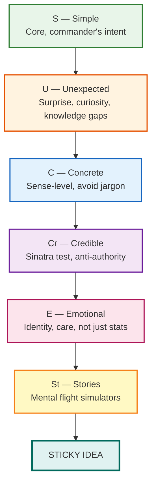

## Overview

The book starts with two stories that mean to make you *feel* the question before you understand it: the kidney-thief urban legend — apocryphal, unverified, and spread across the globe for decades — and a single six-word sentence from Southwest Airlines' Herb Kelleher: *"We are THE low-cost airline."* They occupy opposite poles of credibility and intent, yet both are sticky. The book asks: *why?* The answer, they argue, comes down to six hallmarks — Simple, Unexpected, Concrete, Credible, Emotional, and Stories — and the cognitive bias that undermines them all: the **Curse of Knowledge** (once you know something, you cannot reconstruct what it was like not to know it). Rigorous in its research base (Tversky, Kahneman, Loftus, Tajfel, Wansink) and vivid in its case selection, *Made to Stick* remains the most applied communication framework in modern business and nonprofit practice.

---

## The SUCCES Framework at a Glance

Each principle is a **diagnostic**, not a slogan. Intentional design is required at every stage.

---

## Executive Summary

| Chapter | Title | Single Sentence |
|---|---|---|
| — | Prologue | Kidney thieves + Herb Kelleher: two sticky ideas from opposite poles |
| 1 | Simple | Strip to one core meaning; every added rule is one more thing to forget |
| 2 | Unexpected | Open curiosity gaps — the brain cannot resist a question it wants answered |
| 3 | Concrete | Abstract ideas evaporate; use the Dalmatian level of specificity |
| 4 | Credible | One Sinatra credential beats a hundred credentials; vivid details are honest |
| 5 | Emotional | Identity overrides analysis — appeal to who people believe they are |
| 6 | Stories | Narratives let listeners rehearse action inside their own brains |
| 8 | Anatomy of Sticky Ideas | Southwest Airlines: 50,000 employees governed by six words |

---

## 10 Key Takeaways

1. **Stickiness is a property of ideas, not people** — no special talent needed; anyone can apply SUCCES.
2. **Curse of Knowledge is the root cause of idea failure** — experts literally cannot reconstruct the novice's mental scratchpad.
3. **Simple = ruthless core extraction** — "THE low-cost airline" governs 50,000 decisions; a 400-page plan governs none.
4. **Curiosity is more durable than surprise** — open a knowledge gap and people will engage to close it.
5. **Concreteness is the only universal language** — it bypasses translation; it creates velcro hooks in memory.
6. **One Sinatra credential is worth a thousand credentials** — a single stringent test beats exhaustive diplomas.
7. **Identity beats analysis** — ask "who does my audience believe they are?" not "how do they calculate net benefit?"
8. **Stories are mental flight simulators** — they give listeners rehearsal for action before they act in the real world.
9. **Bad ideas stick and good ideas die — structure matters more than merit.**
10. **Communication is a design problem** — treat your message like a product, not a performance.

---

## Who Should Read

| Reader | Value |
|---|---|
| Health professionals improving protocol compliance | Very High — bacteria-photo case study proves concreteness beats policy memo |
| Startup founders writing pitch decks | Very High — SUCCES maps directly to pitch narrative structure |
| Managers and leaders communicating strategy | Very High — avoid the strategy graveyard |
| Marketers and brand storytellers | Very High — the framework is directly applicable to campaign design |
| Teachers and instructional designers | High — explains why lessons land for some and not others |
| UX writers crafting error messages and onboarding | High — concrete + unexpected solves the "wall of text" problem |
| Nonprofit campaign staff | Medium-High — sticky emotional framing for donor engagement |
| Politicians and policy communicators | Medium — branch the framework; policy language is usually too cautious for SUCCES |
| Academic researchers presenting findings | Medium — the expert–novice gap is the central problem |

---

## Core Themes

### The Curse of Knowledge

The Stanford tappers-and-listeners experiment (Elizabeth Newton) provides the empirical backbone: tappers believed communication was ~50% effective; actual correct identification was 2.5 out of 30 attempts. The gap — roughly 20× — is not dishonesty or incompetence. It is cognitive architecture. Once knowledge is stored, the brain automatises it, de-labels it, and overwrites the pathway that originally constructed it. You cannot consciously *un-know* without genuine re-learning. The Heaths recommend testing on naive subjects, stripping jargon, and mapping the listener's schema — but the deeper problem is structural, not rhetorical, and it re-emerges at each new level of expertise.

### The Velcro Model of Memory

Human memory is not a filing cabinet with indexed entries. It is a mesh. The more hooks an idea provides, the more independently it attaches. SUCCES is a **Hook Production System**. Each concrete detail, each vivid image, each emotional beat adds another loop to the velcro surface. Awareness of this model changes how writers think about revision: every sentence should ask *what hook does this add?*

### Ideas Are Products

The book reframes communication from rhetoric to design. You don't successfully *deliver* a message by speaking it clearly; you **design** the idea itself so it cannot help but survive. This is the deeper intellectual contribution — a reframe that reframes everything else in the book.

### Ethics and the Amoral Chisel

A feature the book does not emphasise: SUCCES is a power amplifier, morally neutral. Sticky ideas made Jared Fogle a household name before that identity later collapsed. The same mechanism that makes a public-health message travel makes a conspiracy theory travel. A 2025 edition would need at least two additional principles: **Verifiable** (AI content, deepfakes, source authenticity) and **Resilient** (not just getting attention, but surviving scrutiny).

---

## Why It Matters

*Made to Stick* changed how the English-speaking corporate and nonprofit world thinks about communication. Phrases like "find the core," "open a knowledge gap," "be concrete not abstract," and the word "sticky" itself migrated from this book into everyday professional vocabulary. It is also directly responsible for a generation of communication training programs across FTSE and Fortune 500 companies, nonprofit leadership development, and public health guideline design. It is short (~336pp, fiction-like pacing), well-researched, and substantially more applicable than most of the management bestsellers of its era. Nearly two decades later it stands as the foundational text.

---

## Related Books

| Book | Connection |
|---|---|
| **Switch** by Chip & Dan Heath | Direct companion — the same duo applies the Rider-Elephant-Path model to *changing behaviour*, not just shaping ideas |
| **The Tipping Point** by Malcolm Gladwell | Sibling — also about what makes messages spread; Gladwell focuses on social context; Heaths focus on idea structure |
| **The Pyramid Principle** by Barbara Minto | Foundational predecessor — structured thinking and "the answer first" share SUCCES's "find the core" impulse |
| **Talk Like TED** by Carmine Gallo | Complement — SUCCES applied specifically to the public-speaking domain |
| **Storytelling with Data** by Cole Nussbaumer Knaflic | Complement — concrete visual communication principles applied to data presentations |
| **Nudge** by Richard Thaler & Cass Sunstein | Complement — sticky architecture applied to behaviour through choice engineering |
| **Influence** by Robert Cialdini | Conceptual ancestor — credibility, emotional binding, and authority expanded from psychology to practical persuasion |
| **The Pre-Suasion** by Robert Cialdini | Follow-up — the *setup* of an idea before it is heard, deepening the credibility work in Made to Stick |

---

## Final Verdict

*Made to Stick* is the rare business book that is both shorter and more useful than 90% of what sits alongside it on the shelf. Its framework — SUCCES — is memorable, testable, actionable, and has now survived two decades of professional training applications. It has limitations: it's silent on de-sticking bad ideas, conventional in its Western examples, and morally neutral in a way that matters at the 2025 inflection point of algorithmic content. But as a practitioner's manual for one of the most universal professional challenges — *getting your message to survive* — it is as close to essential as this genre gets. **8.5/10. Required reading for anyone whose job involves changing minds.**
