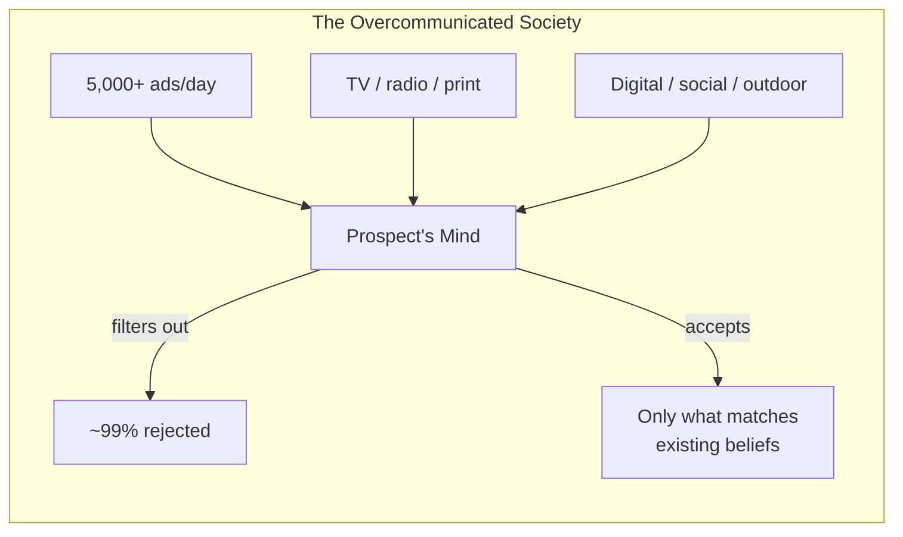
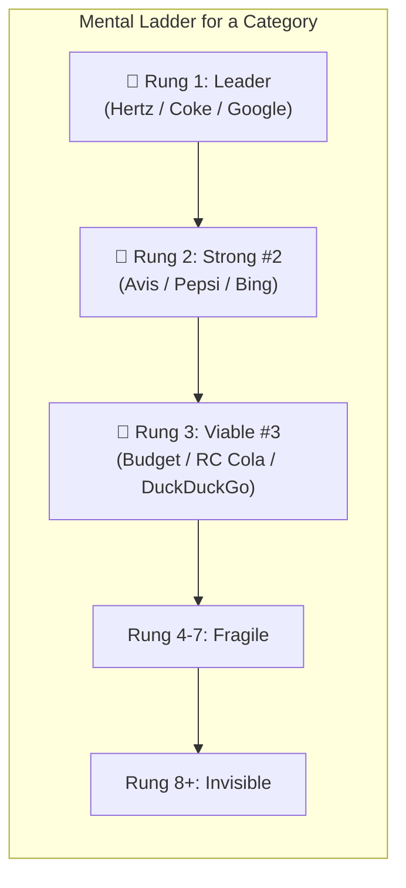
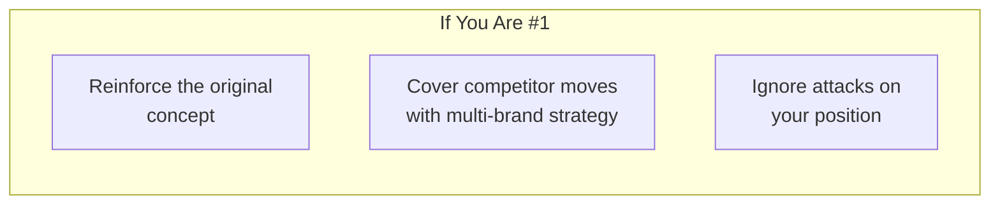
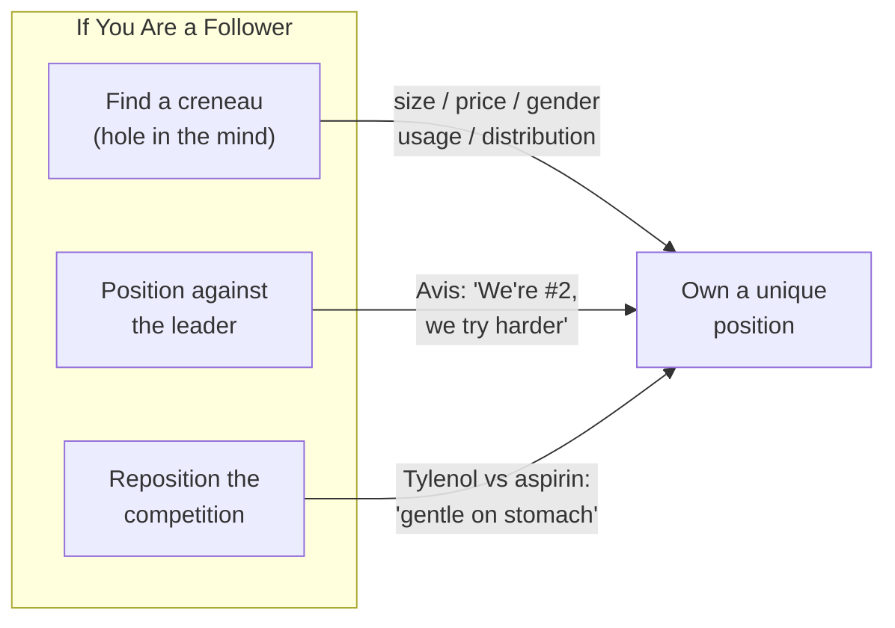
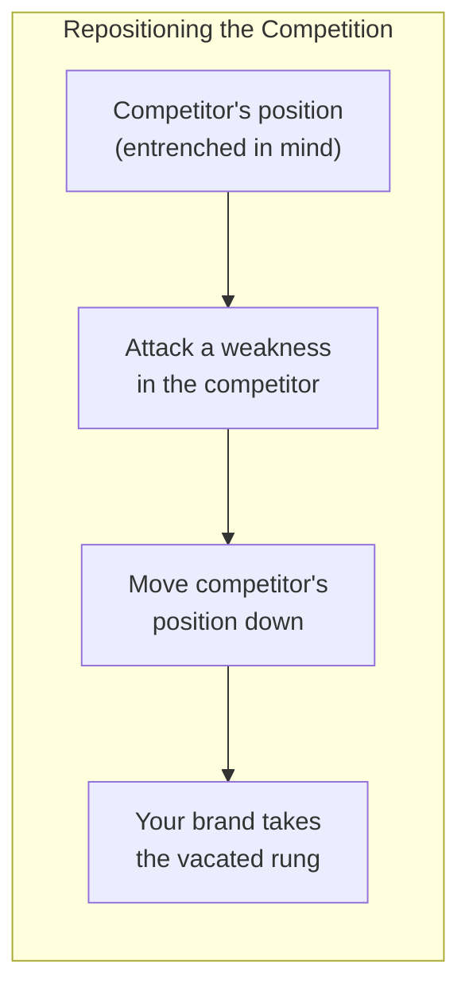
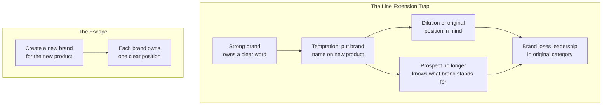

## The Overcommunicated Society

Ries and Trout's diagnosis: consumers are bombarded with thousands of
messages daily. The mind defends itself by accepting only information
that reinforces prior knowledge. Traditional advertising (shouting
louder) is futile. The only way in is to work with what is already
there.

---

## The Product Ladder

Each product category has a ladder in the prospect's mind. Each rung
holds one brand. The top rung is nearly impossible to dislodge. The
average person holds no more than 7 brands per ladder. Beyond rung 3,
you are barely visible.

---

## Positioning Strategies by Market Role

### Leader Strategy

The leader's job is not to shout "we're #1" but to reinforce the
category itself. P&G's multi-brand strategy (Tide, Cheer, Bold, Era)
is the exemplar — multiple brands, each owning a distinct position.

### Follower Strategy (The Against Position)

Classic examples:

- **Avis**: "We're number two, so we try harder." Embraced #2 status,
  turned weakness into a virtue.
- **7-Up**: "The Un-Cola." Did not fight Coke/Pepsi — created a new
  ladder (the non-cola alternative) and owned it.
- **Volkswagen**: "Think Small." In an era of big American cars, VW
  owned the small-car creneau.

### Repositioning the Competition

To make room for your idea, move the competitor's position. Tylenol
repositioned aspirin by associating it with stomach bleeding.
Advil later repositioned Tylenol by associating it with liver damage.

The key: talk about *their* product, not yours. The prospect's mind
rewires its perception of the competitor, making space for you.

---

## The Line Extension Trap

The teeter-totter principle: one name cannot stand for two different
products. When you push one side up (the new product), the other side
(the original) goes down.

**Examples of line extension failure:**
- **Volkswagen**: From "Think Small" Beetle to Dasher/Audi — blurred
  the simple position → sales collapsed
- **Cadillac**: Seville (smaller Cadillac) undermined "big luxury car"
- **Protein 21**: Shampoo leader → extended to hairspray → share
  dropped from 13% to 2%

**The counterexample (successful non-extension):**
- **Dockers**: Levi's created a new brand instead of "Levi's Dress
  Pants" → $1.5B brand

---

## The Five Rules of Positioning

1. **Be first in the mind** — The easiest way in. If you cannot be
   first, create a new category where you can be.

2. **Find a creneau** — A hole the leader has not filled. Size, price,
   age, gender, time of day, distribution channel.

3. **Get a powerful name** — The name is the hook. Avoid initials,
   generic terms, and meaningless labels.

4. **Reposition when necessary** — Move the competitor out of the
   prospect's mind, then move yourself in.

5. **Stick to it** — Positioning requires consistency over years, not
   campaigns. Changing positions is nearly impossible.

---

## When NOT to Position (The "No" Strategy)

Ries and Trout argue that the wisdom of positioning often lies in
what you *don't* do:

- **Don't compete head-on** against a leader with a strong position
- **Don't line extend** unless you meet narrow conditions (no
  competitors, small volume, commodity product)
- **Don't rush** — wait until you can make a first impression that
  sticks
- **Don't contradict** what the prospect already believes — work with
  it, not against it

---

## The Positioning Process

| Step | Question | Action |
|------|----------|--------|
| 1 | What position do you own? | Survey the prospect's current perception |
| 2 | What position do you want? | Select a single word/idea to own |
| 3 | Whom must you outgun? | Identify competitors who already occupy adjacent positions |
| 4 | Do you have enough money? | Positioning requires sustained investment |
| 5 | Can you stick it out? | Take a 5-10 year view |
| 6 | Do you match your position? | All touchpoints must reinforce the position |

---

## Key Lessons

- **Perception is reality.** There is no objective "truth" about a
  product — only what the prospect believes.
- **Simplify to one idea.** The mind rejects complexity. A single word
  (safety, overnight, un-cola) is worth a thousand features.
- **Sacrifice is essential.** You cannot be everything to everyone.
  Focus is the price of entry into the mind.
- **Leaders should not innovate radically.** The leader's job is to
  cover competitive moves with new brands, not to risk the core
  position.
- **Outside-in thinking is hard.** It requires ego suppression. The
  question is not "what do we want to say" but "what will the prospect
  accept?"

---

## Practical Applications

### For Startups
- Identify the category ladder you want to climb — or create a new one
- If an incumbent owns the top rung, do not attack head-on
- Find an unoccupied creneau (price, audience, use case) and own it
- Name the product for the position before building it

### For Established Brands
- Audit what word you currently own in the mind
- Kill line extensions that dilute the core position
- If threatened, do not chase the attacker — reinforce your original
  concept
- Use multi-brand strategy for adjacent markets, not line extension

### For Personal Branding
- Identify the one thing you want to be known for
- Do not try to be the "expert in everything"
- Position yourself against the established authority in your field
- Be first in a niche rather than a follower in a broad space
