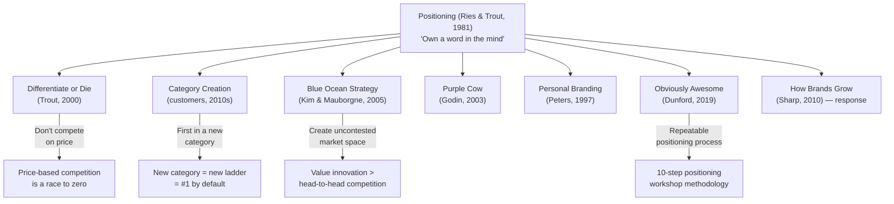

## Immediate Impact (1981–1995)

On publication, *Positioning* was not an instant bestseller. Its ideas
spread slowly through advertising agencies and MBA programs. By the
mid-1990s, the term "positioning" had entered the standard vocabulary
of marketing — so thoroughly that most practitioners no longer
remembered who coined it.

Key institutional adoptions:

- **Procter & Gamble** already practiced multi-brand positioning
  (Tide, Cheer, Bold, Era as distinct brands) before the book. Ries
  and Trout held P&G up as the exemplar, which accelerated adoption
  of the framework across CPG.
- **Young & Rubicam, Ogilvy, BBDO** — the major ad agencies of the era
  — incorporated positioning into their pitch frameworks by the late
  1980s.
- **The Marketing Science Institute** funded academic research into
  positioning that proliferated through the 1990s, though much of it
  contested the book's claims.

---

## Influence on Subsequent Frameworks

### Category Creation (the "New Ladder" school)

The direct intellectual descendant of *Positioning* is the category
creation movement. Companies like Salesforce (cloud CRM), HubSpot
(inbound marketing), and Slack (team messaging) did not out-compete
incumbents — they built new ladders and claimed the top rung. The
playbook is pure Ries & Trout: find a creneau, name it, own it.

### Blue Ocean Strategy

Kim & Mauborgne's *Blue Ocean Strategy* (2005) formalized the "create
a new ladder" idea into a structured framework with tools like the
Strategy Canvas and the Eliminate-Reduce-Raise-Create grid. The core
insight — do not compete in an existing market (red ocean); create a
new one (blue ocean) — is *Positioning*'s creneau strategy with a
methodology attached.

### Obviously Awesome

April Dunford's *Obviously Awesome* (2019) directly addresses the
gap in *Positioning*: how to *execute* positioning. Her 10-step
workshop (competitive alternatives, unique attributes, value,
market category, etc.) gives practitioners a repeatable process. She
explicitly credits Ries & Trout as the originators while adding the
operational rigor that their book lacks.

---

## Academic Critique

The most systematic challenge came from the Ehrenberg-Bass Institute
(University of South Australia) and Professor Byron Sharp:

| Ries & Trout Claim | Empirical Finding |
|---|---|
| Being first is a near-insurmountable advantage | Pioneers fail 47% of the time; many enduring leaders were not first (Golder & Tellis, 1993) |
| Brands should own one word | Double jeopardy law: big brands have many buyers who know them for many things, not one thing |
| Line extension always dilutes | Brand extension success depends on fit, category structure, and parent strength — not a simple rule |
| The mind uses product ladders | Associative network theory shows brands are nodes in a connected web, not isolated rungs on a single ladder |

However, Sharp's own data supports a core *Positioning* insight:
brands that are mentally available (easy to recall in a buying
situation) gain share. The mechanism differs (mental availability vs.
ladder position), but the strategic implication — invest in salience,
not just features — converges.

---

## The Authors' Later Work

| Book | Year | Contribution |
|------|------|-------------|
| **Bottom-Up Marketing** | 1989 | Tactics drive strategy, not the reverse |
| **The 22 Immutable Laws of Marketing** | 1993 | Condensed aphorisms; expanded audience significantly |
| **Horserace** | 1994 | Positioning applied to politics |
| **The New Positioning** | 1996 | Updated with digital-era commentary |
| **Differentiate or Die** | 2000 | Survival stakes of differentiation |
| **The Origin of Brands** | 2004 | Ries & daughter Laura on brand proliferation through category splitting |

---

## Key Defenders

**Seth Godin**: "Positioning is the most important marketing book ever
written. Everything since is a footnote." Godin's *Purple Cow* and
*Tribes* extend the positioning thesis into permission marketing.

**Geoffrey Moore**: *Crossing the Chasm* includes positioning as the
fourth step of crossing the chasm. Moore recommends *Positioning* as
prerequisite reading for any tech entrepreneur.

**Jack Trout (in later interviews)**: "The principles haven't changed.
The media has. The mind has not evolved. It still filters, still ranks,
still rejects."

---

## Modern Relevance Index

| Domain | Relevance | Notes |
|--------|-----------|-------|
| CPG / Retail | High | Multi-brand strategy remains the P&G playbook |
| B2B SaaS | Medium-High | Core ideas apply; Dunford's process is more actionable |
| DTC / E-commerce | Medium | Category creation is powerful; mass-ad focus is outdated |
| Enterprise B2B | Low-Medium | Sales-driven motion reduces positioning leverage |
| Platform Economy | Low | Network effects overpower positioning dynamics |
| Personal Branding | High | Still the best framework for defining your public identity |

---

## Lasting Contribution

*Positioning* left the marketing world with a single question that had
never been asked before:

> **"What position do we own in the mind?"**

Every subsequent framework — differentiation, category creation, brand
purpose, positioning statement — is an answer to that question. Ries
and Trout did not provide the final answer. They did something harder:
they taught the industry to ask the right question. That alone earns
the book its place in the marketing canon.

The 2001 edition added margin commentary from the authors reflecting
on what they got right and wrong. Notably, they conceded no major
errors. On line extension, they acknowledged edge cases. On being
first, they refined: "First in the mind, not first in the marketplace."
The original thesis survived two decades of scrutiny largely intact —
a rare durability for a business book.
