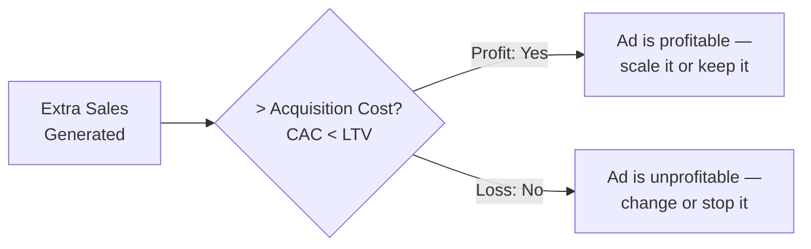
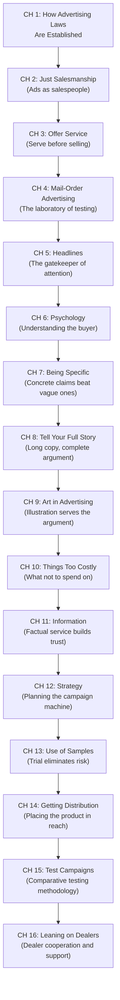
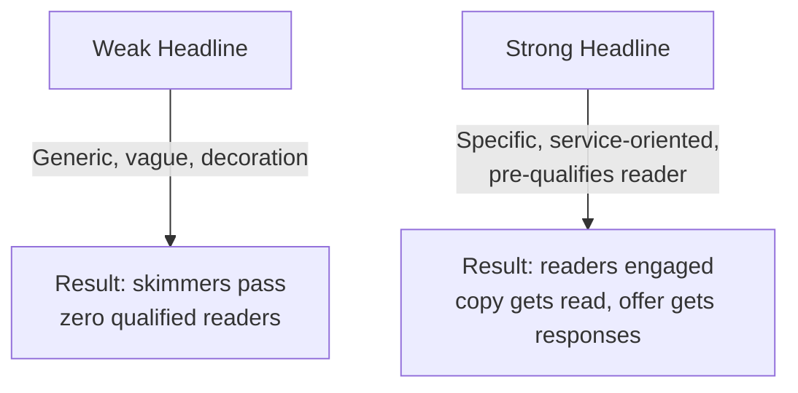
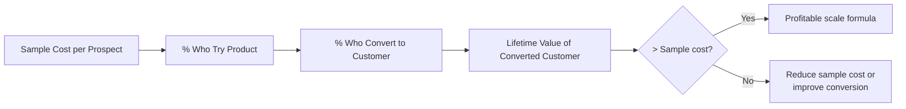
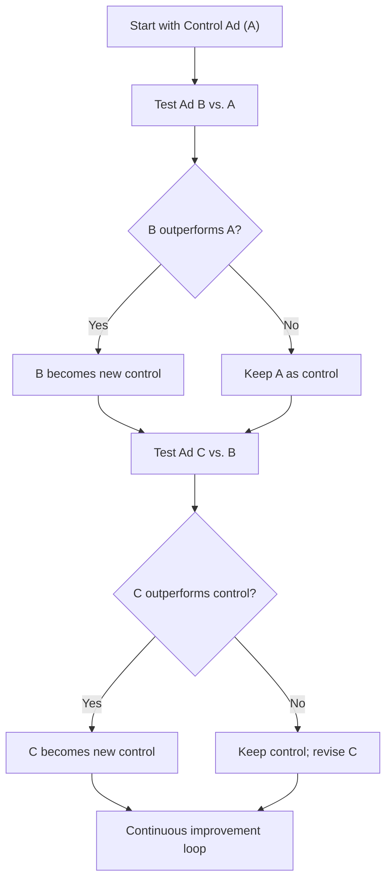
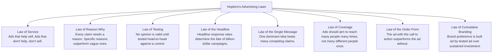

## The Fundamental Equation of Advertising

Hopkins frames every advertising decision around a single economic equation:

All other considerations — aesthetics, awards, client preferences — are secondary to this test. Hopkins is merciless about it: "The only purpose of advertising is to make sales at a profit."

---

## The 16 Chapter Framework

*Scientific Advertising* is organized across 16 chapters. Together they form a complete operating system for advertising.

---

## Chapter-by-Chapter Breakdown

### Chapter 1: How Advertising Laws Are Established

Advertising is governed by fixed laws, not opinions. Hopkins argues that just as chemistry replaces alchemy, advertising as a science replaces guesswork. The "laws" are derived from testing — running parallel campaigns and measuring results. What works repeatedly across products and markets is a law. What works once in one context is a coincidence.

**Key proposition:** An advertising law is established when the same principle produces superior results across many campaigns, in many markets, through many years. Single-source success stories are not laws.

---

### Chapter 2: Just Salesmanship

The most important chapter in the book. Hopkins insists that every advertisement is a sales presentation — not a stage play, not a work of art, not an entertainment piece. An ad's only function is to sell.

The test for any advertisement: if you substituted a silent order form for the brand, would enough people send in money to justify the ad cost? If not, the ad may be enjoyable but it is not advertising.

**The salesmanship test:**
- Would a face-to-face salesperson say these exact words?
- Does the ad make a clear argument or present a clear offer?
- Does it serve the customer's self-interest?

---

### Chapter 3: Offer Service

The flip side of salesmanship: before asking for a sale, the advertisement must offer genuine service. This is the **reason-why injunction** elevated to a philosophy.

Hopkins gives the universal pattern:
1. Provide useful information and advice
2. Solve a problem or answer a question
3. Explain why the product is superior
4. Reduce the consumer's risk (trials, samples, guarantees)
5. Then — and only then — ask for the order

**Example clinching argument:** Hopkins's Schlitz beer campaign demonstrated that Schlitz's rigorous brewing and filtration process (which every major brewery used) made their product superior — a fact no competitor had thought to communicate.

---

### Chapter 4: Mail-Order Advertising

Mail-order advertising is Hopkins's laboratory. In a mail-order campaign, every detail can be tracked: impressions, inquiries, orders, returns. The cost-per-order can be calculated precisely. This makes it the best environment for establishing advertising laws.

The insights from mail-order are portable to brand advertising:
- Every element of an ad can be tested independently (headline, layout, offer, copy length)
- Mail-order advertisers cannot afford cheapskate-approach ads; they must make every dollar work
- The lessons from mail-order translate to any advertising medium

---

### Chapter 5: Headlines

The headline is the single most important element of any advertisement. Hopkins argues that in many ads, the headline is the only element the reader will encounter.

**Headline principles from the chapter:**
- **Specificity beats generality:** "Age 60, how I improved my sight" outperforms "Wonderful eyesight improvement"
- **News and curiosity:** "New process makes old process obsolete" triggers the "stop and read" reflex
- **Service-oriented:** The best headlines promise useful information, not a sales pitch
- **Self-selection:** A good headline pre-qualifies the reader ("For people who suffer from rheumatism") saving money from wasted impressions

---

### Chapter 6: Psychology

Advertising succeeds when it aligns with how the human mind actually works. Hopkins catalogues the psychological triggers that make consumers respond:

| Trigger | Application in Advertising |
|---|---|
| **Desire** | Ads should lead with the benefit the prospect wants most — not what the advertiser wants to say |
| **Fear of loss** | "Don't let X go wrong" is often stronger than "Get Y benefit" |
| **Self-interest** | Every reader asks "What's in it for me?" before reading or responding |
| **Curiosity** | A headline that triggers curiosity opens the door to the argument |
| **Price vs. value paradox** | Low price doesn't always win; value perception depends on context, comparison, and reason-why |
| **Authority** | Experts, doctors, testimonials from knowledgeable people carry enormous weight |
| **Habit formation** | Advertising that creates new habits (e.g., daily tooth brushing) builds brand loyalty that is hard to break |

---

### Chapter 7: Being Specific

"In the mailing tests of many years, I recall only one thing which was emphasized more than another — and that was the value of being specific."

**Specificity transforms advertising:**

| Vague Claim | Specific Claim |
|---|---|
| "Our product is the best" | "Our process yields 99.7% purity" |
| "Thousands are satisfied" | "Over 4 million used in 1922" |
| "Saves time and money" | "Cuts cleaning time 40%; lasts 3x longer" |
| "Doctors recommend it" | "Dr. J. H. Kellogg, Battle Creek Sanitarium" |

A specific claim is verifiable, memorable, and legally defensible. A vague claim is ignored as mere noise.

---

### Chapter 8: Tell Your Full Story

Read the section on long copy. The serial advertisement approach.

A frequent objection in advertising is that people won't read long copy. Hopkins's response is empirical: when a product is new, expensive, or involving, *the more information the consumer has, the more likely they are to buy*. Short copy creates no conviction. Long copy allows the advertiser to:
- Anticipate and answer objections
- Provide the reason-why for every claim
- Tell the full story of the product's development and proof
- Overcome skepticism gradually, argument by argument

The optimal ad length is dictated by the sale, not by an aesthetic preference for brevity.

---

### Chapter 9: Art in Advertising

Illustrations and photography must serve the argument, not compete with it. Hopkins distinguishes helpful art from decorative art:

**Helpful art:**
- Shows the product in use
- Demonstrates a result or transformation
- Compares before and after
- Provides visual evidence for a textual claim

**Decorative art:**
- Abstract compositions that draw attention to themselves rather than the argument
- Pictures that are beautiful but don't sell
- Illustrations that bring no new information

Hopkins was an early advocate of photography in advertising, which was controversial in the 1910s and 1920s. He argued that a photograph of a real product or actual result carried more proof than the most skilled illustration.

---

### Chapter 10: Things Too Costly

Hopkins identifies several advertising expenses that consistently fail to provide return:

- **Celebrity endorsements unattached to proof** — a famous face with no reason-why is an expensive decoration
- **Elaborate displays and signage** that cannot be tracked for response
- **Trade paper advertisements** aimed at buyers who never read them
- **Premiums and souvenirs** that don't advance the cause of selling
- **Blanketing the country with untested ads** — run small, measure, then expand

The chapter is a caution about scale before testing. Most of the money wasted on advertising is spent on ads that were never tested against alternatives.

---

### Chapter 11: Information

Ads should provide genuine information — facts, results, comparisons, data — not just persuasion. The modern equivalent is content marketing, but Hopkins argued for it in 1923 as a foundational principle of ad copy.

**Why informational ads outperform persuasion-first ads:**
- Information reduces the consumer's risk
- Facts are more persuasive than adjectives
- An educated buyer is a committed buyer
- "Tell them something new" is the oldest effective headline formula in advertising

---

### Chapter 12: Strategy

Strategizing advertising campaigns is fundamentally about distributing spend across tested and untested impressions. The principles:

1. **Test before scaling.** Run a known-responder list or a small ad placement before committing to a national campaign.
2. **Use coupon codes to acquire names and addresses.** A coupon-driven campaign builds a mailing list that has future value.
3. **Identify your loss leader.** Find the version of the ad, offer, or headline that gives the best immediate return — that becomes your baseline.
4. **Treat advertising as a volume business.** Small percentage improvements in conversion, when multiplied over large campaigns, generate massive returns.

---

### Chapter 13: Use of Samples

Samples are the most powerful tool in advertising for converting prospects into buyers. Hopkins's Pepsodent campaign — distributing free toothpaste samples door to door — created the daily toothbrushing habit and turned Pepsodent into a dominant brand.

**The sample economics:**

Samples work because:
- They eliminate risk (zero commitment to try)
- They create a time-bound ownership experience
- They form or reinforce new habits
- They generate word-of-mouth within communities

---

### Chapter 14: Getting Distribution

Advertising creates demand. Distribution delivers the product. The most persuasive advertising is wasted if the product isn't available where the prospect wants to buy it.

Hopkins's distribution principles:
- **Obtain listings early** — before the advertising campaign begins
- **Support dealers** — advertising should serve the retailer, not undermine them
- **Use dealer advertising cooperatives** — co-op programs convert retailers into co-marketers
- **Track distribution by region** and attribute sales to regional advertising effectiveness

---

### Chapter 15: Test Campaigns

Comparative testing is the foundational scientific method of advertising. The chapter provides the structure:

**The testing framework:**
1. **Define the variable** you are testing (headline, offer, format, medium)
2. **Split audience** randomly and equally
3. **Run both simultaneously** under identical conditions
4. **Measure on response rate and cost per response**, not on aesthetic judgment
5. **Retain the winner** as the new control for future tests
6. **Repeat** — every test improves the baseline

Letters and return cards are Hopkins's preferred measurement tools. He argues that the only accurate measurement of ad response is the number of direct inquiries or orders generated — not impressions, not readership surveys, not client satisfaction.

---

### Chapter 16: Leaning on Dealers

The final chapter argues that advertising should support the dealer network, not bypass it. Hopkins made this distinction to address a common publisher's fear: strong advertising will drive readers to buy from the cheapest source rather than local dealers.

His solution: dealer-supportive advertising — campaigns that build brand demand *and* make the local dealer the best place to buy. Key tools:
- Thank-you letters to dealers
- Cooperative advertising programs
- Dealer window displays and premiums
- Dealer job advertising (helping them find quality staff)

---

## Hopkins's Core Advertising Laws

Across the 16 chapters, Hopkins derives these underlying laws:

---

## The Hopkins Method in Modern Terms

| 1923 Concept | 2024 Equivalent | Shared Principle |
|---|---|---|
| Coupon/return card | Conversion pixel, UTM parameters, unique promo codes | Trackable response is the only real measure |
| Reason-why copy | Landing page proof points, feature→benefit translation | Every claim needs a reason |
| Parallel ad testing | A/B testing, multivariate testing | Test before scaling |
| Mailing list from coupons | CRM, email list, retargeting audiences | The list is the asset |
| Dealer cooperation | Affiliate programs, channel partnerships | Distribution and demand must grow together |
| Sample distribution | Free trials, freemium models, toe-dipping offers | Trial eliminates acquisition risk |

---

## Key Frameworks

### The Testing Hierarchy

1. **Test headlines first** — they are the gatekeepers of response
2. **Test offers second** — a bad offer with great copy is a loss
3. **Test copy structure** — long vs. short, order of arguments
4. **Test format and illustration** — photos, layout, callout design
5. **Test media and timing** — publisher, day of week, frequency, seasonality

### The Reason-Why Checklist

- Does every claim have a supporting reason?
- Is the reason specific and concrete?
- Is the reason plausible to the skeptical reader?
- Does the reason serve the reader's self-interest?
- Is the reason provable or demonstrable?

### The Profitable Campaign Audit

- Are you tracking response by ad, by medium, by region?
- What is your cost per inquiry? Cost per order?
- Is your acquisition cost lower than customer lifetime value?
- Which ads are loss leaders (building brand, not immediate response)?
- How long do you retain customer names generated from ads?
