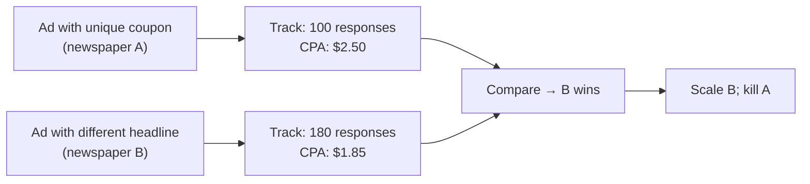
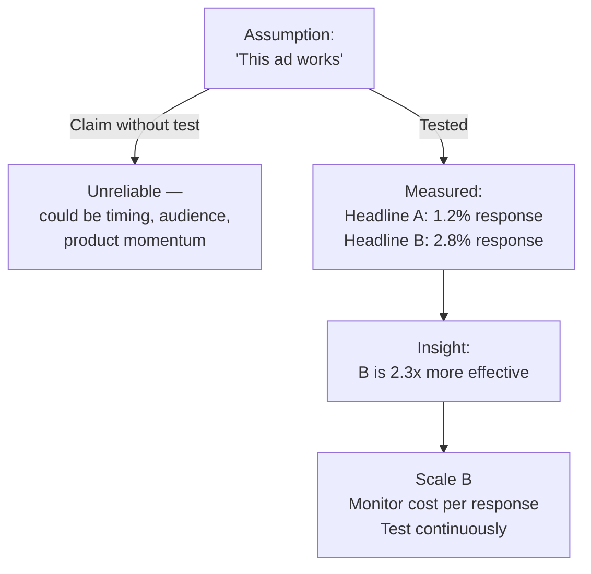

## Introduction

Welcome to BookAtlas. Today: *Scientific Advertising* by Claude C. Hopkins. Published 1923. Approximately 160 pages. One of the most influential business books ever written — and possibly the least well-known outside the direct-response community.

Claude Hopkins was born in 1866 in Hillsdale, Michigan. He started at Lord & Thomas — one of the largest agencies of the age — under Albert Lasker at $185,000 a year. To calibrate: that was more than the president of the United States earned at the time. Hopkins wasn't a creative in the Don Draper sense — he was an empiricist in a gray-flannel suit who measured every ad dollar for ROI.

His full-length writings — *Scientific Advertising* and *My Life in Advertising* — have been in continuous print for a hundred years. David Ogilvy said he read Ogilvy — sorry, Hopkins — twelve times. You should at least read it once.

---

## The Setup: Advertising Is Salesmanship in Print

Hopkins's thesis is a one-sentence job description for advertising. Ready?

> "Advertising is salesmanship in print."

That was radical in 1923 because advertising was mostly an art form. Agencies sold clients on the idea that ads needed to be beautiful, memorable, award-winning. Hopkins didn't care about awards. He cared about **orders**.

**Believer:** What I love about this is that Hopkins is being honest about the purpose of advertising. There's no handwaving about brand equity or emotional engagement as ends in themselves. If an ad doesn't move the needle on sales — given the cost of space — it's a waste of money.

**Skeptic:** And that's precisely the problem. Hopkins gives us no account of why we would want advertising that *doesn't* track to a sale. What of the Nike "Just Do It" campaign? What of Apple's "1984"? What of every Super Bowl ad that people discuss for weeks and remember for years — but doesn't come with a coupon?

**Believer:** Those campaigns sell too. The "1984" ad sold Macs. Brand ads sell, just over a longer time horizon. Hopkins's point is that *you should know* what your advertising is producing. Don't pretend that because you can't measure it, it's exempt from accountability.

**Skeptic:** Fair. But the mechanism matters. Hopkins's framework assumes you can attach a conversion event to every impression. That's not true for brand-building campaigns. His logic works for direct mail and lead generation, less so for brand.

---

## The Core Method: Coupon Testing

Hopkins's most enduring methodological contribution is the coupon. Place a unique offer, code, or keyed address in an ad, track every response against the coupon, and you now have data where before you had opinion.

**Believer:** This is the origin of every A/B test that has ever been run. Optimization.com. Google Ads experiments. Even the "test and learn" doctrine in modern product management. Hopkins invented it in a newspaper.

**Skeptic:** Yes, but the implication is narrow: every ad should produce a trackable action. What about advertising that's correct *because it builds goodwill*? Or an ad that reaches millions, changes perception subtly, and makes future marketing cheaper? Hopkins has no category for that. His measurement system forces advertising into a direct-response posture.

**Believer:** Because direct response *is* the accountable posture. If you have brand-building advertising that doesn't produce measurable down-funnel results, you are operating on hope. That's fine, but it's not advertising as Hopkins defines it. And Hopkins's framework is never actually wrong on this point — he's simply more honest than most about what his method does and doesn't cover.

---

## Reason-Why: The Most Important Idea in the Book

Every claim in an advertisement needs a reason. Hopkins is insistent. And he means *every* claim.

Vague: *"The best product for your skin."*
Specific: *"Contains no alkali; proven at the Johns Hopkins dermatology clinic to reduce blemishes 73% in 3 weeks."*

**Believer:** Reason-why is the closest thing to a universal law of advertising I've encountered. Every genuinely effective ad from every era gives you a reason to believe. Every ineffective ad asks you to take their word for it.

**Skeptic:** Every ad *does* give you reasons if you look for them. But they're often emotional, associative, or rhetorical — not Hopkins-style rational justifications. Freud's "a cigar is sometimes just a cigar" is a joke about cigar ads that Freud approved for *because* they associate the cigar with masculine identity, success, and comfort. The reason-why is implicit. Hopkins wants it explicit.

**Believer:** And that's a meaningful difference. Explicit reasons outperform implicit associations by a wide margin when the prospect is buying a product they'll actually evaluate. Implicit association works to build a brand halo; explicit reasons convert the sale. You need both — and Hopkins gave you the playbook for the conversion part.

---

## The Headline Chapter

Headlines represent 90% of the decision to read or not read an advertisement. Hopkins was methodologically rigorous about this: test ten headlines against each other in parallel and you will see ten different response rates.

**Believer:** This is the insight that launched everything — from copywriting formulas to click-through-rate optimization. "How I improved X by Y in Z time" headlines still outperform every other headline formula in direct response. Hopkins invented the formula.

**Skeptic:** This works for people *already looking* for a solution. People browsing classifieds or opening their mail have time to read and evaluate. What about interruption advertising — the banner ad, the 15-second spot, the sponsored post in a social feed? The headline matters, but there's also the visual, the context, and the targeting. Hopkins was writing for a world where the ad *was* the context.

**Believer:** And that's why his insight about headlines still holds: in all these contexts, the text that matters most is the first text you see. Whether it's a Facebook ad headline, an email subject line, a search ad — Hopkins's principle applies. The gatekeeping function hasn't changed.

---

## Long Copy: Against the Conventional Wisdom

People don't read long copy. Every advertiser who says this has not tested it. Hopkins's position: length should be dictated by the importance of the sale. Cheap, repeat-purchase products can sell on short copy. Expensive, complex, or risk-laden products require the full educational argument.

**Believer:** This is the single most useful counter-mandate in the book. Everyone — including experienced marketers — underestimates how much long copy sells. Gary Bencivenga, the greatest living copywriter, built his career on 2,000-word leads. Modern long-form landing pages follow the same logic. Hopkins was right.

**Skeptic:** What about mobile? A 2,000-word article on a 5-inch screen is unsustainable. Attention spans in 2024 are genuinely shorter than in 1923 because demand for attention is exponentially higher. Long copy has a tax: the transactional friction of reading before you buy.

**Believer:** A fair point — and Hopkins would actually adapt. His framework is: test long vs. short under the conditions of your medium. On mobile with a low-consideration product, short wins. On desktop or print with a high-consideration purchase, long wins. The principle is "let the test decide," not "always use long copy."

---

## The Psychology of Purchase

Hopkins's psychological framework is practical, not academic. He treats human beings as motivated by:
- Self-interest (always ask "what's in it for me?")
- Habit (once established, habits outlast almost any marketing persuasion)
- Fear (of loss, of wasted money, of being cheated)
- Social proof and authority
- Price-consciousness and fairness concerns

This list will look very familiar to anyone who's read Robert Cialdini a half-century later. Hopkins placed all of these at the center of advertising design without running laboratory experiments — he derived them from observing what ads actually produced responses.

**Believer:** What's remarkable is that Hopkins got this right empirically — by running thousands of tests — before psychology formalized these principles as laws. He had the scientists' respect for data long before behavioral science existed in its modern form.

**Skeptic:** He also got a lot wrong. His psychology is not a systematic theory — it's a catalog of observations and occasional causal claims that behavioral science has complicated enormously. Loss aversion, say, is far more context-dependent than Hopkins implies. So is authority. The science has moved past Hopkins on almost every point.

But for advertising purposes — *practical persuasion*, not laboratory psychology — Hopkins's simplifying assumptions are operationally useful. They are right enough to generate sales.

---

## Testing Is Not Optional

Hopkins has a chapter called "Test Campaigns" and it is not brief. His testing methodology is simple:
- Run ads in parallel
- Track response by ad
- Keep the winner, kill the loser
- Test again

**Believer:** This is how online marketing actually works now. Twitter Ads set up A/B tests. Facebook auto-creates variants. Google Optimize (RIP) tested landing pages. Every CRO platform lets you test headlines, CTAs, and layouts. Hopkins imagined this entire world.

**Skeptic:** And Hopkins also ignited the test-to-death problem: you optimize an ad to become a coupon-clipper while destroying brand equity that takes years to build. Measured advertising optimized for direct response often produces brand-sterile results. This is the same critique levied at programmatic display advertising in 2024.

**Believer:** Which is why you need both: tested direct-response ads that buy you customers profitably today, and brand-building advertising that buys you pricing power and consideration tomorrow. Hopkins covers the direct-response half brilliantly. The brand half is someone else's job.

---

## The Schlitz Beer Campaign

Hopkins's Schlitz beer work from 1907 is the case study every advertising brief should include. A brand everyone trusted (all breweries used the same process), in a category with no differentiation, turned into a national leader through one specific insight:

**The insight:** Every competing brewery claimed purity, but none of them *said* they used a specific, verifiable brewing process. Schlitz's process included:
- Air filtered through cotton wool
- Brewing vats scrubbed daily with live steam
- Bottles washed 4-5 times before filling
- Only 24-hour hop extracts used

Hopkins advertised the *actual process* that every competing brewery also used — the difference was simply that Schlitz was the only one that said it. The result: Schlitz's sales exploded, despite no actual product change.

**Believer:** This is the cleanest demonstration of the reason-why principle in the book. The fact wasn't new; the act of communicating it was. The advertising was a 'reveal' strategy — showing prospects what they couldn't see being done by the competition.

**Skeptic:** It's also a clean demonstration that advertising works best when the product is genuinely good and the competition is communicating worse. Hopkins's magic is often just *saying* what competitors refuse to say. That's strategic, not creative genius.

---

## Does Scientific Advertising Still Work?

The world Hopkins wrote for had newspapers, magazines, and mail-order catalogs. None of those have disappeared — they've mutated into websites, landing pages, cold emails, and newsletter sponsorships. The Donovan of the 1920s is the copywriter of 2024.

What's genuinely problematic: Hopkins's testing gospel has an effect on the kind of advertising it produces. Tested ads tend toward the generic, the safe, the non-controversial. This produces the brand-sterile advertising landscape we see in digital media: conversion-optimized but brand-weak. Ads that close the deal but don't build the brand.

**Believer:** Successful advertisers test *and* invest in brand. They run safe direct-response ads that generate cash, then use that cash to fund creative brand work.

**Skeptic:** They do, but the split is usually 70-30 response to brand, not balanced. And the response side consistently wins resources because it's *justified* by Hopkins's framework and the brand side is not.

---

## Final Verdict

*Scientific Advertising* is 100 years old. Its references are antique. Its examples are from Schlitz and Bissell. Counterintuitively, none of this matters because the principles it codifies are medium-independent.

**The three things Hopkins was right about that every modern marketer should internalize:**

1. **Test everything.** No opinion about an ad's effectiveness is valid until tested head-to-head against a control. This applies to landing pages, headlines, email subject lines, and billboards.

2. **Reason-why matters more than cleverness.** A specific, plausible reason beats a vague superlative in every context where the consumer is buying with evaluation.

3. **The cost of salesmanship.** The only legitimate use of advertising is to acquire a customer for less than they are worth. This is the organizing economic test that should govern every media budget.

**The one thing Hopkins was wrong about:**

That every ad should produce a trackable immediate response. Modern advertising—Social, brand campaigns, PR — produces value over longer measurement horizons. Hopkins's framework is a partial map, not a complete territory.

**For whom this book is essential:** Copywriters, performance marketers, growth teams, and anyone who builds sales funnels. It's the foundational text for the direct-response tradition that runs through Caples, Ogilvy, Sugarman, Halbert, and into modern CRO.

**For whom this book is merely useful:** Brand marketers, product marketers, and anyone working in longer-sales-cycle contexts. The reason-why and testing chapters read directly into your work; the testing framework applies to everything from pricing experiments to message testing.

This has been a BookAtlas narration of *Scientific Advertising* by Claude C. Hopkins. The principles in this book have outlasted the paper it was printed on. Test them yourself — Hopkins would approve.
