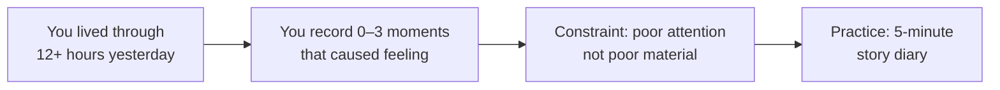
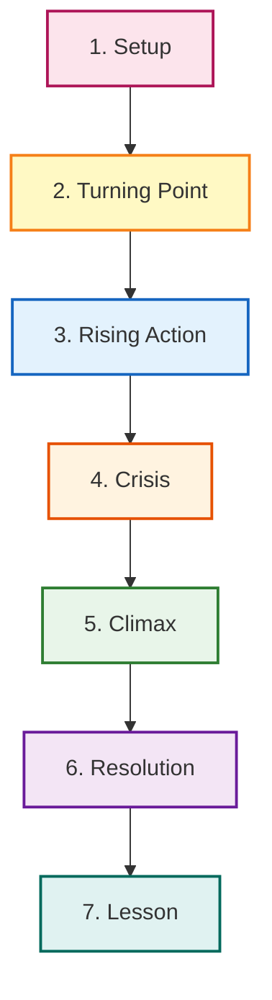

## Introduction: The Power of Story

Storyworthy opens with a radical claim: *everyone has something worth telling*. Ken Daigneau argues that the barrier to great storytelling is not a lack of material but a lack of structure. Through decades of work in advertising and communication, he observed that the most memorable communicators understand that story is not decoration — it is the vehicle through which belief travels.

The chapter ends with the first of many hands-on exercises: writing a five-minute story from yesterday's events, with zero filtering. Most people can only produce a sentence or two. Not because the events were unremarkable. Because they were not paying attention.

---

## Part One: Finding Your Story

This section is a practical workshop in the art of noticing. Daigneau proposes that most people walk past story-worthy moments every day because they are not listening for change.

### The Dinner Test

A good story captivates the way good dinner conversation does — it is personal, specific, surprising, and human. Daigneau uses this as the first filter every potential story must pass. If you would not tell it to a friend over a meal, why would you tell it to an audience? The Dinner Test is not about entertainment; it is about authenticity. Audiences detect performance within seconds. The story that passes the Dinner Test is the story you should develop.

### Three Tools for Mining Personal Narrative

**The 5-Minute Story Diary** — Each night, write down anything from the day that caused even a flicker of feeling. No editing. No narrative design. Just capture raw material. Over weeks and months, patterns emerge: certain events keep resurfacing. Those are your stories — they are the ones you are still processing.

**The Story Grid** — A structured worksheet with six prompts. What was the *before-belief*? What event disrupted it? What choice did you face? What happened as a result? What do you believe now? What should the listener believe after hearing this? The grid forces a story toward the spine it already contains but has not yet acknowledged.

**The Meaning Inventory** — A longer-form exercise that asks readers to map their beliefs across domains — love, work, fear, ambition, identity — and to trace how and why they shifted. This is the deep mining expedition for stories that shape your professional or personal brand.

### The Quiet Story

Daigneau dismantles the myth that only "big" stories matter. A near-death experience is rare; a moment of quiet realisation about your profession, your marriage, or your own limitations is not. Those quieter stories land harder because they feel genuine. They do not require the audience to accept a premise the storyteller has not earned.

---

## Part Two: Crafting Your Story

With raw material found, the craft chapters teach you how to shape it.

### The Story Spine

The seven-stage skeleton that every persistent narrative shares:

1. **Setup** — Establish the normality, the "before" state, in enough sensory detail that the listener can step into it.
2. **Turning Point** — The inciting event that destabilises certainty. It does not need to be dramatic — it only needs to disrupt.
3. **Rising Action** — Stakes build; the protagonist responds, adapts, fails, tries again. The audience leans forward.
4. **Crisis** — The point of no return. Something is at risk. The protagonist must choose.
5. **Climax** — Moment of highest tension and highest change. The before-belief dies; the after-belief is born.
6. **Resolution** — The new normal. Life after the event, reframed.
7. **Lesson** — What this means and why it matters to the audience. Not a moral — a belief transfer.

### Emotion Arc

The plot is the skeleton. The emotion arc is the breathing. Daigneau teaches you to graph the listener's emotional state over time — not the protagonist's. If the graph is flat, the story is inert. Valuable arcs move from one emotional state to another: **skepticism to hope**, **fear to confidence**, **confusion to clarity**. The brain remembers how it *felt* about the story, long after it forgets the details.

### Cinema of the Mind

Present tense. Sensory specificity. Lead with the moment of action rather than the moment of reflection. When you say *the room went quiet*, the listener's brain simulates silence. When you say *I felt stupid*, you invite judgment rather than empathy. Be specific: *my palms were sweating and I could taste the copper of the microphone*.

### Voice Choice: Self-Deprecation vs. Hero Arc

Self-deprecating stories lower audience defences — they signal *you are safe to listen to*. Hero stories — bold, aspirational, unironic — transfer hope — they signal *this is who you could become*. The choice is not moral; it is strategic. Know your listener before you choose.

---

## Part Three: Telling Your Story

Daigneau moves from writing to performance. The core insight: the polished stage voice and the authentic conversational voice are both performances. Neither is neutral. The one audiences trust is the one that remembers the Dinner Test.

### Beginning and Ending

Most stories begin too slowly, layering context the audience has not earned. Daigneau recommends starting just before the turning point — in the moment of normality, close enough to the disruption that patience is never strained.

The ending must close with recognition, not just resolution. A last sentence that summarises the event places a period on the story. A last sentence that names the belief shift hands the listener a conviction. Endings that offer a new lens are endings the listener carries out of the room.

### Adaptive Narrative

Different contexts demand different lengths and registers — a skill Daigneau calls **adaptive narrative**: keeping the emotional core intact while trimming or expanding plot details for time and audience. A three-minute boardroom version and a twelve-minute TED version of the same story share the same spine and the same emotional arc. They do not share the same surface.

---

## Conclusion: Living in Stories

Becoming a better storyteller is not merely a professional skill — it is a way of living more fully. The practice of looking for story-able moments changes how you pay attention. Searching for change in your own life reveals that change is everywhere. *Storyworthy* is therefore both a manual and an invitation to presence: pay attention, capture what moves you, shape it with care, and share it freely.

---

## Chapter Reference

| Section | Focus | Core Tool Introduced |
|---|---|---|
| Introduction | The thesis: story is the vehicle of belief | 5-minute story diary exercise |
| Part One: Finding | Mining personal narrative for raw material | Dinner Test, Story Grid, Meaning Inventory |
| Part Two: Crafting | Shaping material into a story | Story Spine, Emotion Arc, Cinema of the Mind, Voice Choice |
| Part Three: Telling | Performance and delivery | Adaptive narrative, beginning/ending mechanics |
| Before/After Bridge | Applying story to marketing and pitches | The 3-part Bridge structure |
| Conclusion | Story as a practice of living | Invitation to daily attention |
