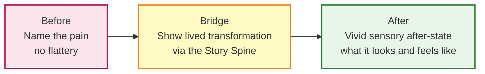

## Evaluation

### Strengths

| Dimension | Assessment |
|---|---|
| Clarity of thesis | Excellent — "every story is about change" is stated, illustrated, and defended throughout without hedging |
| Framework utility | Very High — the Story Spine and Before/After Bridge are simple enough to remember instantly and specific enough to apply immediately |
| Emotional arc as a design object | Unique contribution — Daigneau makes the listener's emotion a first-class thing to design, not a side effect to hope for |
| Neuroscience grounding | Strong for a practitioner book — mirror neurons, oxytocin, predictive processing are cited, not just invoked |
| Practical exercises | The 5-minute story diary, Story Grid, and Meaning Inventory are genuinely usable; the book is a workbook as much as a read |
| Cross-domain reach | Directly applicable to memoir, pitch decks, keynotes, brand campaigns, investor presentations, and teaching |
| Accessibility | Easy to read, no prior writing background required; conversational voice mirrors its own advice |
| Dinner Test as filter | Brilliantly simple and deeply functional — it cuts 80% of candidates before structural work begins |

### Weaknesses

| Dimension | Assessment |
|---|---|
| Depth of neuroscience | Moderate — mirror neurons and oxytocin are presented accurately for a practitioner but the research is not critically examined; the science is instrumental rather than interrogative |
| Originality of structure | The Story Spine is a professional distillation of dramatic tradition rather than an original contribution; Daigneau does not engage with prior frameworks (Aristotle's Freytag, Campbell's Hero's Journey, Vogler) |
| Academic silence | The book does not address or engage with related frameworks (Save the Cat!, SNLR, Deming's PDCA narrative, Duarte's Sparkline) that conversationally do adjacent work |
| Absence of ethics framework | SUCCES-adjacent concern: the tools work equally well for sincere and manipulative narratives; the book does not address how to distinguish them |
| Cultural homogeneity | Case studies and examples are drawn from a narrow professional class (advertising, executive speaking, memoir); the Dinner Test leans heavily on a particular social register |
| Scope tension | The book promises to cover memoir, marketing, public speaking, and executive communication; some domains receive much more depth than others (marketing and pitches are more developed than memoir craft) |
| No de-story mechanism | Nothing on how to *break* a story that has become stale or inappropriate — or when to tell a different one |

---

## The Before/After Bridge: Component Analysis

The Bridge is the book's master marketing tool, and it is worth noting that it works *precisely because* it is a story. You are not arguing the audience into belief — you are walking them through a short narrative arc in which the speaker is the protagonist who has already made the journey. The listener's mirror neurons deliver the conclusion that no argument could reach.

---

## The Story Spine Compared to Related Frameworks

The Story Spine occupies a particular position in the landscape of narrative frameworks. Understanding its relationship to prior art clarifies what it adds.

| Framework | Core Unit | Structure | Daigneau's Relationship |
|---|---|---|---|
| Freytag's Pyramid | Dramatic arc | Setup → Rising → Climax → Falling → Denouement | The Story Spine echoes but extends Freytag with a Lesson step; Daigneau strips the falling action and makes the after-state the narrative destination |
| Campbell's Hero's Journey | Mythic transformation | ~12–17 stages, circular | Story Spine is Campbell stripped to its bare spine; the return is the new normal; the elixir is the lesson |
| Save the Cat! | Screenwriting | ~15 beats | Blake Snyder's framework carries an almost one-to-one mapping to Daigneau's Spine; Daigneau eliminates genre-spec and frame jokes as an explicit category |
| Nancy Duarte's Sparkline | Presentation narrative | What is → What could be → New bliss | The Sparkline is the Before/After Bridge made visible; Daigneau's Bridge is Duarte's structure applied to any spoken or written narrative |
| Chip Heath's SUCCES | Idea survival | Simple, Unexpected, Concrete, Credible, Emotional, Story | The two frameworks are compatible — SUCCES explains *how* stories survive, Daigneau explains *how* to build them |

---

## The Emotion Arc as Design Object

The most distinctive contribution in Storyworthy is the conceptual move of treating the *listener's* emotional state as a design object. This is not the same as saying "make your story emotional" — that advice is everywhere. Daigneau's move is more precise: graph the valence over time, plan the ascent and descent, and choreograph the specific beats (safety, surprise, vulnerability, triumph) that produce the intended trajectory.

This reframes story craft from literary endeavour to engineering discipline, which is precisely why advertising and marketing professionals have responded as enthusiastically as they have. They recognise the instrument.

---

## Storyworthy and the 2018 Communication Moment

*Storyworthy* arrived in 2018 at a precise inflection in how organisations hire, pitch, and communicate. Three contextual dynamics amplified its reception:

**1. The personal-brand gravity.** LinkedIn had, by 2018, made curated personal narrative a professional requirement. Storyworthy gave practitioners a structural vocabulary for what they were already doing imperfectly.

**2. The pitch-deck as a form.** Startup ecosystems had standardised the two-minute pitch as a short-form narrative event. Storyworthy's Before/After Bridge provided a repeatable architecture for something that was still being treated as a creative act.

**3. Neuroscience enters professional vocabulary.** Mirror neurons, oxytocin, and cognitive bias had penetrated business writing. Daigneau cited the science without reducing his method to science — he kept the craft centre-stage and the research as supporting cast, which preserved the book's accessibility.

---

## Application by Professional Domain

| Domain | Highest-Gain Tool | Primary Application |
|---|---|---|
| Startup pitch decks | Before/After Bridge | Replace feature list with a 90-second investor narrative |
| Marketing / brand campaigns | Story Spine applied to product | Reframe product benefits as emotional transformations |
| Executive keynotes | Dinner Test + Emotion Arc | Remove polished script; find a real moment and structure it |
| Corporate training | 5-minute story diary | Build a personal story library for teaching moments |
| Memoir / creative nonfiction | Story Grid | Test anecdote candidates for transformation arc depth |
| Sales | Before/After Bridge | Lead with the prospect's pain, show your solution's transformation, close with sensory after-state |
| HR and culture | Story Spine for change communication | Structure transformation narratives so teams feel change rather than receive it |
| TED / conference speaking | Adaptive narrative | Keep one spine, craft two lengths — 5 min and 18 min — without losing the core |
| Teaching and facilitation | Cinema of the Mind | Replace abstract explanation with sensory, present-tense vignettes |

---

## Final Verdict

*Storyworthy* fills a specific and important gap in the communication library. Where *Made to Stick* explains why ideas survive, *Storyworthy* explains how to build the vehicles that carry them. Where *Talk Like TED* shows you what great presentation looks like, *Storyworthy* gives you the narrative architecture inside it. Where *Building a StoryBrand* puts the customer at the centre of the story, *Storyworthy* puts the storyteller's own authenticity at the centre of persuasion.

Its weaknesses are real and worth holding onto. The Story Spine is not original — it is a professional distillation. Daigneau does not engage critically with the neuroscience, the rhetorical tradition, or the ethics of persuasive narrative. The tools are morally neutral; they serve sincerity and manipulation with equal facility. And the book's scope — four professional domains compressed into ~270 pages — means some readers will find their primary context underserved.

But as a practitioner's manual for the single most universal professional challenge — *shaping and delivering a story worth listening to* — it is as close to essential as the genre gets. The Story Spine and the Before/After Bridge repay the cost of the book in their first application.

**Verdict: 8.5/10. Required reading for copywriters, marketers, executives, speakers, and anyone whose influence depends on narrative. Read it before you write your next pitch, keynote, or email campaign.**
