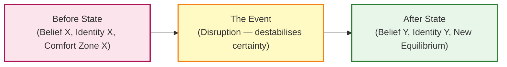
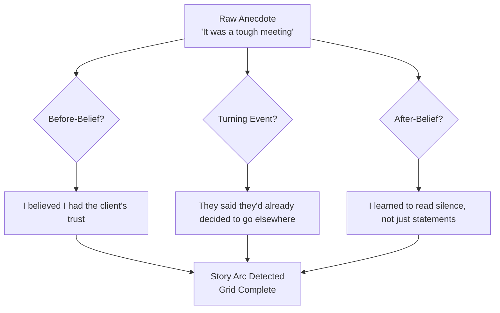
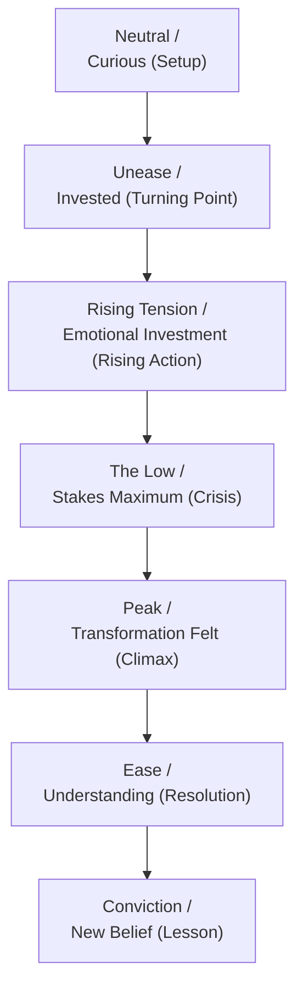
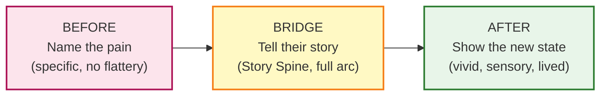

**Sam**: Welcome back. I'm Sam.

**Lee**: And I'm Lee. Today we're talking about *Storyworthy: Discover, Teach, and Tell Your Best Stories from Memoir to Marketing, from Personal Speaking to Executive Giving* by Ken Daigneau — pronounced *din-YO* — copywriter, communication coach, and a man who has spent decades in the room where stories are built. Namely: the ad room.

**Sam**: This is not a memoir. It's not a writing manual. It's closer to a structural blueprint — welded to real exercises — for the thing that every marketer, every executive, every teacher, and every person who has ever stood in front of a room and tried to move an audience actually needs but rarely gets taught.

**Lee**: Right. The core claim is deceptively simple. Daigneau says: every story is about change. Not clever turns of phrase, not incident, not character — change. The listener must feel a character shift from one state to another — belief to belief, fear to confidence, confusion to clarity. If the listener has not travelled, the story has not happened.

---

## Part One: The Science Before the Craft

**Sam**: Daigneau opens with neuroscience, not anecdotes. He wants you to understand *why* the tools work before he gives you the tools. The argument is that the brain does not distinguish a vividly told story from lived experience. When you describe a scene in present tense, with sensory detail — the room going quiet, your palms sweating — the listener's mirror neurons fire as if they were there.

**Lee**: That physicality is the whole point. Stories don't persuade through argument; they persuade through *simulation*. The listener's brain runs a compressed version of your experience. From that simulation comes belief — not because you proved a point, but because they *felt* what it was like to be in the situation and come out different on the other side. Daigneau cites oxytocin release and the brain's predictive processing model. The claim is careful: the brain *responds* to vivid narrative as it would to real event, not that it can't tell the difference. There's a difference between being moved and being fooled.

**Sam**: The practical implication is immediate. If you want to change beliefs, you don't lead with data — you lead with a story that lets the listener's own mirror neurons deliver the conclusion. The argument runs *after* the simulation, not before it.

**Lee**: That reframes every pitch, every presentation, every email. You're not *presenting* a case. You're taking someone on a short journey. The structure of that journey is what the book is for.

---

## Part Two: Finding Your Stories

**Sam**: Here's the thing I keep coming back to: Daigneau insists you already have the material. Most people walk past story-worthy moments every single day. The barrier is attention, not experience.

**Lee**: The opening exercise is called the **5-Minute Story Diary**. You write down anything from the day that caused even a flicker of feeling. Irritation, quiet joy, a sentence that stuck — whatever. No editing. No narrative design. Just capture raw material. Over weeks, patterns emerge: certain events keep resurfacing. Those surfaces are your stories, because they are the ones you are still processing.

**Sam**: Two more tools build on this. The **Story Grid** asks six questions designed to pull the transformation arc out of raw experience. What was your before-belief? What event disrupted it? What choice did you face? What happened? What do you believe now? What should the listener believe after?

**Lee**: And then the **Meaning Inventory** — longer, deeper, mapping your beliefs across domains: fear, ambition, love, identity, work — and tracing how and why they shifted. This is the serious excavation. The stories that surface here are the ones that anchor your professional or personal brand.

**Sam**: Daigneau also dismantles the myth that only "big" stories work. Near-death experiences are rare. A quiet moment of realising you were wrong about someone you trusted is not rare — and in some ways it lands harder, precisely because it feels genuine rather than performative.

---

## Part Three: The Story Spine

**Lee**: The book's structural heart. Seven stages. Every story, regardless of length, genre, or purpose, passes through these seven points. Daigneau draws on dramatic tradition and compresses it into something a copywriter or an executive can hold in working memory.

```mermaid
flowchart LR
  S1["1. Setup\n(Normality / Before State)"] --> S2["2. Turning Point\n(Inciting Event)"]
  S2 --> S3["3. Rising Action\n(Stakes Build)"]
  S3 --> S4["4. Crisis\n(Point of No Return)"]
  S4 --> S5["5. Climax\n(Transformation Moment)"]
  S5 --> S6["6. Resolution\n(New Normal)"]
  S6 --> S7["7. Lesson\n(What Changed & Why)"]

  style S1 fill:#fce4ec,stroke:#ad1457,stroke-width:2px
  style S2 fill:#fff9c4,stroke:#f57f17,stroke-width:2px
  style S3 fill:#e3f2fd,stroke:#1565c0,stroke-width:2px
  style S4 fill:#fff3e0,stroke:#e65100,stroke-width:2px
  style S5 fill:#e8f5e9,stroke:#2e7d32,stroke-width:2px
  style S6 fill:#f3e5f5,stroke:#6a1b9a,stroke-width:2px
  style S7 fill:#e0f2f1,stroke:#00695c,stroke-width:2px
```

**Sam**: The key is that each stage carries specific emotional and cognitive work. The Setup is not just context — it is the *loss*. The audience has to feel what "before" was like so they can feel the weight of its disruption when the Turning Point arrives. Remove the Setup and the Transformation lands flat. It's not optional decoration.

**Lee**: Daigneau applies the Spine to four contexts explicitly: personal memoir, business pitches, conference talks, and brand campaigns. He shows it in action each time. The structure holds.

---

## Part Four: Emotion Arc and Cinema of the Mind

**Lee**: Beyond the skeleton, Daigneau layers the **Emotion Arc** — the listener's internal emotional trajectory over the story's duration. This is the internal wiring of the Spine.

**Sam**: The arc is not a suggestion. If the graph is flat, the story is inert. The practitioner's question becomes: what emotional state do I want the audience in at each point? Daigneau's answer is a lift from skepticism to hope, or fear to confidence, or confusion to clarity.

**Lee**: And he gives you the technique to get there: **Cinema of the Mind**. Present tense. Sensory specificity. Lead with the moment of action, not the moment of reflection. When you say "the room went quiet," the listener simulates silence. When you say "I felt stupid," you invite judgment rather than empathy. Say: "my palms were sweating and I could taste the copper of the microphone."

**Sam**: That shift from internal label to external, sensory evidence is one of the most transferable single techniques in the whole book. I have used it in copy, in emails, in talks. It works every time.

---

## Part Five: Voice, Delivery, and Adaptive Narrative

**Lee**: Daigneau pushes back on the split personality most communicators adopt: the polished stage voice versus the authentic conversational voice. Both are performances. Neither is neutral. The one audiences trust is the one that passes the Dinner Test.

**Sam**: He also addresses voice choice directly. **Self-deprecating stories** lower audience defences; they signal "I am safe to listen to." **Hero stories** — bold, aspirational, unironic — transfer hope; they signal "this is who you could become." The choice is strategic, not moral. What does your audience need from you right now? Safety, or aspiration?

**Lee**: **Adaptive narrative** is his term for scaling a single story to different contexts — keeping the emotional core and the Spine intact while trimming or expanding plot details. The three-minute boardroom version and the twelve-minute keynote version of the same story share the same arc. They do not share the same surface.

---

## Part Six: The Before/After Bridge

**Sam**: The master tool for marketing and executive communication. Named, in sequence:

**1. Before** — name the audience's current pain clearly and specifically. No flattery. No铺垫. Just the thing they already know but have not had held up to the light.

**2. Bridge** — show a lived experience of that pain and its transformation. Use the Story Spine. The audience travels your arc and arrives at your conclusion having *simulated* it, not just heard it.

**3. After** — close with a vivid, sensory moment of what life looks and feels like on the other side. Not "increased revenue." "The first month when the numbers didn't keep you up at night."

**Lee**: The Bridge is the Story Spine compressed into three beats for the shortest of contexts — a pitch, a sales call, a LinkedIn post, an email. It works because it bypasses rational resistance. You are not asking someone to agree with you. You are walking them through a transformation they can feel and recognise from their own experience.

---

## Closing

**Sam**: Daigneau closes by saying that becoming a better storyteller is not merely a professional upgrade. It is a way of living more fully. Searching for story-worthy moments rewires how you pay attention to your own life. You start noticing change everywhere. You start living as someone who expects to be moved, and who therefore moves more easily themselves.

**Lee**: That last sentence is important. *Storyworthy* is not a book about performing. It's a book about paying attention. The exercises are not writing drills — they are attention drills. The 5-minute diary is not a content calendar seed; it's a reminder to show up for your own experience.

**Sam**: For me, the book's deepest insight is that structure is not the enemy of authenticity. Structure is *how* authenticity gets through. Without the Spine, your real story rambles and loses people halfway. With it, your real story lands.

**Lee**: If you're a copywriter, a marketer, anything that requires you to persuade through narrative, this is a handbook. Keep it at your desk. Use the Story Grid every time you prepare a talk. Run the Before/After Bridge on every pitch before you send it.

**Sam**: Ken Daigneau. D-A-I-G-N-E-A-U. *Storyworthy*. The shape of a story is the shape of belief. Go find yours.

**Lee**: Thanks for listening.
