## Letter 1: How to Get Rich Quickly

Gary opens with the foundational principle: **markets matter more than products**. He explains that most aspiring marketers fail because they fall in love with their product rather than identifying a hot market first.

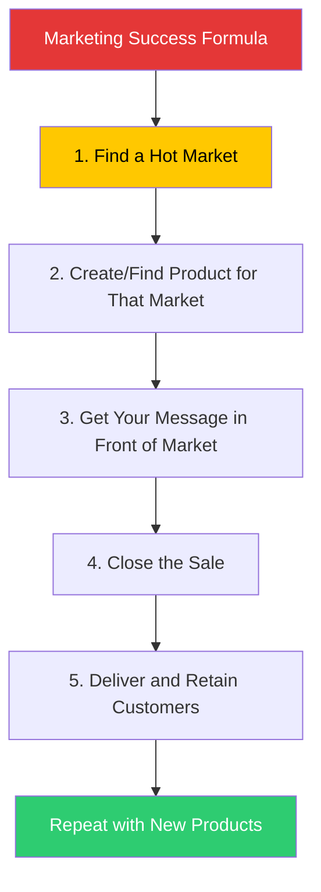

Key insight: A mediocre product in a hot market outsells a great product in a cold market every time. The market's existing desire does the heavy lifting.

### The "Boron Two-Letter Month" Concept

Gary introduces his most famous framework: if you can learn to write two effective sales letters, you have a business.

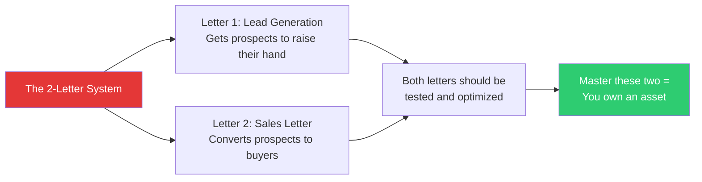

---

## Letter 2: The Basic Wine Letter

Gary uses a sample wine sales letter to teach core copywriting mechanics. He walks through the AIDA structure embedded in every effective sales letter.

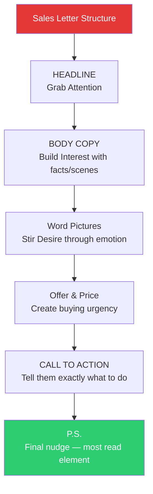

### Word Pictures: The Key to Emotional Selling

Gary explains that word pictures — vivid, sensory descriptions that transport the reader — are what separate copy that merely informs from copy that compels action. He gives examples from his wine letter, describing the vineyard so vividly the reader can taste the grapes.

---

## Letter 3: The Boron Special — Discipline Through Fitness

A departure from pure copywriting, this letter focuses on physical discipline as mental discipline. Gary argues that the same persistence required to get in shape builds the muscle needed to persist in copywriting and entrepreneurship.

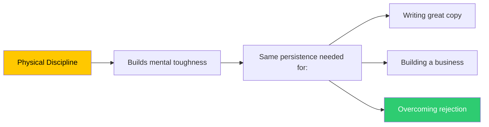

---

## Letter 4: The HALT Technique — Never Decide When Compromised

Gary introduces the HALT acronym as a critical decision-making filter.

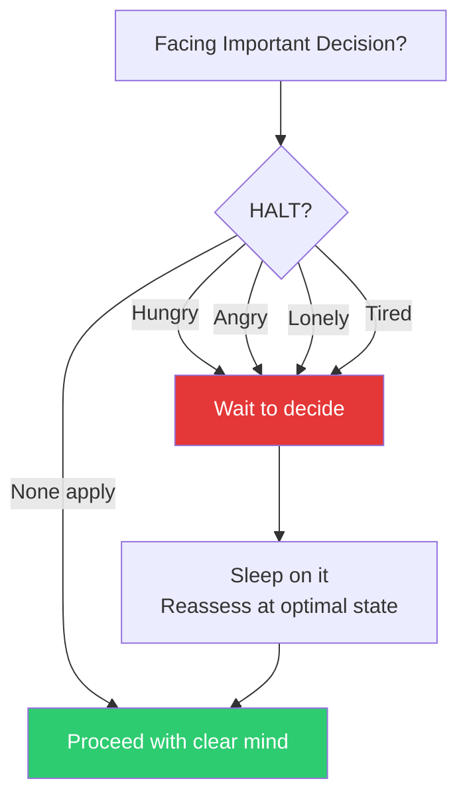

**Why HALT matters for copywriters specifically**: Writing headline revisions, signing partner deals, or quitting a job should never happen in a compromised emotional state. The impulsive version of "I should quit" almost always leads to poor outcomes.

---

## Letter 5: Why to Quit Good Jobs

Gary's most provocative and widely-quoted advice: **good jobs are traps**. He argues that security is a slow-motion form of castration — it gradually robs you of ambition and autonomy.

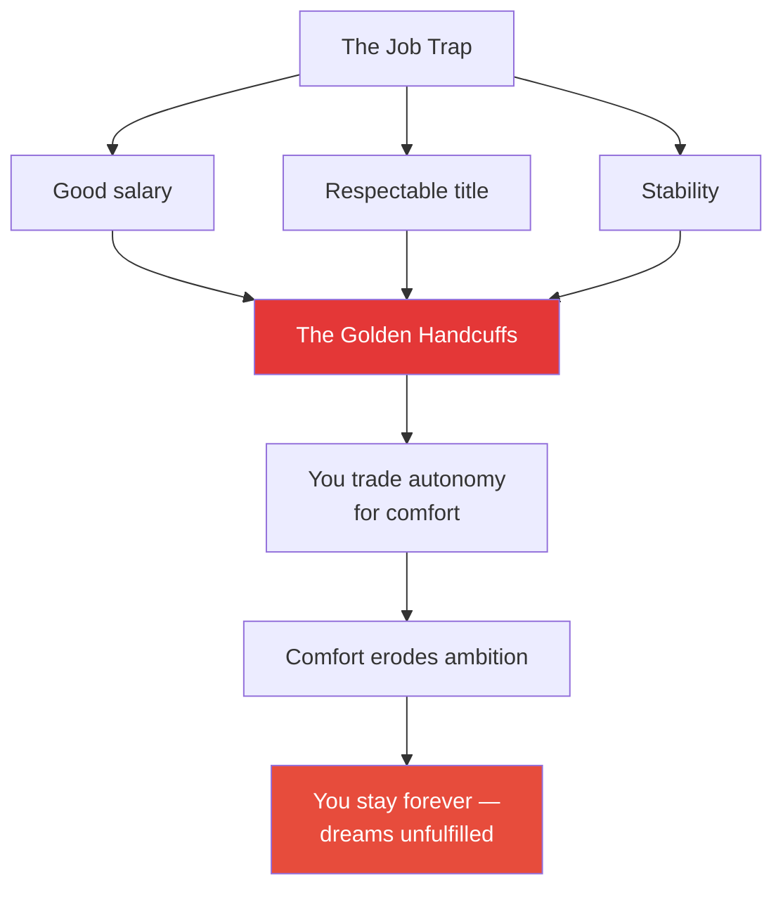

Gary's corrected advice: **Quit when you have something better in hand** — a side business generating income, a client list, a proven offer. Not impulsively, but deliberately. The danger is not in quitting; it is in staying indefinitely.

---

## Letter 6: Student of Markets — How to Research Before You Write

Gary insists that mastering the market's language, desires, and objections is a prerequisite to writing effective copy. He outlines a market research protocol:

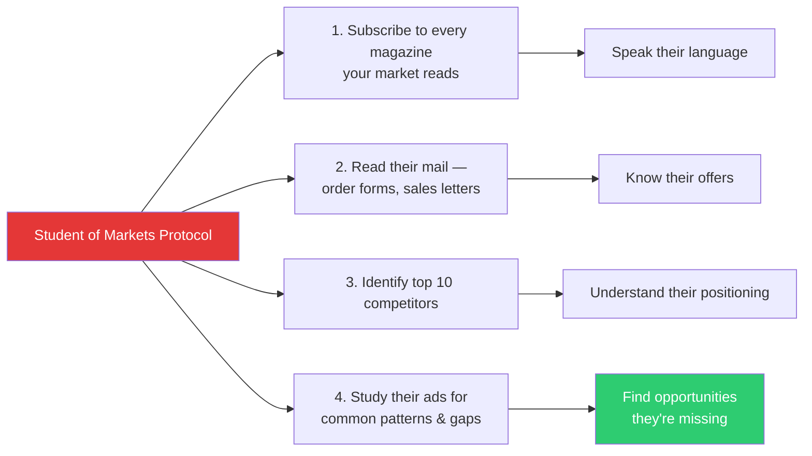

The goal is not to mimic competitors but to identify where they are weak, where the market is underserved, and what language resonates.

---

## Letter 7: Copywriting Longhand — The Secret Learning Tool

Gary's radical technique for building copywriting skill: **rewrite great ads by hand, word for word**.

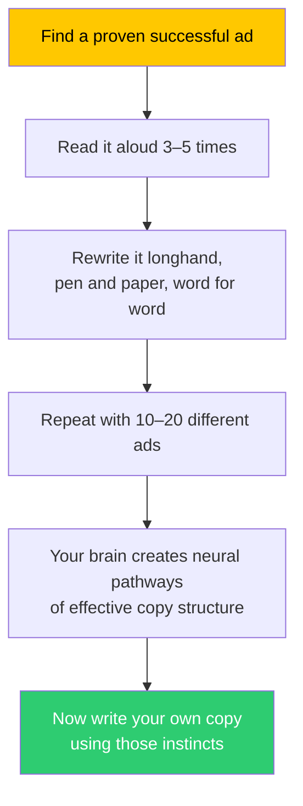

This is not mimicry — it's neuro-muscular imprinting. By physically writing out great copy, your body learns the rhythm, cadence, and structure of persuasive writing at a cellular level.

**Gary's specific recommendation**: Find 10-20 of the best sales letters ever written. Copy each one longhand at least 3 times. After this exercise, you will write better copy than 90% of working copywriters.

---

## Letter 8: Creating Bigger, Better Offers

Gary argues that **the offer matters more than the copy**. An irresistible offer can sell mediocre products; a weak offer needs perfect copy to produce mediocre results.

| Offer Component | Importance | Example Enhancement |
|---|---|---|
| Price & Terms | Very High | "3 easy payments of $29" vs "$87 one-time" |
| Bonuses | Very High | Add 3 high-perceived-value bonuses worth $97 |
| Guarantee | High | "30-day no-questions-asked money back" |
| Scarcity | Medium | "Only available until Friday" |
| Product Quality | Necessary baseline | Must meet minimum expectations |

**The Rule**: Before writing a single word of copy, make your offer as strong as possible. A better offer makes the copywriter's job dramatically easier.

---

## Letter 9: The Importance of Persistence

Gary emphasises that **most people quit too early**. He shares the statistic that most marketing campaigns fail on the first attempt — but the ones that are tested and refined succeed spectacularly.

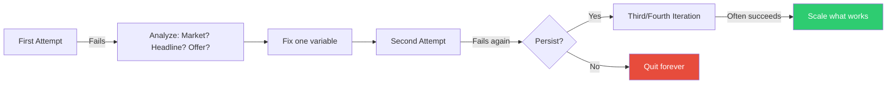

The "try it twice" rule: Never abandon an approach after a single failure. The adjustment you make on attempt two may be exactly what was needed.

---

## Letter 10: The Danger of Negative Influences

Gary warns Bond about the corrosive effect of negative people — family, friends, coworkers who doubt, discourage, or subtly undermine ambition. His solution: **guard your associations as carefully as your headlines**.

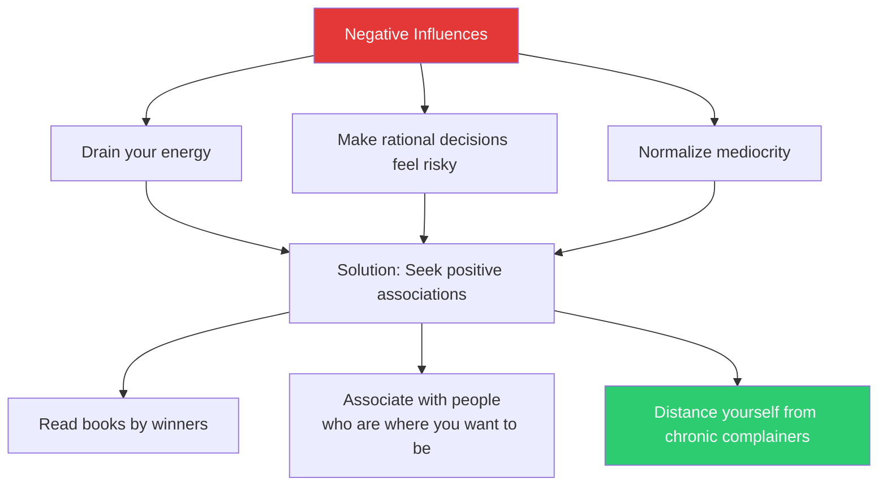

---

## Letter 11: Big Mailer Lessons — What the Pros Do

Gary shares insights from observing the biggest direct mail companies in America:

- They **test constantly** — they run multiple versions and let the market decide
- They **build lists** — acquiring customers is more valuable than single sales
- They **create irresistible offers** — the offer does the selling, the copy just makes the case
- They **use psychology** — fear, greed, curiosity, and belonging are the primary emotional triggers

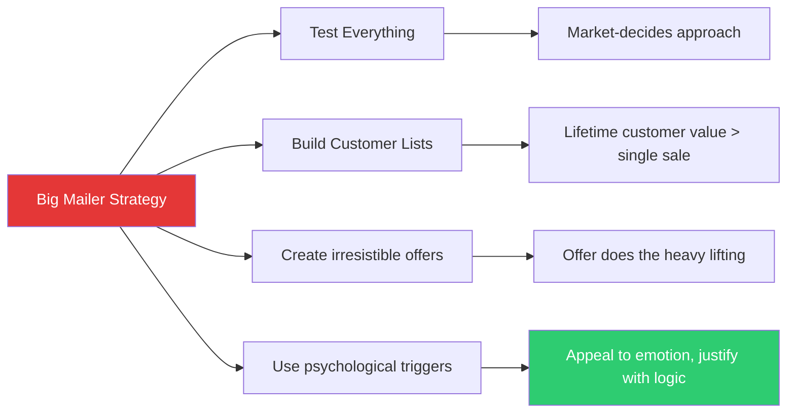

---

## Letter 12: The "Why" Behind Copywriting

Gary connects the mechanics of copywriting to a deeper purpose: **selling with words is a form of service**. He argues that honest copywriting helps people discover products that genuinely improve their lives.

The ethical framework: great copywriting matches buyer desire with seller capability. Neither deception nor hard-sell tactics are necessary when the offer truly serves the market.

---

## Letter 13–17: Closing Letters — Legacy and Final Wisdom

In the closing letters, Gary moves beyond techniques to questions of legacy and attitude:

- **Your reputation is your most valuable asset** — protect it above all
- **Integrity in marketing compounds** — honest sellers build audiences that grow over decades
- **The 2-letter-month concept is not about shortcuts** — it is about building a real, transferable business asset
- **Publishing your own words creates authority** — write articles, letters, newsletters; build a body of work
- **Books and courses are multipliers** — the best investment you can make is in knowledge

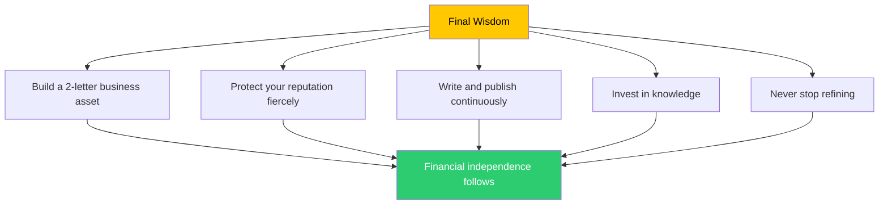

---

## The Letters as a System: Complete Map

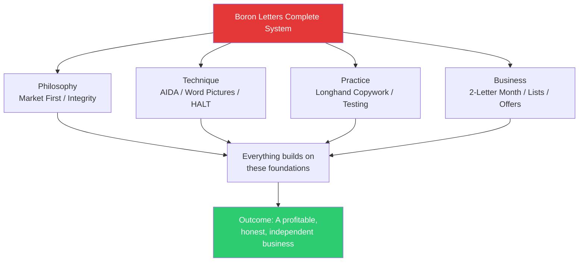
