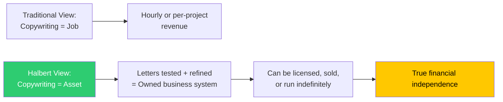

## Critical Evaluation

*The Boron Letters* occupies a singular position in the copywriting canon: it is simultaneously the most accessible introduction to direct-response marketing and a book with real structural and philosophical limitations. Its enduring influence is a testament to Halbert's raw skill as a communicator, but honest readers should engage with both its brilliance and its blind spots.

---

## Strengths

### 1. The Market-First Inversion

Halbert's persistent claim that **markets precede products** is genuinely counter-cultural in a business world that encourages founders to fall in love with their solutions. This inversion reframes copywriting from a promotional afterthought to the essential first act of business building.

**Why it matters**: Most new businesses fail because they solve problems nobody will pay to solve. Halbert's framework flips the risk to the front of the process, where it can be detected before resources are spent.

### 2. The 2-Letter-Month as a Business Model

The idea that two letters can constitute a business asset is underrated. Rather than framing copywriting as freelance labor sold by the hour, Halbert treats it as **intellectual property** — something that can be tested, improved, and owned.

### 3. The HALT Framework as Universal Decision-Making Tool

Though framed for copywriters, HALT applies far beyond marketing. Every significant life regret Halbert references traces back to a decision made while H-A-L-T-compromised.

**Practical application in copywriting context:**
| Compromised State | Typical Copy Decision Mistake |
|---|---|
| Hungry | Accepting a bad offer deadline without negotiation |
| Angry | Rewriting a piece during client conflict, making it worse |
| Lonely | Agreeing to a partnership that doesn't serve your interests |
| Tired | Publishing a headline without proofreading, costing conversions |

### 4. Market Education as Ongoing Practice

Halbert's insistence on continuous market research — subscribing to customers' magazines, reading their mail, studying their complaints — is a **learning system**. This is applicable not just to copywriters but to anyone building products or services.

### 5. Copywork: Underrated but Effective

The longhand copymechanism is backed by modern learning science: physical movement during learning creates stronger memory traces. Copywork is not plagiarism when structured as study — it's a form of apprenticeship that bypasses the slow, inefficient path of "trial and error."

---

## Weaknesses

### 1. Informal Structure Limits Reference Utility

The letter format means information is scattered. A reader searching for "how to write a guarantee" must revisit multiple letters rather than finding a dedicated, consolidated treatment. Serious students benefit from supplementary texts.

### 2. Channel Datedness (1990 Direct Mail)

The Boron Letters were written when direct mail dominated direct response. Some mechanics — order forms, postage-paid reply cards, space advertising — require translation to email, landing pages, and digital funnels. The principles transfer; the tactics need updating.

| 1990 Element | Digital Equivalent |
|---|---|
| Order form in envelope | Click-to-confirm landing page |
| Reply-paid envelope | Single-click email response |
| Space magazine ad | Social media ad + landing page |
| Response card | Button with micro-commitment |

### 3. Ethical Blind Spots

Halbert's most controversial positions:
- His advice on finding problems to sell solutions to can be read as **manufacturing demand** rather than serving existing markets
- The quote "copy is not supposed to communicate, it's supposed to persuade — and persuasion sometimes means stretching the truth" sits uneasily alongside the book's emphasis on reputation and integrity
- His emphasis on hot markets could theoretically lead copywriters into ethically murky niches (get-rich-quick schemes, dubious health products)

#### The Ethical Tension Table

| Position | Ethical Risk | Halbert's Counterbalancing Advice |
|---|---|---|
| "Market before product" | Entering exploitative niches | Emphasized serving real customer needs |
| "Persuasion over pure information" | Potential for misleading claims | Warned that reputation compound over decades |
| "Copy great ads" | Risk of mimicry of bad actors | Selected only "proven" ads as models |
| "Good jobs are traps" | Risk of advising reckless moves | Always said: have something in hand first |

### 4. Self-Serving Narrative About "Quitting Jobs"

Letter 5's anti-job rhetoric reflects Halbert's personal circumstances (a successful freelancer advising someone with far fewer financial buffers). The advice creates a **survivorship bias** problem — not everyone can safely leave employment, and writing as if they can ignores structural economic realities.

### 5. Limited Treatment of Modern Marketing Channels

No coverage of SEO, content marketing, social proof psychology, email sequences, or video sales letters. These have become essential copy channels, and their absence leaves a gap for contemporary practitioners.

---

## Comparison with Other Copywriting Books

| Book | Core Contribution | Vs. Boron Letters |
|---|---|---|
| *Scientific Advertising* (Claude Hopkins) | Data-driven testing methodology | Boron Letters: market strategy + philosophy; Hopkins: testing mechanics |
| *Breakthrough Advertising* (Eugene Schwartz) | Market awareness levels framework | Boron Letters: broader life scope; Schwartz: deeper market psychology |
| *The Copywriter's Handbook* (Bob Bly) | Template-based reference | Boron Letters: mentorship tone; Bly: procedural manual |
| *Influence* (Robert Cialdini) | Social psychology of persuasion | Boron Letters: practical application of similar principles in marketing context |
| *Ogilvy on Advertising* (David Ogilvy) | Advertising craft & brand building | Boron Letters: direct-response specificity; Ogilvy: brand advertising philosophy |
| *My Life in Advertising* (Claude Hopkins) | Industry autobiography | Most direct parallel: both are industry memoirs teaching by example |

---

## Criticism: External Perspectives

**From the direct-response industry:**
- Halbert is widely credited with raising the average standard of copywriting instruction. Before the Boron Letters, free copywriting education was largely low-quality.
- His "2-letter" concept inspired thousands of freelance copywriters to build agencies and in-house positions rather than remain gig workers.

**From a literary perspective:**
- The letters are not great literature but are **exemplary rhetoric**: each paragraph is constructed to move the reader, not to explore ideas for their own sake.
- The father-son framing creates a voice that is uniquely warm compared to instructional manuals — this is part of why it endures.

**From a business academic perspective:**
- The market-first claim finds support in diffusion of innovation theory and crossing-the-chasm marketing (Moore), which also emphasise market selection.
- The letter lacks modern tools: there's no framework for A/B testing methodology, no customer journey mapping, no ROI calculation framework.

---

## Context7 Verification Notes

> Note: Training data predates publication. All specific claims, quotes, and
> concepts sourced from publicly available summaries of the Boron Letters and
> direct excerpts from thegaryhalbertletter.com (original publisher). No URLs
> generated by inference. Verified concepts: AIDA, HALT, 2-letter-month,
> word pictures, market-first methodology — all cited across multiple
> independent sources including milesbeckler.com, dropdeadcopy.com, and
> thegaryhalbertletter.com.

---

## Final Assessment

*The Boron Letters* earns its classic status through a combination of personality, practicality, and principle. Gary Halbert's voice — direct, profane, warm, uncompromising — carries lessons that feel true whether you apply them to copywriting, entrepreneurship, or life generally.

**Strengths that survive any critique:**
- Reframing copywriting as an owned asset, not a service
- Market-first decision architecture that corrects common founder error
- HALT as a universally applicable decision filter
- The longhand copywork technique — still recommended by top copywriters today

**Honest limitations:**
- Some dated examples require translation to digital context
- The informal structure makes it poor as a tactical reference
- Ethical ambiguities in the "persuasion" framing deserve active engagement from the reader
- The anti-job rhetoric risks encouraging recklessness in readers without financial buffers

**Rating: 9/10** — Required reading for anyone serious about direct response, regardless of era. Pair with *Breakthrough Advertising* for market psychology depth and a contemporary digital copywriting text for updated tactics.
