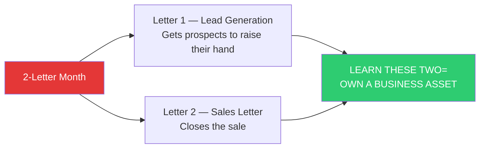
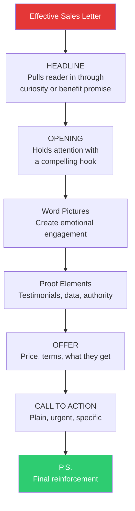
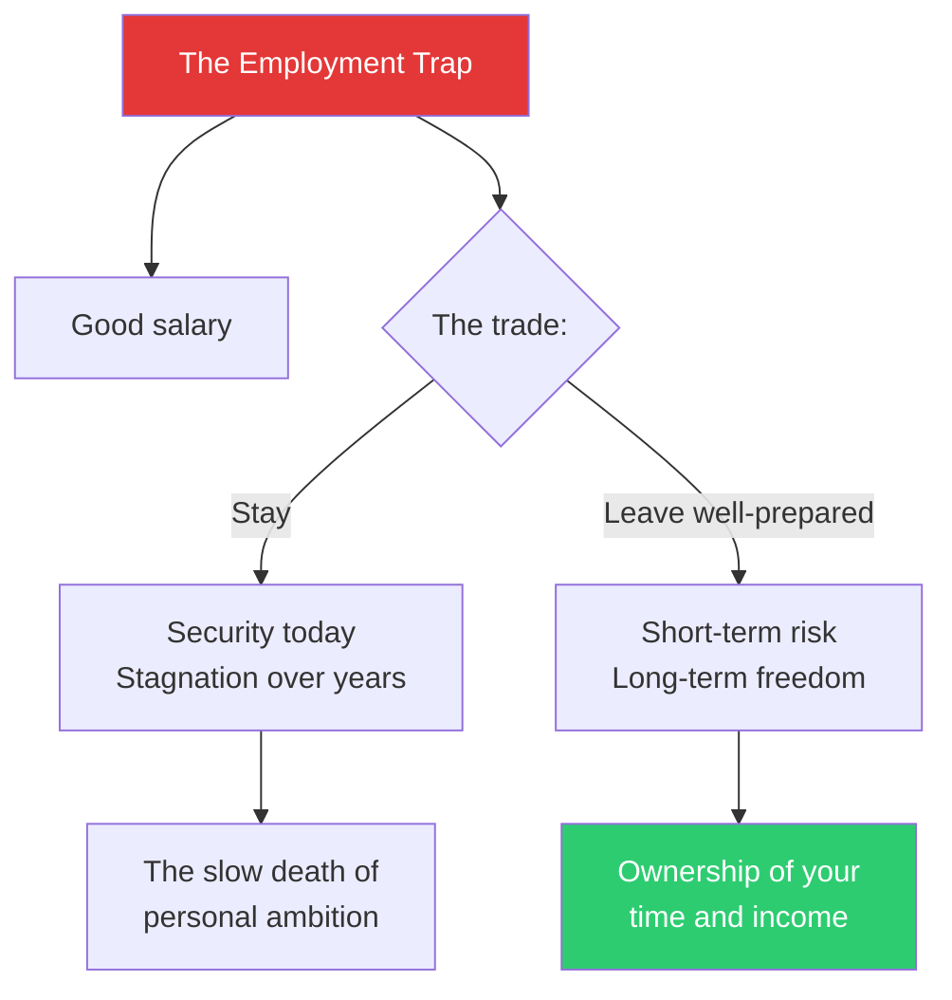
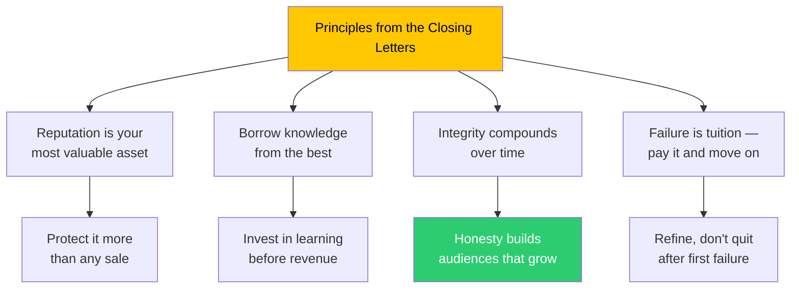

## Opening

*The Boron Letters* is not a textbook. It is not a seminar. It is a father writing to his son from a minimum-security prison in Boron, California — and the fact that it was never meant to be published is precisely why it carries such authority.

Gary C. Halbert, at the time of these letters, was the highest-paid copywriter in America. By the early 1990s he had already written some of the most successful direct mail campaigns in history, earning more in single months than most people earn in a year. He was sent to prison for tax violations in 1990. While there, he wrote to his youngest son, Bond, and those letters became *The Boron Letters*.

What makes them extraordinary is not just what they teach — though what they teach is extraordinary — but the voice in which they are taught. There is no marketing department polishing this prose. No reputation to maintain. No one to impress. Gary Halbert speaks plainly, often vulgarly, sometimes beautifully, always honestly. The result is a book about selling that is also, unexpectedly, a book about how to live.

---

## Letter 1: Markets Before Products

The first letter establishes the book's foundational claim: **markets matter more than products.** Most aspiring copywriters, Gary writes, fall in love with the product they want to sell. They think if they just write brilliant copy, the market will respond.

It doesn't work that way.

A mediocre product in a hot market outsells a great product in a cold market every single time. The market's existing desire does the heavy lifting. The copywriter's job is not to create demand from nothing — it is to channel existing demand toward the right offer.

Gary raises the indispensable question before any other: "What is a hot market?" A hot market is not an abstract demographic. It is a group of people who are already buying — who have demonstrated demand through their spending. The signal is simple: they are already reaching for their wallets.

*"Find the market first,"* Gary writes. *"Find the people who are already buying similar products. Then, and only then, figure out what you can sell them."*

---

## The 2-Letter Month — Letter 9

This is the intellectual center of the book. Gary proposes a framework that reframes what it means to be a copywriter.



Most aspiring copywriters approach the craft as a service: "I will write copy for you for a fee." Gary's reframe is radical: **Master two letters and you own an asset.** Not a job. A system that can generate revenue indefinitely, can be tested and improved, and can eventually be run by others or licensed.

A "letter" in Gary's vocabulary means the complete direct mail package: the envelope teaser, the body copy, the order form, the P.S. — the full persuasive machine. Two letters, mastered, and the world of direct response opens.

*"If you want to make a fortune,"* Gary writes, *"you need to learn to write two letters. One that gets someone to raise their hand. And one that gets them to reach for their wallet. That's it. Everything else is detail."*

---

## AIDA and the Sales Letter — Letter 2

Gary breaks down the anatomy of effective sales copy using what he calls the AIDA framework, though he rarely uses the acronym explicitly. The four stages are:

**Attention** — The headline and lead must stop the reader in their tracks.

**Interest** — The body must sustain attention with relevant facts, evidence, and vivid descriptions.

**Desire** — The reader must want the product, not just understand it. This requires emotional engagement, not just logical argument.

**Action** — The reader must be told exactly what to do, with urgency and simplicity.

Gary introduces "word pictures" as the secret weapon within desire: sensory, specific descriptions that transport the reader emotionally. Describing a vineyard — the sun-baked earth, the smell of crushed grapes, the texture of the oak barrel — does more to sell wine than any list of chemical specifications.



---

## The HALT Technique — Letter 4

One of Gary's most widely-cited contributions. He introduces HALT as a decision-making filter:

**H**ungry
**A**ngry
**L**onely
**T**ired

When you're in any of these states, do not make important decisions. Not about copy revisions, not about business partnerships, not about quitting your job. The result will always be something you later wish you could undo.

*"Every big mistake I ever made in business,"* Gary writes, *"I made when I was one of those four things."*

The practical protocol: if you have a HALT state active, sleep on the decision. Wait 24 hours. Reassess when your state has changed. Most bad decisions that feel urgent are actually recoverable with this one practice.

---

## Letter 5: Why to Quit Your Good Job

Perhaps the most provocative letter in the book. Gary does not advocate recklessness, but he does advocate **deliberate exit from the employment trap**.

His argument, stripped to its essence: good jobs are slowly suffocating. They provide security that imprisons you. The golden handcuffs — good salary, respectable title, predictable hours — gradually erode ambition and the capacity to take risks. Most people stay in jobs they hate for longer than they should because the alternative feels frightening.

**Gary's precise prescription:** don't quit impulsively. Do not leap without a net. Quit only when you have something better in hand — a side business generating income, a client list, a tested offer that works.

*"The goal is not to be reckless,"* he writes to Bond. *"The goal is to be free. And freedom requires owning your own means of support. But it requires it on your terms — not in a state of desperation."*



---

## Longhand Copywork — Letter 7

Gary's prescription for learning to write: find 10–20 of the greatest sales letters ever written, and copy them out by hand, word for word, at least three times each.

This is not plagiarism. Gary is explicit about that. It is **neuro-muscular imprinting**. By physically writing out great copy, your hand learns the rhythm, cadence, and structure of persuasion at a nervous-system level. You are not imitating a great copywriter's voice — you are installing their instincts in your fingers, where they eventually become yours.

*"You will write better copy after doing this exercise than 90 percent of the copywriters working today,"* Gary claims. Perhaps the most remarkable thing about that statement is that it appears to be true.

---

## The Offer — Letter 8

One letter that deserves repeated attention is Letter 8, on creating offers. Gary insists that the **offer is more important than the copy**. An irresistible offer can sell a merely good product. But perfect copy cannot save a weak offer.

| Offers That Scale | Offers That Stagnate |
|---|---|
| Price + Easy terms (not just low price) | Low price, difficult payment terms |
| Abundant bonuses with high perceived value | Bare product, no added value |
| Strong, specific guarantee | Weak or no guarantee |
| Scarcity and urgency that feels real | Fake scarcity that readers recognize |
| Product that genuinely solves a known problem | Product that claims to solve an invented problem |

The copywriter's leverage is not in clever words. It is in structuring an offer so compelling that writing the copy around it becomes almost effortless.

---

## Closing — Letters 13–17

The final letters move beyond technique into the territory of legacy and attitude. Having taught the mechanics of the 2-letter system, Gary turns to questions that matter more than any single sale: your reputation, your integrity, your relationship with failure, and the kind of life your work supports.

*"The best investment you can make,"* Gary writes, *"is in knowledge. Books, courses, seminars — the compound interest of learning dwarfs any single campaign result."*

He returns to a theme running underneath all the letters: **integrity compounds over time**. Every honest sale builds an audience that stays. Every deceptive sale earns you a refund and a cancelled subscription. The short-game players win occasionally; the long-game players build empires.



---

## Narration Notes for Implementation

**Pacing decisions:**
- Allocate 3–4 minutes to Letter 1 (market-first, sets up everything)
- Allocate 4 minutes to Letter 9 (2-letter system — the conceptual anchor)
- Allocate 3 minutes each to Letters 2 (AIDA), 4 (HALT), 5 (quitting jobs), 7 (copywork)
- Allocate 2 minutes each to Letters 3, 8, 10, and 11
- Allocate 3 minutes to closing letters

**Tone guidance:**
- Gary's voice is a mix of fatherly and flinty. Avoid corporate smoothness.
- The vulgarity and directness should be preserved — it is part of his authority.
- The moments of genuine warmth (toward Bond) should be read with audible tenderness without becoming sentimental.

**Browser speech synthesis hints:**
```json
{
  "rate": "moderate",
  "pitch": "low-mid",
  "emphasis": {
    "markets": null,
    "2-letter": {"rate": "slower", "emphasis": "strong"},
    "HALT": {"rate": "pause-before", "spell": false}
  },
  "paragraphPauses": "slightly longer than default between letters"
}
```
