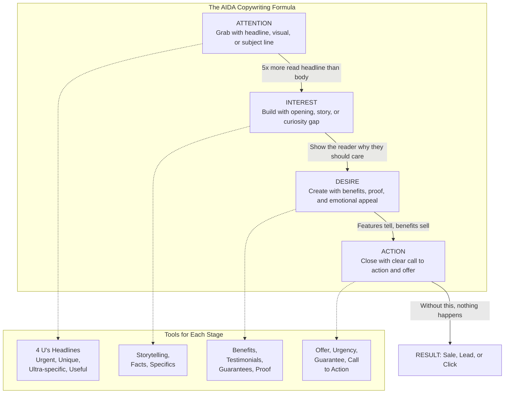
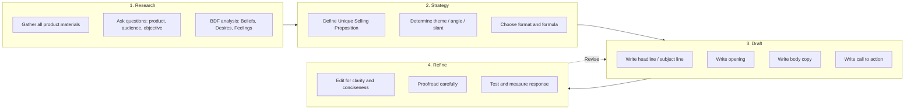
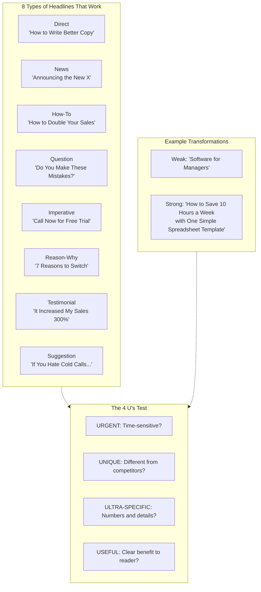
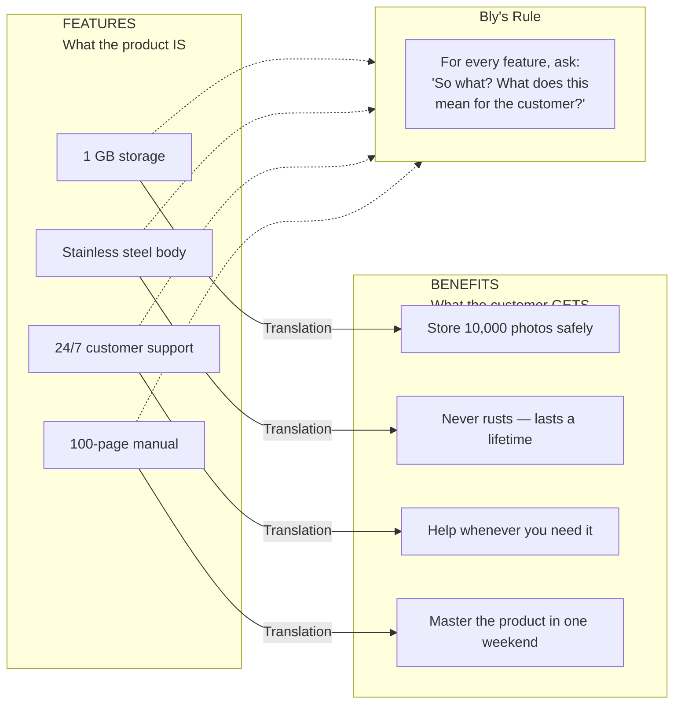

## The AIDA Model

The oldest and most universal copywriting formula. Every persuasive
piece follows this sequence whether the writer intends it or not.

AIDA works because it mirrors how humans make decisions: we notice,
we get curious, we want, we act. Bly's Motivating Sequence is a
five-step elaboration of AIDA used throughout the book.

---

## The Copywriting Process

Bly outlines a systematic process that moves from research to final
draft, rejecting the myth that good copy comes from sudden inspiration.

---

## Headline Formulas

Bly devotes an entire chapter to headlines because they carry 80%
of the ad's effectiveness. He identifies eight headline types:

Every headline should pass the 4 U's test. If it is not at least
three of the four, rewrite. The best headlines appeal to
self-interest or deliver news.

---

## Benefits vs Features

This distinction is the most important concept in the book. Bly
insists that novice copywriters write features; experts translate
every feature into a benefit.

Customers buy benefits, not features. A feature tells. A benefit
sells. Bly recommends creating a two-column "feature-benefit"
chart for every product before writing a word of copy.

---

## The 4 Ps: Pain, Promise, Proof, Push

An alternative to AIDA that Bly developed for supplement and
direct-response work, later generalized to all niches.

| Step | Question to Answer | Tactics |
|------|-------------------|---------|
| **Pain** | What problem does the prospect feel? | Name the pain, magnify it, make it personal |
| **Promise** | What will your product do? | State the benefit clearly and boldly |
| **Proof** | Why should they believe you? | Testimonials, case studies, guarantees, data |
| **Push** | What should they do now? | Offer, urgency, risk reversal, call to action |

---

## BDF: Know Your Prospect

Bly adapted Michael Masterson's BDF formula for audience analysis.
Before writing, answer these three questions about your prospect:

| Dimension | Question | Example (IT Professionals) |
|-----------|----------|---------------------------|
| **Beliefs** | What do they believe about themselves and the world? | "Technology is the most important thing. Users are stupid. Management does not appreciate us." |
| **Desires** | What do they want? | Recognition, respect, bigger budgets, cutting-edge skills |
| **Feelings** | What emotions drive them? | Frustration with users, resentment toward management, pride in technical mastery |

The BDF analysis produced one of Bly's most famous headlines:
"Important news for every systems professional who has ever felt
like telling a user, 'Go to hell.'"

---

## Chapter-by-Chapter Coverage

### Ch 1: An Introduction to Copywriting

Bly defines copywriting as "salesmanship in print." The goal is not
to be clever, win awards, or entertain — it is to sell. Good copy
must get attention, communicate clearly, persuade, and ask for
action. Three forces now drive success: human psychology, data
analytics, and platform compliance.

### Ch 2: Writing to Get Attention: The Headline

The most important chapter. Headlines carry 80% of the ad's
effectiveness. Bly covers the 4 U's (Urgent, Unique,
Ultra-specific, Useful), eight headline types, and 38 examples.
Subject lines follow the same principles in email.

### Ch 3: Writing to Communicate

Eleven tips for clear writing: put the reader first, organize
selling points logically, use short sentences and simple words,
avoid jargon, write conversationally, use graphic emphasis.
Clarity is the #1 virtue of copy.

### Ch 4: Writing to Sell

The heart of persuasion. The five-step Motivating Sequence:
(1) get attention, (2) identify need, (3) position product as
solution, (4) prove claims, (5) ask for action. Features vs
benefits, USP, logical fallacies, secondary promise, 22 reasons
why people buy.

### Ch 5: Getting Ready to Write

Four-step preparation: gather materials, ask product questions,
analyze audience, define objective. Bly's famous question list
helps copywriters extract the facts they need from clients.

### Ch 6: Writing Print Advertisements

Nine criteria for effective print ads. Covers full-page, fractional,
and classified ads. Each element must earn its place: headline,
visual, body copy, logo, call to action.

### Ch 7: Writing Direct Mail

Anatomy of a direct-mail package: outer envelope, sales letter,
brochure, reply device. Fifteen ways to open a sales letter.
Teaser copy on envelopes. The chapter is the foundation for modern
email marketing.

### Ch 8: Writing Brochures, Catalogs, and Sales Materials

Organizing longer content. Using subheads, bullet points, and
product descriptions. Clarity beats cleverness when buyers are
comparing options.

### Ch 9: Writing PR Materials

Press releases, feature articles, ghostwritten speeches,
newsletters. PR relies on earned media — more credible than
advertising but harder to control. Make it newsworthy, not
promotional.

### Ch 10: Writing TV and Radio Commercials

Twelve common formats (spokesperson, slice-of-life, demonstration,
testimonial, etc.). Writing for the ear, not the eye. Packing a
message into 30-60 seconds.

### Ch 11-12: Writing Websites and Landing Pages

SEO copywriting, the inverted pyramid, above-the-fold messaging.
Landing pages are single-purpose conversion tools. Ten tips for
higher conversion rates.

### Ch 13: Writing Email Marketing

Solo emails vs. ezines. Fifteen techniques for high open and
click-through rates. Getting past spam filters. Lead magnets.
The Agora Model: build a list by giving away valuable content.

### Ch 14-15: Writing Online Ads and Social Media

Google, Facebook, LinkedIn ad formats. Tailoring content per
platform. Funnel approach: short posts → longer content →
conversion. Social media is about engagement, not direct selling.

### Ch 16: Writing for Video

Script types for different video formats. Attention spans are
short, so lead with the benefit in the first 5 seconds.

### Ch 17: Content Marketing

Blog posts, articles, white papers, reports. Teaching builds
trust. Useful content generates leads better than overt promotion.

### Ch 18-19: Getting Copy Written, Designed, and Produced

Options: DIY, freelance, agency, or AI. How to hire, brief, and
review copywriters. Design principles: readability, hierarchy,
simplicity. The best layouts are invisible — they let the copy
do the selling.

---

## 22 Reasons Why People Buy

One of Bly's most referenced lists. People buy to:

1. Make money
2. Save money
3. Save time
4. Avoid effort
5. Gain comfort
6. Achieve greater health
7. Escape pain
8. Gain praise / recognition
9. Be popular / loved
10. Protect family / reputation
11. Be in style
12. Satisfy curiosity
13. Have beautiful possessions
14. Satisfy appetite
15. Impress others
16. Be unique / individual
17. Be like others they admire
18. Take advantage of opportunity
19. Avoid criticism
20. Avoid trouble
21. Be safe / secure
22. Make work easier

---

## Action Plan

1. **Use the 4 U's on every headline.** Before publishing, check:
   urgent? unique? ultra-specific? useful? Score each out of 10.
   If total < 30, rewrite.

2. **Create a feature-benefit chart.** For every product feature,
   write the corresponding benefit. Lead with the benefits in
   your copy.

3. **Research before writing.** Spend as much time gathering facts
   as writing. Use Bly's question list to interview clients.

4. **Map your copy to a formula.** Pick AIDA, 4 Ps, or Motivating
   Sequence. Check each stage is covered before publishing.

5. **Know your audience's BDF.** Write a paragraph describing your
   prospect's beliefs, desires, and feelings. Base your angle on
   what you discover.

6. **Always include a clear CTA.** Tell the reader exactly what to
   do next. No ambiguous endings. Every piece of copy must answer:
   "Now what?"
