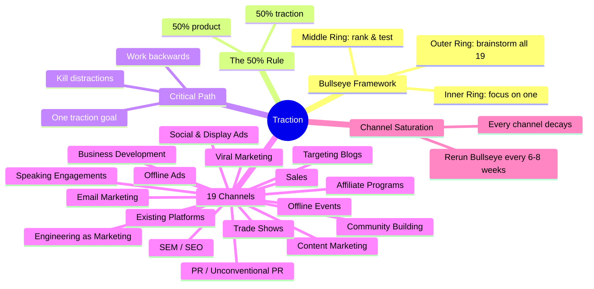
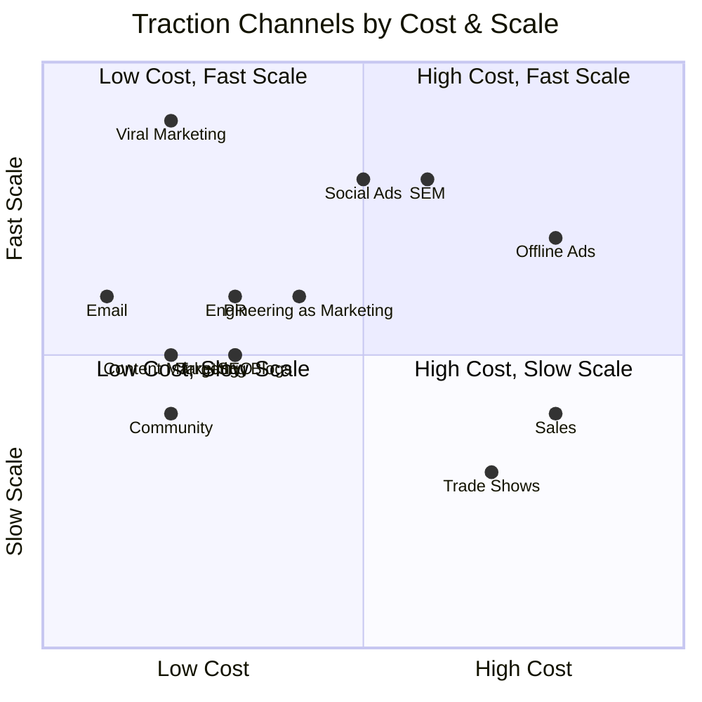

# Traction: How Any Startup Can Achieve Explosive Customer Growth

**Gabriel Weinberg & Justin Mares** · Portfolio · 2015 · 240 pp · ISBN 9781591848363

> "Almost every failed startup has a product. What failed startups don't have
> are enough customers."

Most startups die not from product failure but from *distribution failure*.
They never find the one customer-acquisition channel that works at their
stage. *Traction* solves this by mapping all 19 channels and giving you the
Bullseye Framework to systematically find your winning one. Based on
interviews with 40+ founders (Jimmy Wales, Alexis Ohanian, Dharmesh Shah,
Paul English), it is the definitive guide to getting customers from zero to
scale.

---

## Table of Contents

| # | Chapter | Topic |
|---|---------|-------|
| 1 | Traction Channels | The 19 channels defined |
| 2 | Traction Thinking | The 50% Rule |
| 3 | Bullseye Framework | Outer ring → middle ring → inner ring |
| 4 | Traction Testing | Cheap experiments for real signal |
| 5 | Critical Path | One goal at a time |
| 6 | Viral Marketing | K-factor and referral loops |
| 7 | Public Relations | Trade press ladder |
| 8 | Unconventional PR | Stunts and guerrilla tactics |
| 9 | Search Engine Marketing | Google Ads and keyword economics |
| 10 | Social and Display Ads | Facebook, retargeting, banners |
| 11 | Offline Ads | Radio, billboards, direct mail |
| 12 | Search Engine Optimization | Fat-head vs long-tail |
| 13 | Content Marketing | Own a topic before owning a product |
| 14 | Email Marketing | Triggered sequences and segmentation |
| 15 | Engineering as Marketing | Free tools that convert |
| 16 | Targeting Blogs | Guest posting and sponsorships |
| 17 | Business Development | Partner-channel arithmetic |
| 18 | Sales | Founder-led to hired AE |
| 19 | Affiliate Programs | Commission-based distribution |
| 20 | Existing Platforms | App stores, marketplaces, APIs |
| 21 | Trade Shows | Booth strategy from zero |
| 22 | Offline Events | Meetups, workshops, demos |
| 23 | Speaking Engagements | Conferences and keynotes |
| 24 | Community Building | Forums, groups, brand advocates |
| 25 | The Long Game | Channel saturation and renewal |

---

## Key Concepts

---

## The 19 Traction Channels

---

## Authors

**Gabriel Weinberg** is the founder and CEO of DuckDuckGo, the
multi-billion-dollar internet privacy company. He holds a B.S. in Physics and
an M.S. in Technology and Policy from MIT. He is also co-author of *Super
Thinking* (2019). His experience growing DuckDuckGo from zero to hundreds of
millions of users through deliberate channel experimentation forms the
backbone of the book's practical advice.

**Justin Mares** is an entrepreneur and startup marketer. He was Director of
Revenue at Exceptional (acquired by Rackspace) and has founded multiple
startups. He later co-founded Kettle & Fire (bone broth) and Open Trust. His
work focuses on growth marketing and customer acquisition strategy.
