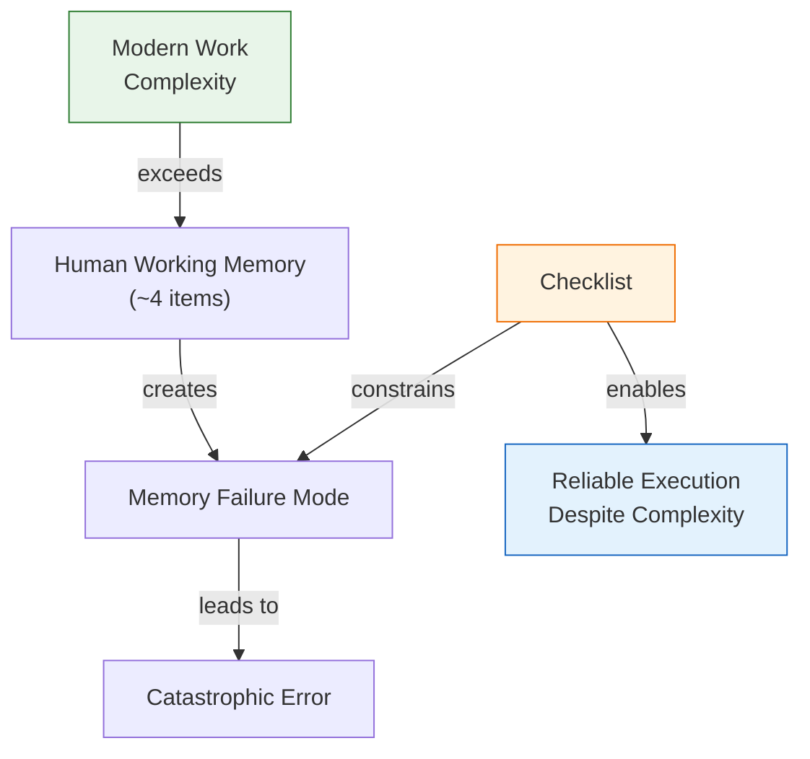
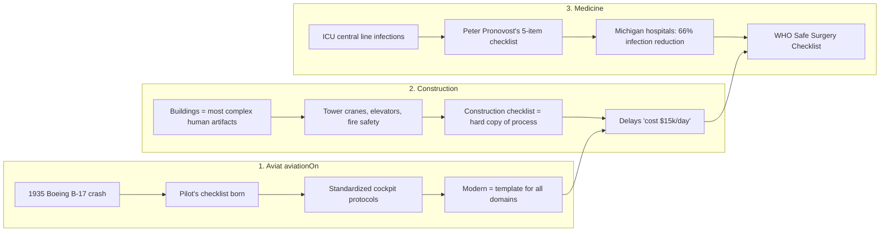
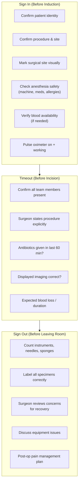
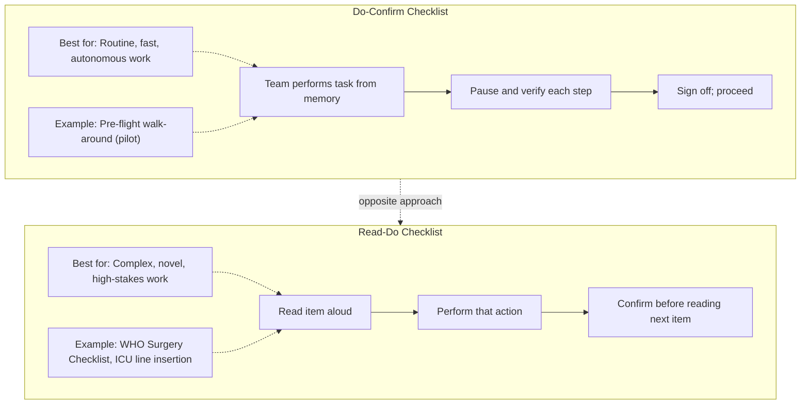

## Why Checklists Exist: The Cognitive Overload Problem

The starting premise of Gawande's argument is not that people are careless —
it is that modern work overwhelms the limits of unaided human memory. The
more you know, the more you forget. The more complex the task, the more
steps are required, and the more likely you are to skip the small ones.

The graphic illustrates the central thesis: when the demands of a task
surpass what unaided memory can hold reliably, a checklist acts as the
external constraint that prevents error. Complexity is not optional — it is
the defining condition of modern expertise. Checklists are not an admission
of incompetence; they are an engineering solution to a human constraint.

---

## The Three Domains of the Manifesto

Gawande builds the book by tracing the evolution of the checklist across
three increasingly ambitious domains:

**Aviation** gave us the first modern checklist in 1935, after a test pilot
crashed a Boeing B-17 during takeoff — not because flying was new, but
because the aircraft had simply grown too complex for any one person to
remember every step. The pilot's checklist was born at Kelly Field in Texas.
It was a scroll. It was rudimentary. It worked.

**Construction** is, Gawande notes, the most complex human artifact most
people ever engage with. Building a skyscraper requires the coordination of
hundreds of subcontractors across thousands of interdependent tasks. The
"checklist" here is not a single document — it is a hard copy of the
process, distributed, updated, and verified at every stage. Delay costs
approximately $15,000 per day on a major construction site; the checklist is
not a nicety, it is a financial instrument.

**Medicine** is where Gawande dwells longest, because it is where he lives.
The starting point is the work of Dr. Peter Pronovost at Johns Hopkins, who
created a simple 5-item checklist for preventing central line infections in
ICUs. When Michigan hospitals implemented it in 2003, they reduced line
infections by 66% and saved an estimated 1,500 lives and $200 million in
18 months. This was the proof of concept. Gawande then led the effort to
adapt the model for the global surgical setting — culminating in the WHO
Safe Surgery Checklist.

---

## The WHO Safe Surgery Checklist: Mechanics

The WHO Safe Surgery Checklist, launched in 2007, is structured around three
pause points — moments in the workflow where the team deliberately stops,
verifies, and confirms before proceeding.

The pilot phase (eight hospitals across eight countries) showed a reduction
in major surgical complications from 11.0% to 7.0% and mortality from 1.5%
to 0.8% — relative reductions of 36% and 47% respectively. These numbers
are extraordinary given the modest nature of the intervention: less than
three minutes of structured conversation.

---

## Do-Confirm vs. Read-Do: The Core Design Distinction

Not all checklists are built the same way. Gawande identifies two
fundamental patterns, each suited to different task conditions:

**Do-confirm** is faster and more trusting of expertise: the team knows
what to do, and the checklist simply catches the steps they might forget.
Pilots use this for routine pre-flight checks, where the aircraft is already
familiar.

**Read-do** is slower and more prescriptive: each item must be read aloud
and confirmed before the next is introduced. This is appropriate when the
team is managing something rare, novel, or where the cost of skipping a step
is severe. Surgery — where a patient's life is on the table and the
procedure may be unusual — matches read-do precisely.

The choice between them is the core checklist design decision, and choosing
wrong — using read-do for a routine, fast task, or do-confirm for a novel
high-stakes task — is itself a source of error.

---

## The Discipline-Dignity Connection

One of Gawande's most important contributions is reframing the emotional
resistance experts feel toward checklists. Many professionals perceive
checklists as condescending — an external authority telling them their
contribution is not trusted.

Gawande confronts this directly. The discipline of using a checklist and the
dignity of doing excellent work are the same thing:

> "The checklist has to be designed to allow for certain kinds of judgment
> and not to allow others. The purpose is to make sure that even the
> smartest, most experienced people on the team don't skip something that
> they now know they shouldn't, and that they are in a position to
> communicate and coordinate effectively."

Discipline and dignity are not opposites. Discipline is the repeated,
unpublic performance of details that others will never notice. Dignity is
derived from being the kind of professional who does those details anyway.

---

## Checklist Design Principles

From Gawande's observations and the iterative process he describes, the core
design principles emerge:

| Principle | Description |
|-----------|-------------|
| **5–9 items maximum** | Any longer and the checklist stops being read. Every item must justify its presence. |
| **Trigger pause at natural breakpoints** | Pause points must occur when the team has a moment to think — not when they are rushing. |
| **Use plain language, not jargon** | Short, active phrases ("Confirm antibiotics given") beat institutional abbreviations. |
| **Collaborate to design it** | The people who will use the checklist must help write it. Imposed checklists fail. |
| **Test, observe, revise** | A checklist is not final after one draft. Run it for a week. Watch where people balk. Fix those points. |
| **Separate must-do from nice-to-have** | Every item is critical or it is not on the list. The boundary between the categories must be explicit. |
| **One item per line** | Cluttered checklists breed skimming. Clean lists breed completion. |
| **Describe the purpose of the pause** | The "why" builds buy-in. "We pause before incision to verify antibiotics and marking — preventing wrong-site surgery." |

---

## The Communication Dividend

Perhaps Gawande's most surprising finding is that the primary benefit of
checklists is not individual error prevention — it is team coordination. The
brief, structured pausing of a checklist forces people who rarely work
together to speak to each other.

In a cockpit, this means the pilot and first officer are speaking in unison,
sharing situational awareness, catching each other's misreads. In an
operating room, it means the anesthesiologist, the scrub nurse, and the
surgeon are each confirming what they know *before* the incision — not
afterward, when a mistake has already been made.

The checklist, in this reading, is not a control mechanism. It is a brief,
practical conversation whose purpose is collective reliability.

---

## The Krause Central-Line Checklist: A Case Study

Dr. Peter Pronovost's innovation at Johns Hopkins in 2001–2003 provides the
book's most concrete evidence. His checklist for inserting a central
vascular line — a procedure performed hundreds of thousands of times per
year in US ICUs — had five items:

1. Wash hands with soap
2. Clean the patient's skin with chlorhexidine antiseptic
3. Put sterile drapes over the entire patient
4. Wear a sterile mask, hat, gown, and gloves
5. Put a sterile dressing over the catheter site after insertion

These steps were all known. They were all taught. And they were all skipped
with regularity, because busy clinicians had something more important to do
at the moment: manage a sick patient.

The result of implementing it across Michigan ICUs: central-line infections
fell from 11% to near zero within 18 months. Not reduced. Near zero. For a
problem the medical system had struggled with for decades.
