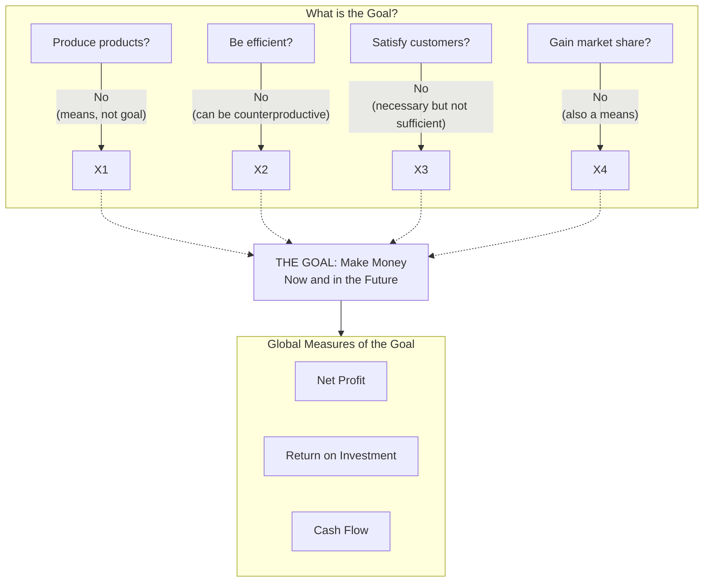
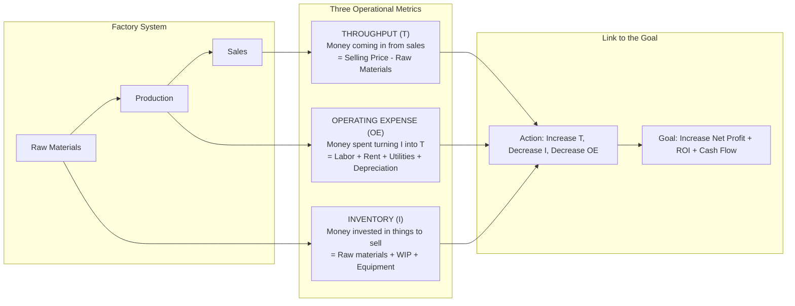
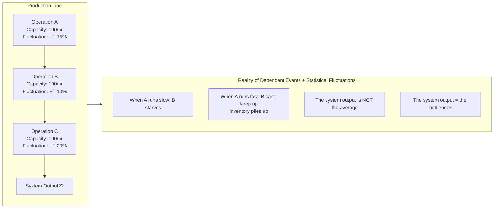
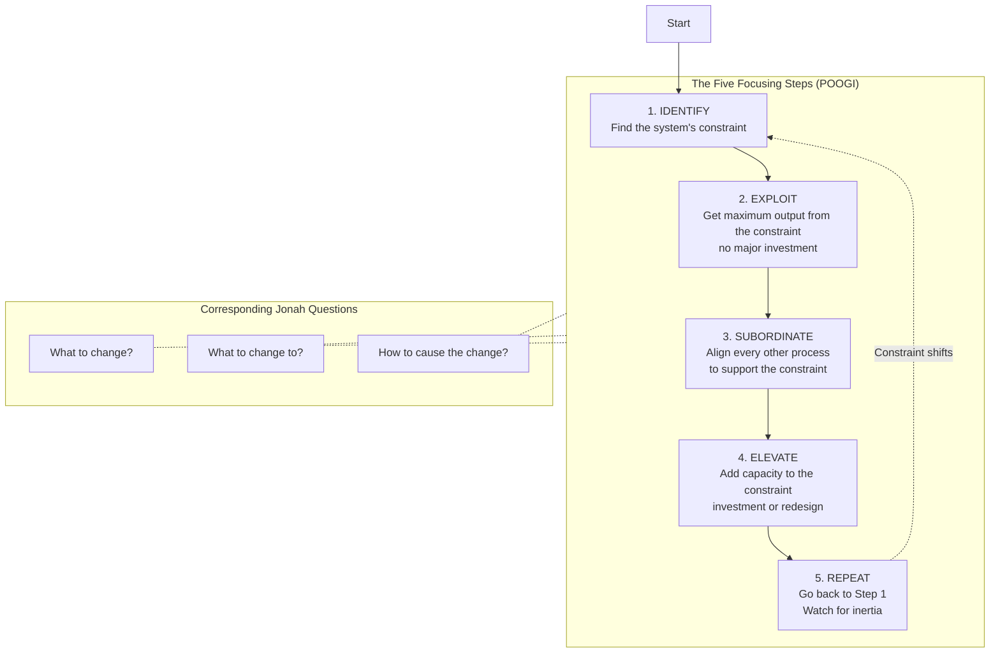
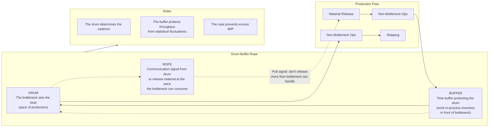

## The Goal

Jonah opens with a question that seems trivial but proves devastating in its
implications: **what is the goal of your business?**

Rogo's first answers — "to produce products," "to be efficient," "to keep
people employed," "to satisfy customers," "to build quality," "to gain market
share" — are all wrong. They are *means* to the goal, not the goal itself.
The goal of any for-profit business is to **make money** — now and in the
future.

Everything else is either a means or a distraction.

---

## Throughput Accounting

Traditional cost accounting creates perverse incentives. To replace it,
Goldratt introduces three operational measures that connect directly to the
goal.

### Definitions

**Throughput (T)** — The rate at which the system generates money through
* sales*. Critical distinction: producing something is not throughput.
Selling it is. Work-in-process sitting on the factory floor is inventory,
not throughput.

**Inventory (I)** — All the money invested in purchasing things the system
intends to sell. This includes raw materials, work-in-process, finished
goods, *and* machines, buildings, tools — all forms of capital tied up.

**Operating Expense (OE)** — All the money spent turning inventory into
throughput: labor, rent, utilities, depreciation, interest.

The goal equation: **increase T and decrease I and OE simultaneously**.
Among the three, T has the greatest leverage. A small increase in throughput
dwarfs the impact of a comparable reduction in OE — but most companies focus
obsessively on cost-cutting (OE reduction) while neglecting throughput.

---

## Dependent Events + Statistical Fluctuations

Jonah gives Rogo a riddle: what do **dependent events** and **statistical
fluctuations** have to do with your plant?

In any production process, operations are linked in sequence (dependent
events). Each operation also has natural variability (statistical
fluctuations). When the two combine, the system's output is governed by the
slowest operation — not the average.

### The Boy Scout Hike (Herbie)

Rogo discovers this principle not in a textbook but on a Boy Scout camping
trip. He leads a troop of boys on a hike. The line keeps stretching out.
The faster boys surge ahead; the slower ones fall behind. The troop's total
speed is determined not by the average hiker but by the *slowest* one.

That slow scout is named **Herbie**. When Rogo puts Herbie at the front of
the line and redistributes his heavy pack to faster scouts, the troop stays
together and arrives on time.

Herbie is the bottleneck. The scouts are dependent events. Their varying
speeds are statistical fluctuations. The lesson: **put the bottleneck first,
unload it, and subordinate everyone to its pace**.

---

## Theory of Constraints — The Five Focusing Steps

The Theory of Constraints (TOC) is Goldratt's core framework. It provides a
systematic method for improving any system by identifying and managing its
constraint — the one thing that limits its performance against its goal.

### Step 1: Identify

Find the resource whose capacity is less than or equal to the demand placed
on it. In Rogo's plant: the NCX-10 machine and the heat treatment area.
Symptoms: piles of work-in-process inventory in front of the resource, idle
downstream operations waiting for it.

### Step 2: Exploit

Get every last drop from the bottleneck *without spending money*. Ensure it
never sits idle during lunch or breaks. Only feed it quality parts (inspect
before the bottleneck, not after). Have operators running it during
lunch breaks. Dedicate a foreman to each bottleneck.

### Step 3: Subordinate

Every non-bottleneck must operate at the bottleneck's pace — not at its own
full capacity. This is the hardest step because it violates conventional
wisdom ("keep everyone busy"). If the bottleneck can process 100 units/hour,
running a non-bottleneck at 150 units/hour only creates excess inventory.
The non-bottleneck's utilization is determined by the bottleneck, not by
its own capability.

### Step 4: Elevate

If the bottleneck is still the constraint after exploiting and subordinating,
add capacity. Buy another machine. Outsource some work. Redesign the
process. This costs money — do it only after Steps 2 and 3 have been
exhausted.

### Step 5: Repeat (Watch for Inertia)

Once the bottleneck is broken, a new constraint will appear — possibly in
the market (demand is insufficient) rather than in the factory. The most
dangerous mistake: continuing to operate as if the *old* constraint still
exists. Inertia becomes the new constraint.

---

## Activation vs Utilization

One of Goldratt's most counterintuitive distinctions:

- **Utilization**: making a resource work in a way that moves the system
  toward its goal (increases throughput)
- **Activation**: making a resource work, period — regardless of whether the
  output contributes to the goal

A non-bottleneck running at 100% activation is *not* being fully utilized.
It is producing inventory that cannot be processed by the bottleneck,
increasing I (inventory) without increasing T (throughput). This is not
productive — it is wasteful, and it obscures the true bottleneck.

---

## Drum-Buffer-Rope

The operational mechanism that implements the Five Focusing Steps in a
production environment:

- **Drum**: the bottleneck sets the beat. The entire plant marches to its
  rhythm.
- **Buffer**: protective capacity in front of the bottleneck to ensure it
  never starves.
- **Rope**: a communication mechanism that releases new material into
  production only at the rate the drum can process it.

---

## The Socratic Method

Goldratt deliberately avoids giving answers. Jonah never tells Rogo what to
do — he asks questions that force Rogo to discover the answer himself. The
novel does the same for the reader. By the time Rogo implements the Five
Focusing Steps, the reader has derived them alongside him.

This is not a stylistic choice. It is a pedagogical theory: people resist
being told, but internalize what they discover. The book's structure *is*
its method.

### Jonah's Key Questions

| Chapter | Question | Purpose |
|---------|----------|---------|
| 4 | What is the goal of your company? | Expose the mismatch between activity and purpose |
| 11 | What do dependent events and statistical fluctuations have to do with your plant? | Introduce variability as the fundamental problem |
| 18 | Are your robots making money? | Challenge the assumption that automation equals productivity |
| 19 | How much does an hour of bottleneck downtime really cost? | Reveal the hidden leverage of constraints |
| 36 | What are the five steps you actually followed to fix the plant? | Formalize tacit knowledge into a repeatable process |

---

## The Process of On-Going Improvement (POOGI)

The final insight: improvement is never finished. Once you solve one
bottleneck, another appears. The constraint may shift from a machine to the
market (demand becomes the limiting factor) or to a policy (a company rule
prevents further improvement). The skill is not in finding a permanent
solution but in mastering the *process* of identifying and managing
constraints as they emerge.

Goldratt later summarized this as three questions (the Thinking Process):

1. **What to change?** — Identify the core problem
2. **What to change to?** — Find the simple, practical solution
3. **How to cause the change?** — Get people to adopt it

---

## Key Lessons

- **The goal is to make money.** Not to run machines, not to build inventory,
  not to hit utilization targets. Measure everything against T, I, OE.
- **Find the bottleneck before fixing anything.** Most improvement efforts
  fail because they optimize non-constraints.
- **An hour lost at the bottleneck is lost forever.** An hour saved at a
  non-bottleneck is a fantasy.
- **Do not balance capacity with demand.** You need excess capacity at
  non-bottlenecks to absorb statistical fluctuations.
- **Local optimization destroys global performance.** Every department
  running at full capacity creates system-level failure.
- **Quality before the bottleneck.** The bottleneck has zero spare time to
  process defective parts.
- **Inertia is the enemy.** When the constraint moves, your process must
  move with it.
- **People learn by deduction, not instruction.** The Socratic method is not
  slow — it is the fastest way to make knowledge stick.

---

## Practical Applications

### In Manufacturing
- Map the entire production flow. Identify the slowest operation.
- Never let the bottleneck run out of work. Build a time buffer before it.
- Release material into production only at the rate the bottleneck can
  consume it (the Rope).
- Inspect quality *before* parts reach the bottleneck.

### In Project Management (Critical Chain)
- Identify the resource that will be most heavily loaded (the project
  bottleneck).
- Add a project buffer at the end, not task-level safety time.
- Manage by buffer consumption, not milestone dates.

### In Software Development
- Your CI/CD pipeline has a bottleneck — find the slowest step and focus
  there.
- WIP limits (Kanban) are a direct application of the Rope principle.
- Don't optimize test speed for non-bottleneck services if the database is
  your constraint.

### In Personal Productivity
- What is the one constraint that limits your output? Exploit it, then
  subordinate your schedule to protect it.
- Your bottleneck might be energy, not time. Protect your peak hours.
- The Herbie principle: identify your slowest task and put it first.

---

## Action Plan

1. **Name the goal.** State in one sentence what your system exists to
   achieve. All measurements must flow from this.

2. **Map the flow.** Draw the sequence of dependent events in your process.
   Mark capacity and variation at each step.

3. **Find the bottleneck.** Where is inventory piling up? Where is the
   downstream process waiting? That is your constraint.

4. **Exploit it immediately.** Can you run it through lunch? Can you inspect
   quality before it reaches the constraint? Can you dedicate an operator?

5. **Subordinate everything.** Tell every upstream process: do not produce
   more than the bottleneck can consume. Tell every downstream process: be
   ready to accept whatever the bottleneck sends.

6. **Elevate if needed.** Only after steps 2-5 have been exhausted should
   you invest in more capacity.

7. **Watch for inertia.** When throughput improves, check whether the
   constraint has shifted. Do not keep running the old process.

8. **Repeat.** POOGI is a loop. There is no step 9.
