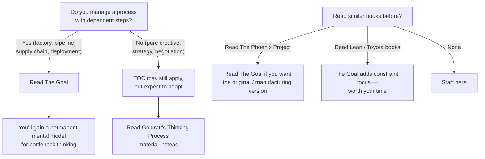

## Introduction

Welcome to BookAtlas. Today: *The Goal: A Process of Ongoing Improvement* by
Eliyahu M. Goldratt and Jeff Cox. Published 1984, North River Press.
408 pages. 10 million copies sold. The business novel that changed how
factories — and eventually software teams, hospitals, and project managers —
think about bottlenecks.

This is a story about a plant manager named Alex Rogo. His factory is
hemorrhaging money. His marriage is falling apart. He has three months to
turn things around. And the answer comes from his old physics professor.

But is this a genuinely original management framework or a novel-length
thought experiment that wears thin? We've got two voices to settle it. On
one side, an operations executive who rebuilt their factory around TOC and
swears by it. On the other, a skeptic who thinks the book is coasting on
one good idea stretched to breaking point.

Let's get into it.

---

## What Even Is This Book?

**[Operator]**: Before we argue, let's establish what *The Goal* actually
is. It's a novel — not a textbook, not a case study collection, an actual
story with characters and a plot. Alex Rogo runs a manufacturing plant that
is failing. Costs are up, shipments are late, inventory is piling up. His
division VP gives him an ultimatum: fix it in three months or the plant
closes.

At the airport, Alex runs into Jonah — his old physics professor — who
somehow knows exactly what's wrong with Alex's plant without ever having
seen it. Jonah won't give Alex answers. He asks questions. The book is
Alex discovering the Theory of Constraints through Jonah's Socratic prodding.

**[Skeptic]**: Right. And the first question is "what is the goal of your
company?" Alex goes through a bunch of wrong answers — produce products, be
efficient, satisfy customers — before landing on the obvious one: make
money. And I have to say, this is the most overrated "insight" in business
literature. Any first-year MBA student can tell you the goal of a for-profit
company is to make money. Goldratt presents this like a revelation.

**[Operator]**: But that's not the insight. The insight is that almost
*none of the conventional metrics* align with that goal. Cost accounting
tells plant managers to maximize machine utilization — which creates
inventory, not profit. Efficiency metrics tell them to keep everyone busy —
which means overproducing at non-bottlenecks. The "goal is make money" is
the starting point, not the conclusion. The conclusion is that everything
you think you know about running a factory is wrong.

---

## The Herbie Moment

**[Skeptic]**: Let's talk about the single most famous piece of the book.
Alex goes on a Boy Scout camping trip with his son. The troop is hiking
single-file through the woods. The troop keeps stretching out. Alex figures
out that the slowest kid — Herbie — is setting the pace for everyone. Put
Herbie at the front. Redistribute his pack. The troop moves faster.

Herbie is the bottleneck. The hike is the factory. The lesson: the speed of
the system is determined by its slowest component.

It's a good analogy. It really is. I'll give Goldratt full credit for that.
But it's also the closest the book comes to being intellectually
interesting. Once you've internalized "find the bottleneck and focus on it,"
you've absorbed about 80% of what the book is selling.

**[Operator]**: That's not fair. There is a lot more to TOC than "find the
bottleneck." There's the distinction between activation and utilization —
which is genuinely counterintuitive. There's the idea that a balanced plant
is mathematically impossible because of the combination of dependent events
and statistical fluctuations. There's the Five Focusing Steps, which are a
repeatable process, not a one-time fix. There's Drum-Buffer-Rope as an
operational mechanism.

But I'll grant you this: the Herbie analogy is doing a lot of heavy lifting.
It's the frame that makes everything else stick. And it works.

---

## The Heresy of Throughput Accounting

**[Operator]**: Here's where *The Goal* is most radical. Goldratt says cost
accounting is the enemy. He replaces it with three numbers:

- **Throughput (T)** — money coming in from sales
- **Inventory (I)** — money tied up in the system
- **Operating Expense (OE)** — money spent to make throughput happen

And the key insight: reducing OE is the *least* powerful lever. Increasing
T is the most powerful. Most companies do the opposite. They're obsessed
with cutting costs, cutting headcount, squeezing suppliers. But if
throughput is flat, all those cuts just make the company smaller — not
healthier.

**[Skeptic]**: That part is genuinely good. And it explains why so many
cost-cutting programs fail to produce lasting improvement. You can cut your
way to profitability once. You can't do it twice.

But — and I think this is important — throughput accounting is much harder
to implement in practice than the book suggests. What counts as "throughput"
when you're a multi-product company with complex bundling? How do you handle
shared capacity across product lines? The book uses a simple example — make
Product A, sell Product A — that doesn't generalize cleanly.

**[Operator]**: Sure, but that's true of any framework. The point is the
*orientation*. Traditional accounting says "our cost per unit is X, so we
need to produce more units to spread the fixed cost." That leads to
inventory bloat. Throughput accounting says "our bottleneck can process Y
units; let's make sure we sell every one of them before we worry about
anything else." The orientation shift is what matters.

---

## The Marriage Problem

**[Skeptic]**: We need to talk about Julie Rogo.

**[Operator]**: Yeah. We do.

**[Skeptic]**: Alex's wife exists in this book to be unhappy about Alex's
work hours, leave him, and return when he starts paying attention to her
again. She has no job, no interests, no independent arc. She is literally
a subplot that parallels the factory: fix the factory, fix the marriage.
The message is basically "if you're a good provider, your wife will stop
nagging you."

It's pretty hard to read in 2026 without cringing.

**[Operator]**: It's dated. The book was written in 1984, and the gender
dynamics reflect that. I'm not going to defend the Julie subplot as
progressive. But I will say: the parallel between managing the factory and
managing the marriage is intentional. Alex neglects both. He has to learn
to pay attention to both. The point is that you can't offshore your personal
life the way you offshore a bottleneck process.

But yeah, the execution is clumsy. I wish Goldratt had given Julie an
actual character.

---

## Herbie in the Real World

**[Skeptic]**: Let's get practical. How does TOC hold up outside of a 1984
factory with exactly two bottlenecks?

**[Operator]**: Remarkably well, actually. Here's where it's been applied:

- **Software development**: Kanban boards and WIP limits are TOC. The
  DevOps movement's focus on the deployment pipeline bottleneck is pure
  Goldratt.
- **Project management**: Critical Chain — Goldratt's own follow-up — is
  TOC for projects. Buffer management replaces earned value.
- **Healthcare**: Emergency departments use TOC to manage patient flow.
  The bottleneck is often the bed assignment process or the CT scanner,
  not the doctors.
- **Supply chain**: Drum-Buffer-Rope is still taught as a best practice
  for distribution.
- **Amazon**: Jeff Bezos requires his top management team to read *The
  Goal*. Amazon's fulfillment network is arguably the largest TOC
  implementation in history.

**[Skeptic]**: But here's the thing — when you look at those applications
closely, most of them are using TOC as one tool among many, not as a
comprehensive management system. Kanban was influenced by TOC, sure, but
it also draws on Toyota's production system, queuing theory, and
statistical process control. TOC is rarely the *only* framework. It's part
of a toolkit.

**[Operator]**: And that's fine. Goldratt never claimed TOC was the only
tool. He claimed it was the *most important* one — because it tells you
where to focus. Lean gives you improvement tools. Six Sigma gives you
variation analysis. TOC tells you which machine to apply Lean to. That
prioritization is the value.

---

## Does TOC Work?

**[Skeptic]**: The evidence for TOC is mostly case studies. Companies that
adopted it report 50-100% throughput increases, 50-90% lead time
reductions. Those are impressive numbers. But every management framework
has success stories. The question is: how much is the framework, and how
much is the focused attention?

**[Operator]**: That's the Hawthorne effect criticism, and it applies to
every intervention. But TOC has been around for 40 years. If it didn't
work, it would have died. Toyota's production system gets similar
reverence with similar evidence. And TOC's mechanism is transparent: if
you find a bottleneck and improve its output, system throughput increases.
That's not faith-based. It's physically true for dependent-event systems.

**[Skeptic]**: I'll grant you that for factories. I'm less convinced for
knowledge work, creative work, or service environments where the "throughput"
is hard to define. What's the bottleneck for a team of designers? For a
negotiation? For strategy formation? TOC starts to break down when the
process isn't linear.

**[Operator]**: That's fair. TOC originated in manufacturing, and its
strength is linear flow processes. Goldratt's later work — particularly the
Thinking Processes (Current Reality Tree, Evaporating Cloud) — was designed
for non-linear, people-intensive contexts. But those books (like *It's Not
Luck*) never achieved *The Goal*'s popularity. So the perception is that
TOC is a factory tool, which undersells it.

---

## The Verdict

**[Operator]**: If you manage anything that involves moving work through a
series of steps, you should read *The Goal*. The bottleneck framing is
permanently useful. It will change how you look at your factory, your
pipeline, your supply chain, or even your day. Every time something is
backing up, you'll ask "where's Herbie?"

**[Skeptic]**: It's a one-idea book, and the idea is a good one. But the
novel format adds 200 pages that a summary would cover in 20. The marriage
subplot is dated. And the book's dominance has meant that Goldratt's richer
later work — where he addressed the limitations of the simple bottleneck
model — is far less read. I'd recommend reading a summary of the Five
Focusing Steps and then moving to *Critical Chain* or *It's Not Luck* if
you want deeper TOC.

**[Operator]**: I disagree. The novel format is the whole point. You
remember the Herbie story because it's a story. If Goldratt had written
"The Five Focusing Steps: A Monograph," no one would remember it. The
format *is* the pedagogy. And that's why the book has endured for 40 years
while most management frameworks vanish in 18 months.

**[Skeptic]**: Fair point. I can't argue with the endurance.

---

## Final Thoughts

*The Goal* is a strange book — a physics professor's Socratic dialogue
disguised as a pulp novel about a failing factory. It shouldn't work. But
it does. The Herbie metaphor is sticky enough to rewire how you think about
flow. The Five Focusing Steps are simple enough to apply Monday morning.
And the core argument — that most of what we measure in business measures
the wrong thing — is as relevant today as it was in 1984.

The book has dated badly in its social dynamics and its manufacturing-only
focus. But the *thinking* it teaches — find the constraint, focus there,
and keep moving when it shifts — is timeless.

*The Goal* is the most influential operations book of the last half-century.
Not because it's the most rigorous, and not because it's the most complete.
Because it made a generation of managers ask one question that changed how
they work: "Where's the bottleneck?"

This has been a BookAtlas narration of *The Goal* by Eliyahu M. Goldratt
and Jeff Cox. Thanks for listening.
