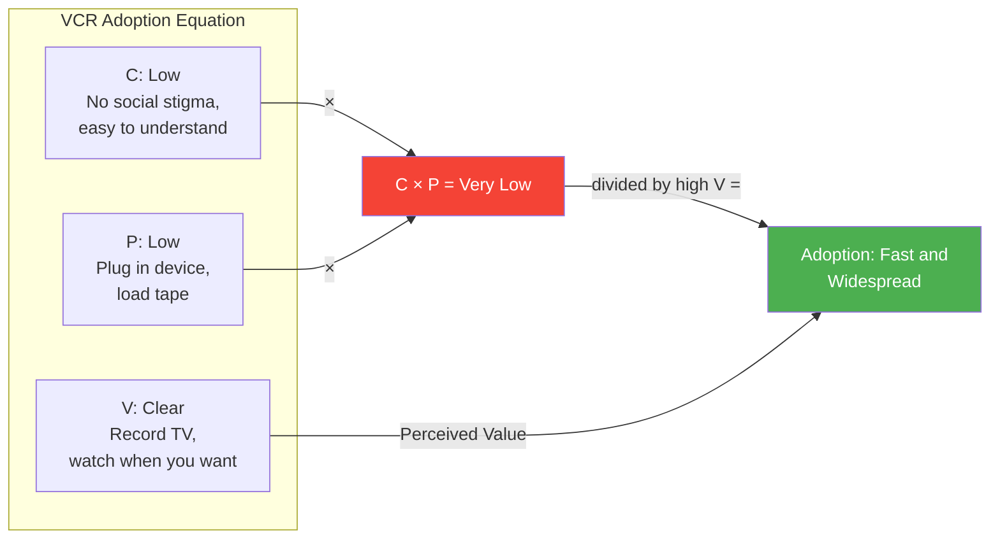
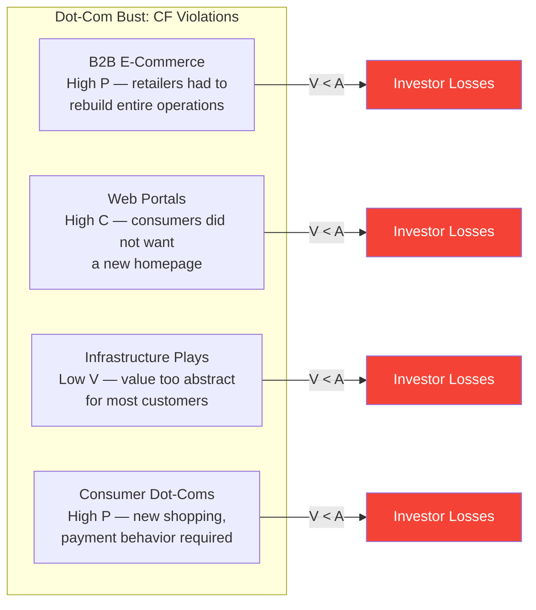

# Core Concepts

## The Change Function: C · P / V

Coburn arrives at the change function through consumer interviews, product launch analysis, and investor meeting observation. The formula he develops is:

```
Change Function = (C × P) / V

C = Consumer Anxiety
P = Pain of Change
V = Perceived Value
```

Adoption happens when V exceeds the product of C and P. The formula captures something subtle: anxiety and pain are multiplicative, not additive. A product that is moderately anxiety-inducing AND moderately painful to adopt will fail even if the value is high. A product with very low anxiety and very low pain can succeed with modest value.

### The Variables Defined

**C — Consumer Anxiety:** The psychological resistance a consumer feels toward adopting something new. This is not rational. It includes fear of looking foolish, fear of obsolescence of current skills, fear of social disapproval, and the general human preference for the known. Coburn treats C as real — the model fails if you pretend consumers are rational actors.

**P — Pain of Change:** The actual logistical friction of adoption. Does the product require new equipment? Does it require learning new workflows? Does it require unlearning old ones? Does it require involvement from other people (spouses, colleagues, IT departments) who also need to change? Pain is measurable in time, money, and habit disruption.

**V — Perceived Value:** The benefit the consumer thinks they will receive. This is subjective — it is what the consumer believes, not what the product objectively delivers. A product that is objectively revolutionary will fail if consumers do not perceive the value, either because it is poorly communicated or because the benefit is too abstract to grasp before purchase.

---

## The VCR Adoption Phenomenon

Coburn returns to the VCR as his defining case study because it demonstrates the change function operating at near-pure efficiency:



The VCR is not technically sophisticated — anyone could describe its function in one sentence. It fits cleanly into an existing behavior (television viewing). It requires no new skills. The value proposition — "watch what you want, when you want" — is immediately comprehensible. The result: VCR adoption went from zero to majority household penetration within roughly a decade, driven almost entirely by word of mouth and display in retail stores.

This is the benchmark. Most successful consumer technology approximates the VCR pattern: clear value, low behavior change, minimal social friction.

---

## Why Consumers Do Not Adopt Products

The most important section of the book for product builders is Coburn's systematic refutation of what he calls "the marketing myth" — the belief that poor adoption is a marketing problem. Coburn argues it is almost never true. Consumers do not fail to adopt because they have not heard enough about the product. They fail to adopt because the change function is negative. No amount of advertising can make V > A when the consumer's C and P components are too high.

### The Real Reasons for Non-Adoption

**Habit Lock-In:** Consumers have established patterns that work well enough. The cost of changing them is real even when the new product would be objectively better. Coburn cites examples of consumers who refused to switch to digital cameras for years, despite the superior image quality, because the habit of dropping film off at the photo lab was deeply embedded.

**Social Anxiety:** Some technologies make consumers feel old, out of touch, or uncool. Coburn observes that this is most acute for technologies that require visible behavior change — someone typing on a BlackBerry in 2004 looked productive; someone struggling with a Palm Pilot looked lost. The social cost of visible confusion is real.

**Network Incompleteness:** Some products require other people to also adopt before they become useful. A fax machine is useless if no one you know has one. Coburn treats this as a P component — the pain of being an early adopter in an incomplete network.

**Complexity Stacking:** The most lethal adoption killer is when a product requires multiple behavior changes simultaneously. Coburn points to early personal finance software as an example: to use it, consumers had to learn new software, reorganize their financial thinking, enter months of historical data, and trust a new piece of software with sensitive information — all at once. Most people did not.

---

## The Dot-Com Bust Through the Change Function Lens

The dot-com bust of 2000–2002 becomes, in Coburn's analysis, the largest real-world demonstration of change function failure in history. Hundreds of billions of dollars were deployed into business models that violated the change function consistently:



The common thread: in almost every case, the technology was genuinely innovative and the long-term market was real. The failure was in assuming that consumers or businesses would be willing to change enough behavior to access the value. Most were not. Coburn's prediction: the bust was not surprising once you applied the change function to the typical dot-com business plan.

---

## Why "Cool" Does Not Win

Coburn's second major corrective is to the enthusiasm of early adopters and the technology press. He documents a recurring pattern: technology that generates intense excitement among engineers and technology enthusiasts consistently fails in the mainstream market. The reason is precisely the change function dynamic: technologies that excite early adopters tend to be technologies that require behavior change. Why? Because early adopters are the people who enjoy changing behavior. Mainstream consumers are not.

**Case: Tablet PCs (pre-iPad).** Multiple companies released tablet computers before Apple's iPad in 2010. Each was technically sophisticated, praised by reviewers, and eagerly adopted by technology professionals. None reached mainstream adoption. The reason: using a tablet required abandoning the keyboard-and-mouse paradigm that most workers had spent years mastering. The anxiety and pain outweighed the value for the mainstream market.

**Case: WebTV (1996).** WebTV allowed consumers to browse the internet on their television sets. It was technically clever, well-funded, and received significant media coverage. It failed. Consumers who wanted the internet used computers. Consumers who watched television did not want to browse the internet on a screen designed for viewing from across a room at low resolution.

---

## Examples Across Technology Domains

### Mobile Phones

The mobile phone industry provides the clearest long-running demonstration of the change function. Early mobile phones (1980s–1990s) were large, expensive, and required consumers to abandon their home phones. The change function was close to neutral. Adoption was slow and confined to business users. The breakthrough came when technology evolved to the point where V increased dramatically — the phone became a multi-purpose device — and P decreased — it shrank, became cheaper, and integrated into existing habits. The iPhone's success in 2007 was not primarily a technology breakthrough; it was a change function optimization. The touch interface lowered P (easier to use than buttons) while raising V (internet, apps, media in one device). C stayed low because it felt familiar.

### Financial Services

Online banking provides an early example of change function dynamics. Early online banking required consumers to trust software with their finances, learn new interfaces, and abandon the ritual of visiting a branch or calling a phone representative. Coburn documents that early adoption was glacial precisely because C was high (trust) and P was high (new workflow). The breakthrough came when value shifted: online bill pay, real-time balance checking, and transaction history made the old behavior (filing paper statements, writing checks) seem obviously painful by comparison. V rose fast enough to overcome C and P.

ATMs provide an even earlier example. Initial resistance was high — consumers did not trust machines with their money. But the value (24-hour access, no wait, no teller interaction) was so high relative to anxiety that adoption accelerated once the first adopters demonstrated that the machines were safe.

### Consumer Technology

Digital cameras illustrate a gradual change function shift. Early digital cameras were expensive, had poor image quality, and required consumers to learn new software and workflow. The change function was negative for most consumers. Film cameras worked well enough. Over time, as prices fell, quality improved, and printing services emerged (lowering P), the change function crossed zero. The crossover was not a single event — it was a gradual process where V climbed and P fell until adoption became inevitable.

---

## The CPV Framework in Practice

Coburn provides a practical framework for applying the change function to product strategy:

### The Three Levers

**Lower C (Anxiety):**
- Reduce the visible difference from current behavior
- Use familiar interfaces and metaphors
- Let consumers try the product with minimal commitment
- Social proof from people like the target consumer
- Graduated exposure — do not ask consumers to switch entirely on day one

**Lower P (Pain of Change):**
- Reduce learning requirements
- Make the product backward-compatible or additive
- Minimize the number of simultaneous changes required
- Offer support, training, and assistance at the moment of transition
- Design for partial adoption — consumers should get value before they have fully switched

**Raise V (Value):**
- Focus on the benefit, not the feature
- Make value visible before purchase (free trials, clear demonstrations)
- Address the comparison directly: "This is better than what you already do"
- Reduce the gap between promised value and delivered value
- The best value propositions map directly to existing consumer desires, not new ones you are trying to create

---

## How to Predict Winners and Losers

Coburn's practical contribution is a prediction methodology rooted in the change function. He argues that accurate prediction is possible when analysts apply the framework rigorously rather than relying on technology enthusiasm or market size projections.

### Conditions for Reliable Prediction

The change function is most predictive when:
1. **V is obvious and immediate.** The consumer can understand the benefit before purchase
2. **C is low.** There is no social stigma or fear associated with adoption
3. **P is minimal.** The product fits into existing habits or requires minimal new learning

Products meeting these conditions have historically succeeded at very high rates. Products violating one or more of them have failed at very high rates.

### The Predictor vs. Backfill Distinction

Coburn makes a sharp distinction between real prediction and what he calls "backfill" — the practice of explaining why a technology succeeded or failed after the fact, using language that sounds predictive but was constructed in hindsight. Genuine prediction requires stating the change function outcome before the market result is known. Coburn argues that most technology analysts engage in backfill, not prediction, and that this is why their track records are poor.

---

## The Role of Convenience

Convenience is the hidden variable that appears throughout the book even though it is not formally part of the C/P/V notation. Coburn treats convenience as an amplifier that acts on both sides of the equation simultaneously:

- **Convenience lowers P** — a convenient product requires less behavior change
- **Convenience raises V** — the same benefit arrives faster, with less effort

The result is that convenience improvements shift the change function in consumers' favor more powerfully than either a value increase or a friction reduction alone. Coburn argues that convenience is consistently the underrated driver in technology adoption and that most product strategists focus on features while convenience — the way the product fits into existing lives — is the actual competitive advantage.
