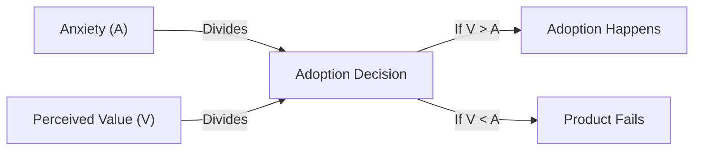

---
title: "The Change Function"
description: "An introduction to Pip Coburn's framework for understanding why some technologies take off and others fail"
date: 2006-01-01
---

# The Change Function: Why Some Technologies Take Off and Others Flop

## Overview

*The Change Function* (2006) by Pip Coburn arrives as a sharp corrective to a decade of excess. The dot-com bust had just laid bare a fundamental misunderstanding: technology companies and investors alike assumed that breakthrough technology — something genuinely new and useful — would automatically find a market. Coburn says no. The market does not care how clever your technology is. Markets care about a much simpler calculation running in every consumer's head.

Coburn's thesis is that technology adoption follows a change function — a ratio of perceived value to adoption anxiety. When perceived value exceeds anxiety, adoption happens. When it does not, the product fails, no matter how innovative it is or how much capital has been poured into it. This formula is deceptively simple, but it explains patterns that no amount of venture capital enthusiasm can override.

---

## The Author

Pip Coburn worked as a technology analyst at UBS for many years, covering software and internet companies through the peak of the dot-com bubble and its catastrophic collapse. His experience during that period — watching analysts, CEOs, and investors systematically misjudge which technologies would succeed — shaped this book. Coburn styles himself "the frog," a reference to the fable of the frog in gradually heating water that does not notice rising temperature until it is too late. Under that analogy, Coburn sees himself as someone who stays in the boiling water long enough to understand how the companies actually behave, rather than jumping out at the first sign of heat.

His vantage point at UBS gave him access to thousands of investor meetings, product demonstrations, and management briefings across the technology sector. He watched brilliant engineers pitch products that made no commercial sense, watched companies burn hundreds of millions of dollars pursuing markets that did not exist, and watched the market punish "cool" technology with the same disregard it showed for any other commodity.

---

## The Central Problem

The book opens by identifying the single most common mistake in technology investment and product strategy: confusing technological innovation with market demand. Coburn's core argument is that the two are not the same thing — and that founders, VCs, and corporate strategists routinely conflate them.

```
Technology innovation → Does not automatically → Market adoption
```

The gap between them is where Coburn's change function lives. It is not enough that a product is smart, or new, or technically superior. It must pass a consumer psychology test: will the receiver of the technology change enough of their existing behavior to obtain its benefits? If the answer is yes, the product can win. If the answer is no, it will not — no matter how much you spend on marketing.

---

## The Change Function Formula

Coburn's framework is often summarized as:



Anxiety is not a vague feeling. Coburn defines it as the sum of everything a consumer must change — habits, workflows, existing investments in learning, existing equipment, social relationships around the technology — to make use of the new product. Perceived value is the benefit the consumer believes they will receive. Adoption happens when V exceeds A. Period.

---

## The VCR as Prototype

Coburn uses the VCR as his archetype for successful adoption. The VCR — videocassette recorder — arrived in the market with genuine consumer benefit: you could record television programs and watch them when you wanted. But launching it required nearly zero change in viewing behavior. You still sat in your living room. You still watched the same channels. You just got to choose the time. The change function was nearly pure benefit with near-zero anxiety.

This contrasts sharply with products that required massive behavior change to realize modest benefits. Coburn details examples throughout the book — technologies that worked technically but required consumers to rebuild entire habits around them, technologies that forced users to abandon investments in existing systems, technologies that promised convenience but delivered complexity.

---

## Why "Cool" Does Not Win

One of the book's most provocative arguments is that being cool — being talked about in the media, praised by early adopters, or praised by technology journalists — predicts failure as often as it predicts success. Coburn observes that genuinely cool technology is often cool precisely because it requires behavior change. The people who adopt early do so because they are the kind of people who enjoy changing behavior. The mainstream market is not.

The pattern of "cool technology failing" recurs throughout history: early Wi-Fi devices, Tablet PCs before the iPad, WebTV, countless "information appliances" that made engineers excited and confused everyone else. Each of these required consumers to learn new workflows, abandon existing devices, and invest time in mastering interfaces that engineering teams had spent years perfecting. Coburn argues that this is not a market taste problem — it is math. The anxiety component of the change function is simply too high.

---

## Dot-Com Bust Lessons

The book devotes substantial attention to the dot-com bust as a real-time case study in change function failure. The late 1990s produced an extraordinary number of products and business models that treated consumers as abstractions. Companies built platforms that required consumers to adopt entirely new shopping habits, communication patterns, and payment behaviors — all simultaneously — and expected investors to fund this because the long-term technology addressable market was enormous.

Coburn's counter: consumers do not care about addressable market size. They care about the next behavior change they have to make. The failure was not in the technology or the market size. It was in the absence of any analysis of the change function before billions of dollars were deployed.

---

## Predicting Winners and Losers

A significant portion of the book is devoted to practical prediction. Coburn argues that, contrary to the popular belief that technology prediction is impossible, certain conditions make prediction reliable:

- When the change function is overwhelmingly positive (V >> A)
- When the product enables behavior the consumer already wants to do, more easily
- When the product degrades gracefully — consumers can use it partially while existing habits remain intact

These conditions are not rare. Coburn argues that analysts and investors routinely overlook them because they are too focused on technology rather than consumer behavior. Prediction failure is usually a focus failure, not a knowledge failure.

---

## Convenience as the Hidden Variable

Convenience is not a separate concept in the book — it is embedded in both V and A. A convenient product lowers anxiety (it fits into existing habits more easily) and simultaneously increases value (the benefit arrives with less friction). Coburn treats convenience as the most underrated variable in product strategy because it acts on both sides of the equation simultaneously.

---

## Place in the Genre

*The Change Function* occupies a distinctive position at the intersection of technology analysis, behavioral economics, and product strategy. It is more focused on consumer psychology than *Crossing the Chasm*, more empirical than most management books, and more skeptical of technology enthusiasm than the vast majority of technology writing from the era. It predates but anticipates much of the behavioral economics popularization that followed the 2008 financial crisis.

---

## Key Ideas

| Idea | Description |
|------|-------------|
| The Change Function | V > A must hold for adoption; value divided by anxiety |
| Anxiety as Behavior Cost | Every consumer behavior change has a real cost |
| VCR as Prototype | Successful adoption = high value, near-zero anxiety |
| Cool Technology Fails | Early adopter enthusiasm is a warning sign for mainstream |
| Dot-Com Bust as CF Failure | Bust was predictable from change function analysis |
| V > A is Sufficient | No marketing budget can overcome a negative change function |
| Gradual Adoption Wins | Products that let consumers adopt incrementally succeed |
| Convenience is Dual-Action | Lowers anxiety and raises value simultaneously |
| When Crystal Balls Work | Prediction is reliable when CF is obviously positive |
| Predictor vs. Backfill | Post-hoc rationalization is not prediction; real prediction works |