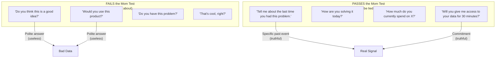
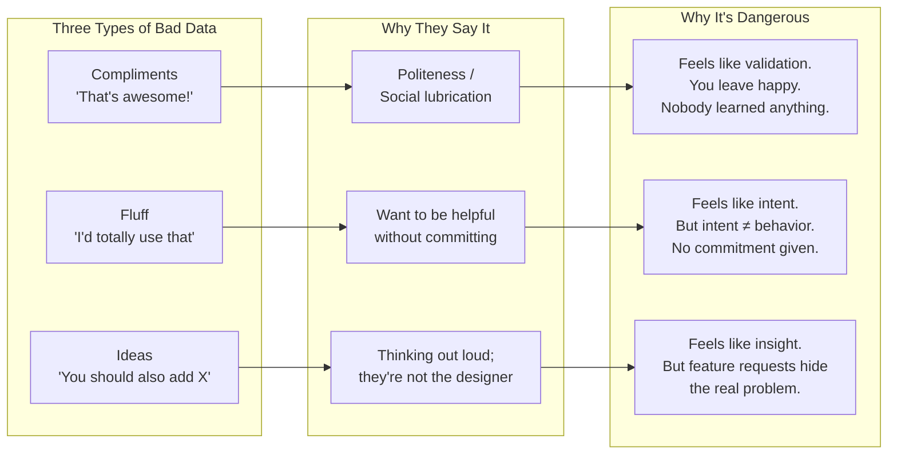
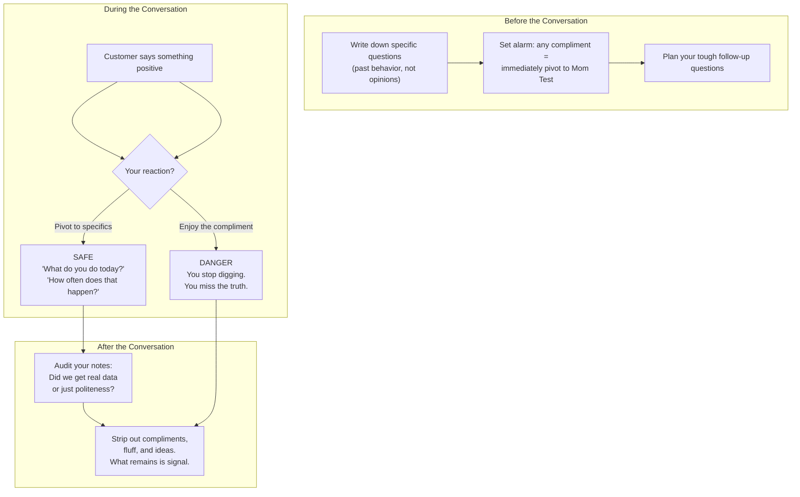
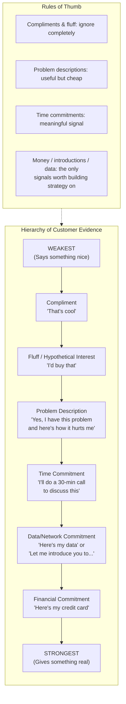
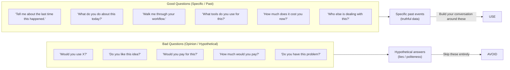
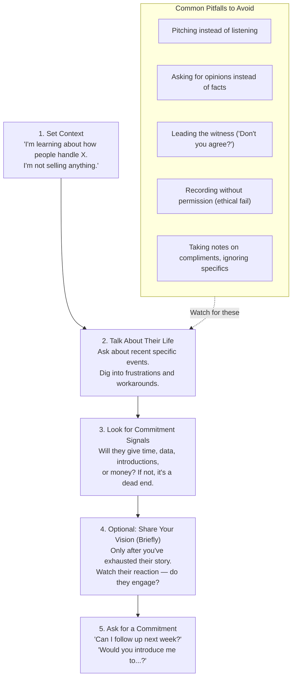
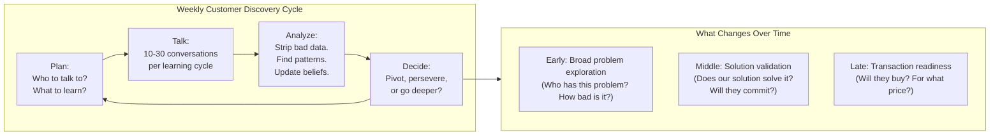

## The Mom Test

The foundational insight of the book. Named after the observation that even
your own mother will lie to you about your business idea — because she loves
you and doesn't want to hurt your feelings. The problem is not specific to
mothers; it applies to everyone you talk to:

| Person | Reason They Lie |
|--------|-----------------|
| Your mom | She loves you and believes in you |
| Your friend | They want to be supportive |
| A mentor | They want to encourage you |
| A potential customer | They want to be polite, end the conversation, or seem helpful |
| An investor | They want to stay on good terms (or they genuinely don't know) |
| You (to yourself) | Confirmation bias: you hear what you want to hear |

The Mom Test is not a question you ask — it is a filter you apply to every
customer conversation:

> **The Mom Test:** If you ask a question that a biased person could answer
> positively while still being technically truthful, you have failed the Mom
> Test — because they will.

The test forces you to design questions about the customer's actual behavior
rather than their opinion of your idea. If they cannot lie while answering
honestly, you are having a good conversation.

---

## Three Types of Bad Data

Most of what you hear in customer conversations is noise. Fitzpatrick
categorizes bad data into three types:

### Compliments

"When I told people about my idea, everyone said it was great!"

Compliments cost the other person nothing. They are social lubrication, not
market validation. The only appropriate response to a compliment is to
immediately pivot to a Mom Test question:

> **Them:** "That's a really cool idea!"
>
> **You (correct):** "Thanks. Out of curiosity, are you dealing with this
> problem today? What do you do about it?"

> **You (wrong):** "Great, so we're validated!" (You are not.)

### Fluff

"I'd definitely use that" / "That sounds really useful" / "I think there's a
market for this."

Fluff sounds more substantive than a compliment but is equally worthless.
The customer genuinely believes they would use it. They are not lying
intentionally. But hypothetical future behavior is not a reliable predictor
of actual behavior. The only meaningful response is to test for commitment.

### Ideas

"You should add X feature" / "Have you thought about doing Y instead?"

When a customer starts designing your product, it feels like deep engagement.
It is not. They are describing their current workflow in the form of a
feature request. Your job is to dig into *why* they want that feature:

> **Them:** "You should add a way to export to CSV."
>
> **You:** "Interesting. What does your current export workflow look like?
> What's frustrating about it?"

This uncovers the problem behind the feature request — which is actual signal.

---

## Defend Compliments

A practice, not a concept. Before every customer conversation, consciously
prepare to defend against the emotional lift that compliments give you.

The most dangerous moment is after a conversation that felt "great." If you
leave a customer meeting feeling good, you probably learned very little. If
you leave it feeling confused or sobered, you probably learned something real.

---

## The Hierarchy of Customer Evidence

Not all data from customer conversations is equally valuable. Fitzpatrick
ranks signals by how much commitment they required:

### What Each Level Actually Means

| Evidence Level | Example | What It Tells You |
|---------------|---------|-------------------|
| Compliment | "That's a great idea" | Nothing. Discard. |
| Fluff | "I would use this" | Nothing. Discard. |
| Problem description | "I spend 5 hours/week on this and it drives me crazy" | Real problem exists. Worth exploring. |
| Time commitment | "Sure, let's grab coffee next week" | They care enough to spend an hour. |
| Data / Network | "Here are my spreadsheets" / "Talk to my VP" | They are invested. Keep going. |
| Financial | "How do I pay?" / "Can I buy now?" | Strongest possible signal. Ship it. |

---

## Question Types: Good vs Bad

Fitzpatrick provides a clear taxonomy of questions:

### The "Bad Question" Surgery

If you catch yourself about to ask a bad question, Fitzpatrick provides a
simple fix:

| Bad Question | Why It's Bad | How to Fix It |
|--------------|-------------|---------------|
| "Would you use this?" | Hypothetical; they'll say yes to be nice | "How do you handle X today?" |
| "Do you like the idea?" | Opinion; you're asking for a compliment | "What frustrates you about the current way?" |
| "Would you pay for this?" | Hypothetical price anchoring | "What do you currently spend on X?" |
| "Is this a big problem?" | They'll agree to be helpful | "How often does X come up? What happens when it does?" |
| "What features would you want?" | They'll design your product | "Walk me through your process when X occurs." |

---

## The Customer Conversation Flow

Fitzpatrick describes a well-structured customer conversation in phases:

### The Golden Rule of Customer Conversations

> **Do not talk about your idea. Talk about their life.**

If you find yourself pitching, stop. You are not learning. The moment you
start selling, the conversation shifts from discovery to defense, and all
future data is contaminated.

---

## Running the Process

Customer discovery is a habit, not a milestone:

Fitzpatrick recommends planning customer conversations in batches rather than
one-offs. A single good conversation is an anecdote; ten good conversations
are a pattern. Between batches, formally analyze what you learned and update
your business hypotheses.

### The Note-Taking Protocol

1. Write down direct quotes — not your interpretation of what they meant
2. Note the commitment signal level (if any)
3. Flag compliments and fluff — then ignore them
4. After each conversation, answer: "What did I learn that I didn't know
   before?"

---

## Key Lessons

- **If you leave a conversation feeling good, you probably learned nothing.**
  Good conversations feel uncomfortable because they reveal problems with
  your assumptions.
- **Pitching is the enemy of learning.** Every minute you spend selling is a
  minute you are not discovering.
- **"I would use that" means nothing.** Ask for the credit card or the
  calendar invite.
- **Feature requests are hidden problem descriptions.** Never take them at
  face value; always dig for the underlying need.
- **Customer discovery is not a one-time validation milestone.** It is a
  continuous habit that runs throughout the life of the company.
- **Data from the top of the hierarchy is dangerous.** Build your strategy on
  commitments (time, money, access), not compliments.
- **You will be wrong. That is the point.** If you already knew everything,
  you wouldn't need these conversations. The faster you surface your wrong
  assumptions, the faster you find the right ones.

---

## Practical Applications

### For a First-Time Founder
- Set a goal: 10 customer conversations per week
- Before each conversation, write down 5 specific past-behavior questions
- Never pitch — if they ask "what are you building?" answer briefly and pivot
  back to their life
- After each conversation, audit your notes: strip compliments and fluff
- Track commitments: did anyone give you time, data, money, or introductions?
- When you get a compliment, immediately ask: "are you dealing with this
  problem today?"

### For a Product Manager
- Use the Mom Test framework for all user research interviews
- Flag feature requests and dig for the problem beneath them
- Build a weekly habit of 2-3 customer calls
- Train your team to recognize and discard bad data
- Create a shared "evidence board" tracking commitment signals, not
  compliments

### For a Salesperson (Early-Stage Sales)
- The commitment hierarchy maps directly to sales qualification: a prospect
  who won't give you time won't give you money
- Stop asking "would you buy this?" — ask about their budget, procurement
  process, and current vendor
- A prospect who is truly interested will self-identify by taking an action
- "That's cool" from a prospect is the same as from your mom — it means
  nothing

### For Breaking Bad Founder Habits
- Stop counting compliments as validation
- Stop asking hypothetical questions
- Stop designing products based on customer feature requests
- Stop having one-off conversations and calling it "customer development"
- Stop pitching in discovery conversations
