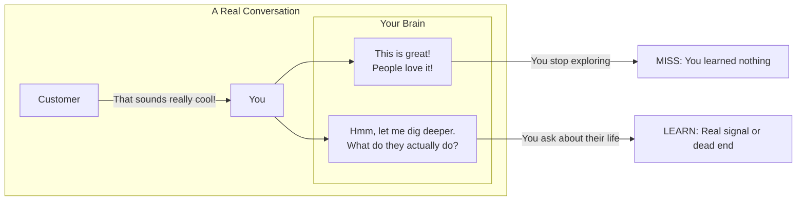
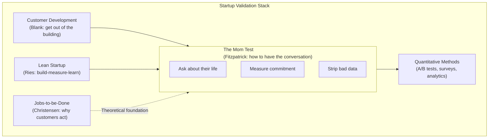
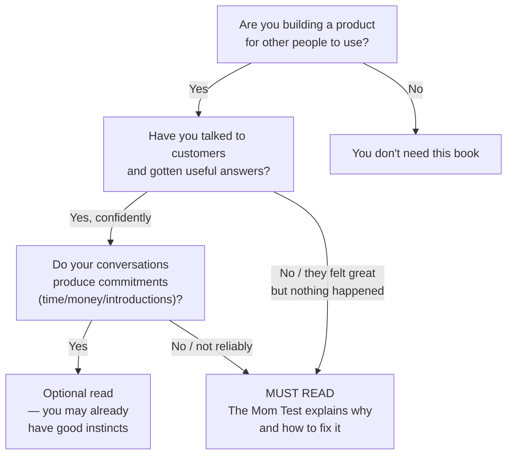

## Introduction

Welcome to BookAtlas. Today: *The Mom Test: How to talk to customers & learn
if your business is a good idea when everyone is lying to you* by Rob
Fitzpatrick. Self-published, 2013. 144 pages. One of the most influential
startup books you have probably never heard of — until someone pressed a
copy into your hands and said "read this."

The premise is simple: you ask your mom whether your business is a good idea.
She says yes. She is lying. Why? Because she loves you and does not want to
hurt your feelings. The problem is not specific to moms. Everyone you talk to
— friends, mentors, potential customers, investors — will lie to you for the
same reason. They want to be nice. They want to be supportive. They do not
want to be the person who crushed your dream.

The result is that most "customer validation" in startups is a complete
fiction. Founders walk out of conversations feeling great and then spend
months building something nobody actually wants. The Mom Test is the
antidote.

We're going to explore this book with two voices. On one side, a founder who
learned the hard way why The Mom Test matters. On the other, a skeptic who
thinks the book's advice is too simple to be as valuable as everyone claims.

Let's get into it.

---

## The Core Insight: Your Mom Will Lie to You

Fitzpatrick opens with a brutal observation: if you ask a question that a
biased person could answer positively while still being technically truthful,
they will. And almost everyone you talk to is biased in your favor.

> The Mom Test: a set of rules for customer conversations that lets you learn
> the truth even when everyone is trying to be nice.

The key is to design questions about the customer's actual life — not their
opinion of your idea. You do not ask "do you like this?" You ask "tell me
about the last time you had this problem."

**Founder:** This hit me like a truck. I had spent three months talking to
potential customers for my first startup. Every conversation went great.
Everyone loved the idea. I was so confident. And then when I launched,
nobody bought. Looking back, every single one of those conversations had
failed the Mom Test. I was asking questions they could lie about — and they
did.

**Skeptic:** Okay, but here is my problem: "ask about their life, not your
idea" is not exactly earth-shattering. It is basically good interviewing 101.
Why does this book get so much credit for stating the obvious?

**Founder:** Because stating the obvious is not the same as doing it. Every
founder knows they should talk to customers. Almost none of them do it well.
The book names the problem in a way that sticks. "Did I pass the Mom Test?"
is a question you can ask yourself in the middle of a conversation. That is
valuable.

---

## The Three Types of Bad Data

Fitzpatrick classifies everything that comes out of a customer's mouth into
three categories of useless:

| Type | Example | Why It's Useless |
|------|---------|------------------|
| Compliments | "That's awesome!" | Social politeness. Costs nothing. |
| Fluff | "I'd totally use that" | Hypothetical. Intent ≠ behavior. |
| Ideas | "You should add X feature" | They're designing, not describing. |

**Founder:** The bad data taxonomy is the most useful tool in the book. I
started mentally tagging every customer response as I heard it. Compliment.
Fluff. Idea. And I realized that 80% of what I was hearing was noise. Once
I started stripping it out, I had almost no signal left — which told me
something important: I was having the wrong conversations.

**Skeptic:** I get the taxonomy, but I think it is too harsh. Sometimes a
compliment is genuine. Sometimes a feature request contains real insight.
The book trains you to discard everything that feels good, which might cause
you to ignore useful information.

**Founder:** Fitzpatrick's point is that they *feel* like signal but are not
*reliable* signal. When you get a feature request, you should dig into the
problem behind it — not add it to your backlog. When you get a compliment,
you should pivot to a Mom Test question — not count it as validation. The
taxonomy does not tell you to ignore people. It tells you to stop taking
their output at face value.

---

## Defend Compliments

Fitzpatrick devotes an entire practice to recognizing and neutralizing
compliments. His warning is stark: compliments are addictive. They feel good.
They will make you stop digging.

**Skeptic:** This part I genuinely like. The advice to "defend compliments" is
concrete and useful. Most founders — myself included — have walked out of a
meeting high-fiving over a compliment that turned out to be meaningless.
Learning to treat compliments as danger signals is genuinely valuable.

**Founder:** Exactly. The book warns you: if you leave a conversation feeling
good, you probably learned nothing. Good conversations feel uncomfortable
because they surface problems with your assumptions. The best customer
conversation I ever had ended with me realizing my entire business model was
wrong. I felt terrible. It saved me six months.

---

## The Hierarchy of Customer Evidence

This is the book's operational heart. Fitzpatrick ranks signals from weakest
to strongest:

| Level | Signal | Value |
|-------|--------|-------|
| 1 | Compliment | Worthless |
| 2 | Hypothetical interest ("I'd buy") | Worthless |
| 3 | Problem description | Useful but cheap |
| 4 | Time commitment | Meaningful |
| 5 | Data / introductions | Strong signal |
| 6 | Financial commitment | Definitive |

**Founder:** The hierarchy is what makes the book actionable. It gives you a
decision rule. When someone says "I like your product," you mentally assign
it a zero. When someone pulls out their credit card, you assign it a ten.
You build your strategy on the tens, not the zeros.

**Skeptic:** It is useful as a heuristic, but it can be oversold. I have had
prospects who said "I'll buy" and then disappeared. I have had prospects who
said nothing enthusiastic and later became my biggest customers. The hierarchy
is a guide, not a law.

**Founder:** Fair. But without the hierarchy, founders tend to treat all
signals as equal. A compliment and a purchase get the same weight in their
mental model. The hierarchy is wrong in some cases, but it is better than the
default — which is "everything is signal."

---

## Talk About Their Life, Not Your Idea

Fitzpatrick's most important tactical rule: stop pitching and start asking
about the customer's current reality.

| Good Question | Bad Question |
|---------------|--------------|
| "Walk me through how you handled this last week." | "Would you use this?" |
| "What do you currently spend on this?" | "Would you pay $10/month?" |
| "What's frustrating about your current solution?" | "Do you think this is a good idea?" |
| "Who else deals with this problem?" | "Do you know anyone who needs this?" |

**Founder:** This was the hardest rule for me to follow. Every instinct says
"pitch your idea." You are excited. You want to share. But pitching is the
enemy of learning. When you pitch, the customer shifts from informant to
audience. They stop telling you the truth and start reacting to your
performance.

**Skeptic:** I push back on the absolutism here. Some customers need to know
what you are building before they can answer usefully. I have had excellent
conversations where I started with a 30-second pitch — "here is who we are
and what we are trying to do" — and then spent the remaining 29 minutes
asking about their life. A brief pitch at the top establishes context and
credibility. The rule should be "don't spend the whole conversation pitching,"
not "never pitch."

**Founder:** That is a fair refinement. Fitzpatrick's absolutes are training
wheels. Once you understand the principle, you can apply judgment. For a
first-time founder who is naturally inclined to pitch for 25 of 30 minutes,
"never pitch" is safer than "pitch a little."

---

## The Bigger Picture: Where Does This Fit?

Let's zoom out. The Mom Test covers one phase of one skill in the startup
toolkit. Here is where it fits:

**Founder:** This is the perfect way to think about it. Blank gives you the
strategy. Ries gives you the system. Fitzpatrick gives you the conversation.
You need all three. But most founders read Blank and Ries and skip Fitzpatrick
— then wonder why their customer conversations feel pointless.

**Skeptic:** I would add that Fitzpatrick is also a corrective to over-
reliance on quantitative methods. The lean startup culture can become
obsessed with A/B tests and conversion rates. The Mom Test reminds you that
behind every metric is a human being with a story. You need both.

**Founder:** Agreed. But I also think the quantitative culture has led to an
under-appreciation of The Mom Test. Founders think they can skip the
conversations and just run experiments. They can't. Experiments test
hypotheses; conversations generate them. You cannot run good experiments
without good hypotheses. The Mom Test is how you get good hypotheses.

---

## The Biggest Criticisms: A Fair Hearing

Let's be honest about the book's limitations:

1. **It is very short.** 144 pages with large type and wide margins. Some
   concepts are introduced and then abandoned. The book feels more like a
   manifesto than a comprehensive guide.

2. **It is B2B SaaS-centric.** The examples assume you are selling to
   businesses. Consumer founders and marketplace founders have to adapt the
   principles to their context.

3. **"Never pitch" is too absolute.** As we discussed, a brief, context-
   setting pitch can be useful. The absolutism is a useful corrective for
   beginners but becomes a hindrance with experience.

4. **No quantitative methods.** The book focuses entirely on qualitative
   conversations. It does not tell you how to validate the signal you get
   through experiments or data analysis.

5. **The editing is rough.** Self-published quality. Typos. Awkward phrasing.
   It does not affect the substance but it can be distracting.

6. **No sustained case studies.** The book uses brief examples but never
   walks through a complete customer discovery cycle. A full-length case
   study would make the concepts more concrete.

7. **Emotional cost of truth-seeking is not addressed.** The book tells you
   to seek the truth, but does not prepare you for the emotional toll of
   repeatedly hearing that your idea has problems.

**Founder:** These are all real. But I think the book's strengths — brevity,
memorability, immediate applicability — are the flip side of its weaknesses.
A 400-page version of The Mom Test would not be read or re-read. The fact
that it is short is why it is effective.

**Skeptic:** I agree that brevity has value. But I have seen founders treat
this book as sufficient — "I read The Mom Test, I did ten customer calls, I'm
validated" — and they move forward with dangerously thin evidence. The book
does not tell you how many conversations are enough, how to analyze them, or
how to weigh conflicting signals. It gives you a starting point, not a
complete process.

**Founder:** I think Fitzpatrick would agree with that. The book is explicitly
a tactical guide for one specific skill. It does not claim to be a complete
validation methodology.

---

## The Verdict: Do You Need This Book?

**Founder:** For a first-time founder, this is non-negotiable. Read it before
you have your first customer conversation. Read it again after you have had
ten conversations — you will be amazed at what you missed the first time.

**Skeptic:** I will say this: if you have never had a customer conversation
that changed your understanding of the problem you are solving, you need this
book. If your conversations routinely produce compliments but not commitments,
you need this book. If you have built something nobody wanted despite talking
to customers, you need this book.

**Founder:** That is a good test. Let me add one more: if you are a founder
and someone recommends you read The Mom Test, do not be offended. They are
not saying you are bad at talking to customers. They are saying you are human,
and humans are bad at this. The book is the fix.

---

## Final Thoughts

The Mom Test is a book about one thing: getting truthful answers from
customer conversations. It is short, practical, and memorable. It will
change how you run your next customer call.

Its core insight — that the people you ask have powerful incentives to lie,
and that most startup "validation" is therefore theater — is both obvious in
retrospect and almost universally ignored. The book names the problem, gives
you tools to solve it, and gets out of your way.

It is not a complete startup methodology. It does not replace Steve Blank,
Eric Ries, or quantitative methods. But as a tactical guide for the single
most important skill in early-stage entrepreneurship — talking to customers
and learning the truth — it has no equal.

The best compliment I can give: I have recommended this book to dozens of
founders. Every single one who actually applied it came back and said it
saved them months of wasted effort. That is not fluff. That is a commitment
signal.

This has been a BookAtlas narration of The Mom Test by Rob Fitzpatrick.
Thanks for listening.
