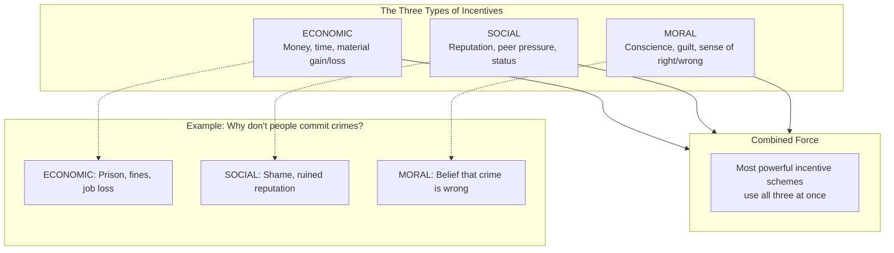
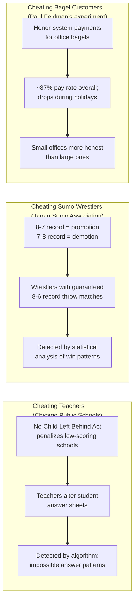
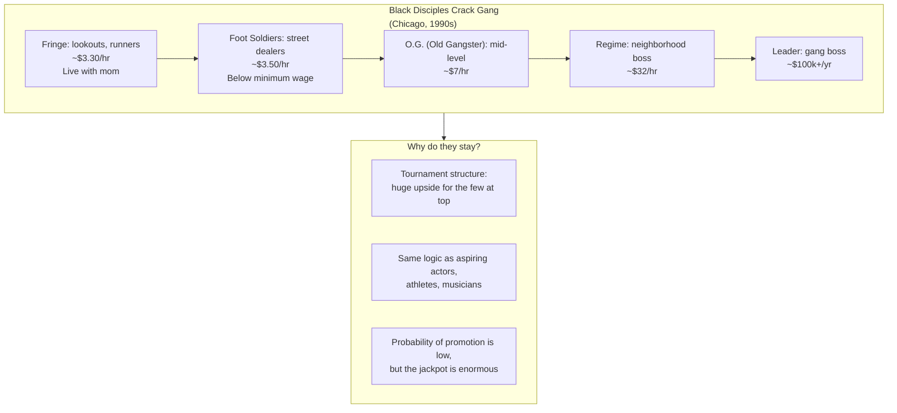
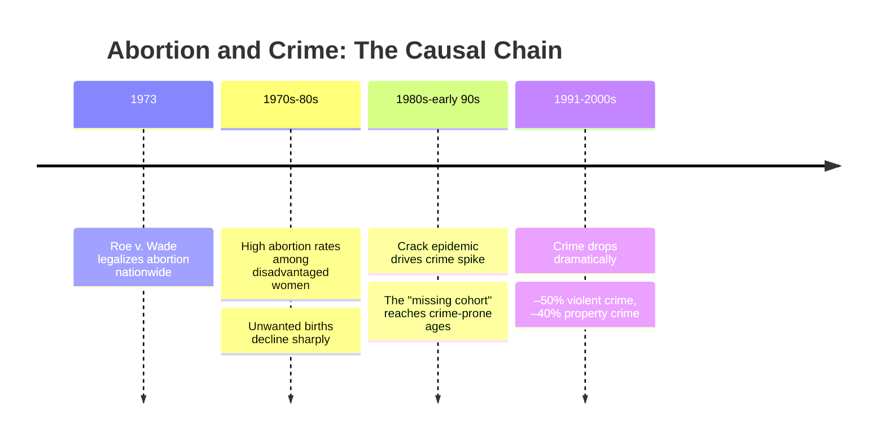
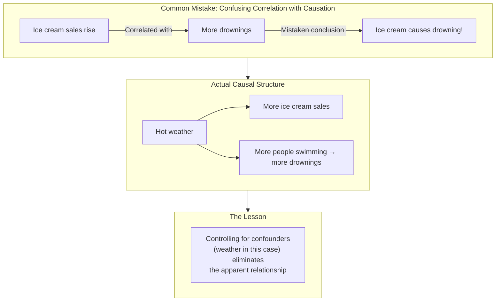
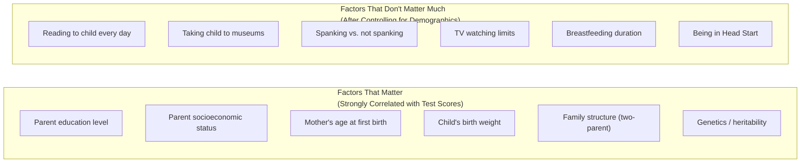

## The Three-Legged Stool of Incentives

Every human behavior, according to Levitt, can be traced to three kinds
of incentives working in concert:

### Economic Incentives
Tangible rewards or penalties that alter the cost-benefit calculation of
a decision. Examples: bonuses, fines, tax breaks, prison sentences.

### Social Incentives
The desire to be viewed favorably (or avoid being shamed) by peers,
family, and community. Examples: publishing the names of arrested
clients, awarding public praise, peer pressure.

### Moral Incentives
Appeals to conscience and internalized ethical standards. Examples:
charitable giving, voting, the instinct not to harm others.

### The Daycare Fine Paradox
The book's most famous example of incentives backfiring: an Israeli
daycare introduced a $3 fine for parents who picked up their children
late. The fine did not reduce lateness — it *increased* it. Before the
fine, parents felt moral and social pressure to be on time. The fine
replaced that with a transaction: for $3, you bought the right to be
late. When the fine was removed, lateness stayed high — the moral
incentive had been permanently displaced.

---

## The Anatomy of Cheating

Cheating, Levitt argues, is simply "getting more for less" — a rational
response to incentives when the expected benefits outweigh the expected
costs. The book examines three cases:

### Key Findings on Cheating
- **Who cheats?** Almost everyone, given the right incentives. Even
  highly professional teachers.
- **Detection matters.** The perceived probability of getting caught is
  the strongest deterrent — more powerful than the magnitude of penalty.
- **Context shifts honesty.** People are more honest in good weather,
  after 9/11 (patriotism effect), and in smaller groups.
- **Daycare fine effect in reverse.** Moral incentives (not stealing the
  bagel) were stronger than economic ones (saving $1) — until the
  economic calculation was made salient.

---

## Information Asymmetry

Whenever two parties in a transaction have unequal knowledge, the better
informed party can exploit the gap. The book contrasts two cases:

```mermaid
flowchart TB
    subgraph KKK["The Ku Klux Klan"]
        K1["Relied on secrecy and<br/>fear of the unknown"]
        K2["Stetson Kennedy infiltrated<br/>the Klan in the 1940s"]
        K3["Published secret rituals,<br/>handshakes, code words"]
        K4["New members publicly<br/>humiliated on TV/radio"]
        K5["Membership collapsed as<br/>information advantage vanished"]
    end

    subgraph RE["Real Estate Agents"]
        R1["Know true market value<br/>of homes in area"]
        R2["Commission structure creates<br/>misaligned incentives"]
        R3["Self-interest: sell fast,<br/>not at highest price"]
        R4["Agents keep own homes on<br/>market 10 days longer,<br/>get 3%+ higher price"]
        R5["Clients accept lower offers<br/>because agent steers them"]
    end

    K1 --> K2 --> K3 --> K4 --> K5
    R1 --> R2 --> R3 --> R4 --> R5
```

### The Expert's Dilemma
Experts (real estate agents, doctors, car mechanics, financial advisers)
have both superior knowledge and their own interests. The more an expert
knows relative to a client, the greater the potential for exploitation.
The internet — by democratizing information — has been the single
greatest check on expert power.

### The KKK Case Study
The Klan's power depended on the mystique of its secrecy. When Stetson
Kennedy infiltrated and broadcast its rituals on the radio show *The
Adventures of Superman*, the organization's mystique evaporated.
Membership plummeted. The lesson: sunlight is the best disinfectant.

---

## The Economics of Drug Dealing

Conventional wisdom: drug dealers are rich. The data: the average crack
dealer earns minimum wage.

### Key Findings
- The top 2-3% of the gang made nearly as much as a corporate CEO.
- The bottom 80% earned less than the legal minimum wage.
- Gang members faced a 1-in-4 chance of being killed during their
  years in the gang — far more dangerous than any legal job.
- The gang operated like a franchise: local bosses paid a percentage of
  their revenue to the national organization.

---

## The Abortion-Crime Link

The most controversial argument in the book. Levitt and co-author John
Donohue argued that the legalization of abortion in *Roe v. Wade* (1973)
was the single biggest factor in the dramatic crime drop of the 1990s.

### The Logic
1. Legalized abortion → fewer unwanted children
2. Unwanted children are statistically more likely to become criminals
   (born to poor, young, single mothers with fewer resources)
3. The cohorts that would have been born just after *Roe* entered their
   high-crime years (ages 18-24) in the early 1990s
4. Those cohorts were smaller and had a lower propensity for crime

### The Evidence Levitt Cites
- States with higher abortion rates in the 1970s had larger crime drops
  in the 1990s
- The five states that legalized abortion before *Roe* (NY, CA, WA, AK,
  HI) experienced crime drops 2-3 years earlier than the rest of the
  country
- Romania's brutal 1966 abortion ban led to a surge in crime 20 years
  later as the banned-cohort generation reached adulthood

### Controversy
See the Analysis section for a detailed treatment of the criticisms.

---

## Correlation vs. Causation

A recurring theme: just because two things happen together does not mean
one causes the other.

### Examples from the Book
- **Money and elections:** Candidates who spend more win more often, but
  cutting a winning candidate's budget in half would cost them only ~1%
  of the vote. Successful candidates attract donations; donations do not
  cause victory.
- **The economy and crime:** Both improved in the 1990s, creating a
  satisfying narrative. But when Levitt controlled for other factors, the
  economy's contribution to the crime drop was negligible.
- **Police and crime:** More police → less crime? Or more crime →
  cities hire more police? The causal arrow runs both ways.

### How Levitt Tries to Establish Causation
- **Natural experiments:** Events that create treatment and control
  groups as if by random assignment (e.g., the timing of abortion
  legalization across states).
- **Instrumental variables:** Using a third variable that affects the
  suspected cause but not the outcome directly.
- **Panel data:** Tracking the same units over time to control for
  unobserved fixed characteristics.

---

## Parenting: Who You Are vs. What You Do

The book's most reassuring (or unsettling) finding: by the time you
become a parent, the most important factors for your child's success
are already determined.

### The Swimming Pool vs. Gun Fact
A chapter-five showstopper: swimming pools are roughly 100 times more
dangerous to children than guns. The average American pool kills 1 child
per 11,000 pools annually; the average gun kills 1 per 1,000,000+. Yet
parents fear guns far more than pools. This illustrates how risk
perception is shaped by media coverage and emotional salience, not data.

### The Name Game
Chapter six examines whether names shape destiny. Conclusion: no. A
child named "Temptress" or "Winner" is not destined for any particular
outcome. The name is a signal, not a cause — it reveals the parents'
education, race, and class, which *are* predictive. Black-sounding names
(like "DeShawn" or "Imani") appeared to correlate with worse life
outcomes, but that correlation vanished when family background was
controlled for.

---

## How to Think Like a Freak

The book's implicit methodology:

1. **Identify the incentive structure.** Who wants what? What are the
   costs and benefits of different actions?

2. **Question conventional wisdom.** Is the common explanation supported
   by data, or does it serve someone's interest?

3. **Look for natural experiments.** Find situations where the world
   created a control group.

4. **Distinguish correlation from causation.** Don't mistake A-happens-
   with-B for A-causes-B.

5. **Follow the data wherever it leads.** Even — especially — if it
   leads to an uncomfortable conclusion.
