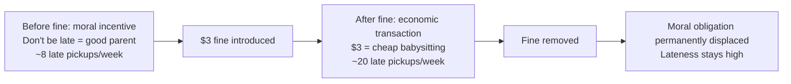
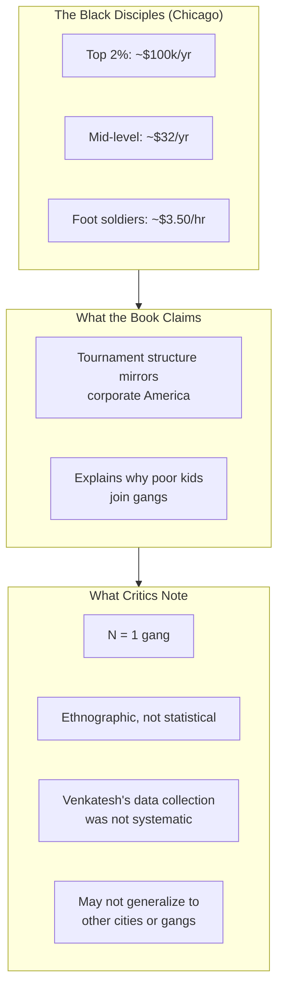
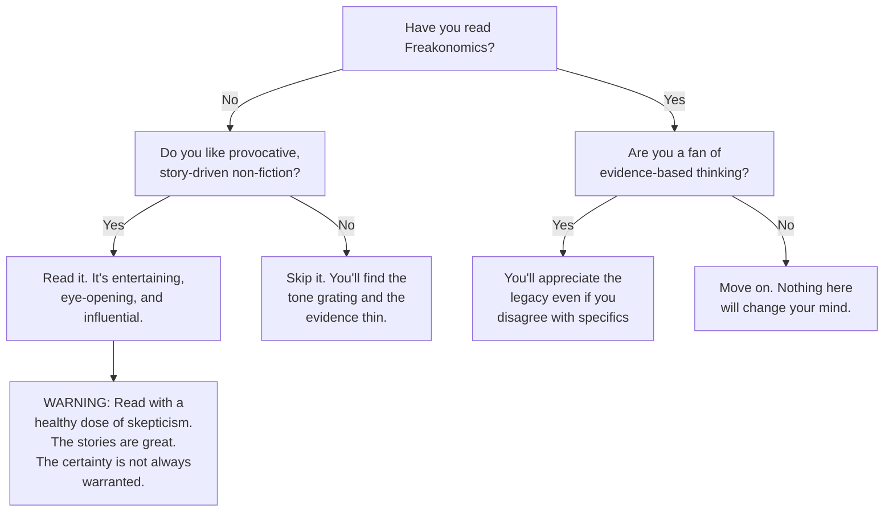

## Introduction

Welcome to BookAtlas. Today: *Freakonomics: A Rogue Economist Explores
the Hidden Side of Everything* by Steven D. Levitt and Stephen J. Dubner.
Published April 2005, William Morrow. Revised and expanded edition 2006.
336 pages. 4 million copies sold. 35+ languages. Countless imitators.

This is the book that made economics cool. But did it make economics
*true*? We're going to debate that with two voices. On one side, a data
journalist who considers Freakonomics the founding text of their field.
On the other, a skeptical economist who thinks the book is more style
than substance — provocative stories slapped onto thin evidence.

Let's get into it.

---

## The Setup: What Is Freakonomics?

The book opens with an audacious claim: morality represents the way
people would like the world to work. Economics represents how it
actually does work. Then comes a string of bizarre questions — What do
schoolteachers and sumo wrestlers have in common? Why do drug dealers
live with their moms? — and the promise that data can answer them.

**Fan:** This opening is brilliant. It tells you exactly what kind of
book this is going to be. Not a textbook. Not a policy paper. A series
of puzzles, each solved with data. It's the most addictive structure for
non-fiction I've ever read.

**Skeptic:** It's addictive because it's designed to be. Each chapter
is a magic trick. Levitt shows you something surprising, then gives you
an explanation that sounds rigorous — but you never see how the trick
works. The methodology is hidden. And some of the tricks... let's just
say the magician is not always honest about what he's doing.

---

## Incentives: The Core Idea

The central framework is incentives — economic, social, and moral. The
daycare fine example is the star of Chapter 1.

**Fan:** The daycare fine story is perfect. An Israeli daycare introduces
a $3 fine for late pickups. Late pickups go *up*. When they remove the
fine, late pickups stay high. The parents were bought out of their guilt.
A $3 transaction replaced a moral obligation. This single story
illustrates more about human behavior than a hundred academic papers.

**Skeptic:** The daycare story is great. I'll give you that. But notice
what Levitt does: he tells you one story and implies it proves a general
principle. One daycare in Israel. One study. That's not how science
works. It's an anecdote dressed up as evidence. A good anecdote — but
still an anecdote.

---

## The Abortion-Crime Link: The Elephant in the Room

We need to address the most controversial claim in the book. Levitt
argues — based on his academic paper with John Donohue — that the 1990s
crime drop was substantially caused by *Roe v. Wade* legalizing abortion
two decades earlier.

**Fan:** This chapter is what Freakonomics does best. It takes something
everyone thought they understood — the crime drop — and offers a
counterintuitive, data-backed alternative. The evidence is genuinely
compelling: states that legalized abortion early saw crime fall earlier.
Romania's abortion ban led to a crime surge. The timing lines up.

**Skeptic:** Let me count the problems. First, most criminologists
reject the hypothesis outright. Age-specific crime rates don't show the
predicted pattern. Second, Levitt and Donohue had to correct a
significant coding error in their own paper. Third, the results are
fragile — change the specification, change the conclusion. Fourth, when
Levitt updated the analysis in 2019, the implied effect was so large
he himself said it was "almost mind-boggling." That's not confidence.
That's a red flag.

**Fan:** But the paper was published in the *Quarterly Journal of
Economics*. It passed peer review. The critics have been answered.

**Skeptic:** Peer review is not infallible. And Levitt was the editor of
the *Journal of Political Economy* — a journal that published a
supportive paper by his friend Emily Oster that later turned out to be
wrong. There's a pattern of insufficient skepticism toward friendly
research. The abortion-crime link may be true — but the book presents it
with far more certainty than the evidence warrants.

---

## The Crack Gang: Business as Usual?

Chapter 3 is based on Sudhir Venkatesh's embedded research with the
Black Disciples in Chicago. The finding: crack gangs are structured like
McDonald's — a few rich bosses at the top, minimum-wage workers below.

**Fan:** This chapter alone is worth the price of the book. Venkatesh
lived with the gang for years. The fact that the median crack dealer
makes less than minimum wage and still lives with his mother — and that
they all stay because they're playing a tournament where the top prize
is enormous — that explains so much about inner-city poverty and
violence.

**Skeptic:** It's a compelling story, but Venkatesh's data comes from
*one* gang in *one* housing project in *one* city. His methodology was
ethnographic, not statistical. Levitt presents it as if it's a
systematic economic analysis of the drug trade. It's not. It's
journalism about one gang. Good journalism — but the sample size is 1.

---

## The Real Estate Agent Problem

Chapter 2's comparison of the KKK and real estate agents is one of the
book's sharpest insights.

**Fan:** The KKK comparison is genius. Both groups derive power from
information asymmetry. The Klan crumbled when its secrets were broadcast.
Real estate agents exploit the same dynamic: they know more than you
about the market, and their incentives are not aligned with yours. The
statistic that agents keep their own homes on the market 10 days longer
and get 3% more is devastating. It's a perfect illustration of the
principal-agent problem.

**Skeptic:** That's a good statistic. But again — how much of this is
original to Levitt? The principal-agent problem has been understood in
economics since the 1970s. Akerlof's "market for lemons" paper from
1970 is all about information asymmetry. Levitt didn't discover this.
He put a Klan hat on it.

---

## Parenting: You Matter Less Than You Think

Chapter 5 is every parent's nightmare and liberation.

**Fan:** This chapter should be required reading for every new parent.
Levitt shows that once you control for who the parents *are* (education,
income, genetics), what they *do* barely matters. Reading to your child,
taking them to museums, spanking or not spanking — these explain almost
none of the variation in child outcomes. The anxiety industry of
parenting books is built on a statistical illusion.

**Skeptic:** This is the chapter where Levitt's methodology is weakest.
He's using the Early Childhood Longitudinal Study and running
regressions with lots of controls. But he's not identifying causal
effects — he's identifying correlations. And the conclusion — that
parenting doesn't matter — is deeply counterintuitive for a reason. Most
developmental psychologists disagree with this framing. A more nuanced
reading would be: "parenting matters, but the things we worry most about
are not the things that matter most." That's useful. "Parenting doesn't
matter" is a headline, not a conclusion.

---

## The Bagel Man: An Honest Look at Honesty

Paul Feldman's bagel experiment — where he left bagels and an honor-
system payment box in hundreds of offices — provides a charming capstone
to Chapter 1.

**Fan:** The bagel data is delightful. 87% of people pay most of the
time. Small offices are more honest than large ones. Good weather
increases honesty. The holidays — especially Christmas — cause a
dramatic drop. And after 9/11, honesty spiked. It's a beautiful,
natural experiment on everyday morality.

**Skeptic:** It's a fun story. But Feldman was not a social scientist.
He was a bagel salesman who happened to keep a spreadsheet. The data
was not collected systematically. There's no control for selection bias.
And the 87% figure — what does it even mean? Some people always pay.
Some never do. The average masks more than it reveals.

---

## The Biggest Criticisms: A Fair Hearing

Let's be honest about what this book gets wrong:

1. **The tone of certainty exceeds the evidence.** The abortion-crime
   link is the prime example. It is one hypothesis among several.
   Freakonomics presents it as the answer.

2. **The "rogue" branding is misleading.** Levitt is not a rogue. He is
   a mainstream economist with mainstream methods. The persona is a
   marketing choice.

3. **Methodology is obscured.** Readers never learn about regression
   analysis, instrumental variables, fixed effects, or standard errors.
   They get results without the caveats that every economist knows to
   attach.

4. **Stories are selected for surprise, not representativeness.**
   Freakonomics does not show the times the data found nothing
   interesting. It shows the hits and hides the misses.

5. **Intellectual debts are underpaid.** Gary Becker, George Akerlof,
   and Thomas Schelling all did "freaky" economics decades earlier. The
   book implies more originality than it deserves.

**Fan:** All fair points. But here's my counter: Freakonomics was never
meant to be a textbook. It was meant to make people *curious*. And it
succeeded spectacularly. Millions of people who never thought about
incentives or data started asking questions. Started looking for the
hidden side of things. That's not nothing. That's enormous.

---

## The Verdict: Does It Hold Up?

**Fan:** Look. This book changed my career. I'm a journalist because of
Freakonomics. It taught me that data can tell stories, that conventional
wisdom is usually wrong, and that the most interesting questions are the
ones nobody asks. Is it perfect? No. Is it important? Absolutely.

**Skeptic:** It's a fun book that sometimes forgets it's fun. When
Levitt steps from "here's an interesting pattern" to "here's the cause,"
he often overreaches. The abortion chapter is the worst offender, but
it's not alone. Read Freakonomics for the stories. Enjoy the ride. But
don't mistake it for science. The science is in the academic papers —
and even there, it's contested.

---

## The Lasting Legacy

Freakonomics created a genre. Before it, economics books were either
textbooks or wonky policy tomes. After it, every publisher wanted "the
next Freakonomics." It launched a media empire (the podcast is still
running, 15+ years later). It influenced a generation of journalists
to look for stories in spreadsheets. It made data literacy cool.

The irony is that Freakonomics's most important insight may be the one
it practices rather than preaches: **the way you frame a question
determines the kind of answer you can get.** By asking weird questions,
Levitt found weird answers. That willingness to look where nobody else
was looking — more than any individual finding — is the book's real gift.

**Fan:** And that's why I'll defend it. It taught millions of people to
ask better questions.

**Skeptic:** It also taught them to accept answers that weren't fully
earned. That's the trade-off. Freakonomics is an incredible invitation
to think differently. It's just not always a reliable guide to what's
true.

---

## Final Thoughts

Freakonomics is a book about the hidden side of everything. Its greatest
achievement is also its greatest limitation: it made economics look
easy. It made data analysis look like magic. For readers inspired to dig
deeper, it opened a door. For readers who took its conclusions at face
value, it may have closed one.

Read it. Enjoy it. Question it. That's what Levitt would want you to do.

This has been a BookAtlas narration of Freakonomics by Steven D. Levitt
and Stephen J. Dubner. Thanks for listening.
