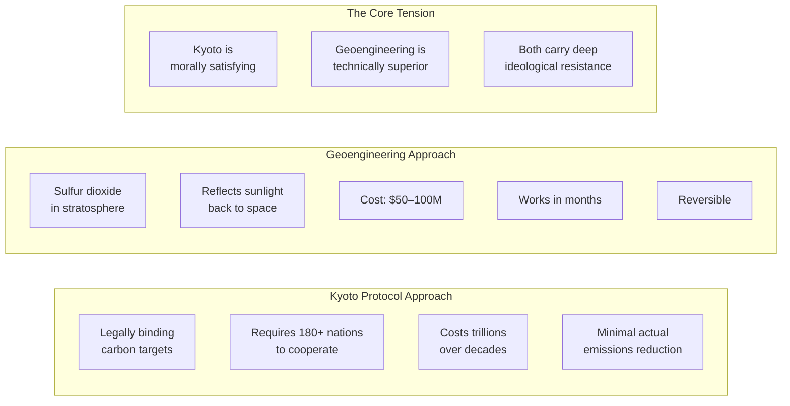
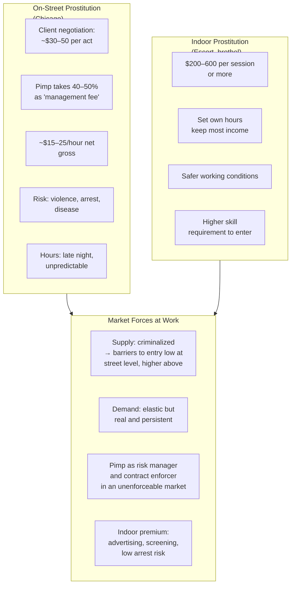
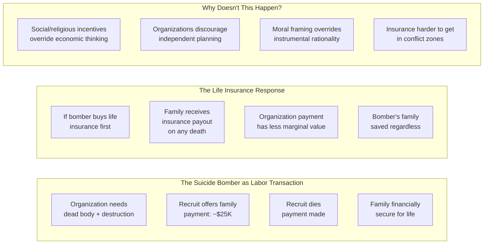
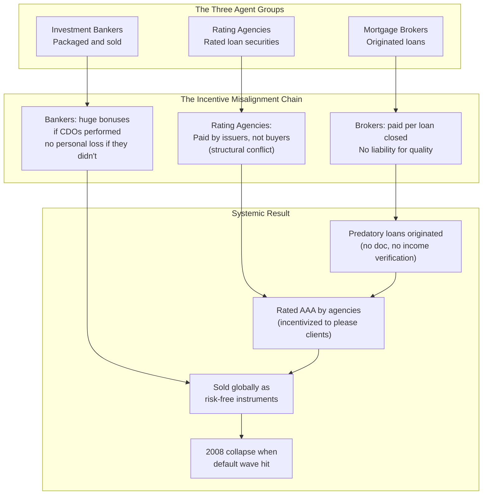
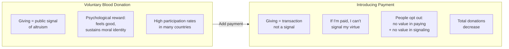

## Incentives, Revisited and Deepened

The first book introduced the three-legged stool of incentives. SuperFreakonomics tests the framework on the hardest problems in its scope. The chapters collective argument: if you can correctly identify the incentive structure behind terrorism, terrorism becomes comprehensible. If you identify the incentive structure of a crack gang or a brothel, those institutions become predictable.

This is not a trivial claim. It is the basis for everything this book attempts.

```mermaid
flowchart TB
subgraph Incentives["The Three Types of Incentives"]
  EI["ECONOMIC<br/>Money, risk, time, career path"]
  SI["SOCIAL<br/>Reputation, community standing, identity"]
  MI["MORAL<br/>Guilt, conscience, sacred values"]
end
subgraph TestedOn["Tested On In This Book"]
  T1["Terrorism:<br/>Suicide bomber payments<br/>and family security"]
  T2["Prostitution:<br/>Pimp fees, safety,<br/>indoor vs. street premium"]
  T3["Banking 2008:<br/>Originate-to-distribute<br/>incentive misalignment"]
  T4["Climate:<br/>Carbon tax vs. geoengineering<br/>as competing incentive schemes"]
end
end
EI --> TestedOn
SI --> TestedOn
MI --> TestedOn
```

---

## Chapter 1: The Global Warming Problem — and the Geoengineering Solution

The authors argue that climate change is real and worth addressing — but that the conventional response, exemplified by the Kyoto Protocol, was a moral and political gesture dressed up as policy. Kyoto's structure was all guilt, sacrifice, and virtue signaling — social incentives, in other words. But it made almost no measurable difference.

They propose a radical alternative: **geoengineering** — intentionally manipulating the climate system to offset the warming caused by greenhouse gases. Specifically, they note that stratospheric aerosol injection (pumping sulfur dioxide into the upper atmosphere to reflect sunlight back to space) could:

- Cost $50–100 million total (a rounding error in most national budgets)
- Work within months of deployment, not decades
- Be reversed relatively quickly if unintended side effects emerge
- Address the symptom of warming directly rather than requiring global behavioral change at the emission level

They contrast this with the Kyoto model, which required coordinated action across 180+ nations, demonstrably failed to reduce global emissions, and imposed economic costs that were largely symbolic.



**The philosophical conflict:** Geoengineering works because it accepts human nature — not asking billions of people to voluntarily reduce consumption, but engineering a technological bypass. Environmentalists resist it because it allows continued fossil fuel use, which feels like permitting the original sin to continue. The authors see this as a test of whether climate policy is about saving the planet or about enforcing virtue.

**Critique worth noting here:** The book's confidence on geoengineering's safety and efficacy drew significant pushback from climate scientists. The Iraq war analogy used in the chapter — arguing that climate scientists were warning against geoengineering the way intelligence officials warned against invading Iraq — was seen as glib by many experts.

---

## Chapter 2: The Economics of Street Prostitution

One of the most data-rich and underrated chapters in the book examines the market for sex work through the lens of a pimp named Allie and the economics research of economists Scott Cunningham and others.

**Key finding:** Street prostitution in Chicago pays far less than popular imagination suggests. The economics of the trade closely resembles a severely exploitative low-wage labor market:



**Why pimps exist in a "free market":** In a legal market, contracts are enforced by courts. In an illegal market, no contract is enforceable. The pimp provides enforcement, customer screening, and protection from both clients and police. He is not purely exploitative; he provides a service that increases the worker's safety and income (though he captures most of the surplus). The economics is functionally identical to a talent agency or sports agent in a legal market.

**The $800,000 question the book avoids:** If streets are this bad and indoor this much better, why is prostitution still largely criminalized? The answer would point squarely at political incentives — religious voters, moral entrepreneurs, suburban fears — that have nothing to do with the safety of workers and everything to do with political signaling.

---

## Chapter 3: Why Suicide Bombers Should Buy Life Insurance

The chapter on terrorism reframes the problem entirely: instead of asking about ideology or religion, ask about the economics of the transaction.

**Key argument:** Suicide bombing is a labor market for risk. Terrorist managers face the same challenges as any organization: recruiting reliable agents, screening candidates, managing risk, and controlling costs. Hamas and other groups use standardized payment structures:

- A successful suicide bomber's family receives $10,000–$25,000 — a fortune in the West Bank or Gaza, enough to buy a house, fund multiple children's education, and secure the family's economic future for a generation
- Failed bombers (caught, exploded prematurely) produce no payment
- Would-be bombers who back out may face violence from their own organization as a deterrence mechanism
- Some bombers have been found carrying receipts and copy machine proof of identity documents — the bureaucracy of terror

**The life insurance twist:** If you are a young man in a conflict zone and a terrorist organization offers your family a large payment if you die in an attack, you should genuinely consider buying life insurance. The insurance would pay your family if you died of any cause — accidental, natural, or terrorist. The key insight: the terrorist payment creates a moral hazard. Your incentive, as a rational actor, is to separate the commission of violence from the care of your family.



The authors acknowledge this is a reductio ad absurdum — a thought experiment about the logic of incentives, not a literal policy prescription. But the analytical move is the point: strip away the moral horror and look at the transaction structure.

---

## Chapter 4: The Financial Crisis and Mortgage Incentives

The 2008 financial crisis is reframed as an incentive failure across three institutional layers:



**Levitt's formulation:** People did not do bad things because they were uniquely evil in 2008 — they did bad things because the institutional structure made those bad things the path of least resistance. Loan officers who refused to write liar loans would be fired. Rating agencies who downgraded their clients' products would lose those clients. Bankers who passed on high-risk profit opportunities would be replaced.

**The Ferengi Rule:** The chapter explicitly invokes an economics framework: one group's incentives determine what they do, not their character. The Ferengi are Star Trek's species defined entirely by economic calculation — and the comparison is intentional and provocative.

---

## Chapter 5: The Economics of Altruism

Is giving a purely moral act, or does it carry self-interested components? The chapter examines blood donation, charitable giving, and volunteerism using laboratory and real-world data.

**The blood donation paradox:** When countries introduce small monetary payments for blood donation, total donations *drop*. The market framework — "you get paid, I pay you" — crowds out the moral incentive. Voluntary donation is a signal: "I am the kind of person who helps others." When you introduce payment, the signal disappears. People no longer donate because the act no longer communicates anything about their character.



**Charity as signaling:** Levitt argues that much charitable giving is not pure altruism — it is a social signal. People donate to feel good about themselves and to signal to others that they are generous, trustworthy people. This is not a critique of giving — it is an explanation of why the same communities that donate the most also have high social trust.

---

## Chapter 6: Role-Playing and the Pushed Button Effect

The final analytical chapter examines how social roles and contexts shape behavior — drawing on the famous 1971 Stanford Prison Experiment, a study of doctors avoiding malpractice suits, and the bizarre finding that briefly trying on a Hitler-style sweater changes how people vote later.

**The doctor-jury finding:** What makes a doctor less likely to be sued is not better medicine, better communication, or more patient information. It's whether the doctor likes the patient. Doctors who form emotional connections, who make eye contact, who pause before delivering bad news — they do not get sued. The technical quality of care correlates almost zero with liability; the emotional quality correlates strongly.

**The sweater experiment:** Researchers paid subjects to try on either a warm wool cardigan described as "worn by a beloved poet" or a supposedly identical sweater described as "worn by Hitler." In subsequent political attitude surveys, those who had worn the Hitler sweater expressed significantly more conservative views. Role priming works even when subjects don't consciously endorse the role.

---

## How to Think Like a Freakonomist — The Sequel Edition

The implicit methodology, updated for a more hostile intellectual environment:

1. **Question the dominant narrative — especially when it feels morally good.** Climate guilt, financial greed, terrorism-as-evil — all are emotionally satisfying stories that may not be analytically useful.

2. **Follow the incentive structure before you follow the story.** Every institution — legitimate or criminal — responds to the incentives that govern its participants.

3. **Accept that uncomfortable answers may be correct.** Geoengineering may be the fastest, cheapest, most reliable way to cool the planet. People may choose terrorism for economic reasons. Doctors get sued for interpersonal failings, not medical errors.

4. **Treat data as your best friend, but demand that it be the right data.** Correlation is not causation. Selection effects matter. The book acknowledges some of its own第一章's limitations more openly here.

5. **Distinguish between is and ought.** Economics describes how incentives shape behavior. It rarely tells you what we *should* prefer. Moral commitment and economic analysis are separate tools.
