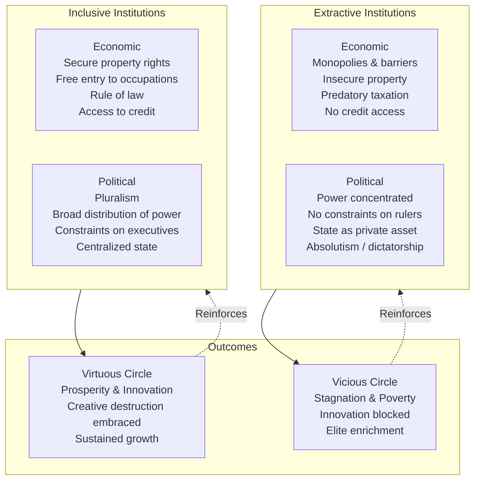
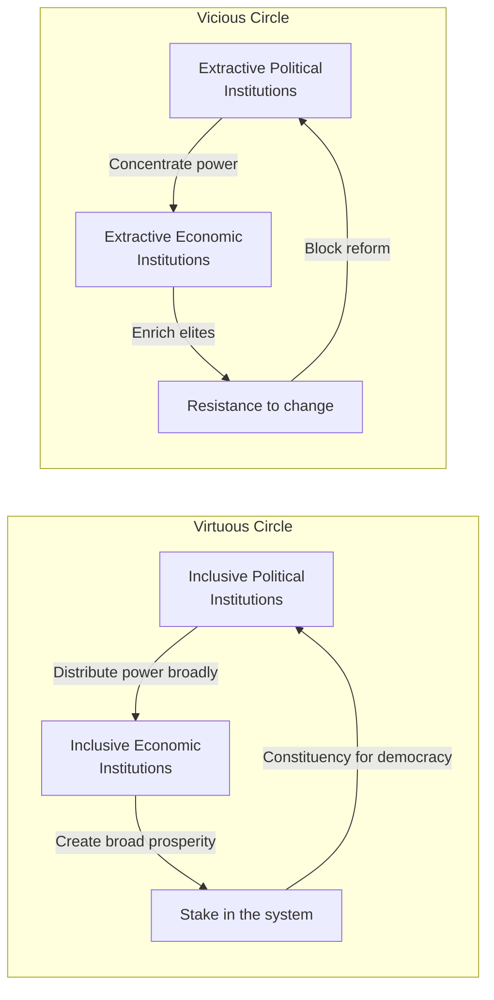
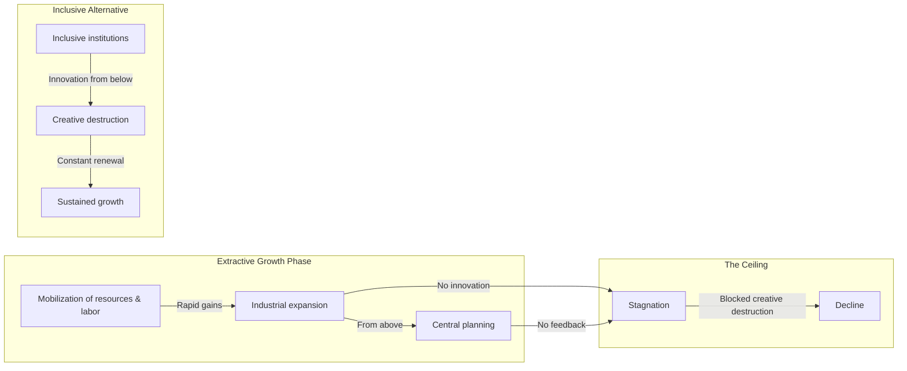
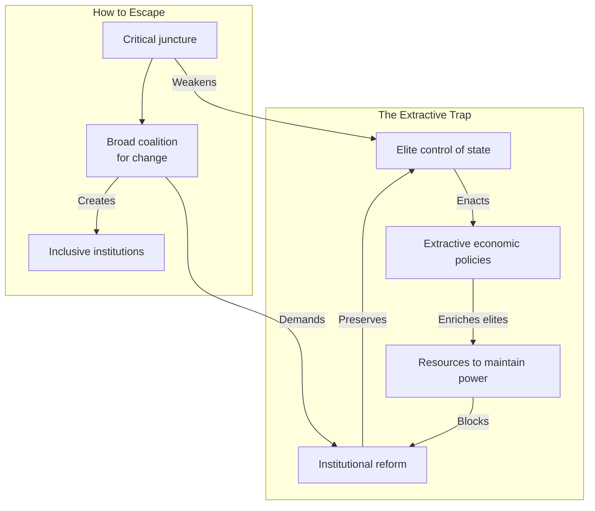

## The Central Thesis

---

## Chapter 1: So Close and Yet So Different

The opening salvo: Nogales, Arizona and Nogales, Sonora — the same
city split by a fence. Same geography, same climate, same ethnic
composition, different institutions. The American side is prosperous;
the Mexican side is poor. The difference is not culture or geography.
It is institutions.

This framing device carries the entire book. If two halves of the same
city can have such different outcomes, the usual suspects (geography,
culture, climate) cannot be decisive. Institutions must be the
difference.

---

## Chapter 2: Theories That Don't Work

Acemoglu and Robinson systematically dismantle rival explanations:

- **Geography hypothesis** (Jared Diamond, Jeffrey Sachs): Tropical
  climates, disease, and resource endowments determine prosperity. The
  authors counter with counterexamples — Nogales, Singapore (equatorial
  and rich), Ghana (tropical and poor but growing in tropical zones).
- **Culture hypothesis** (Max Weber, David Landes): Protestant work
  ethic, trust, or cultural values determine development. Counter:
  Korea is one nation with one culture, yet South Korea is rich and
  North Korea is poor. The split is due to institutions.
- **Ignorance hypothesis**: Rulers don't know which policies create
  growth. Counter: rulers often know exactly what would create growth —
  they choose not to pursue it because growth threatens their power.

---

## Chapter 3: The Making of Prosperity and Poverty

The core framework introduced systematically:

**Inclusive economic institutions:**
- Secure property rights for the broad population
- Free entry into occupations and businesses
- Rule of law applied equally
- Access to credit and opportunity

**Extractive economic institutions:**
- Monopolies and barriers to entry
- Insecure property rights (elites can seize assets)
- Predatory taxation
- No access to credit for the majority

Inclusive institutions produce prosperity because they allow the broad
population to participate in economic life, invest, innovate, and share
in the gains. Extractive institutions enrich elites in the short run
but destroy incentives, block innovation, and produce stagnation.

Political institutions are the foundation: inclusive economic
institutions require inclusive political institutions to sustain them.

---

## Chapter 4: Small Differences and Critical Junctures

The Black Death (1346-1351) killed a third of Europe's population. But
its institutional consequences diverged dramatically:

- **Western Europe**: Labor scarcity gave peasants bargaining power.
  In England, the peasant revolt of 1381 and the Wars of the Roses
  weakened feudal lords and created space for inclusive institutions.
- **Eastern Europe**: Landlords responded by tightening serfdom —
  the Second Serfdom — making peasants even more dependent. The
  extractive institutions deepened.

Same shock, different initial institutions, opposite outcomes.

**Critical junctures** are major historical events that disrupt the
existing institutional equilibrium. They create windows of opportunity
for change — but whether the change is toward inclusion or extraction
depends on the balance of power between contending groups.

---

## Chapter 5: Growth Under Extractive Institutions

Extractive institutions can produce growth — for a time. The Soviet
Union industrialized rapidly under Stalin (1928-1940s) by mobilizing
resources and labor through central planning. But it could not sustain
innovation: without inclusive institutions that protect the innovators,
the system eventually stalled.

Same pattern: the Maya city-states, the Aztec Empire, the Venetian
Republic (in its later extractive phase). Extractive growth hits a
ceiling because:

- It cannot generate sustained technological innovation
- It destroys incentives for the non-elite majority
- It blocks creative destruction that threatens existing power
  holders

---

## Chapter 6: Drifting Apart

The crucial divergence: England vs. Spain in the early modern period.

- **England**: The Glorious Revolution of 1688 limited the power of the
  monarchy, established parliamentary supremacy, and created inclusive
  political institutions. This led to secure property rights, financial
  markets (Bank of England, 1694), and eventually the Industrial
  Revolution.
- **Spain**: The monarchy remained absolutist. The crown controlled the
  economy, granted monopolies, extracted gold and silver from the
  Americas, and suppressed dissent. Spain, richer than England in 1500,
  fell behind.

The "drift" — small initial differences amplified by self-reinforcing
dynamics — explains why England and Spain, starting from relatively
similar positions in 1500, had such different outcomes by 1800.

---

## Chapter 7: The Turning Point

The Atlantic trade expansion in the 16th-18th centuries created new
economic opportunities, but the institutional consequences differed:

- **England and the Netherlands**: Existing pluralistic institutions
  allowed new merchant classes to gain political power, strengthening
  inclusive institutions further.
- **Africa and the Caribbean**: The same trade took the form of the
  slave trade and plantation economies, reinforcing extractive
  institutions. Powerful elites benefited from extraction and blocked
  change.

The same external shock — Atlantic commerce — produced inclusive
institutions where pluralism already existed and deepened extraction
where absolutism prevailed.

---

## Chapter 8: The Path Not Taken — The Reversal of Fortune

One of the book's most striking empirical findings: among former
colonies, those that were richest in 1500 (per capita income) are now
poorest, and vice versa.

**Why?** Europeans imposed extractive institutions in densely populated,
prosperous regions (the Mughal Empire, Mesoamerica, the Inca) because
it was profitable to extract from an existing labor force. In sparsely
populated, poor regions (North America, Australia, New Zealand),
Europeans settled and built inclusive institutions resembling those
at home.

The reversal of fortune is thus not a paradox but a direct consequence
of how colonial institutions were shaped by pre-colonial conditions.

| Region | Pre-Colonial Wealth | Colonial Institution | Today |
|--------|--------------------|---------------------|-------|
| Mughal India | High | Extractive (tax collection, zamindari) | Poor |
| Inca Peru | High | Extractive (encomienda, mita) | Poor |
| North America | Low | Inclusive (settler institutions) | Rich |
| Australia | Low | Inclusive (settler institutions) | Rich |
| Caribbean | Moderate | Extractive (plantations, slavery) | Poor |

---

## Chapter 9: The Diffusion of Prosperity

Why did the Industrial Revolution spread to Western Europe, North
America, and Japan — but not to China, the Ottoman Empire, or India?

Inclusive institutions enabled the adoption of new technologies because
those technologies did not threaten existing power holders. In China,
the Qing dynasty blocked industrialization because railways and
factories would have disrupted the existing social order. In the
Ottoman Empire, the guild system and absolutist state prevented the
emergence of an independent industrial class.

Where inclusive institutions existed, creative destruction was
possible. Where they did not, the same technologies were blocked or
adopted in ways that preserved elite power.

---

## Chapter 10: The Virtuous Circle

Inclusive institutions create feedback loops:

- Economic inclusion gives broad groups a stake in the system
- A broad stake creates political demand to maintain inclusive
  institutions
- Political inclusion prevents elites from dismantling inclusive
  economic institutions
- Stability attracts investment, which reinforces prosperity

This is why inclusive institutions, once established, are remarkably
stable. They generate their own constituencies for continuity.

---

## Chapter 11: The Vicious Circle

Extractive institutions also create feedback loops:

- Economic extraction enriches elites, giving them resources to defend
  their power
- Political control allows elites to block institutional reform
- Blocked reform prevents the emergence of inclusive institutions
- Stagnation and poverty generate instability, which justifies
  authoritarian control

This is the extractive trap. Elites know that inclusive institutions
would produce more prosperity overall, but inclusive institutions
would also reduce their power and wealth. So they block change, even
at great cost to national prosperity.

---

## Chapter 12: Why Some Nations Fail Today

The framework applied to contemporary failed states:

- **Zimbabwe**: Robert Mugabe inherited relatively strong institutions,
  then systematically dismantled them — destroying property rights,
  expropriating farms, and concentrating political power. The result:
  collapse.
- **Congo**: Centuries of extractive institutions, from Leopold II's
  rubber terror to Mobutu's kleptocracy to modern warlordism. The
  resource curse reinforced extraction.
- **North Korea**: The ultimate extractive state — all economic activity
  controlled by a narrow elite. Total stagnation.
- **Haiti**: The only country born of a successful slave revolt — but
  extractive institutions persisted through predatory governments,
  culminating in economic collapse.

None of these failures is explained by culture or geography. All are
the predictable outcome of extractive institutional trajectories.

---

## Chapter 13: Breaking the Mold

The rare success story: **Botswana**.

Botswana was one of the poorest countries in the world at independence
(1966). It is now a middle-income country with sustained growth,
democratic institutions, and relatively inclusive economic policies.

Why? Two factors:

1. **Pre-colonial institutions** were relatively participatory (kgotla
   system of tribal councils), creating a foundation for inclusion.
2. **Post-independence leaders** (Seretse Khama) chose inclusive
   institutions, partly because the discovery of diamonds meant the
   elite did not need to extract from the poor.

Botswana shows that institutional change is possible — but it also
highlights how unusual the preconditions are.

---

## Key Lessons

- Institutions, not geography or culture, determine national prosperity
- Inclusive economic + inclusive political institutions = sustained growth
- Extractive institutions block creative destruction, the engine of prosperity
- Critical junctures create windows for institutional change
- The colonial reversal of fortune explains persistent global inequality
- Virtuous and vicious circles make institutions self-reinforcing
- Elite resistance to inclusive reform is the fundamental obstacle to development
- China's growth is extractive growth — impressive but with a ceiling
- Institutional change requires broad coalitions at critical junctures
- There is no shortcut to inclusive institutions

---

## Practical Applications

### For Policymakers

- Focus on institutional reform (property rights, anti-corruption, political
  pluralism) over technocratic fixes
- Recognize that foreign aid without institutional change is likely wasted
- Support broad-based coalitions for reform rather than elite bargains
- Build state capacity alongside constraints on power

### For Development Professionals

- Evaluate projects by their effect on institutional dynamics, not just
  output metrics
- Understand that extractive elites will resist changes that threaten
  their power — plan accordingly
- Look for critical junctures where institutional change is possible

### For Citizens in Developing Countries

- The fundamental problem is political, not economic — inclusive growth
  requires inclusive politics
- Broad coalitions across class and regional lines are necessary to
  challenge extractive institutions
- Reform is possible — Botswana, South Korea, and Mauritius show the way

---

## Action Plan

1. **Read critically.** Ask of any development program: does it
   strengthen inclusive institutions or inadvertently reinforce
   extractive ones?
2. **Examine case studies.** Compare Botswana and Zimbabwe, South
   Korea and North Korea, Chile and Argentina — the institutional
   framework explains the divergence.
3. **Challenge rival theories.** When you encounter a geographic,
   cultural, or "ignorance" explanation for poverty, test it against
   the institutional evidence.
4. **Watch for critical junctures.** Political crises, economic shocks,
   and leadership transitions create windows for institutional change.
   Are the forces aligned for inclusion or extraction?
5. **Look for the vicious circle.** Identify the elite beneficiaries of
   the current extractive system — they are the real obstacle to reform.
