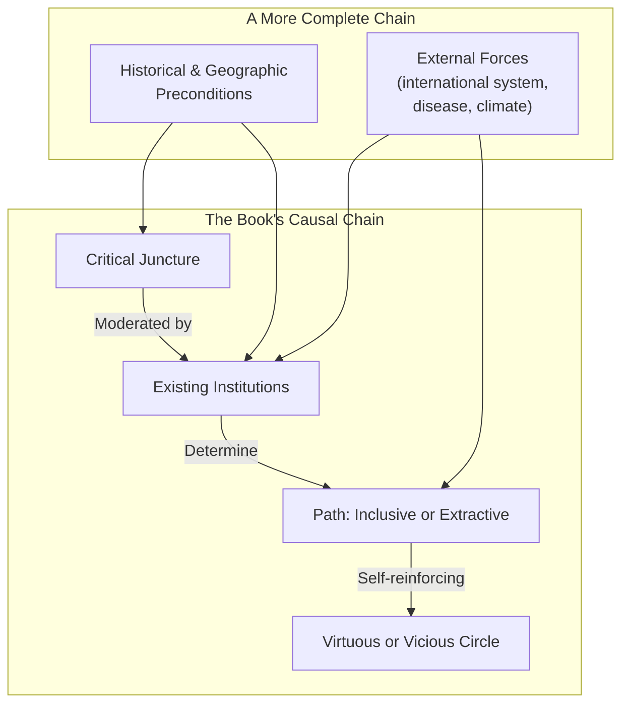
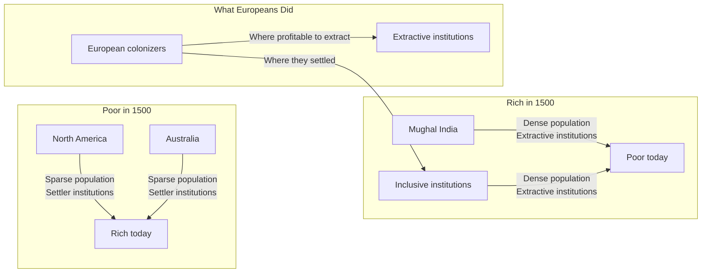

## Introduction

Welcome to BookAtlas. Today: *Why Nations Fail: The Origins of Power,
Prosperity, and Poverty* by Daron Acemoglu and James A. Robinson.
Published 2012, Crown Business. 544 pages.

The thesis is direct: nations succeed or fail because of their
institutions — the rules that structure economic and political life.
Inclusive institutions create prosperity; extractive institutions
create poverty. Geography, culture, and the intelligence of the
population are not the primary explanations.

Today's conversation features an institutional economist who considers
this book the most important work on development in a generation, and a
political historian who admires its ambition but finds its determinism
troubling and its policy implications hollow.

---

## The Core Thesis: Institutions First

**Institutional Economist:** This is the book that made me understand
development. It is so simple and so powerful. Two halves of the same
city — Nogales — split by a fence. Same people, same geography,
different institutions, radically different outcomes. That single
image refutes every cultural and geographic theory of poverty. The
book gets the fundamental question right: it is about power. Who has
it, how they use it, and whether they can be constrained.

**Political Historian:** The Nogales image is powerful, I grant you.
But it is also carefully chosen. There are many border cities where
the picture is more complicated. The book's framework is a hammer, and
everything looks like a nail. It treats institutions as the independent
variable that explains everything, but institutions themselves are
shaped by geography, by culture, by historical contingency. The Black
Death is a critical juncture — but why did it produce freedom in
England and serfdom in Eastern Europe? The book says "existing
institutions" — but what shaped those institutions?

---

## Geography vs. Institutions

**Institutional Economist:** The geography hypothesis is elegant but
wrong. Jared Diamond argues that Eurasia's east-west axis and
domesticable species gave it advantages. But look at Nogales. Look at
North and South Korea. Look at the two halves of the former Roman
Empire — Western Europe and the Balkans — same Mediterranean climate,
radically different outcomes. Geography doesn't change in 50 years.
Institutions do. That is why the book wins the argument.

**Political Historian:** That is not entirely fair to Diamond. He is
explaining the very long run — why some regions developed agriculture,
writing, and states 10,000 years ago. Acemoglu and Robinson are
explaining the last 500 years. Those are different questions with
different time scales. And Diamond himself would say that geography
shapes institutions: agricultural surpluses enabled state formation,
which produced institutions. The causality is not one-way. The book's
dismissal of geography — a few paragraphs in chapter 2 — is the
weakest part of the argument.

---

## The Reversal of Fortune

**Institutional Economist:** The reversal of fortune finding is
brilliant. Among former colonies, the regions that were richest in
1500 are now the poorest. This is not a paradox — it is the colonial
extractive trap. Europeans built extractive institutions where there
were people and wealth to extract (Mughal India, Inca Peru) and
settler-inclusive institutions where there were not (North America,
Australia). The institutions persisted after independence. This
explains global inequality better than any competing theory.

**Political Historian:** The reversal of fortune is a real empirical
pattern, and the book's explanation is the best available. But it is
not the whole story. Geography matters here too: the regions where
Europeans could settle (temperate climates) were precisely the regions
where geographic conditions were conducive to European-style
agriculture. The mortality rate for European settlers in tropical
regions was a genuine constraint. Institutions and geography are not
competing explanations — they are entangled.

---

## Creative Destruction

**Institutional Economist:** The creative destruction argument is the
book's deepest insight. Innovation always disrupts existing power
structures. The printing press undermined the Church. The factory
system undermined the guilds and the landed aristocracy. Automation
is undermining today's labor market. Inclusive institutions allow this
disruption to happen. Extractive institutions block it — because the
elites who benefit from the status quo use their power to suppress
anything that threatens them. That is why the Soviet Union could build
steel mills but could not invent the personal computer.

**Political Historian:** Creative destruction is real, and blocking it
is a major source of stagnation. But the book presents inclusive
institutions as uniformly embracing disruption, and extractive ones as
uniformly blocking it. The reality is more complex. Inclusive
societies also block creative destruction — look at how incumbent
industries use regulation, intellectual property, and political
lobbying to suppress competitors in the United States today. Are
American patent laws inclusive or extractive? The binary breaks down.

**Institutional Economist:** The authors would say that the US has
elements of extraction too — and that the political power of incumbent
firms is a sign that institutions are becoming less inclusive. The
framework handles this.

**Political Historian:** If every counterexample is a sign of
incomplete inclusion, the framework is impossible to falsify.

---

## The China Challenge

**Institutional Economist:** China is the hardest case for the book,
and the authors handle it honestly. China has grown rapidly under
authoritarian institutions. But the book argues this is extractive
growth — the state directs resources, blocks political competition,
and suppresses creative destruction that would threaten Communist
Party control. This growth will hit a ceiling because the system
cannot generate sustained innovation. The argument is: wait and see.

**Political Historian:** "Wait and see" is not a theory — it is a
bet. China has grown for 40 years at rates unprecedented in human
history. At what point does the book's framework have to concede that
authoritarian institutions can produce sustained growth? The Chinese
response to the book has been dismissive for good reason: it looks
like a Western-centric assumption that only Western-style democracy
can produce prosperity. Perhaps there are multiple paths to inclusive
economic institutions, and China is finding one without Western-style
political pluralism.

**Institutional Economist:** But look at Chinese innovation. The most
important technologies of the 21st century — the internet, AI,
smartphones, search engines — were all developed in inclusive
societies. Chinese innovation is largely catch-up and adaptation. The
framework's prediction is that this gap will persist — or widen.

**Political Historian:** That may be true, but it was also true of
Japan in 1950, Korea in 1960, and Taiwan in 1970. Today they are
technological leaders. The book makes a strong case, but the China
question remains open.

---

## The Policy Problem

**Institutional Economist:** This book is not a policy manual — it is
a diagnosis. And the diagnosis is crucial for getting policy right.
Foreign aid without institutional reform is wasted. Building inclusive
institutions is hard, but not impossible. Botswana did it. Mauritius
did it. Post-war Europe and Japan did it. The book helps us see what
works and what does not.

**Political Historian:** "Build inclusive institutions" is the academic
equivalent of "draw the rest of the owl." How do you build inclusive
political institutions in a country where the elites control the state
and will fight any reform? The book's answer is "broad coalitions at
critical junctures" — but this is a description of how change has
happened, not a prescription for making it happen. The causal
framework is elegant. The practical guidance is nearly nonexistent.

**Institutional Economist:** Understanding the nature of the problem is
the first step. No one book can do everything.

**Political Historian:** That is fair. But the book's influence means
that policymakers who internalize its message — "just build inclusive
institutions" — may be no better equipped than those who believed in
foreign aid, good governance programs, or cultural change. The book is
better at explaining the past than enabling the future.

---

## The Verdict

**Institutional Economist:** *Why Nations Fail* is the most important
book on development I have read. It reframes the entire conversation
from geography, culture, and ignorance to power and institutions. The
Nogales image, the reversal of fortune, the creative destruction
argument — these are contributions that will shape the field for
decades. It is not perfect. The policy implications are thin. The
China question is unresolved. But as a framework for understanding the
deep causes of global inequality, it has no equal.

**Political Historian:** The book is a masterpiece of synthesis and a
genuinely important contribution. But its binary framework is too
rigid for the complexity of 10,000 years of human history. The
inclusive/extractive distinction is useful as an analytical tool but
misleading as a total explanation. Geography and culture are not the
dominant causes — the book proves that — but they are not irrelevant
either. And the policy implications are frustratingly abstract. Read
this book for its questions, its historical sweep, and its sharp
refutations. Read it alongside its critics for the full picture.

---

## Final Thoughts

*Why Nations Fail* is one of those rare books that changes how you see
the world. After reading it, you cannot look at a border, a failed
state, or a development program without thinking about institutions.

The institutional framework is genuinely powerful. It explains
patterns that geography and culture cannot. It connects the Glorious
Revolution to the growth of South Korea, the collapse of Zimbabwe,
and the persistence of poverty in Haiti. It gives a coherent account
of 500 years of global divergence and convergence.

But the framework's power is also its limitation. The binary of
inclusive vs. extractive is reductive. The dismissal of geography and
culture is too quick. The policy guidance — make institutions more
inclusive — is true but almost tautologically unhelpful.

The deepest question the book leaves unanswered: if institutions are
the fundamental cause of prosperity, what causes institutional change?
The book says "critical junctures and broad coalitions" — but this is
a description, not a theory. The authors ask us to understand the
past. They cannot tell us how to make the future.

Read the book for its ambition, its scholarship, and its argument —
but read it with a critical eye. The truth about why nations fail is
important. A single framework, however brilliant, is unlikely to be
the whole truth.

This has been a BookAtlas narration of *Why Nations Fail: The Origins
of Power, Prosperity, and Poverty* by Daron Acemoglu and James A.
Robinson. Thanks for listening.
