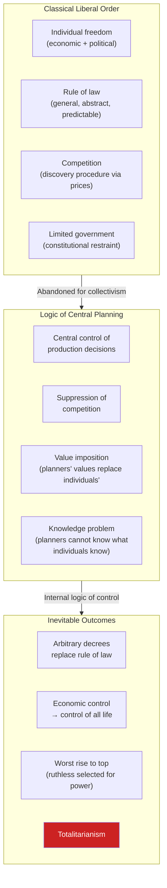
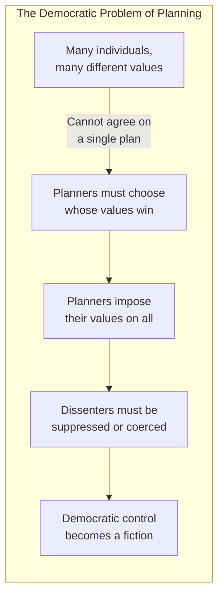

## The Central Thesis

---

## Chapter 1: The Abandoned Road

Hayek opens by observing that Western civilization has drifted from
classical liberalism — the tradition of individual freedom, limited
government, and the rule of law — toward collectivism. The change was
gradual, seemingly reasonable at each step, but the destination is
totalitarianism.

The road was abandoned not because liberalism failed but because it
was never allowed to mature. The 19th-century faith in liberty gave
way to a demand for "conscious control" of social forces. Germany led
this departure; the rest of Europe followed.

---

## Chapter 2: The Great Utopia

Socialism promises a new and higher liberty — freedom from economic
want, freedom from exploitation. But the word "liberty" has been
subtly redefined: from freedom *from* coercion to freedom *from*
material insecurity. This redefinition conceals the truth: socialism
achieves its goals by abolishing private property and centralizing
control.

The utopia of democratic socialism is a contradiction in terms.
Socialism requires the abolition of independent economic decision
making. Democracy requires it.

---

## Chapter 3: Individualism and Collectivism

Hayek distinguishes between individualism (the tradition of Smith,
Hume, Burke) and collectivism (socialism, fascism, national socialism).
Both collectivist doctrines share a core: the subordination of the
individual to the collective will, expressed through state direction
of economic life.

"Planning" is the shared method. Whether the ends are socialist
equality or fascist national glory, the means are the same: replace
competition with a central plan. Hayek argues that the alternative to
a directed economy is not laissez-faire but a rational legal framework
for competition.

---

## Chapter 4: The 'Inevitability' of Planning

A common argument in the 1930s and 1940s was that technological
change had made competition obsolete — that large-scale industry
naturally tended toward monopoly, making planning inevitable. Hayek
rejects this:

- Technological change does not make competition impossible
- Monopolies often result from government intervention (tariffs,
  patents, licensing)
- The argument for planning is driven by specialists who see only
  their own field and demand coordination they cannot provide

---

## Chapter 5: Planning and Democracy

This is the pivotal chapter. Hayek argues that central economic
planning is fundamentally incompatible with democratic governance:

The reason: democratic agreement is possible on general rules (procedural
justice) but not on substantive outcomes (distributive justice). People
disagree about who should get what. When planning forces these
decisions, someone must impose the answer — and that someone cannot
be checked by democratic processes that are themselves paralyzed by
disagreement.

Hayek's chilling conclusion: "Freedom and not democracy is the
ultimate value."

---

## Chapter 6: Planning and the Rule of Law

The rule of law means that government acts through general, abstract,
predictable rules that apply equally to all. Planning requires the
opposite: specific commands tailored to particular situations.

| Rule of Law | Rule by Law (under planning) |
|---|---|
| General rules known in advance | Specific commands issued ad hoc |
| Applied equally to all | Tailored to individuals or groups |
| Enable private planning | Enforce the state's plan |
| Predictable and stable | Subject to constant revision |
| Allow freedom of action | Command specific outcomes |

Planning destroys the rule of law not by accident but by necessity.
Planners cannot achieve their goals through general rules. They need
the power to discriminate — to tell this factory to produce X, that
worker to move to Y. This is rule by decree, not rule of law.

---

## Chapter 7: Economic Control and Totalitarianism

The link is direct: control over production is control over
everything. When the state decides what is made, where people work,
and what they may consume, it has total power. The price system is
the only alternative to orders and prohibitions.

Hayek emphasizes the "contempt for the merely economic" — the
dismissal of material concerns as base or unimportant. This allows
planners to justify any sacrifice in the name of higher ends. But
economic freedom is not base; it is the foundation of all other
freedoms.

---

## Chapter 8: Who, Whom?

The title comes from Lenin: "Who, whom?" — the question of who rules
whom. Under planning, every economic decision becomes a political
decision about who gets what. The distribution of income, the setting
of prices, the allocation of labor — all become matters of state power.

Socialists imagine this will produce equality. Hayek argues it
produces the opposite: the concentration of power in those who make
the decisions, who will naturally favor themselves and their allies.
"Distributive justice" becomes a tool for the powerful to reward
supporters and punish opponents.

---

## Chapter 9: Security and Freedom

Hayek distinguishes between two kinds of security:

1. **Limited security** — protection against extreme deprivation
   (compatible with freedom)
2. **Absolute security** — guaranteed status and income (requires
   total control)

The demand for absolute security — protection from all economic
fluctuation — is the demand that the state control everything. In a
free economy, some insecurity is inevitable. Prices change. Industries
decline. Jobs disappear. This uncertainty is the price of freedom.

---

## Chapters 10-11: Why the Worst Get on Top; The End of Truth

These two chapters form the book's darkest passages:

**Why the Worst Get on Top:** Collectivism selects for the morally
unfit. In a system that requires enforcing arbitrary power, those
with strong moral convictions are liabilities. The successful
functionary is the one who obeys orders, suppresses doubts, and
advances by pleasing superiors. The same character traits that make
a good bureaucrat in a planned economy — obedience, ambition without
principle, willingness to use power ruthlessly — are precisely the
traits that should disqualify one from ruling.

**The End of Truth:** A planned economy cannot tolerate disagreement
about facts. If the plan assumes a certain crop yield, and farmers
report a different number, the reports must be changed — not the plan.
Control of information becomes essential. Propaganda replaces education.
Independent thought is suppressed not because planners are evil but
because the plan cannot survive it.

---

## Chapter 12: The Socialist Roots of Nazism

The most controversial chapter. Hayek argues that Nazism was not a
reaction against socialism but its outgrowth. Both Nazism and
socialism are collectivist doctrines that reject individualism,
competition, and the rule of law. Both demand the subordination of
the individual to the state. Both use "planning" and "the common
good" to justify control.

The claim is not that every socialist becomes a Nazi. It is that the
collectivist method — when pushed to its logical conclusion — opens
the door to totalitarianism of any stripe. Germany's path from
Bismarck's welfare state to Hitler's dictatorship was not a break
from socialist ideas but their radicalization.

---

## Chapter 13-14: Enemies Within; Material vs. Ideal Ends

**The Totalitarians in Our Midst:** The mindset of totalitarianism
does not arrive with jackboots. It appears first among well-meaning
technocrats, scientists, and intellectuals who believe they can
manage society more rationally than the messy democratic process.
The monopolist organizations of capital and labor alike push for
state control that benefits them.

**Material Conditions and Ideal Ends:** Hayek targets the
"economophobia" of intellectuals — the contempt for material concerns
that allows them to sacrifice economic freedom for "higher" ends.
No single purpose, not even the abolition of unemployment, is
important enough to justify unlimited state power. A free society
must accept that many purposes coexist and none permanently
dominates.

---

## Key Lessons

- Central planning requires concentrated power, and concentrated
  power destroys freedom
- The knowledge problem is fundamental: no planner can know what
  individuals know through prices
- The rule of law is not a formality — it is the structure that
  makes freedom possible
- Democracy without constitutional limits can vote itself into
  dictatorship
- Good intentions do not prevent catastrophic outcomes
- Competition is a discovery procedure, not a capitalist luxury
- Economic freedom is the foundation of political freedom
- The worst get on top in systems of arbitrary power

---

## Practical Applications

### For Policymakers

- Before any intervention, ask: "Does this require the state to
  discriminate between individuals or groups?" If yes, it may
  undermine the rule of law
- Prefer general rules to specific commands — tax carbon rather than
  mandate specific technologies
- Beware the logic of intervention: one control creates distortions
  that seem to demand more controls

### For Citizens

- Be skeptical of arguments that "this time is different" —
  concentration of power follows patterns
- Understand the difference between rule of law and rule by law
- Recognize that your economic independence is the foundation of
  your ability to dissent

### For Intellectuals

- Distinguish between the pursuit of truth and the advancement of
  a political program
- Beware the temptation to believe you know what is best for others

---

## Action Plan

1. **Read the book directly.** The arguments are often distorted by
   both supporters and critics
2. **Test the knowledge problem.** Next time you see a price change,
   ask what information it communicates — and imagine trying to
   replicate that information through data collection
3. **Read a critic.** Try Karl Polanyi's *The Great Transformation*
   for the opposing view that markets themselves cause the social
   dislocation that demands state response
4. **Evaluate interventions.** For any government policy, ask:
   "Does this require the state to make judgments about specific
   people and outcomes, or does it operate through general rules?"
5. **Watch for the worst.** In any organization, notice who seeks
   power over others and who avoids it. Hayek's test is harsh but
   useful.
