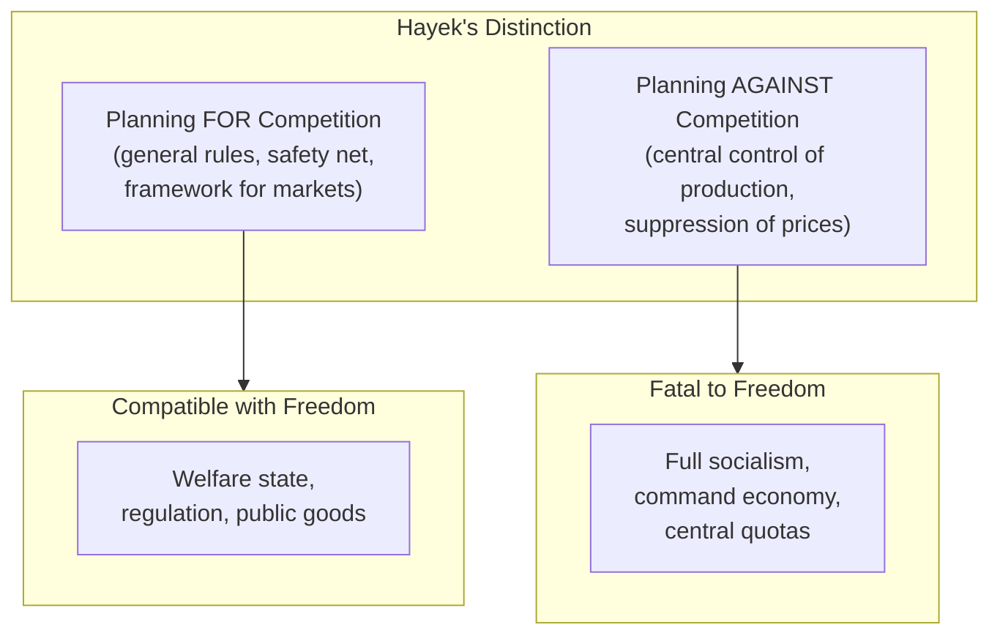

## Introduction

Welcome to BookAtlas. Today: *The Road to Serfdom* by Friedrich
Hayek. Published 1944, University of Chicago Press. 320 pages.

It is one of the most influential political books of the 20th
century. Margaret Thatcher called it "the most powerful critique of
socialist planning and the socialist state." Her opponents consider
it the founding text of a doctrine that has increased inequality and
weakened democracy.

Today's conversation features a classical liberal economist who
considers Hayek's warning prophetic, and a political historian who
argues the book has been badly misunderstood — and misused.

---

## The Central Warning: Planning Leads to Tyranny

**Economist:** The core of the book is deceptively simple. When the
state controls what is produced, how it's produced, and who works
where, it controls your survival. You cannot dissent from a regime
that controls your paycheck, your housing, and your food. This is not
speculation — it happened in Nazi Germany, the Soviet Union, Mao's
China.

**Historian:** But Hayek was writing about Britain. And Britain did
nationalize major industries after the war — coal, steel, railways,
health care — and it did not become a dictatorship. The Nordic
countries have gone further and remain fully democratic. So Hayek's
prediction was simply wrong for democratic socialist countries.

**Economist:** You're conflating the welfare state with central
planning. Hayek explicitly distinguished between the two. He supported
a social safety net and what he called "planning for competition" —
the state setting general rules. He opposed "planning against
competition" — the state replacing markets with central direction.
Britain nationalized some industries but mostly preserved market
mechanisms. That's a far cry from what Hayek warned against.

---

## The Knowledge Problem

**Economist:** This is Hayek's greatest insight. Here it is:

The information needed to run an economy — what people want, what
materials are available, what techniques work best — is not collected
in any single mind. It's dispersed across millions of individuals.
No computer, no bureau, no central planning board can gather it all.
The price system is the only mechanism that communicates this
dispersed knowledge.

Try to imagine running a city without prices. How would you know how
much bread to bake? How would you decide who gets leather for shoes
versus leather for jackets? You'd have to guess — and you'd be wrong.
That's the knowledge problem.

**Historian:** It's a powerful argument, but it's also an argument
against any large organization, including Hayek's beloved private
corporations. General Electric in the 1960s had more employees than
some countries and operated through internal planning. If the
knowledge problem defeats central planning, it should also defeat
the large firm.

**Economist:** Firms operate within a market. They have prices for
their inputs and outputs. They know if they're profitable. Central
planning of an entire economy lacks that feedback. That's the
difference.

---

## The Rule of Law

**Economist:** The distinction between rule of law and rule by law is
crucial. Rule of law means general rules known in advance — you know
what's legal and what isn't. Rule by law means the state uses legal
forms to issue arbitrary commands. Nazi Germany had laws. Stalin's
USSR had a constitution. The form of law is not the substance.

Planning destroys the rule of law because planners cannot work with
general rules. They need specific commands: "You will produce this
much steel. You will move to this city. You will charge this price."
That's not law — it's administration. And administration without law
is tyranny.

**Historian:** This is philosophically rich, but in practice every
modern state issues specific commands — zoning laws, environmental
regulations, building codes. Hayek's standard would rule out most of
what governments actually do. The question is not whether the state
issues specific rules, but whether those rules serve legitimate
purposes and are subject to democratic accountability.

---

## Why the Worst Get on Top

**Economist:** The darkest chapter in the book. In a system based on
arbitrary power, the people most likely to succeed are those with the
least moral integrity. Think about it. If your job is to tell people
what they must do, and you have unlimited discretion, who advances?
The person who says "this order is unjust and I won't carry it out"?
No. The person who nods and obeys. The person who anticipates what
the boss wants. The person with no scruples.

**Historian:** This is the most prescient part of the book. Look at
the leadership of any authoritarian system — the obsequiousness, the
cruelty, the absolute absence of moral backbone. Hannah Arendt wrote
about the same phenomenon in *Eichmann in Jerusalem*: the banality
of evil. The bureaucrat who just follows orders.

But here's the thing — this happens in corporations too. The
sycophant who pleases the CEO. The executive who fires 10,000 workers
to boost the stock price. Hayek's warning about the worst rising to
the top applies to any system of concentrated power, public or private.

---

## The Socialist Roots of Nazism

**Economist:** This chapter gets Hayek into the most trouble. He
argues that Nazism grew out of socialist ideas — that the National
Socialist German Workers' Party was socialist in its methods even if
its ends were nationalist and racial. Both socialism and Nazism
rejected individualism, competition, and the rule of law. Both
subordinated the individual to the state.

**Historian:** This is historically dubious. The Nazis murdered
socialists. They banned socialist parties. The idea that Nazism is
just socialism with a different flag is a rhetorical trick, not
serious history. What Nazism shared with Stalinism was totalitarianism
— but totalitarianism is not unique to socialism. You can have
fascist planning, socialist planning, nationalist planning. The
common thread is concentration of power, not socialist ideology.

**Economist:** But Hayek's point is about method, not label. He
dedicated the book "to socialists of all parties" because he saw
the collectivist method — replacing individual choice with state
direction — as the common danger. Whether the justification was
racial purity, national greatness, or economic equality, the result
was the same: the individual became a tool of the state.

---

## The Verdict: Prophet or Panic?

**Economist:** Hayek was more right than wrong. The collapse of the
Soviet Union vindicated his core argument: command economies cannot
sustain themselves. They don't know what to produce, they crush
innovation, and they rule by fear. The knowledge problem is real.
The rule of law matters. Concentrated power corrupts. These are not
controversial claims — they're the foundation of modern institutional
economics.

**Historian:** But Hayek's actual prediction was that democratic
socialism would lead to totalitarianism. It didn't. The countries
that implemented the policies he feared — nationalization, welfare
state, progressive taxation — remain free and democratic. So what
was he warning about? A path that was never taken? A danger that
never materialized?

**Economist:** That's a fair criticism. But Hayek himself later said
the book was a warning against "hot socialism" — the full
nationalization of production. That kind of socialism died in the
West. What survived was the welfare state, which Hayek considered a
different — if still concerning — trend. The book's real value is
not as a prediction but as a framework for understanding how power
concentrates and liberty erodes.

**Historian:** Then the book is not a roadmap of where we're going
but a warning about what to watch for. And in that sense, it's still
valuable. Whenever someone says "trust us, we're the experts, we
know what's best" — Hayek's voice whispers: do you? Do you really?

---

## Final Thoughts

*The Road to Serfdom* is a book you must read and then argue with.
Its central insight — that concentrated economic power concentrates
political power — is as true today as in 1944. The knowledge problem
is a genuine discovery. The warning about the rule of law is
prophetic.

But the book's vision is partial. The welfare states of Northern
Europe have not become dictatorships. Mixed economies have proved
more stable than Hayek's logic predicts. Inequality has grown under
deregulated capitalism in ways that threaten the political equality
Hayek valued. The road to serfdom may run through unregulated
markets as surely as through planned ones.

Read Hayek. Read Polanyi. Read Keynes. The truth is in the tension.

This has been a BookAtlas narration of *The Road to Serfdom* by
Friedrich Hayek. Thanks for listening.
