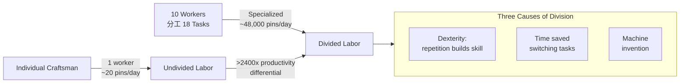
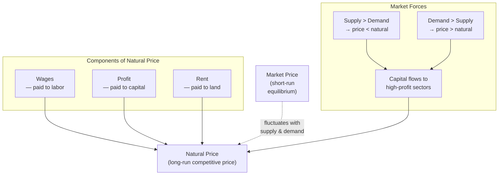
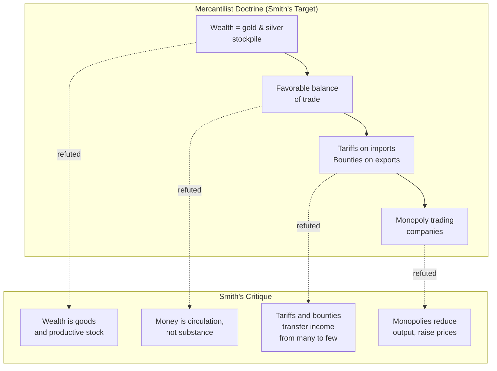
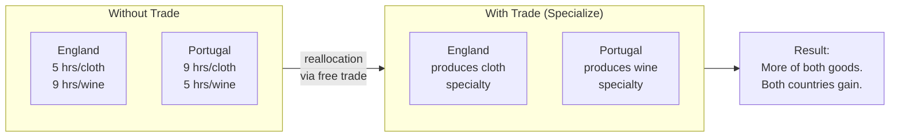

## Book I: The Engine of Prosperity

### The Pin Factory: A Lesson in Specialization

Smith opens the book with a single, devastating example. A pin
factory. Not a famous workshop — a small, ordinary one. Ten workers
分工 performing eighteen distinct operations — drawing wire, cutting,
straightening, pointing, heading, whitening, papering — produce
between them roughly 48,000 pins per day. A single craftsman working
alone would be lucky to make twenty.

Smith is not describing a technological breakthrough. The same
machines and materials existed before. The productivity is entirely
a product of **division**: of tasks, of skill, of attention. The
factory has not invented a new pin. It has reinvented the worker.

This is not a parable. It is the structural fact on which the entire
book rests. The same logic, applied across a society, explains why
civilized nations produce so much more than "savage" ones — and why
specialized towns, regions, and nations can trade and prosper
together.

### Three Limits on the Division of Labor

Smith is not naive about specialization. He identifies three
constraints:

1. **The extent of the market.** The division of labor is bounded by
   the size of the demand. A pin factory is viable only because
   enough people want pins. A single village cannot support a
   specialized watchmaker; a great city can support dozens.

2. **Capital accumulation.** Specialized workers need machines,
   tools, and raw materials in advance of output. Smith calls this
   **stock** — what we would call capital. Where capital is scarce,
   specialization is shallow.

3. **The nature of the trade.** Some activities do not subdivide
   well. Smith notes that agriculture, by its seasonal and
   place-bound nature, supports far less division than manufacture.

The first limit is the most important for Smith's later argument
about free trade. Open up a wider market — through transport
improvements, peace, or commerce with other nations — and the
division of labor can deepen indefinitely.

---

## The Origin and Use of Money

Once specialization takes hold, exchange is no longer incidental. It
is the dominant economic activity. The butcher does not raise
cattle; the baker does not grind wheat. They exchange.

But barter fails at scale. The "double coincidence of wants" — I
have what you want, and you have what I want — is rare. Smith
explains that people naturally select a single commodity as the
medium of exchange: cattle, shells, metals, and eventually gold and
silver. **Money** is not wealth. It is a circulating instrument that
facilitates the real exchange of goods.

This move is a quiet revolution. By separating money from wealth,
Smith destroys the mercantilist equation that had governed European
policy for two centuries. A nation that exports goods and imports
gold has not become richer — it has merely changed the form of its
holdings. Real wealth is the consumable goods and productive stock
the nation can command.

---

## The Natural and Market Price of Commodities

Smith's theory of value has two layers. At the foundation, in an
early economy of simple commodities, the exchange value of a good
reflects the labor required to produce it. In a developed economy,
with capital, rent, and profit already in play, the value of a good
reflects the **adding up** of wages, profit, and rent required to
bring it to market.

The second theory is what governs prices in a commercial society.
It is the forerunner of the cost-of-production theory that would
dominate economics for the next century and a half.

The **natural price** is what covers the going rate of wages, profit,
and rent under "natural" conditions of freedom and competition. The
**market price** fluctuates around it based on supply and demand.
Deviations from natural price send signals: profits rise where
demand outstrips supply, drawing capital in until equilibrium is
restored.

This is Smith's version of the invisible hand. The market has a
gravitational center. It can be pushed off balance by monopoly,
regulation, or accident, but the underlying tendency pulls it back.

---

## Book II: Capital, Stock, and the Division of Labour

### The Three Functions of Stock

Stock — capital — performs three functions in Smith's economy:

1. **Reserves** for current consumption before the harvest or sale
2. **Fixed capital** — machines, buildings, improvements that
   increase future productivity
3. **Circulating capital** — goods in process, materials, money that
   circulates between producers

The crucial question is how much stock is allocated to each, and
especially how much is consumed unproductively versus invested
productively. A nation that consumes its stock in luxuries stalls;
a nation that accumulates fixed capital grows.

### Productive vs. Unproductive Labour

Smith draws one of the most influential distinctions in the history
of economics. **Productive labour** is work that adds value to a
tangible good a merchant is willing to buy. **Unproductive labour**
is work that produces services rather than goods — and the services
"perish in the very instant of their performance."

| Category | Examples | Adds to Stock? |
|---|---|---|
| Productive | A weaver, a farmer, a smith, a pin-maker | Yes — the good is sold and re-enters the economy |
| Unproductive | A soldier, a priest, a lawyer, a court official, a domestic servant | No — the service is consumed instantly |

This is a descriptive, not a moral, judgment. Smith explicitly
rejects the implication that unproductive labour is worthless. The
soldier defends the state; the judge administers justice; the
domestic servant makes the master's life possible. But none of
them add to the year's stock of vendible goods. A nation that
redirects productive labour to unproductive service is consuming
its wealth.

This framework shaped two centuries of policy thinking about
taxation, public employment, and the relative weight of agriculture,
manufacture, and services.

### Capital and the Extent of the Market

Smith closes Book II with a meditation on how the accumulation of
capital makes possible the deepening of the division of labor, which
in turn expands the market, which makes possible yet deeper
division. This is the engine of growth. Smith, unlike Malthus, is
mildly optimistic: there is no inherent barrier to growth, only the
choice of policy that allows capital to accumulate safely.

---

## Book III: How Nations Grow Rich

The third book traces the different paths by which wealth has
accumulated in different societies. Smith is sharply critical of
European policy that has privileged cities over the countryside,
manufacture over agriculture, and foreign trade over domestic
exchange.

His argument: agriculture is the foundation of all real wealth, and
a nation's policy should protect and extend it. The wealth of cities
is real but partial. When the countryside stagnates, the city
eventually does too.

This is a more nuanced position than his free-trade principles
suggest. Smith the policy critic is more conservative than Smith
the theorist.

---

## Book IV: Systems of Political Economy

Book IV is the attack on mercantilism, written at full force. Smith
walks through the principal mercantilist policies — the balance of
trade doctrine, tariffs, export bounties, exclusive trading
companies — and shows how each enriches a small merchant or
manufacturer class at the expense of consumers and the general
public.

The principle is consistent: when a government intervenes to favor
one industry or interest, it is taxing the rest of society to
subsidize the favored group. The market, left to itself, would have
allocated capital to its most productive use.

Smith also disposes of the **physiocrats** — the French school
(led by François Quesnay) who argued that only agriculture
produced real wealth. Smith is more generous to them than to
the mercantilists: their error, he says, is partial rather than
total. Manufacturing, properly understood, does add value.

---

## Book V: The Revenue of the Sovereign

The final book is about government. Smith opens with a
classification of the sources of public revenue and the
principles of taxation, then turns to the proper functions of
the state.

### The Three Duties of the Sovereign

| Duty | What It Means | Smith's Reasoning |
|---|---|---|
| **Defense** | Protect society from external violence | A standing army is cheaper than perpetual war; private citizens cannot defend a nation |
| **Justice** | Administer property, contract, and criminal law | The whole system of property and exchange rests on enforcement |
| **Public works and institutions** | Roads, bridges, ports, education, the poor | Some works "cannot be profitable to any single individual" but are useful to society |

The third category is the largest and most suggestive. It
includes not just infrastructure but **education of the common
people** — to counter the "stupidity and ignorance" that Smith
believes is built into the division of labor. Workers who repeat
the same task all day become "as stupid and ignorant as it is
possible for a human creature to become." Public education is the
remedy Smith proposes, in language that anticipates modern
arguments for state investment in human capital.

### The Four Canons of Taxation

In a passage still taught in public-finance courses, Smith lays
out the principles of good taxation:

1. **Equity** — taxpayers should contribute in proportion to
   their ability, not arbitrarily
2. **Certainty** — the amount, manner, and time of payment should
   be clear and not arbitrary
3. **Convenience** — taxes should be levied when it is most
   convenient for the taxpayer
4. **Economy** — taxes should be designed to minimize the cost
   of collection and the burden they impose

These are not libertarian principles. They are the principles
of a competent government that recognizes taxation as the price
of legitimate collective goods.

---

## Of the Invisibility of the Hand

The phrase "invisible hand" appears only three times in the book
— and the famous one is in Book IV, on the subject of
preference for domestic over foreign investment:

> "By preferring the support of domestic to that of foreign
> industry, he intends only his own security; and by directing
> that industry in such a manner as its produce may be of the
> greatest value, he intends only his own gain, and he is in
> this, as in many other cases, led by an invisible hand to
> promote an end which was no part of his intention."

The invisible hand is not a doctrine of universal harmony. It
is a specific claim about competitive markets: that under
conditions of free exchange, individual self-interest
systematically produces social benefits that the individual did
not intend. It is a feature of a particular kind of economic
arrangement — not a law of nature.

The passage is also empirical, not theoretical. Smith is
appealing to a phenomenon he observed in English commercial
life. The argument would not be the same if applied to
monopolies, joint-stock companies with limited liability, or
the financial system — all of which Smith treats elsewhere
with deep suspicion.

---

## Of Free Trade: The Theory of Absolute Advantage

Book IV also contains the argument for free trade that would
shape two centuries of economic policy.

If a country can produce a good more efficiently (using fewer
labor-hours) than its trading partner, it has an **absolute
advantage** in that good. Specializing in those goods and
importing the rest — even where the partner has its own
absolute advantage in other goods — leaves both countries
better off than producing everything themselves.

David Ricardo would later refine this into **comparative
advantage** — showing that trade is mutually beneficial even
if one country is more efficient at everything. The core
insight, though, comes from Smith: specialization, mediated by
exchange, increases the wealth of all parties.

---

## Wages, Profit, and the Natural Dynamics of Distribution

In Smith's account, the three classes of society — workers,
owners of capital, and landlords — receive wages, profit, and
rent respectively. The relative size of these three income
streams shifts over time, and with it the distribution of
power in society.

| Stage | Capital Accumulation | Effect on Wages | Effect on Profit |
|---|---|---|---|
| Early society | Low | Wages near subsistence | High profit (scarce capital) |
| Growing economy | High | Wages rise above subsistence | Profit falls (capital competition) |
| Wealthy, saturated economy | Very high | Wages remain above subsistence | Low profit; rent rises as land is the constraint |

This three-stage model is one of the most influential in
classical economics. It frames later debates on the
**iron law of wages** (Malthus and Ricardo), the **tendency
of the rate of profit to fall** (Marx and Ricardo), and the
**diminishing returns to land** (David Ricardo, most famously).

---

## Key Lessons

- **Prosperity is produced, not collected.** A nation grows rich by
  making goods efficiently, not by hoarding gold.
- **Specialization is the mother of productivity.** The division of
  labor multiplies output by orders of magnitude.
- **Exchange coordinates self-interest.** Self-love, in competitive
  markets, tends to produce social benefit.
- **Government should be limited but competent.** Three duties:
  defense, justice, public works including education.
- **Mercantilism is a system of privilege.** It enriches the few at
  the expense of the many.
- **Capital accumulation is the precondition for growth.** Without
  saving, the division of labor cannot deepen.
- **Trade is a positive-sum game.** All parties gain from
  specialization and exchange.
- **Prices gravitate.** Markets have a natural level they tend
  toward, deviations are signals of imbalance.

---

## Practical Action Plan

1. **Distrust framings that confuse money with wealth.** A country,
   company, or individual that holds cash is not necessarily rich.
   Wealth is the capacity to produce useful goods and services.

2. **Specialize.** Within an organization or career, the deepest
   gains come from finding the smallest area where you can
   consistently deliver disproportionate value and trading with
   others for the rest.

3. **Audit the role of self-interest in your decisions.** Self-love
   is not a vice in Smith; it is a fact. Channel it through
   competitive, transparent arrangements to produce socially
   beneficial outcomes.

4. **When policy favors a small interest, ask who pays.** Most
   policy that benefits one group does so by taxing another.
   Identify the transfer before evaluating the policy.

5. **Treat monopolies, tariffs, and exclusive privileges as
   suspect.** Even when well-intentioned, they tend to reduce
   output and transfer wealth to a narrow class.

6. **Invest in human capital.** The division of labor makes
   workers productive; it also makes them ignorant. Public
   education and continual learning are how a society keeps
   both halves of that bargain.

7. **Read the *Theory of Moral Sentiments*.** Smith's economics
   assumes a moral psychology of sympathy, propriety, and the
   impartial spectator. Without it, the economic system is
   incoherent.
