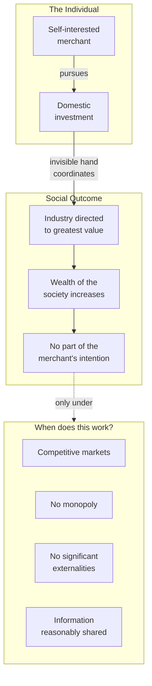

## Introduction

Welcome to BookAtlas. Today: *An Inquiry into the Nature and Causes
of the Wealth of Nations* by Adam Smith. Published 9 March 1776 in
London by W. Strahan and T. Cadell. Roughly 1,100 pages in modern
editions. No chapter, section, or topic is laid out in the orderly
fashion of a modern textbook. This is, by any measure, one of the
most important books ever written.

We are going to approach this book with two voices. On one side, a
free-market economist who thinks Smith's framework remains the best
starting point for understanding how nations grow rich. On the other,
a heterodox political economist who thinks Smith is foundational but
incomplete — that he asks the right questions but answers only some
of them.

Let's get into it.

---

## The Pin Factory

Smith opens the book not with theory, but with a small factory
making pins. Ten workers. Eighteen distinct operations. Roughly
48,000 pins a day. A single craftsman working alone would be lucky
to make twenty.

**Free-Market Economist:** The pin factory is the most powerful
example in the history of economics. It is the foundation on which
everything else is built. Productivity is not a function of genius
or technology. It is a function of division. Smith identified the
key insight of the modern economy before Watt's steam engine
existed.

**Heterodox Economist:** The pin factory is also a parable about
the *costs* of specialization. Smith himself acknowledges, in
Book V, that a worker who spends his life on a single operation
becomes "as stupid and ignorant as it is possible for a human
creature to become." The division of labor produces wealth *and*
alienation. We cannot celebrate one half and ignore the other.

**Free-Market Economist:** That is a fair point — and Smith
explicitly proposes public education as the remedy. The book
includes some of the earliest modern arguments for state
investment in human capital. Smith is no crude libertarian.

---

## The Invisible Hand

The phrase "invisible hand" appears three times in the book. The
famous one is in Book IV, on the question of whether a merchant
should prefer domestic to foreign investment.

**Free-Market Economist:** The invisible hand is the most
underappreciated idea in modern intellectual history. Self-interest
plus competition plus free exchange produces socially beneficial
outcomes that nobody designed. This is the deep structure of every
prosperous market economy on earth.

**Heterodox Economist:** The invisible hand is also a much more
limited claim than its later interpreters suggest. Smith is not
arguing that markets always work. He is observing that in specific
cases — domestic trade, when there is no monopoly — self-interest
happens to produce good outcomes. He explicitly worries about the
East India Company, the joint-stock companies, the banks, and the
mercantilist monopolies. Read the whole book, not the sound bite.

**Free-Market Economist:** Both of those readings are Smith. The
book is consistent with a strong, but not unlimited, role for
competitive markets. That is the position of most serious
economists today.

---

## The Labor Theory of Value

Smith's argument about value evolves across the book. In a simple
economy, where goods are produced with little capital and no rent,
the value of a thing is roughly the labor it contains. In a
developed economy, value is the sum of wages, profit, and rent
required to bring the good to market.

**Heterodox Economist:** The labor theory of value is the part of
Smith that did not survive. The marginalist revolution of 1871
showed that value is determined by subjective preference at the
margin, not by labor embodied. Smith was wrong, and it took
economics 100 years to fix him.

**Free-Market Economist:** Smith was wrong in the form, not in the
instinct. He was asking a different question: where does real
wealth come from? His answer — from productive human effort, not
from circulation or speculation — remains true. The labor theory
may have failed as a price theory, but it survives as a production
theory.

**Heterodox Economist:** That defense is a stretch. Smith said
"labor is the real measure of value." That is a price theory, and
it is wrong. Where it is *not* wrong — in the labor theory of
exploitation that Marx built on it — it is also politically
explosive. The labor theory does not survive as a tame production
theory. Either you take it seriously, or you abandon it.

---

## Of Money

Smith's treatment of money is one of his most enduring
contributions. He separates money from wealth decisively. A
nation that accumulates gold by selling useful goods abroad has
not become richer. It has only changed the form of its holdings.

**Free-Market Economist:** This is the move that destroyed
mercantilism. Two centuries of European policy had been built
on the equation of national wealth with bullion. Smith
demolished the equation in a few pages.

**Heterodox Economist:** And yet: Smith undersells the role of
money in a modern economy. He treats it as a circulating
instrument, not as a store of value or a unit of account in a
complex financial system. He lived before central banking,
before paper money became dominant, before the kinds of
financial crises that would later require Keynes. The theory of
money is one of the many places where the 18th-century book
shows its age.

**Free-Market Economist:** You cannot fault a writer for not
anticipating phenomena that did not exist in his time. Smith's
point is structural: wealth is goods, not tokens. That is a
permanent insight.

---

## Free Trade

Smith's argument for free trade in Book IV is the foundation of two
centuries of trade policy. Two nations trade when each can produce
some good more efficiently — at lower labor cost — than the other.
Specialization raises total output. Both nations gain.

**Free-Market Economist:** This is the strongest argument in the
book. It is the core insight of comparative advantage — even if
Ricardo would later state the full version. Specialization plus
exchange raises the wealth of all parties. Two centuries of
empirical evidence — from 19th-century free trade to postwar
globalization to 21st-century supply chains — has broadly
confirmed Smith's case.

**Heterodox Economist:** The argument is cleaner in the book than
in the world. Real trade is shaped by power asymmetries, by
monopolies, by exchange-rate manipulations, by labor and
environmental standards. The abstract case for free trade
assumes away the very conditions that often make it politically
contentious. Smith himself was wary of monopoly in trade —
otherwise he would not have attacked the East India Company.

**Free-Market Economist:** Smith's own book is full of those
caveats. He is not making the strong libertarian case. He is
arguing against specific mercantile policies — tariffs, export
bounties, exclusive trading companies — that enriched the few at
the expense of the many.

---

## Productive vs. Unproductive Labour

Smith distinguishes between labor that adds value to a vendible
good and labor that produces services consumed in the moment. A
weaver is productive; a domestic servant is not. A pin-maker is
productive; a court official is not.

**Heterodox Economist:** This is the most awkward part of the
book for modern readers. Smith uses "unproductive" in a
descriptive economic sense, but the term sounds like a moral
judgment. Worse, modern service economies have made the
distinction almost impossible to draw. A software engineer writes
code that is sold — productive. A teacher educates children —
productive? Unproductive? A nurse, a doctor, a lawyer, a
financial adviser — what does Smith say about them?

**Free-Market Economist:** Smith is precise about this. He is
making a national-income accounting point, not a moral one. In
the 18th century, a domestic servant's work vanished the moment
it was performed. A weaver's work became a piece of cloth that
could be sold, stored, exported, accumulated. The distinction is
about whether the labor adds to a nation's *stock* of vendible
goods.

**Heterodox Economist:** But stock is itself a 18th-century
notion. In a service economy, the stock is human capital,
institutional knowledge, social cohesion. The "productive /
unproductive" binary is a useful 18th-century heuristic. It is
not a foundation for thinking about a 21st-century economy.

---

## The Three Duties of the Sovereign

Smith famously limits the role of government to three duties:
defense, justice, and "certain public works and institutions"
that private profit cannot supply. The third category is
largest — and most suggestive. It includes roads, ports,
education, and the care of the poor.

**Free-Market Economist:** This is the classical liberal position
on government. It is also the position of every successful
market economy since the 19th century. The list is short, but it
is not trivial. Defense, justice, public works, education — that
is the platform on which prosperity is built.

**Heterodox Economist:** But notice what Smith puts in the
*third* category. Education. Public works. The care of the poor.
That is not a minimal state. It is a state that actively
invests in human capital, that builds infrastructure, that
redistributes to those who cannot earn. Modern libertarians
reading Smith as a prophet of small government are reading
only two-thirds of the book.

**Free-Market Economist:** Modern libertarians are also not the
heirs of Smith. The classical liberalism of Smith, Mill, and
later the 20th-century social democrats all trace through the
same intellectual lineage. Smith is the source, not the
blueprint.

---

## Of the Joint-Stock Company

One of the most surprising parts of the book is Smith's deep
suspicion of the joint-stock company — the modern corporation
with limited liability and transferable shares. He thinks
directors will mismanage other people's money. He thinks
managers' incentives will diverge from shareholders'. He thinks
the joint-stock form is suited only to a few industries
(banking, insurance, waterworks) where active management is
neither possible nor necessary.

**Heterodox Economist:** Smith is vindicated. The 2008 financial
crisis was the joint-stock company behaving exactly as Smith
feared — managers taking risks that shareholders bore, with
moral hazard from limited liability and from the state safety
net. The structure of the modern corporation, as Smith warned,
creates a separation of ownership and control that is
permanently prone to misalignment.

**Free-Market Economist:** Smith was right to worry. He was
wrong to generalize. The modern corporation, with proper
governance, accounting, and regulation, has been the most
powerful organizational form in history for capital
mobilization. We can have joint-stock companies *and* the
regulations that keep their incentives aligned. Smith did not
have a fully developed theory of corporate governance. He
anticipated the problem; he did not solve it.

---

## The Verdict: Is This the Most Important Economics Book Ever Written?

**Free-Market Economist:** Yes. There is no other candidate. The
concepts, the vocabulary, the analytical categories, the policy
positions — they all originate here. Every later economist works
in Smith's space. The book is not perfect; it is the field.

**Heterodox Economist:** It is the *founding* book, which is
different from being the *best* book. The marginalists did
Smith better on value. Keynes did Smith better on aggregate
demand. Marx did Smith better on class. The book is essential
*because* it is the foundation — not because it is the final
word.

**Free-Market Economist:** Then it is the most important book
*and* the most unfinished. Which is what I've been saying.

---

## Final Thoughts

*The Wealth of Nations* is 250 years old this year, and it is
still the most consequential book in economics. It is not a
textbook, not a manifesto, not a defense of any modern
ideology. It is an empirical inquiry into how nations grow rich,
conducted with the moral seriousness of the Scottish
Enlightenment.

The book changed the world. It gave the merchants and the
manufacturers of the late 18th century an intellectual defense
of their activity. It gave the abolitionists and the free-traders
an argument for openness. It gave the modern discipline of
economics its founding charter. And it gave every subsequent
thinker — from Ricardo to Marx, from Marshall to Keynes, from
Hayek to Friedman to Piketty — a starting point to argue
against.

Read it with patience. Read it with the *Theory of Moral
Sentiments* in the other hand. Read it as a 250-year-old book
that is still unfinished — and that is, in part, why it is
still the most important economics book ever written.

This has been a BookAtlas narration of *The Wealth of Nations*
by Adam Smith. Thanks for listening.
