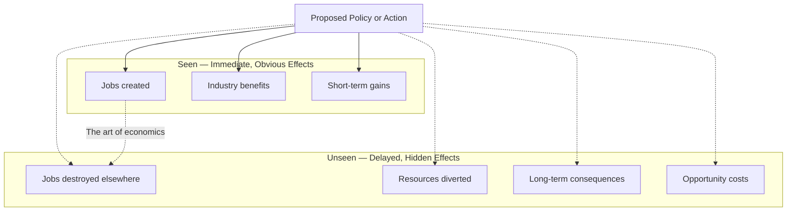
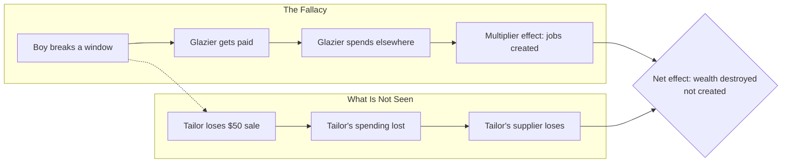
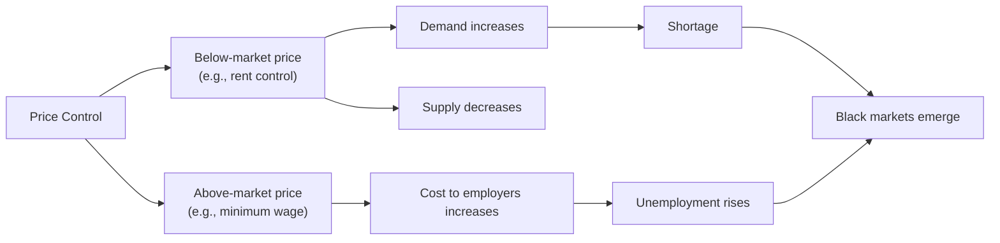

## The One Lesson

Hazlitt's central thesis: good economics traces the consequences
of a policy not merely for one group at one time, but for all
groups over time.

---

## The Broken Window Fallacy

The most famous example in the book.

The glazier benefits. The tailor loses. The net effect is not zero
— it is negative because resources are diverted to repair rather
than create new value.

---

## Government Spending

Hazlitt's analysis of government spending follows the same pattern:

| Seen | Unseen |
|------|--------|
| Workers hired for public projects | Workers displaced by taxes |
| Roads built, bridges repaired | Private investment never made |
| Short-term employment boost | Long-term debt burden |
| Visible benefits in one district | Invisible losses across the economy |

Every dollar the government spends must first be taken from a
taxpayer or borrowed from a saver. The question: who would have
spent it better?

---

## Price Controls

Hazlitt demonstrates that price controls consistently produce the
opposite of their intended effect:

---

## Key Lessons

- **Look for the unseen.** Every policy has hidden consequences.
  The mark of good economics is finding them.
- **The broken window fallacy is pervasive.** Arguments for
  "stimulus" spending and "job creation" from destruction repeat
  this error.
- **Government cannot repeal economic laws.** Price controls,
  tariffs, and wage floors fight against supply and demand — and
  lose.
- **Inflation is not prosperity.** Printing money does not create
  wealth. It redistributes it and creates malinvestment.
- **Trade benefits everyone.** Protectionism helps a few visible
  producers at the expense of many invisible consumers.

---

## Action Plan

1. **Apply the one lesson to every policy.** Before accepting an
   economic argument, ask: who is not seen? What are the long-term
   effects?

2. **Question the broken window.** Whenever you hear that
   destruction or spending "creates jobs," trace where the money
   came from and what it would have done otherwise.

3. **Think in trade-offs.** There is no free lunch. Every benefit
   has a cost. Find it.

4. **Distrust simple solutions.** Price controls, tariffs, and
   wage mandates sound good. Their consequences consistently
   disappoint.

5. **Learn the history.** Most economic mistakes have been made
   before. Knowing the history of the 20th century is the best
   defense against repeating it.
