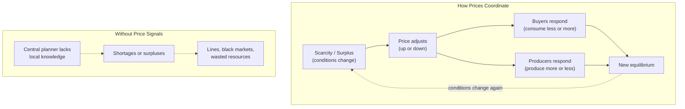
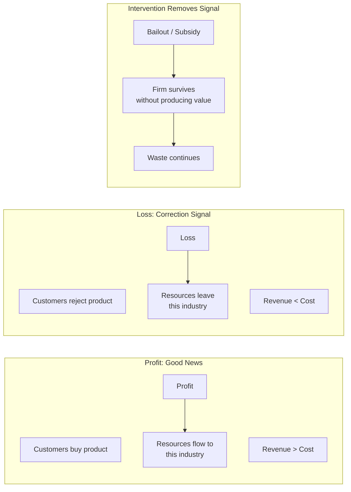

## What Is Economics?

Economics, Sowell writes, is the study of the use of scarce resources that
have alternative uses. Scarce means there is not enough for everyone who
wants it. Alternative uses means every resource could be deployed in
different ways — and choosing one use means forgoing others.

This is the bedrock constraint. All economic questions trace back to it.
Should steel be used for cars or for buildings? Should land grow wheat or
corn? Should a doctor spend an hour with this patient or that one? Every
decision is also a rejection of alternatives. The real cost of anything is
the value of what you had to give up — its **opportunity cost**.

---

## The Role of Prices

Prices are the central coordinating mechanism of any economy. They transmit
knowledge across time and space without any central authority.

Sowell illustrates with a simple scenario. A hurricane hits a city. The
supply of ice, water, and gasoline drops. Prices rise. The public is
outraged. Politicians decry "price gouging" and impose price controls.

But what do the rising prices actually do? Two things: they signal to
consumers to conserve (use ice only for food, not for cooling drinks), and
they signal to suppliers from outside the affected region that there is
profit to be made — bringing in trucks of ice and water from hundreds of
miles away. Price controls block both signals. The result: no new supply
arrives because it costs more to transport than the controlled price. The
shortage persists longer. The well-intended policy makes the crisis worse.

### Prices as Information

No single mind possesses the knowledge required to run an economy. The
price of a particular good in a particular city on a particular day
aggregates the knowledge of:
- Every producer's cost structure
- Every consumer's willingness to pay
- Transportation constraints
- Weather conditions
- Substitute availability

No planner could collect and process this data in time. The price system
does it continuously, automatically, and without central direction. This
is F.A. Hayek's insight — the "knowledge problem" — which Sowell
operationalizes throughout the book.

---

## Price Controls

### Rent Control

Sowell's treatment of rent control is a masterclass in thinking beyond
stage one. The visible effect: tenants in controlled apartments pay less.
The less visible: landlords stop maintaining buildings, convert apartments
to condos, or abandon properties. New construction becomes unprofitable.
Over time, the housing stock deteriorates and shrinks. The people who most
need affordable housing — newcomers and the poor — cannot find it because
existing tenants never leave their below-market apartments.

Case study: San Francisco, New York, Stockholm, Mumbai. Every city with
longstanding rent control has the same pattern — aging housing stock,
waiting lists measured in years, and a two-tier market where newcomers pay
far more than incumbents.

### Price Ceilings and Floors

Ceilings (maximum prices) create shortages. Floors (minimum prices) create
surpluses. Agricultural price supports in the United States and Europe have
produced mountains of butter, lakes of wine, and fields of cotton that no
one would buy at the supported price — paid for by taxpayers and borne by
consumers in poorer countries who cannot compete with subsidized exports.

---

## Industry and Commerce

### The Role of Profits and Losses

Profits are often misunderstood. The popular imagination casts profit as
money taken from customers. Sowell reverses this: profit is the signal that
a firm has used resources in a way that customers value more than the
resources' alternative uses. Losses are the signal of waste.

When government bails out failing firms, it short-circuits this feedback
mechanism. Resources remain locked in unproductive uses. The economy as a
whole grows more slowly because its capital is misallocated.

### Middlemen

Sowell devotes substantial attention to the role of middlemen — distributors,
wholesalers, retailers. The common view is that middlemen add cost without
adding value. Sowell argues the opposite: middlemen *reduce* transaction
costs. A farmer does not need to find each individual consumer; a
distributor aggregates. A consumer does not need to visit each farm; a
grocery store gathers thousands of products under one roof.

Middlemen profit by identifying gaps between supply and demand and bridging
them. The middleman's profit is the measure of how much transaction cost
they save. When margins are thin — as in grocery retail — the market has
determined that the service is worth barely more than its cost.

---

## Work and Pay

### Productivity Determines Wages

Sowell's argument on wages is simple and controversial: in a competitive
market, workers are paid approximately what they contribute to output.
If an employer pays a worker $15/hour, the worker must produce at least
$15/hour of value. Otherwise the employer would hire someone else — or
automate the task.

This does not mean every worker is paid fairly in a moral sense. It means
that attempts to mandate wages above productivity levels will produce
unemployment. The employer cannot pay $15/hour to a worker producing
$10/hour of value for long.

### Minimum Wage Laws

Sowell's most pointed policy critique. Minimum wage laws, he argues, are
a textbook case of good intentions producing harmful results. The people
most affected are not skilled workers earning a fair wage — they are
teenagers, immigrants, and low-skilled workers trying to gain their first
foothold in the labor market. When the legal price of their labor is set
above what they can produce, employers do not hire them.

Evidence cited: the 2004 minimum wage increase in San Francisco led to
reduced employment among low-skilled workers. Puerto Rico's adoption of
the U.S. federal minimum wage in the 1950s coincided with a sharp rise in
unemployment on the island. South Africa's rapid minimum wage increases in
the post-apartheid era reduced employment, particularly among young black
workers.

### Special Labor Market Problems

Discrimination, occupational licensing, and labor unions all receive
chapters. Sowell's treatment of discrimination is subtle: if an employer
refuses to hire productive workers due to prejudice, they create an
opportunity for a less-prejudiced competitor to gain an advantage. Markets
therefore tend to *penalize* discrimination — though not eliminate it
entirely. This argument, first made by Gary Becker, remains contested.

---

## Time and Risk

### Investment

Investment is the act of sacrificing current consumption for future output.
Sowell distinguishes financial investment (stocks, bonds, savings accounts)
from real investment (factories, education, infrastructure). Financial
markets channel savings toward real investment. The interest rate is the
price of time — it compensates savers for deferring consumption and
allocates capital to projects with the highest expected returns.

### Stocks, Bonds, and Insurance

Sowell explains the function of each financial instrument in simple terms.
Stocks represent ownership and a claim on residual profits. Bonds represent
debt with a fixed claim. Insurance pools risk across many individuals so
that a loss experienced by one does not become catastrophic.

### Risk and Uncertainty

Risk can be measured (insurance companies calculate probabilities).
Uncertainty cannot (no one knows the probability of a technological
breakthrough). Entrepreneurs bear uncertainty; the potential profit is
their compensation for doing so.

---

## The National Economy

### National Output

GDP is the measure of total output. Sowell emphasizes that GDP is not
well-being — it counts both desirable (education) and undesirable (cleaning
up an oil spill) activity equally. But it remains the best single measure
of an economy's productive capacity.

### Money and Banking

Money serves three functions: medium of exchange, store of value, unit of
account. Sowell explains fractional-reserve banking, the role of central
banks, and the dangers of inflation. His treatment of inflation is
focused on its distributional effects — it is a hidden tax that falls
hardest on those who hold cash and fixed-income assets (the elderly, the
poor).

### Government Functions and Finance

Government's legitimate economic roles include national defense, enforcing
contracts, defining property rights, and providing public goods. But
government also engages in redistribution, regulation, and direct
production — activities Sowell subjects to skeptical cost-benefit analysis.

His key point: government spending must be financed through taxation,
borrowing, or inflation. There is no free lunch. The question is whether
the benefits of any given government program exceed the deadweight losses
of the taxes required to fund it.

---

## The International Economy

### Comparative Advantage

The core insight from David Ricardo (1817): even if one country is more
efficient at producing *everything* than another, both countries still
gain by specializing in what they do relatively best and trading. This is
not a theoretical curiosity — it is the foundation of global prosperity.

Sowell uses a vivid example: if a lawyer is also the world's best typist,
should she type her own briefs? No. Her comparative advantage is law, not
typing. She hires a secretary who types more slowly but charges far less
per hour. Both gain. The same logic applies between nations.

### Trade Barriers

Tariffs and quotas protect domestic industries from competition. The
visible benefit: jobs saved in the protected industry. The less-visible
cost: higher prices for consumers, retaliation by trading partners, and
a misallocation of resources away from sectors where the country has a
comparative advantage.

Sowell points out that the Smoot-Hawley Tariff Act of 1930, which raised
U.S. tariffs to historic highs, is widely regarded by economic historians
as deepening and prolonging the Great Depression. The lesson has been
forgotten by successive generations of policymakers.

### International Disparities

Why are some nations rich and others poor? Sowell's answer: differences
in economic institutions, culture, and human capital. Countries that allow
markets to function, enforce contracts, protect property rights, and
maintain stable money tend to grow. Countries that suppress price signals,
expropriate wealth, and prioritize political control over economic
efficiency stay poor.

---

## Myths About Markets

The final sections address common fallacies. Among them:

- **"Big business sets whatever prices it wants."** In competitive markets,
  no single firm sets prices — the market does. Even dominant firms face
  competition from potential entrants and substitute products.

- **"Capitalism exploits the poor."** Sowell counters with historical
  evidence: the standard of living for the poorest has risen faster under
  capitalism than under any other system. The poverty of the pre-industrial
  world was not exploitation — it was scarcity.

- **"Some things should not be for sale."** Sowell questions who decides.
  Banning a market does not eliminate the underlying scarcity or the
  trade-off — it simply drives the transaction underground or removes the
  price signal that could allocate the resource efficiently.

- **"The economy is a zero-sum game."** Voluntary exchange creates value.
  Both parties trade because each values what they receive more than what
  they give up. The economy is not a fixed pie.

---

## Key Lessons

- **Every choice has a cost.** The cost of any decision is the value of the
  best alternative forgone. This is the single most important economic
  concept — and the most consistently ignored in public debate.
- **Prices are not arbitrary.** They carry information that no individual
  possesses about the relative scarcity and value of goods. Interfering
  with prices is interfering with information.
- **Incentives drive behavior.** People respond to costs and benefits.
  Policy that ignores this will fail — often in ways that hurt the people
  it was designed to help.
- **There are no solutions, only trade-offs.** Every policy creates winners
  and losers. The question is not "does this help?" but "compared to what?"
- **Think beyond Stage One.** The immediate visible effects of a policy
  are often the opposite of its long-term consequences. Sound judgment
  requires tracing the chain of effects.
- **Markets are not perfect, but they are better than the alternatives.**
  Government can and does correct market failures — but it also creates
  government failures, often larger than the original problem.

---

## Practical Applications

### For Voters and Citizens
- When evaluating a policy proposal, ask: "What happens next? And then
  what? And then?" Trace the full chain of consequences.
- Be skeptical of price controls — rent control, price caps, wage mandates.
  Ask who gains and who loses in the long run.
- Recognize that "the government should do something" is not an argument.
  The question is whether government action improves the outcome.

### For Business Owners and Managers
- Understand that your profit margin is a signal, not an entitlement.
  Losses are feedback, not failure.
- The middleman's role is value-add, not cost-add. If you can reduce
  transaction costs in your industry, you create value.

### For Students of Economics
- Start with concepts, not equations. Sowell proves you can understand
  the logic of economics without calculus.
- Test every claim against the incentive question: "What would this policy
  cause people to do?"
- Read *Basic Economics* first, then move to more technical treatments.
  The intuition comes first; the math formalizes it.

### For Policy Advocates
- Disaggregate. "The poor" are not a monolith. Minimum wage helps some
  low-skilled workers and prices others out of the job market. Which
  effect dominates is an empirical question.
- Consider the dynamic response, not just the static picture. The economy
  is a system, not a snapshot.

---

## Action Plan

1. **Read the first four chapters** — Prices and Markets section. This is
   the conceptual core. Everything else builds on it.

2. **Test the framework against a current news story.** Pick a policy
   debate (housing, trade, minimum wage) and map it to Sowell's
   categories: who gains? who loses? what are the unseen consequences?

3. **Practice thinking in trade-offs.** For any major policy proposal,
   list three costs that are rarely mentioned in public debate.

4. **Study a historical case of price controls.** The Soviet Union's
   command economy, Venezuela's price controls, or New York's rent
   stabilization. Trace the chain of consequences.

5. **Read Hazlitt's *Economics in One Lesson* next.** It is shorter and
   narrower but reinforces the same "seen and unseen" framework. Then
   read Sowell's *Applied Economics* for deeper policy analysis.
