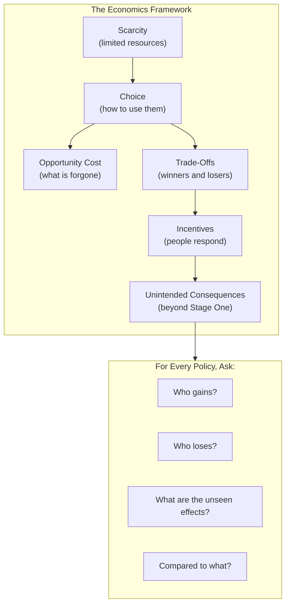
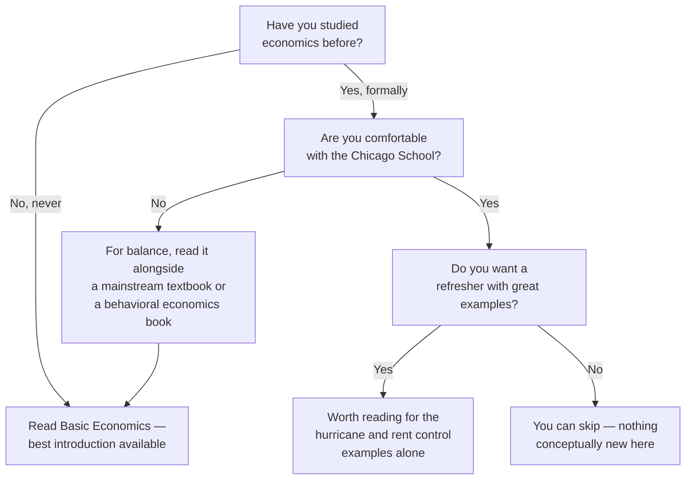

## Introduction

Welcome to BookAtlas. Today: *Basic Economics: A Common Sense Guide to the
Economy* by Thomas Sowell. First published in 2000 by Basic Books. Now in
its fifth edition, 704 pages, over a million copies sold. One of the most
widely read economics books of the last quarter century.

It has no graphs. No equations. No jargon. That was Sowell's bet — that
you can understand economics purely through logic and examples. Did he
pull it off? Our guests today:

First, a public policy analyst who assigns *Basic Economics* to every new
intern in their office. They say it should be required reading in high
school.

Second, a skeptical economist who thinks Sowell's book is a free-market
tract dressed up as a neutral primer — useful, but dangerously incomplete.

Let's get into it.

---

## The Big Question: What Is Economics?

Sowell starts with a definition that is deceptive in its simplicity:
economics is the study of the use of scarce resources that have
alternative uses.

Every word matters. Scarce — there is not enough for everyone who wants
it. That is a fact of the human condition, not a failure of any particular
system. Alternative uses — steel can be cars or buildings; land can be
farms or factories; an hour of your time can be work or leisure.

The direct implication: there is no such thing as a free lunch. Every
choice you make is also a rejection of every alternative you did not
choose. The real cost is what you gave up — opportunity cost.

**Policy Analyst:** This is the foundation. Everything Sowell argues in
the next 700 pages traces back to these two words: scarce and alternative.
If you internalize opportunity cost, you have already learned more than
most politicians seem to know.

**Skeptic:** But it is also a framing that *assumes* scarcity is exogenous
— given, fixed. It is not. Human ingenuity creates resources. Oil was a
nuisance until we figured out how to use it. Sowell's framework is static
in a way that misses the dynamic, creative side of capitalism. Schumpeter's
"creative destruction" gets a few pages, but the emphasis is always on
constraint, not creation.

---

## The Price System: Sowell's Masterpiece

The strongest section of the book, by far, is the first four chapters on
prices and markets. Sowell explains why prices are not arbitrary numbers
but *information* — carrying knowledge about relative scarcity, production
costs, and consumer preferences across time and space.

His hurricane example is unforgettable. A storm hits. Ice runs out. Prices
soar. The public screams "price gouging." But the high price is doing two
essential things: it rations the remaining ice to those who need it most,
and it signals to suppliers hundreds of miles away that there is a profit
opportunity. Trucks roll in from three states. Without the price signal,
the shortage lasts weeks instead of days.

**Policy Analyst:** This example alone justifies the book. I have used it
a hundred times in policy arguments. The instinct to "do something" after a
disaster — freeze prices — is exactly wrong. The market response is faster
and more effective than any government program.

**Skeptic:** But it is also a deeply convenient example. A short-term
supply shock after a hurricane is not the same as structural inequality in
housing markets. Sowell's logic works best when the time horizon is short.
Over longer periods, the market has more failure modes — monopolies,
externalities, information asymmetries, behavioral biases. Sowell
acknowledges these, but always as exceptions rather than systemic features.

---

## Price Controls: Rent Control and Minimum Wage

Sowell devotes substantial space to two policies he considers classic
fallacies: rent control and minimum wage laws. His treatment of rent
control is devastating. He uses examples from New York, San Francisco,
Stockholm, Mumbai — all cities with long-standing rent control — to show
the same pattern: deteriorating housing stock, waiting lists, a two-tier
market where incumbents pay far below market while newcomers cannot find
any housing at all.

On minimum wage, Sowell's argument is stark: if you set the legal price
of labor above what a worker can produce, you price that worker out of
the job market. The most vulnerable — teenagers, immigrants, the less
educated — lose the opportunity to gain their first work experience.

**Policy Analyst:** The data is clear. Puerto Rico adopted the U.S.
minimum wage in the 1950s, and unemployment among low-skilled workers
on the island shot up. South Africa's rapid minimum wage increases after
apartheid reduced employment for young black workers. These are not theory.
They are documented outcomes.

**Skeptic:** The minimum wage research is actually more contested than
Sowell admits. The famous Card and Krueger study (1994) found no
employment loss from a minimum wage increase in New Jersey fast-food
restaurants. More recent meta-analyses show a range of effects, from
small negative to neutral. Sowell presents the Stigler view as settled
science, when it is not. The truth is that minimum wage effects depend
on the level, the local economy, and the specific labor market. A $15
minimum wage in rural Mississippi is different from $15 in Seattle.

---

## Profits, Losses, and Middlemen

Sowell's reframing of profit is one of his most valuable contributions.
The popular story is that profit is money taken from customers. Sowell
argues profit is a signal that resources are being used in a way customers
value. Losses are the opposite signal — indicating waste.

And middlemen — the universally despised intermediaries — are actually
value-creators. They reduce transaction costs. The farmer does not need to
find each customer. The customer does not need to visit each farm. The
middleman aggregates, and the thin margins in competitive retail prove
that the service is barely worth more than its cost.

**Policy Analyst:** This is Sowell at his best. He takes something everyone
thinks they understand — "middlemen are parasites" — and turns it on its
head. After reading this, you see the economy differently. The gas station
on the corner is not just selling gas. It is solving a coordination problem.

**Skeptic:** True enough for competitive markets. But what about
pharmaceutical benefit managers in the U.S. — middlemen who have been
accused of inflating drug prices? Or ticket resellers who use bots to buy
up concert tickets and resell at huge markups? Sowell's theory assumes a
perfectly competitive middleman market. Real life has middlemen who capture
regulatory advantages and exploit information asymmetries. The theory is
correct in the abstract; the question is whether the real world matches
the abstraction.

---

## International Trade: Comparative Advantage

Sowell's explanation of comparative advantage, using the lawyer-and-
secretary example, is one of the best in print. A lawyer who is also the
world's best typist should still hire a secretary — not because the
secretary is a better typist (they are not), but because the lawyer's
comparative advantage is practicing law. The opportunity cost of typing
is too high.

Same logic applies to nations. Even if China can make both phones and
clothing more efficiently than Bangladesh, both countries gain if each
specializes in what they do relatively best and trade.

**Policy Analyst:** This is the foundation of the modern global economy.
Every time someone says "trade deficits are bad" or "we need to bring
manufacturing home," they are revealing that they do not understand
comparative advantage. Sowell's explanation should be mandatory for every
elected official.

**Skeptic:** But comparative advantage is a static model. It assumes
capital does not move and technology does not change. In the real world,
countries can develop new comparative advantages through education,
infrastructure, and industrial policy. Sowell's conclusion — that free
trade is always optimal — does not follow from the premise. South Korea
did not get rich by eliminating tariffs. It got rich by strategic
protectionism combined with export promotion. Sowell's treatment is too
pure.

---

## The Seen and the Unseen

The book's most important theme, borrowed from Frédéric Bastiat, is the
distinction between what is visible and what is not. A policy's immediate
effects are visible: people keep their apartments under rent control,
workers earn higher wages under a minimum wage law, jobs are protected
by a tariff. The unseen effects come later: landlords stop building,
low-skilled workers cannot find jobs, consumers pay more, and other
industries lose export markets.

Sowell's method is to insist on tracing the full chain. Every chapter
invites the reader to look beyond what is obvious.

---

## The Biggest Criticisms: A Fair Hearing

Let us be honest about the book's limitations:

1. **It is not neutral.** Sowell presents free-market economics as *the*
   truth, not *a* perspective. Keynesian, Marxist, institutional, and
   behavioral economics are barely acknowledged. A reader could finish
   this book thinking all economists agree on the minimum wage question,
   or that rent control is universally condemned — neither of which is
   true.

2. **Evidence is selected for the argument.** The book finds examples that
   support its claims and does not engage with counterexamples. The Nordic
   countries — which combine market economies with extensive regulation
   and high taxes — are not examined. Singapore's heavy-handed housing
   policies are not discussed.

3. **Dismissive tone toward dissent.** Sowell is not a gentle writer. He
   has a habit of caricaturing opposing views and then demolishing the
   caricature. This makes the book persuasive to the already-convinced
   but alienating to those who disagree.

4. **Ignoring the politics it critiques.** Sowell treats government as a
   monolithic actor, not a collection of competing interests with
   different incentives. The public choice tradition (Buchanan, Tullock)
   is more sophisticated about government failure than Sowell's
   presentation suggests.

**Policy Analyst:** Fair points. But here is the counter: no introductory
book is perfect. Every text picks a framework. Mankiw's textbook picks
a mainstream Keynesian-neoclassical synthesis. Sowell picks the Chicago
school. The value of *Basic Economics* is not that it is balanced — it is
that it is clear. You can learn the framework and then seek counter-
arguments elsewhere. That is what educated readers do.

**Skeptic:** I agree that clarity is a virtue. But calling the book
"basic economics" when it is really "free-market economics" is a
disservice. It should be called "Basic Free-Market Economics." Then the
reader knows what they are getting. As it stands, many readers take its
conclusions as the settled consensus of the economics profession, which
they are not.

---

## The Verdict: Do You Need This Book?

**Policy Analyst:** If you have never studied economics, this is the first
book you should read. It is the clearest explanation of economic
fundamentals ever written for the general public. Do not rely on it as
your *only* economics book — but start here. The way Sowell teaches you
to think about trade-offs, incentives, and unintended consequences is
invaluable regardless of your political views.

**Skeptic:** If you already have a background in economics, you can skip
it. There is nothing new here. Sowell's examples are excellent — the
hurricane and rent control stories are worth reading — but the framework
will be familiar from Hayek, Hazlitt, and Friedman. If you want a more
balanced and current introduction, try Charles Wheelan's *Naked
Economics* or the latest edition of Mankiw. Both acknowledge the existence
of market failures and alternative perspectives.

**Policy Analyst:** I will close with this. Sowell's greatest achievement
is not the specific policy conclusions — it is the *habit of mind* the
book cultivates. After reading *Basic Economics*, you will find yourself
asking better questions. Not "is this policy well-intentioned?" but "what
are the actual incentives this creates?" Not "does this help people?" but
"who specifically gains, who specifically loses, and what happens next?"

That habit — thinking beyond stage one — is rare, valuable, and the book
installs it more effectively than any other I know.

---

## Final Thoughts

*Basic Economics* is not a complete education in economics. It is not
balanced. It is not current on the latest research. What it is, is the
best possible starting point — a clear, forceful, example-rich
introduction to the logic of scarcity, prices, and incentives.

Read it. Learn the framework. Then read something that disagrees with it —
maybe Stiglitz's *The Price of Inequality* or Kahneman's *Thinking, Fast
and Slow*. The combination will serve you better than either book alone.

But start here. Because before you can critique free-market economics,
you need to understand it. And no one explains it better than Thomas
Sowell.

This has been a BookAtlas narration of *Basic Economics* by Thomas Sowell.
Thanks for listening.
