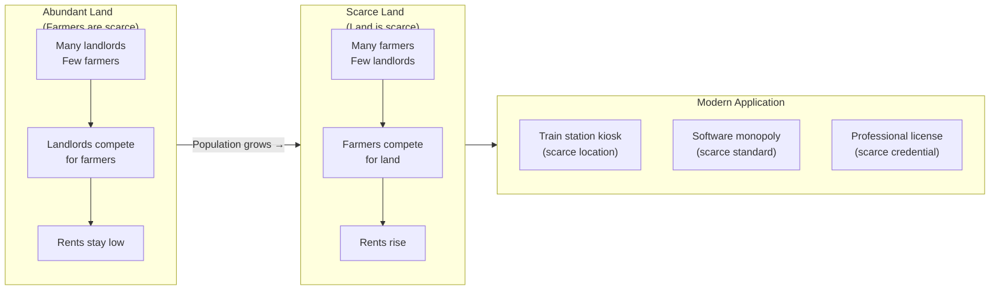
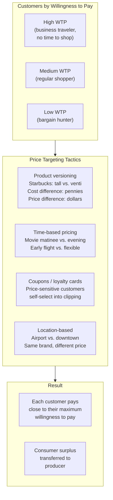
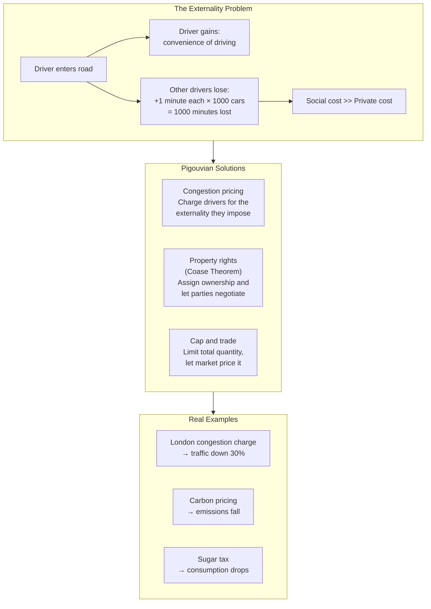
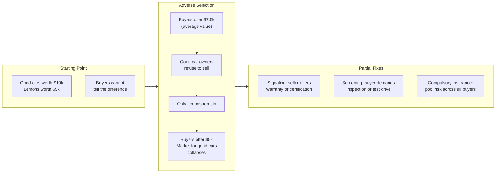

## Scarcity Power: Who Gets What and Why

Harford opens with a deceptively simple question: why does a cappuccino
cost $4.50 at a train station when the same coffee costs less elsewhere?

The answer is **scarcity power**. Only one coffee shop can fit in the
station concourse. Commuters value convenience highly. The landlord who
controls the scarce real estate can charge enormous rent — and that rent
is passed to you in the price of your coffee.

### David Ricardo's Insight

In 1817, David Ricardo explained why fertile land earns rent for the
landlord, not the farmer. When land is abundant, farmers compete for
tenants and rents stay low. When farmers arrive faster than land can be
created, the scarce resource shifts from farmers to land — and
landlords gain pricing power.

### Economic Rent

Economists define **rent** as earnings that come not from creating
value but from controlling something scarce. Harford identifies three
sources:

| Source | Example | Rent Extraction |
|--------|---------|-----------------|
| Natural scarcity | Prime real estate | Higher prices for coffee at the station |
| Created scarcity | Monopoly / patent | Microsoft's margins on Windows |
| Regulatory scarcity | Taxi medallions, medical licenses | Artificially limited supply raises prices |

---

## Price Targeting: The Art of Extracting Your Money

If Starbucks charged everyone the same price, they would leave money on
the table from customers willing to pay more — and lose customers who
will only pay less. The solution: **price targeting** (price
discrimination).

### How Firms Segment You

### Self-Targeting

The genius of modern price targeting is that customers reveal their own
willingness to pay. A business traveler booking a refundable flight at
the last minute shows she values flexibility. A leisure traveler booking
three weeks out with a Saturday-night stay shows price sensitivity.

Harford's advice: to beat price targeting, be the customer who looks
price-sensitive. Use incognito browsing, buy in bulk, wait for sales,
and avoid the convenience premium.

---

## Perfect Markets: The World of Truth

Harford introduces the concept of a **perfectly competitive market** as
an ideal: many buyers and sellers, identical products, perfect
information, no barriers to entry. In such a market:

- Price equals marginal cost
- No firm makes economic profit in the long run
- Resources flow to their highest-valued use

### Why This Matters

The perfect market is useful not because it exists, but because it
provides a benchmark. When real markets deviate from perfection —
through scarcity power, externalities, or information problems — we can
identify the deviation and ask whether intervention could improve
outcomes.

| Market Type | Price Reflects | Result |
|-------------|----------------|--------|
| Perfect competition | True cost + consumer preferences | World of truth |
| Monopoly | Cost + scarcity rent | Some consumers priced out |
| Externality-ridden | Private cost only | Social cost ignored |
| Information-asymmetric | Suspect | Market may collapse |

---

## Externalities: When Markets Fail

An **externality** is a cost or benefit that spills over to a third
party not involved in the transaction. Harford's central example:
traffic jams.

Every driver considers only her own time cost when deciding to enter a
congested road. She ignores the delay she imposes on every other driver
(a negative externality). The result: too many cars, everyone stuck.

### Pigouvian Taxes

Harford's preferred tool: tax the negative externality at its source.
Not as moral condemnation — as price correction. A congestion charge
does not punish drivers; it aligns the price of driving with its true
social cost.

---

## Asymmetric Information: The Used Car Problem

Harford devotes rich attention to **information asymmetry** — when one
party knows more than the other.

### The Market for Lemons

George Akerlof's classic insight: in the used car market, sellers know
whether the car is a lemon; buyers do not. Since buyers cannot tell
good from bad, they offer only the average price for a used car of that
model year. This price is too low for owners of good cars — so they
withdraw from the market. The average quality of remaining cars falls.
Buyers lower their offer. The market unravels.

### Healthcare

Harford applies this to healthcare. In the U.S. system, insurers know
less about patients' health than patients do (adverse selection), and
insured patients consume more care because they do not bear the full
cost (moral hazard). The result: high costs, unequal access, and
pervasive inefficiency.

---

## Game Theory: Strategic Interdependence

Harford explains game theory through the **prisoner's dilemma** — the
canonical model of why individually rational choices produce collective
disaster.

| Player A / Player B | Cooperate | Defect |
|---------------------|-----------|--------|
| Cooperate | Both get 3 years | A gets 10, B gets 1 |
| Defect | A gets 1, B gets 10 | Both get 7 years |

The dominant strategy is to defect — yet both would be better off if
they cooperated. This structure explains price wars (competing firms
would rather both keep prices high, but each has an incentive to
undercut), arms races, and environmental treaties.

---

## Comparative Advantage and Globalization

Harford walks through **comparative advantage**: even if Country A is
better at everything than Country B, both gain from trade. Country A
should specialize in what it does *most* better; Country B in what it
does *least* worse.

| Country | Computers (output/worker) | Beer (output/worker) |
|---------|--------------------------|----------------------|
| America | 100 | 50 |
| Europe | 60 | 40 |

America is absolutely better at both. But America is 1.67x better at
computers and only 1.25x better at beer. America's comparative
advantage is computers; Europe's is beer. Both gain by specializing and
trading.

### Sweatshops

Harford tackles the morally charged question of sweatshops directly.
His argument: sweatshop jobs in Bangladesh or China are terrible by
Western standards — but they are dramatically better than the
alternatives available (subsistence farming, informal labor). The
anti-sweatshop activism that pushes multinationals out of poor countries
often makes workers *worse* off by removing their best available option.

---

## Why Poor Countries Are Poor

The book contrasts **China** and **Cameroon** to illustrate how
institutions determine prosperity.

| Factor | China (after 1978) | Cameroon |
|--------|-------------------|----------|
| Property rights | Gradually introduced | Weak / corrupt |
| Market pricing | Deregulated over time | Controlled / distorted |
| Trade openness | Special Economic Zones | Protected / restricted |
| Corruption | Declining trend | Pervasive |
| Result | Fastest poverty reduction in history | Stagnation |

Harford's analysis emphasizes that poverty is not a mystery — it is the
natural outcome of bad institutions. The question is political: why do
countries fail to adopt policies that would make their citizens richer?

---

## Key Lessons

- **Follow the incentives.** Every economic outcome has a logic — find
  who gains and who loses from the current arrangement.
- **Scarcity is not natural.** Much scarcity is created by regulation,
  licensing, or monopoly. Ask who benefits from keeping things scarce.
- **Prices are information.** High prices signal scarcity; low prices
  signal abundance. Distorting prices (subsidies, price controls) hides
  information.
- **Market failure is real, but so is government failure.** The
  comparison should always be between imperfect markets and imperfect
  government, not between imperfect markets and perfect theory.
- **Trade creates winners and losers.** The net gain is positive, but
  the losers are real. The right response is compensation and
  adjustment assistance, not protectionism.
- **Think at the margin.** Most economic decisions are about small
  changes, not all-or-nothing. The relevant question is: what happens
  if we do a little more or a little less?
- **Unintended consequences are everywhere.** Good intentions do not
  guarantee good outcomes. The best policy is the one that works,
  regardless of how it sounds in a speech.
- **The world is complicated.** Simple answers (privatize everything,
  nationalize everything, free trade, no trade) are almost always wrong.
  Context matters.

---

## Practical Action Plan

1. **When shopping, obscure your willingness to pay.** Use incognito
   browsing, clear cookies, and compare prices across sellers.

2. **Look for the scarcity behind high prices.** Is it natural (limited
   land, rare skill) or created (regulation, monopoly)? Your response
   depends on which.

3. **When a policy sounds good, ask: who has the incentive to make this
   work?** If nobody does, it will fail regardless of intention.

4. **Support Pigouvian taxes** (congestion charging, carbon pricing,
   sugar taxes) as price corrections, not moral statements.

5. **Be skeptical of trade barriers.** They protect a few visible jobs
   at the cost of many invisible ones, and they hurt the poor most.

6. **When markets fail, ask whether government can do better — and at
   what cost.** The relevant comparison is real vs. real, not real vs.
   ideal.

7. **Develop the economic way of thinking.** Ask "and then what?" Trace
   the chain of incentives and consequences. Most policy mistakes are
   failures to think two steps ahead.
