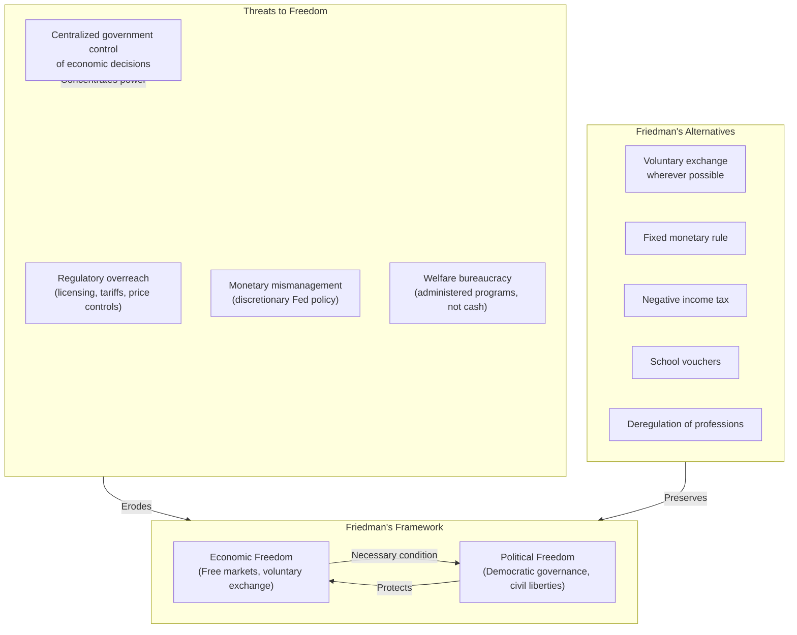
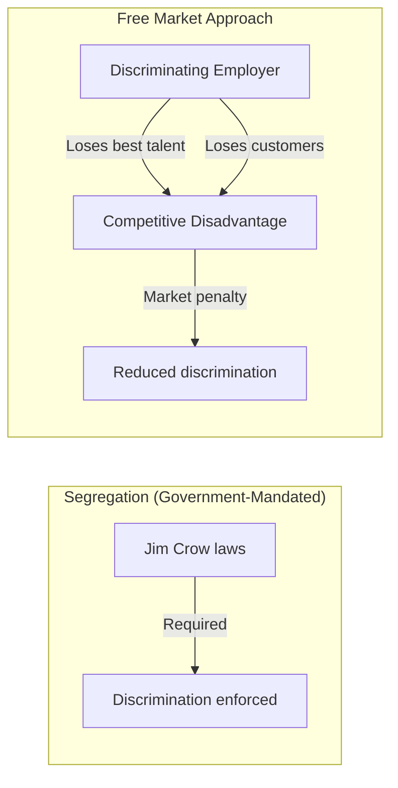

## The Central Thesis

---

## Chapter 1: The Relation Between Economic and Political Freedom

Friedman's foundational argument: economic freedom is not just
instrumentally valuable for prosperity — it is a necessary condition for
political freedom.

The logic:
- When government controls economic decisions, it controls the means of
  survival for every citizen
- Dissent becomes economically impossible — you can be starved into
  submission
- A free market disperses power across millions of independent decision
  makers, making it impossible for any single authority to coerce
- No country with a centrally planned economy has ever maintained
  democratic political freedom

Friedman acknowledges exceptions: countries like Pinochet's Chile had
free markets without political freedom. His response: economic freedom
is necessary but not sufficient. It creates pressure for political
freedom over time.

---

## Chapter 2: The Role of Government in a Free Society

Government's legitimate functions are:
1. **National defense** — Protect against foreign coercion
2. **Police and courts** — Enforce contracts, protect property, prevent
   fraud
3. **Addressing externalities** — Cases where market transactions affect
   third parties (e.g., pollution)
4. **Protection of those who cannot be responsible for themselves** —
   Children, the mentally ill

Everything beyond this — price controls, occupational licensing, tariffs,
subsidies, public ownership — is an infringement on liberty that
requires extraordinary justification.

Friedman is especially skeptical of the "public interest" rationale for
regulation. He argues that regulations almost always benefit existing
producers at the expense of consumers and new entrants.

---

## Chapter 3: The Control of Money

Friedman's critique of the Federal Reserve is foundational to
monetarism:
- The Great Depression was caused by the Fed's contraction of the money
  supply, not by capitalism's failures
- Discretionary central banking has produced inflation and instability
- Solution: a constitutional amendment requiring the Fed to grow the
  money supply at a fixed rate (3-5% annually)

This "k-percent rule" would remove discretion and provide a stable
monetary framework for economic growth. The argument directly
challenged the Keynesian consensus that active monetary management was
beneficial.

---

## Chapter 4: International Trade

Friedman's free trade argument:
- Tariffs and import quotas harm consumers to benefit domestic
  producers
- The "cheap foreign labor" argument is fallacious — trade is
  beneficial regardless of wage differences
- A country benefits from importing goods it could produce more
  cheaply, just as an individual benefits from specialization
- Free trade promotes international peace by creating mutual economic
  interdependence

The chapter includes one of Friedman's most famous lines: "The world
cannot continue to exist half free and half slave" — extended to trade
policy.

---

## Chapter 5: Fiscal Policy

Friedman challenges the Keynesian consensus on government spending and
deficits:
- Government spending is not a free stimulus — it diverts resources
  from productive private use
- Deficits are deferred taxation and represent a claim on future
  output
- Tax cuts should be paired with spending cuts, not used as stimulus
- The size of government should be limited constitutionally

---

## Chapter 6: The Role of Government in Education

This chapter contains Friedman's famous school voucher proposal:
- Public education is a monopoly with no incentive to improve
- Vouchers would give parents purchasing power to choose any school
- Competition would raise quality for all students, especially the poor
- Government would fund education at a basic level but not operate
  schools
- Higher education should be privately financed through loans repaid
  from future income

This remains one of Friedman's most influential and controversial
proposals, tested in various forms across the US, Sweden, and Chile.

---

## Chapter 7: Capitalism and Discrimination

Friedman's argument on discrimination:
- In a free market, discrimination is costly — a business that refuses
  to hire qualified workers or serve customers is penalized by
  competitors who will
- Government-mandated segregation (Jim Crow) was enabled by government
  power, not prevented by it
- The most effective force against discrimination is market competition

---

## Chapter 8-9: Monopoly and Occupational Licensure

- **Monopolies** can arise from government (patents, tariffs,
  regulation) or from private collusion. Most dangerous are
  government-created monopolies.
- **Occupational licensing** is a barrier to entry that raises prices
  and restricts opportunity, especially for the poor. Friedman
  advocates eliminating most licensing requirements.

---

## Chapter 10-12: Welfare and Poverty

Friedman's alternatives to the welfare state:

| Problem | Current System | Friedman's Alternative |
|---------|----------------|------------------------|
| Poverty | Welfare bureaucracy | Negative income tax |
| Education | Public school monopoly | School vouchers |
| Housing | Public housing | Housing vouchers |
| Retirement | Social Security | Mandated private savings |

The **negative income tax** would:
- Provide a guaranteed minimum income through the tax system
- Eliminate welfare bureaucracy
- Remove work disincentives by phasing out benefits gradually
- Preserve individual dignity through cash rather than in-kind benefits

---

## Key Lessons

- Economic freedom is necessary for political freedom
- Government's role should be narrow and clearly defined
- Most regulation benefits the regulated, not the public
- Fixed rules are superior to discretionary authority
- Free markets reduce discrimination, not increase it
- The welfare state can be replaced with simpler, more humane
  alternatives
- International free trade benefits all parties
- There is no free lunch — government programs always have hidden costs
- Individual choice is the best guide to individual welfare
- The social responsibility of business is to maximize profits within
  the rules of the game

---

## Practical Applications

### For Policy Professionals

- Use cost-benefit analysis to evaluate proposed regulations
- Consider market-based alternatives (vouchers, tradable permits) to
  command-and-control regulation
- Evaluate unintended consequences before enacting new programs

### For Citizens

- Be skeptical of "public interest" justifications for regulation
- Understand that tariffs and trade restrictions harm consumers
- Recognize that government programs create winners and losers, not
  just winners

### For Business Leaders

- Engage in policy debates with evidence, not self-interest
- Understand that some regulation benefits competitors at your expense
- Advocate for rule-based policy over discretionary authority

---

## Action Plan

1. **Read critically.** Identify where you agree and disagree with
   Friedman's assumptions
2. **Test the arguments.** Apply Friedman's framework to a current
   policy debate (minimum wage, rent control, drug pricing)
3. **Read the critics.** John Kenneth Galbraith's *The Affluent
   Society* and Amartya Sen's *Development as Freedom* provide
   contrasting views
4. **Evaluate trade-offs.** For any government program, ask: "What are
   the unintended consequences? Who benefits? Who pays?"
5. **Understand the context.** Friedman was reacting against the
   postwar Keynesian consensus. The arguments are sharper because of
   the opposition
