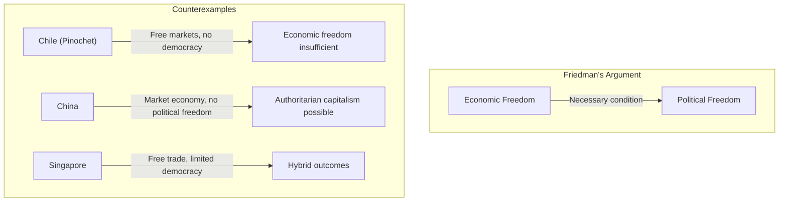

## Introduction

Welcome to BookAtlas. Today: *Capitalism and Freedom* by Milton
Friedman. Published 1962, University of Chicago Press. 208 pages.

This is the book that turned libertarianism from a fringe academic
curiosity into a political movement that would reshape the world. It
is the intellectual foundation of the Reagan-Thatcher revolution. It
is also the book that critics blame for rising inequality, the decline
of the welfare state, and — most controversially — for providing
economic cover for the Pinochet dictatorship.

Today's conversation features a free-market economist who considers
this the most important book of the 20th century, and a progressive
policy analyst who thinks Friedman's influence has been largely
negative.

---

## The Central Argument: Economic Freedom and Political Freedom

**Economist:** The opening chapter is devastating. Friedman shows that
every society that has eliminated economic freedom — the Soviet Union,
Nazi Germany, Mao's China — has also eliminated political freedom.
This is not a coincidence. When government controls what you can
produce, where you can work, and what you can buy, it controls your
very survival. Dissent becomes impossible.

**Policy Analyst:** The correlation is real, but the causation runs
both ways. Friedman assumes that economic freedom produces political
freedom. But Pinochet's Chile had free markets without political
freedom. China has massive economic freedom without democracy.
Singapore. The Gulf states. The relationship is more complicated than
Friedman admits.

---

## School Vouchers and Education

**Economist:** Friedman's school voucher proposal is brilliant in its
simplicity. The public school system is a monopoly with no incentive
to improve. If parents could choose where to send their children,
schools would have to compete. Poor families would benefit most —
they currently have the least choice.

**Policy Analyst:** We've had decades of voucher experiments. The
results are mixed at best. In Chile, Friedman's proposal was
implemented — and it increased segregation without improving outcomes.
In Sweden, it produced a for-profit education sector with quality
problems. The problem is not the theory; it's that parents don't have
perfect information, schools can game the system, and the worst
students get left behind by everyone.

---

## The Negative Income Tax

**Economist:** Friedman's negative income tax is a beautiful idea.
Instead of a bureaucratic welfare system with caseworkers and forms
and perverse incentives — just give poor people cash through the tax
system. It's simpler, more dignified, and less prone to abuse. The
Earned Income Tax Credit is a partial implementation, and it's one of
the most effective anti-poverty programs in America.

**Policy Analyst:** The EITC works, but it's not the same as a
negative income tax. And the overall message of Friedman's welfare
critique — that government programs are inherently bad — has been used
to justify cutting the social safety net without replacing it with
anything. The attack on Social Security didn't lead to better private
retirement options. It led to less retirement security.

---

## Occupational Licensing

**Economist:** This is where Friedman is most obviously right.
Occupational licensing raises prices, restricts supply, and protects
existing practitioners. It's a barrier to entry that hurts poor people
most — they can't afford the training or the fees. Every study shows
licensing reduces employment without improving quality.

**Policy Analyst:** Some licensing is necessary. You don't want
unlicensed doctors performing surgery or unlicensed electricians
wiring houses. The question is where to draw the line, not whether
licensing should exist. Friedman's argument is rhetorically powerful
but practically useless — it doesn't tell us which licenses to keep
and which to eliminate.

---

## The Verdict: Prophet or Problem?

**Economist:** Friedman was right about more than he was wrong. The
Great Inflation proved his monetarist critique. Deregulation of
airlines, trucking, and telecommunications benefited consumers
enormously. The EITC is the most effective anti-poverty program in
America. School vouchers are still a live policy option. The book's
central insight — that economic freedom and political freedom are
linked — is more relevant than ever as we debate platform regulation,
central bank digital currencies, and tech monopolies.

**Policy Analyst:** Friedman's influence has been largely negative. He
provided the intellectual justification for the Reagan-Thatcher
policies that deindustrialized the West, increased inequality, and
weakened the social contract. His policies benefited capital at the
expense of labor. His simplistic faith in markets ignored the reality
of monopoly power, information asymmetries, and externalities. And his
willingness to advise dictatorships is a permanent stain on his legacy.

**Economist:** That's not a fair reading. Friedman's work —
implemented selectively and partially — improved lives. The alternative
to Friedman's policies was not a progressive utopia; it was stagflation
and Soviet central planning.

---

## Final Thoughts

*Capitalism and Freedom* is a book you must read — and then argue
with. Its clarity and consistency make it the best possible
representation of the free-market case. Understanding Friedman helps
you understand the policies that shaped the modern world.

But the book is not the last word. Markets fail. Externalities are not
marginal. Inequality matters for political freedom. And freedom means
more than the absence of coercion — it also means having the resources
to act.

Friedman and Galbraith should be read together, not as opponents but
as correctives. Each sees half the picture. The truth is in the
tension between them.

This has been a BookAtlas narration of Capitalism and Freedom by Milton
Friedman. Thanks for listening.
