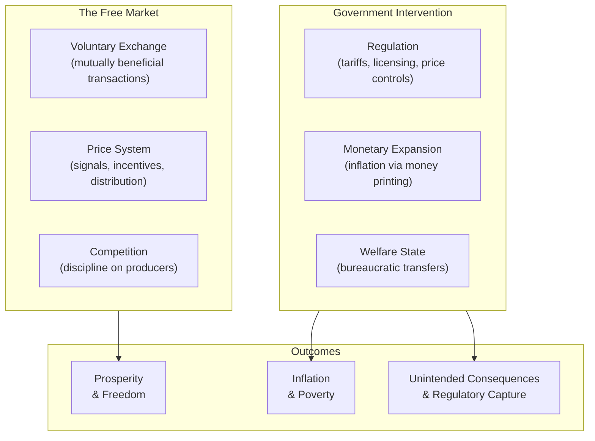
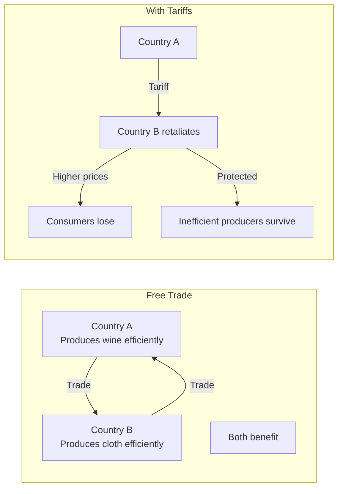
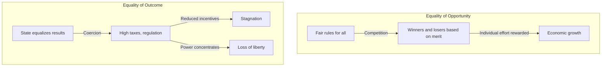
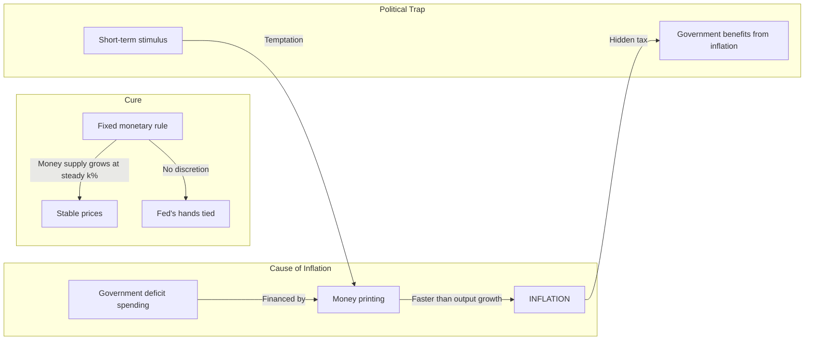

## The Central Thesis

---

## Chapter 1: The Power of the Market

The Friedmans argue that the price system is a marvel of coordination:

- **Transmits information** — Prices signal relative scarcity, telling
  producers what to make and consumers what to buy
- **Provides incentives** — High prices attract entry; low prices force
  exit; producers adopt least-cost methods
- **Distributes income** — Returns flow to owners of resources based on
  supply and demand

No central planner can replicate this. The market coordinates the
actions of millions who do not know each other, each pursuing their own
interest, producing outcomes that benefit all. Adam Smith's invisible
hand, restated for the 20th century.

The Friedmans compare Japan after 1867 (embraced free markets and
industrialized rapidly) with India after 1947 (adopted central planning
and stagnated for decades) to illustrate the power of free markets.

---

## Chapter 2: The Tyranny of Controls

Government controls — tariffs, price controls, wage controls,
occupational licensing — all have the same effect: they restrict
voluntary exchange and create shortages, surpluses, or higher costs.

**International trade:** Tariffs protect domestic producers at the
expense of consumers. The argument that low-wage countries harm
high-wage workers is fallacious — trade benefits both sides.

**Occupational licensing:** Originally meant to protect consumers,
licensing has become a barrier to entry that restricts supply and
raises prices. The Friedmans advocate eliminating most licensing
requirements.

---

## Chapter 3: The Anatomy of Crisis

The Friedmans present the monetarist interpretation of the Great
Depression — the argument that won Friedman the Nobel Prize:

- The Depression was not caused by a failure of capitalism
- The Federal Reserve allowed the money supply to contract by one-third
  between 1929 and 1933
- Bank failures were not contained because the Fed failed to act as
  lender of last resort
- Government interventions (tariffs, wage controls, the New Deal
  cartelization) prolonged the Depression

This directly challenged the Keynesian narrative that the Depression
demonstrated the need for active government management of the economy.

---

## Chapter 4: Cradle to Grave

A critique of the welfare state:

- Social Security transfers income from the poor to the rich (the poor
  die younger and collect fewer benefits)
- Welfare programs create perverse incentives: high implicit marginal
  tax rates as benefits are withdrawn make work financially
  disadvantageous
- The bureaucracy consumes a large share of the money intended for the
  poor

**Solution:** A negative income tax — a guaranteed minimum income
delivered through the tax system, phasing out gradually as earnings
increase. It would eliminate welfare bureaucracy, remove work
disincentives, and preserve dignity.

---

## Chapter 5: Created Equal

The Friedmans draw a sharp distinction between equality of opportunity
and equality of outcome:

- Equality of opportunity is compatible with freedom — it means no
  artificial barriers
- Equality of outcome requires coercion — someone must be empowered to
  take from some and give to others
- Progressive taxation, wealth taxes, and inheritance taxes reduce
  incentives to produce and save
- Redistribution through government programs has not reduced poverty
  effectively

The chapter includes data showing that the poor in market economies
live better than the middle class in planned economies — material
equality is less important than general prosperity.

---

## Chapter 6: What's Wrong with Our Schools?

The Friedmans trace the decline in education quality to the monopoly
structure of public schooling:

- Government funding and government operation are conflated — funding
  does not require operation
- Without competition, schools have no incentive to improve
- Centralization removes decision-making from parents and local
  communities
- Spending has increased while outcomes have stagnated or declined

**Solution:** School vouchers — give parents the full funding for their
child's education and let them choose any school, public or private.
Competition would drive quality up and costs down.

For higher education, the Friedmans argue against subsidies (which
mostly benefit the middle and upper classes) and propose an "equity
investment" model where students repay a share of future income.

---

## Chapter 7: Who Protects the Consumer?

The Friedmans argue that market competition protects consumers better
than government regulation:

- A business that cheats customers loses them to competitors
- Brand reputation is a powerful incentive for quality
- Government regulators are captured by the industries they regulate
- Regulation raises costs of entry, reducing competition

They acknowledge genuine externalities (pollution) and support
market-based solutions like effluent taxes over command-and-control
regulation.

---

## Chapter 8: Who Protects the Worker?

The Friedmans argue that the same market forces protect workers:

- In a competitive labor market, employers must offer good wages and
  conditions or lose workers
- Labor unions often benefit their members at the expense of
  non-members and create inefficiency
- Minimum wage laws harm low-skilled workers by pricing them out of
  jobs
- Occupational licensing restricts entry into professions, reducing
  opportunities

---

## Chapter 9: The Cure for Inflation

This chapter contains the book's most famous argument:

> "Inflation is always and everywhere a monetary phenomenon."

- Inflation occurs when the money supply grows faster than output
- Governments cause inflation because it is a hidden tax — it allows
  them to spend without raising explicit taxes
- Once inflation is anticipated, it produces no real benefits, only
  distortions
- The cure is to slow the rate of money growth to match real output
  growth

The Friedmans advocate a constitutional amendment requiring the Fed to
grow the money supply at a fixed, predictable rate (the "k-percent
rule").

---

## Chapter 10: The Tide Is Turning

The Friedmans argue that the tide of public opinion was shifting back
toward free markets in the late 1970s. They propose an **Economic Bill
of Rights** with four constitutional amendments:

1. **Spending limit** — Government spending capped at a fixed
   percentage of national income
2. **Tax limit** — Progressive tax rates and tax increases subject to
   supermajority requirements
3. **Sound money** — The Fed required to maintain a stable money supply
   growth rate
4. **Free trade** — Tariffs and quotas prohibited

The chapter expresses cautious optimism that the pendulum of public
opinion was swinging away from collectivism and toward individual
freedom.

---

## Key Lessons

- The price system coordinates without central direction
- Government controls will always produce unintended consequences
- The Great Depression was a monetary failure, not a market failure
- Inflation is caused by government money creation
- School vouchers can fix education through competition
- A negative income tax can replace the welfare state
- Most regulations harm the people they claim to protect
- Free trade benefits everyone; tariffs are a tax on consumers
- Equality of opportunity is compatible with liberty; equality of
  outcome requires coercion
- Constitutional constraints on government are necessary to preserve
  freedom

---

## Practical Applications

### For Citizens

- Be skeptical of "consumer protection" regulations — ask who benefits
- Understand that tariffs raise prices on everything you buy
- Evaluate candidates based on their commitment to limited government

### For Policymakers

- Use market-based mechanisms (vouchers, tradable permits, negative
  income tax) over command-and-control programs
- Evaluate regulations by their actual effects, not their stated
  intentions
- Prefer cash transfers to in-kind benefits to preserve recipient
  choice

### For Investors

- Understand that inflation is a monetary phenomenon — watch money
  supply growth for early warning signs
- Recognize that regulatory changes create winners and losers

---

## Action Plan

1. **Read critically.** Identify where Friedman's assumptions —
   perfect competition, rational actors, no externalities — apply and
   where they break down
2. **Test the framework.** Apply the Friedmans' analysis to a current
   issue (housing costs, student debt, healthcare regulation)
3. **Read the critics.** Robert Kuttner's *The Economic Illusion* and
   John Kenneth Galbraith's *The Affluent Society* provide contrasting
   perspectives
4. **Watch the series.** The original PBS episodes are available and
   show the Friedmans debating opponents — a richer experience than the
   book alone
5. **Look at the real-world record.** Which of Friedman's proposals
   were implemented (deregulation, EITC, charter schools) and what were
   the actual outcomes?
