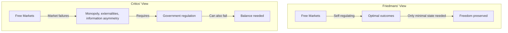
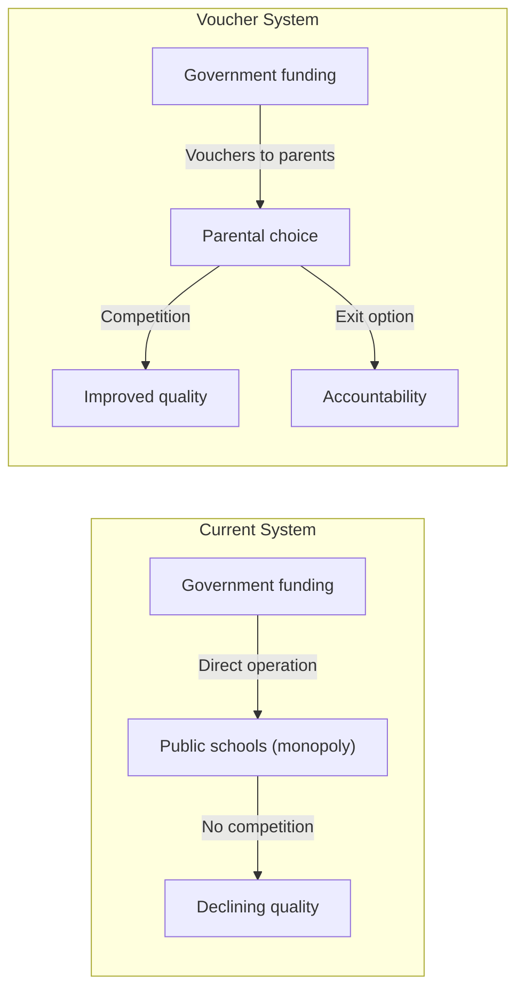

## Introduction

Welcome to BookAtlas. Today: *Free to Choose: A Personal Statement* by
Milton Friedman and Rose Friedman. Published 1980, Harcourt Brace
Jovanovich. 368 pages.

This is not a textbook. It is a popular argument — the companion to a
PBS television series that reached millions. The Friedmans wrote it
because they believed free-market ideas needed to reach a mass
audience. They succeeded: the book sold over a million copies and
became one of the most influential policy books of the late 20th
century.

Today's conversation features a free-market economist who considers
this the most effective popular economics book ever written, and a
progressive policy analyst who finds its arguments dangerously
simplistic.

---

## The Central Argument: Prices, Markets, and Freedom

**Economist:** The opening chapter on the power of the market is one of
the best pieces of economic writing I have ever read. The Friedmans
explain how prices coordinate the activities of millions of strangers.
Nobody tells a baker to bake bread, a farmer to grow wheat, or a truck
driver to deliver flour — but the bread appears on the shelf because
prices signal what is needed. Central planners cannot do this. The
Soviet Union tried and produced empty shelves.

**Policy Analyst:** The price system is real and impressive. But the
Friedmans treat it as if it solves every problem. What about public
goods — clean air, national defense, basic research? What about
externalities — climate change, antibiotic resistance? The price system
does not price pollution unless government creates property rights or
taxes. The Friedmans acknowledge this but treat it as marginal. Climate
change is not marginal.

---

## The Great Depression

**Economist:** The chapter on the anatomy of crisis is where Friedman's
Nobel Prize work shines. The Great Depression was not caused by
capitalism. It was caused by the Federal Reserve contracting the money
supply by a third. Banks failed not because the system was fragile but
because the Fed refused to act as lender of last resort. Hoover's
tariffs and Roosevelt's New Deal cartelization made things worse. The
Depression was a government failure.

**Policy Analyst:** The monetarist interpretation is part of the story,
but it is not the whole story. The Depression was a global phenomenon
with multiple causes: the gold standard, agricultural debt, trade
collapse, banking contagion, and yes, monetary contraction. Friedman
singles out one cause to make an ideological point. His policy
prescription — a fixed money growth rule — would have prevented the Fed
from responding to the 2008 financial crisis, which would have been
catastrophic.

---

## Inflation

**Economist:** "Inflation is always and everywhere a monetary
phenomenon." This is the most famous line in the book, and it is
correct. Every sustained inflation in history was caused by
governments printing too much money. The hyperinflations of Germany,
Hungary, Zimbabwe, Venezuela — all caused by government money
creation. The cure is simple: stop printing so much money.

**Policy Analyst:** The line is famous because it is simple, not
because it is complete. Inflation in the 1970s had multiple causes —
oil price shocks, wage-price spirals, expectations. And when central
banks adopted Friedman's advice and targeted money supply growth in
the 1980s, it did not work well. The relationship between money supply
and inflation turned out to be unstable. Central banks moved to
inflation targeting instead. Friedman was right that inflation is
ultimately about money. He was wrong that a simple fixed rule would
solve it.

---

## School Vouchers

**Economist:** The chapter on education is devastating. Government
schools are a monopoly with no incentive to improve. Spending goes up,
outcomes stagnate. The solution is simple: give parents vouchers and
let them choose. Competition will drive quality up. Poor families will
benefit most because they currently have the least choice.

**Policy Analyst:** Voucher programs have been tried — in Chile,
Sweden, Milwaukee, New Orleans, and elsewhere. The results are not the
triumph Friedman predicted. In Chile, vouchers increased segregation
and did not improve average outcomes. In Sweden, for-profit schools
expanded rapidly with quality control problems. The theory is clean.
The reality is messy. Schools game the system by excluding expensive
students. Parents lack perfect information. And the public school
system, for all its flaws, serves everyone.

---

## The Welfare State

**Economist:** The negative income tax is a beautiful idea. Instead of
a massive welfare bureaucracy with caseworkers, forms, and perverse
incentives — just give poor people cash through the tax system. The
Earned Income Tax Credit is a partial implementation, and it is one of
the most effective anti-poverty programs in America. The principle is
right: cash, not services; choice, not bureaucracy.

**Policy Analyst:** The EITC is popular across party lines precisely
because it subsidizes work. But the Friedmans' broader welfare critique
has been used to gut the social safety net. They attacked Social
Security, Medicare, public housing — programs that, for all their
flaws, have dramatically reduced poverty among the elderly and the
sick. The attack on Social Security did not lead to better private
retirement options. It led to less retirement security and a massive
401(k) experiment with mixed results.

**Economist:** That is not Friedman's fault. Partial implementation
that ignores the full framework does not disprove the framework.

**Policy Analyst:** That is convenient. If policies fail, it is because
they were not implemented fully. If they succeed, it is proof the
theory works. This is unfalsifiable.

---

## The Verdict

**Economist:** *Free to Choose* is the most effective popular economics
book ever written. It is clear, principled, and influential. The
Friedmans were right about inflation, right about deregulation, right
about trade. The world is richer and freer because of their ideas. The
standard of living for the global poor has improved more since 1980
than in all previous history combined — and market liberalization is a
major reason.

**Policy Analyst:** The book is beautifully written and dangerously
persuasive. It gives readers the confidence that complex problems have
simple solutions, when in reality trade-offs are everywhere. Markets
are powerful but they do not solve everything. The Friedmans dismissed
externalities, underestimated inequality, ignored behavioral
economics, and provided intellectual cover for policies that
concentrated wealth and power. The book is essential reading — but for
its influence, not its wisdom.

---

## Final Thoughts

*Free to Choose* is the best possible introduction to free-market
economics for a general audience. It is lucid, confident, and
consistently argued. Reading it helps you understand how one of the
most consequential intellectual movements of the 20th century made its
case.

But the book's clarity is also its limitation. Real economies are
messy. Markets fail, governments fail, and the choice is rarely between
a perfect market and a perfect state. It is between imperfect
alternatives, where trade-offs are unavoidable.

The Friedmans' great contribution was to remind the world of the power
of voluntary exchange — a truth that the postwar consensus had
forgotten. Their great failure was to dismiss every objection as either
ignorance or special-interest pleading.

Read the book. Learn from it. Argue with it. And then read its critics.

This has been a BookAtlas narration of *Free to Choose: A Personal
Statement* by Milton Friedman and Rose Friedman. Thanks for listening.
