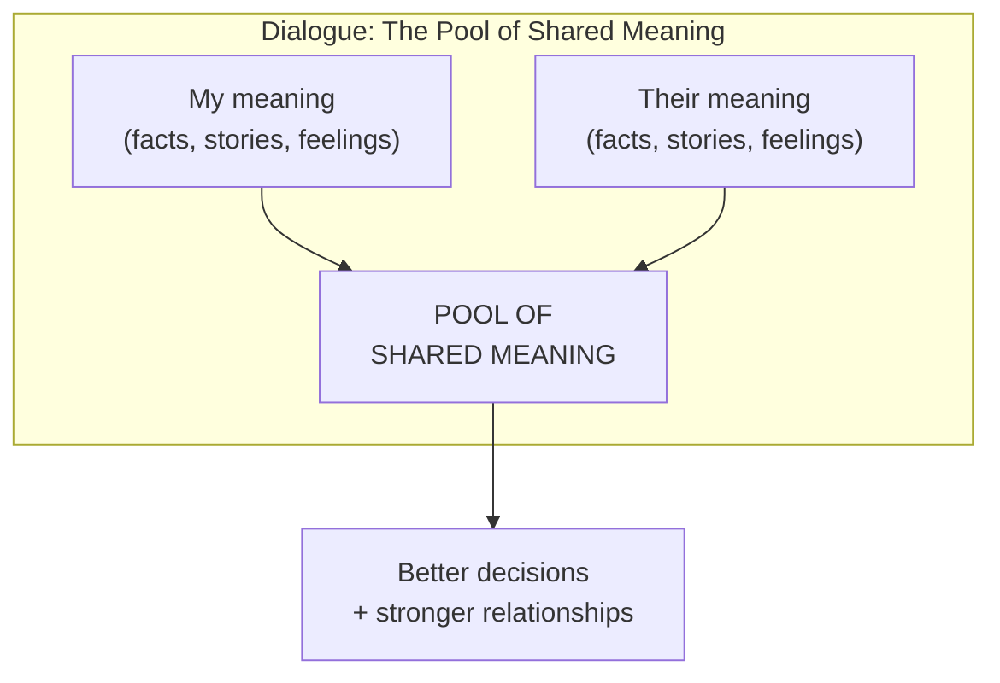
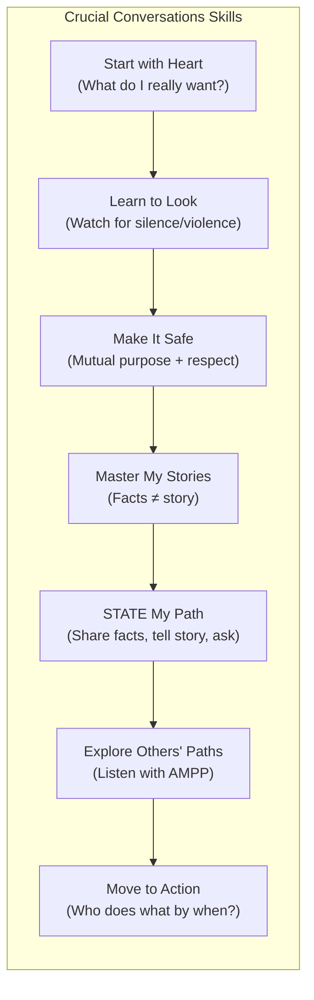

## The Pool of Shared Meaning

The central metaphor: each person brings their pool of meaning —
their observations, feelings, and interpretations. The goal of dialogue
is to add to the shared pool. When the pool is full, decisions are
better. When it is empty, decisions suffer.

---

## The Dialogue Model

---

## Start with Heart

Before any crucial conversation, ask:
- What do I really want for myself?
- What do I really want for the other person?
- What do I really want for the relationship?
- How would I behave if I really wanted these results?

This reframes the conversation from winning to achieving your actual
goals.

---

## Learn to Look: Silence and Violence

When people feel unsafe, they move away from dialogue in two directions:

| Silence Type | Signs |
|-------------|-------|
| Masking | Sarcasm, sugarcoating, telling people what they want to hear |
| Avoiding | Steering away from sensitive topics |
| Withdrawing | Checking out, leaving the room, giving the silent treatment |

| Violence Type | Signs |
|--------------|-------|
| Controlling | Cutting others off, exaggerating, dogmatic statements |
| Labeling | Calling people names to dismiss their views |
| Attacking | Belittling, threatening, making it personal |

---

## Make It Safe

Two conditions must be met for dialogue:
- **Mutual Purpose**: others believe you care about their goals
- **Mutual Respect**: others believe you value them as people

When safety is at risk, use **Contrasting**:
"I don't want you to think I don't appreciate your work. I do. But I
have a concern about how this project is being managed."

---

## Master My Stories

Emotions don't just happen. They are created by the stories we tell
ourselves about what we see. The path from fact to feeling:

1. **See/Hear**: I observe what happened
2. **Tell a Story**: I interpret the observation
3. **Feel**: My story creates an emotion
4. **Act**: I behave based on that emotion

To change your emotion, question the story:
- Am I pretending not to notice my role in this?
- What would a reasonable, neutral person conclude?
- Is there another explanation?

---

## STATE My Path

| Step | Description |
|------|-------------|
| **S**hare your facts | Start with the least controversial, most objective elements |
| **T**ell your story | Explain your interpretation as a story, not a truth |
| **A**sk for others' paths | Invite them to share their facts and stories |
| **T**alk tentatively | Tell your story as a possibility, not a certainty |
| **E**ncourage testing | Make it safe for others to disagree |

---

## Explore Others' Paths: AMPP

| Technique | What to Say |
|-----------|-------------|
| **A**sk | "What's going on?" "What do you think?" |
| **M**irror | "You seem frustrated." (Reflect the emotion you observe) |
| **P**araphrase | "Let me make sure I understand. You're saying that…" |
| **P**rime | "Are you thinking that maybe I don't care about this?" (Venture a guess) |

---

## Move to Action

| Method | Best For |
|--------|----------|
| Command | Decisions where speed matters; one person decides |
| Consult | Gathering input before a single person decides |
| Vote | Decisions where majority support is sufficient |
| Consensus | High-stakes decisions needing full buy-in |

Always document: who does what by when? Follow up.

---

## Key Lessons

- **You cannot be both right and connected.** Choosing to win the
  argument often costs you the relationship.
- **Psychological safety is the foundation of all dialogue.** Without
  it, people hide their true thoughts.
- **Your emotional response is your responsibility.** No one "makes
  you angry." You choose the story that produces anger.
- **Facts are the bridge.** Start with what is indisputable, then
  share your interpretation as interpretation, not fact.
- **Silence is as destructive as violence.** Withdrawing from a
  crucial conversation is a decision — and it has consequences.

---

## Practical Applications

### For Feedback Conversations
- Before: "What do I really want?" (A stronger team, not a
  humiliated employee)
- During: Share facts ("The report had three errors"), not
  judgments ("You are careless")
- After: Document who does what by when

### For Disagreements
- Notice when you feel unsafe — are you going to silence or violence?
- Use contrasting: "I don't mean to dismiss your point. I want to
  understand it better."
- Ask: "What would I need to believe to see this differently?"

### For Difficult Decisions
- Use the right decision method: don't use consensus when command
  is appropriate
- After deciding: "I know you disagreed. Here is why I made this
  choice. Can you support it?"
