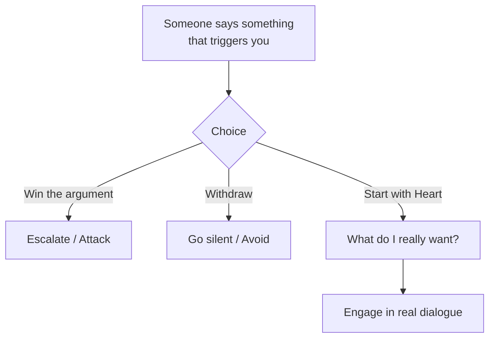

## Introduction

Welcome to BookAtlas. Today: *Crucial Conversations* by Patterson,
Grenny, McMillan, and Switzler. Published 2002. Over 5 million copies
sold. The book that taught millions how to stop avoiding difficult
conversations and start having them effectively.

The premise: when conversations matter most — high stakes, strong
emotions, differing opinions — we often perform at our worst.

---

## The Pool of Shared Meaning

**Coach:** The most important concept in this book is the Pool of Shared
Meaning. Every person in a conversation has their own pool of facts,
interpretations, and feelings. The goal of dialogue is to add everyone's
meaning to a shared pool. The fuller the shared pool, the better the
decision.

**Skeptic:** That's a nice metaphor. But in practice, people don't want
shared meaning. They want to win. They want to be right.

**Coach:** Exactly. And that is why the first skill is "Start with
Heart." Before the conversation, ask yourself: "Do I want to be right,
or do I want a good outcome?" If the answer is "be right," you are not
ready for dialogue.

---

## Start with Heart

**Coach:** This is the most powerful question in the book: "What do I
really want here?" Not "what do I want right now" (which is usually to
win or to escape), but "what do I really want for myself, for the other
person, and for the relationship?"

If you want a stronger relationship, yelling or walking away both fail
that test. The question forces you back to dialogue.

---

## Make It Safe

**Skeptic:** The book talks a lot about "making it safe." But what if
the other person does not want safety? What if they are determined to
attack?

**Coach:** Then you cannot have a crucial conversation. You can only
have a crucial conversation when both parties are willing. If the other
person is committed to attacking, your best option is to establish a
boundary: "I want to hear your concerns, but I cannot continue if you
keep interrupting me."

**Skeptic:** And if that does not work?

**Coach:** Then you choose silence or exit — but you do so consciously,
knowing it is a choice. The book is not magic. Some conversations
cannot be had.

---

## Master Your Stories

**Coach:** This is the hardest skill. Our emotions are not caused by
what other people do. They are caused by the stories we tell ourselves
about what they do. The boss criticizes your report. Your story: "She
doesn't respect me." Alternative story: "She is stressed about an
upcoming deadline." Same fact, different emotion.

**Skeptic:** So you are saying I should not trust my emotional
responses?

**Coach:** I am saying you should question them. Your emotional
response is real. But the story behind it may not be. Separate the
fact from the story. Then share the fact first, and offer the story
as a possibility, not a truth.

---

## The Verdict

**Coach:** Crucial Conversations is the most practical communication
book I have ever read. The skills are specific, memorable, and they
work. I have used the STATE framework in performance reviews,
relationship conflicts, and even during medical emergencies. It is a
life-changing book.

**Skeptic:** It is a good book. But it overpromises. Some conversations
simply cannot be salvaged. And the framework assumes you have time to
think — in heated moments, remembering seven steps is unrealistic.

**Coach:** That is why you practice. The goal is not to follow the
steps. The goal is to internalize the principles so they become
automatic. "Start with Heart" becomes a habit. "Make It Safe" becomes
a reflex.

**Skeptic:** That takes more than a book.

**Coach:** The book is the catalyst. The practice is up to you.

---

## Final Thoughts

Crucial Conversations is not a perfect book, but it is a genuinely
useful one. It has changed how millions of people handle the
conversations that matter most. That kind of practical impact is rare,
and it deserves recognition.

This has been a BookAtlas narration of Crucial Conversations by
Patterson, Grenny, McMillan, and Switzler. Thanks for listening.
