```mermaid
flowchart TB
    B["How to Win Friends<br>& Influence People"]
    
    B --> P1["Part One<br>Fundamental Techniques<br>in Handling People<br>3 principles"]
    B --> P2["Part Two<br>Six Ways to Make<br>People Like You<br>6 principles"]
    B --> P3["Part Three<br>How to Win People<br>to Your Way of Thinking<br>12 principles"]
    B --> P4["Part Four<br>Be a Leader<br>How to Change People<br>Without Giving Offense<br>9 principles"]

    P1 --> C1["1. Don't criticize,<br>condemn, or complain"]
    P1 --> C2["2. Give honest and<br>sincere appreciation"]
    P1 --> C3["3. Arouse in the other<br>person an eager want"]

    P2 --> L1["1. Become genuinely<br>interested in others"]
    P2 --> L2["2. Smile"]
    P2 --> L3["3. Remember names"]
    P2 --> L4["4. Be a good listener"]
    P2 --> L5["5. Talk in terms of<br>the other's interests"]
    P2 --> L6["6. Make the other<br>person feel important"]

    P3 --> W1["1. Avoid arguments"]
    P3 --> W2["2. Never say 'you're wrong'"]
    P3 --> W3["3. Admit mistakes<br>quickly and emphatically"]
    P3 --> W4["4. Begin in a friendly way"]
    P3 --> W5["5. Get 'yes, yes'<br>immediately"]
    P3 --> W6["6. Let the other person<br>do the talking"]
    P3 --> W7["7. Let them feel<br>the idea is theirs"]
    P3 --> W8["8. See things from<br>their point of view"]
    P3 --> W9["9. Be sympathetic to<br>their ideas and desires"]
    P3 --> W10["10. Appeal to nobler<br>motives"]
    P3 --> W11["11. Dramatize your ideas"]
    P3 --> W12["12. Throw down<br>a challenge"]

    P4 --> D1["1. Begin with praise<br>and honest appreciation"]
    P4 --> D2["2. Call attention to<br>mistakes indirectly"]
    P4 --> D3["3. Talk about your own<br>mistakes first"]
    P4 --> D4["4. Ask questions<br>instead of orders"]
    P4 --> D5["5. Let the other<br>person save face"]
    P4 --> D6["6. Praise the slightest<br>improvement — be lavish"]
    P4 --> D7["7. Give a fine reputation<br>to live up to"]
    P4 --> D8["8. Make faults seem<br>easy to correct"]
    P4 --> D9["9. Make them happy<br>about doing what you suggest"]
```

## Part One: Fundamental Techniques in Handling People

These three principles form the book's philosophical foundation. Carnegie argues most people approach others backwards: they criticize, they talk about their own needs, and they try to impose their will directly. The antidote is a shift from judgment to understanding.

### Principle 1: Don't Criticize, Condemn, or Complain

Criticism is futile because it puts the other person on the defensive. It wounds their pride, triggers self-justification, and produces resentment — not change. Carnegie cites B.F. Skinner's research (reward for good behavior is more effective than punishment for bad) and the feud between Teddy Roosevelt and President Taft as evidence. Principle 1 is the hardest in the book: it requires suppressing the instinct to correct, blame, or vent.

> "Any fool can criticize, condemn and complain — and most fools do. But it takes character and self-control to be understanding and forgiving."

### Principle 2: Give Honest and Sincere Appreciation

The deepest urge in human nature is "the desire to be important." This craving distinguishes humans from animals. Carnegie distinguishes appreciation (specific, earned, sincere) from flattery (general, unearned, manipulative). Appreciation nourishes self-esteem. It is the one tool that reliably produces motivation without side effects.

Carnegie's key distinction: flattery is what you say *about* someone to get something from them. Appreciation is what you genuinely notice *in* them.

### Principle 3: Arouse in the Other Person an Eager Want

The only way to get someone to do something is to make them *want* to do it. Frame every request in terms of the other person's desires. Carnegie uses the fishing analogy: you don't bait the hook with what *you* like. You bait it with what the fish likes.

> "The only way on earth to influence other people is to talk about what they want and show them how to get it."

## Part Two: Six Ways to Make People Like You

This section moves from general philosophy to specific behaviors. The six principles are simple but Carnegie insists they require genuine intent — insincerity is detectable.

### Principle 1: Become Genuinely Interested in Other People

You make more friends in two months by being interested than in two years by trying to be interesting. Carnegie's model: dogs. Dogs are universally liked because they show unbridled enthusiasm at seeing you — no agenda, no calculation. Borrow this trait.

### Principle 2: Smile

A smile is the universal signal of friendly intent. Carnegie cites a study where 86% of executives preferred doing business with people who smiled. The principle sounds trivial; Carnegie's point is that most people walk through the world with expressions that signal disinterest or hostility without realizing it.

### Principle 3: Remember Names

A person's name is the sweetest sound in any language. It is the most personal word. Andrew Carnegie (no relation) built U.S. Steel partly by remembering and using the names of thousands of workers. Forgetting a name signals the person was not important enough to remember.

### Principle 4: Be a Good Listener — Encourage Others to Talk

Carnegie's counterintuitive claim: a person who has been listened to attentively for 30 minutes will consider the listener a brilliant conversationalist — even if the listener said almost nothing. Most people fail here because they are not listening; they are waiting to talk.

> "To be interesting, be interested."

### Principle 5: Talk in Terms of the Other Person's Interests

The royal road to a person's heart is talking about what they treasure most. Theodore Roosevelt prepared for every meeting by reading up the night before on the visitor's specific interests. People who came to argue with him left as admirers because they felt seen.

### Principle 6: Make the Other Person Feel Important — and Do It Sincerely

This is the closing principle of Part Two and arguably the highest-leverage social technique in the book. Treat every person — CEO and receptionist — with the same demonstrated respect. Human beings hunger for importance. Feeding that hunger is the master key.

## Part Three: How to Win People to Your Way of Thinking

Twelve principles for changing minds without creating resistance. This is the longest section and the most practically dense. Carnegie's overarching argument: people resist being *told* what to think but will adopt ideas they feel they arrived at themselves.

### Principles 1–3: Avoid Arguments, Never Say "You're Wrong," Admit Mistakes

You cannot win an argument. Even when you are demonstrably right, making the other person feel defeated produces resentment, not conversion. Instead: (1) avoid the argument, (2) show respect for their position — never say "you're wrong," (3) if *you* are wrong, admit it quickly and emphatically. Pre-emptive admission disarms the other person's attack before it launches.

### Principles 4–6: Begin Friendly, Get "Yes, Yes," Let Them Talk

A drop of honey catches more flies than a gallon of gall. The Socratic method — getting the other person saying "yes, yes" immediately — sets a positive pattern. Let the other person do most of the talking; they know more about their own situation than you do.

### Principles 7–9: Let Ideas Be Theirs, See Their Perspective, Be Sympathetic

Letting the other person feel the idea is theirs is the foundation of consultative selling. Try honestly to see things from their point of view. Be sympathetic: "I don't blame you for feeling that way. If I were you, I would feel exactly the same."

### Principles 10–12: Appeal to Nobler Motives, Dramatize, Throw a Challenge

People want to believe they act from noble motives. Give them that frame. In a world of movies and radio, "stating a truth is not enough — it has to be made vivid, interesting, dramatic." Finally, the challenge itself motivates — people respond to competition and the chance to prove themselves.

## Part Four: Be a Leader — How to Change People Without Giving Offense

Carnegie's nine principles for leadership and management. Each is a practical technique for giving feedback, correcting behavior, or motivating improvement without breeding resentment.

### Principles 1–3: Begin with Praise, Call Out Mistakes Indirectly, Talk About Your Own Mistakes First

The "criticism sandwich" — praise first, then critique, then encouragement. Change "but" to "and" to transform criticism into sincere follow-up. Admitting your own mistakes before pointing out someone else's signals humility and disarms defensiveness.

### Principles 4–6: Ask Questions, Save Face, Praise Every Improvement

No one likes taking orders. Ask questions instead: "Do you think this approach would work?" Let the other person save face — a small act of preservation that pays long-term loyalty dividends. Be "hearty in your approbation and lavish in your praise" for the slightest improvement.

### Principles 7–9: Give a Reputation, Make Faults Easy to Correct, Make Them Happy to Do It

The Pygmalion effect: give someone a fine reputation to live up to and they will grow into it. Make faults seem easy to correct — encouragement, not criticism, produces change. Finally, make the other person happy about doing what you suggest by connecting it to their desires.

## Key Lessons

1. Most social failure is attention failure, not technique failure
2. Criticism is the surest way to lock in unwanted behavior
3. Appreciation must be specific and earned — flattery is detected and resented
4. Frame every request around what the other person wants
5. Listening is the highest-priority skill in human relations
6. Arguments produce resentment, not persuasion — avoid them
7. Admitting fault is a strength, not a weakness
8. Names, smiles, and sincere interest compound into trust
9. People grow into the reputation you give them
10. Sincerity is the only sustainable foundation for influence

## Action Plan

**Week 1**: Stop criticizing. For seven days, catch yourself before any critical remark and reframe it as a question or observation.

**Week 2**: Give three pieces of specific, earned appreciation each day. Make it about a concrete behavior, not a general quality.

**Week 3**: In every conversation, aim for 70% listening, 30% talking. Ask one more question before offering your own experience.

**Week 4**: Before making any request, write down the other person's perspective and frame the request in terms of their desires.

**Ongoing**: Start every feedback conversation with genuine praise, admit your own mistakes first, and end with encouragement.
