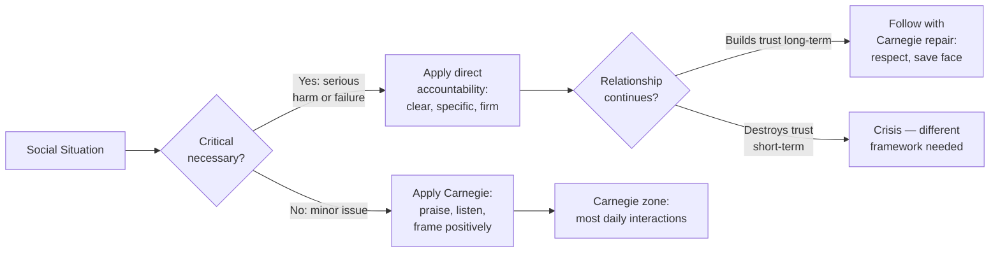

**[Host]**: Welcome to BookLab. I'm your host. Today's book is the one that started it all — Dale Carnegie's *How to Win Friends and Influence People*, first published in 1936, 30 million copies later, still in print, still debated. To figure out whether Carnegie's advice holds up in 2025, I have two guests with very different perspectives. Priya Mehta is an HR Director at a tech company who runs Carnegie-based training for her teams. Welcome, Priya.

**[Priya]**: Thanks. I'll say upfront: I use Carnegie principles every week — in my job, with my kids, even in my marriage. The man understood people.

**[Host]**: And James O'Brien is a journalist and cultural critic who wrote a piece titled *"Why Dale Carnegie Is the Most Dangerous Book on Your Shelf."* James, welcome.

**[James]**: Thanks. Let me clarify: I don't think the book is evil. I think it's ethically naive. And that naivety, in the wrong hands, is dangerous.

**[Host]**: Let's start with what everyone knows: the first principle — don't criticize. Priya, you use this at work?

**[Priya]**: Constantly. I see managers destroy teams by leading with criticism. The research backs Carnegie: criticism activates the amygdala's threat response. The person stops hearing your feedback and starts defending themselves. I train managers to replace "Here's what you did wrong" with "Here's what worked, and here's how we can build on it."

**[James]**: And this is where the naivety starts. Carnegie says "don't criticize." But what about when criticism is *owed*? When someone is racist, sexist, or just incompetent? Carnegie's framework assumes you can always find something to praise. You can't always. Sometimes the only honest thing to say is "that was wrong."

**[Priya]**: I push back. Even in hard conversations, you can start with respect. "I know you didn't intend harm, but here's the impact." That's not soft — it's strategic. People who feel attacked don't change.

**[Host]**: Part Two — six ways to make people like you. Smile, remember names, listen. James, this seems unobjectionable.

**[James]**: On the surface, sure. But read the chapter titles carefully: these are presented as *techniques* to get people to like you. Not as expressions of genuine character. "How to make people like you instantly." That's a sales manual, not a philosophy of human connection. The distinction Carnegie himself draws between appreciation and flattery is real. But when you package these as "six ways to achieve X outcome," the frame is instrumental. People are a means to an end.

**[Priya]**: I think you're being unfair. Carnegie says repeatedly: these only work if they're genuine. He calls out the insincere person who uses a smile as a mask. The book says: "become genuinely interested." Not "pretend to be interested."

**[James]**: He says that. But the structure undercuts the message. If the goal is genuine interest, why is the chapter titled "Six Ways to Make People Like You"? Why not "How to Actually Care About Others"?

**[Host]**: Part Three — win people to your way of thinking. Avoid arguments, admit mistakes, use the Socratic yes-set. Priya, this is where it gets tactical.

**[Priya]**: The argument principle is the most counterintuitive and the most important. "The only way to get the best of an argument is to avoid it." Every time I've violated this principle as a manager, I've regretted it. Even when I was right. You win the argument, lose the relationship.

**[James]**: But this advice has a shadow. The yes-set — getting someone to say "yes, yes" repeatedly — was used by interrogators. It's a consent-manufacturing technique. Chris Voss, the FBI negotiator, actually argues the opposite: you should get the other person to say *no* first, because "no" feels like a choice, and people commit to choices they feel they made freely.

**[Priya]**: Voss isn't contradicting Carnegie — he's refining him. Carnegie wrote in 1936. Voss updated for hostage negotiations. The core insight — make the other person feel heard — is the same.

**[James]**: Let me give you the most uncomfortable example. Charles Manson read this book in prison and used it to build a cult. He used the genuine interest principle — he paid attention to people who felt invisible. He used the appreciation principle — he made followers feel important. He used the "give a reputation to live up to" principle — he gave them an identity as revolutionaries. The principles work. That's the problem.

**[Priya]**: That's like blaming the hammer for the murder. A book about human relations can't be responsible for how a sociopath uses it.

**[James]**: A hammer is designed to drive nails. A book about how to influence people is designed to influence people. When the most effective influence book in history is weaponized by one of the most notorious manipulators of the 20th century, that is a design flaw worth discussing. Not dismissing.

**[Host]**: Part Four — leadership. Begin with praise, criticize indirectly, ask questions. Priya, does this hold up?

**[Priya]**: The "ask questions instead of giving orders" principle is the one that most transforms new managers. Instead of "do X," say "what do you think about approaching this as X?" The ownership shifts. The employee feels respected. Performance improves.

**[James]**: And the employee may also feel manipulated when they eventually realize the manager had the answer in mind the whole time. The principle "let them feel the idea is theirs" is literally about manufacturing a false sense of ownership.

**[Priya]**: Or it's about mentoring. There's a difference between "I want you to think this is your idea so you'll do what I want" and "I want you to develop judgment so you can solve problems without me." Carnegie's principle supports the second. The intent matters.

**[James]**: And the book has no mechanism for ensuring intent. That's my point.

**[Host]**: Let's bring this to 2025. Does Carnegie work in a remote, Slack-driven, hybrid work world?

**[Priya]**: More than ever. The listening principle is *more* important on Zoom, where non-verbal cues are limited. The appreciation principle is *more* important when people feel isolated behind screens. The "talk in terms of others' interests" principle is *more* important when attention is the scarcest resource. Carnegie's advice to be genuinely interested in others is the antidote to the algorithmic, transactional culture we live in.

**[James]**: I agree with that — ironically. The book's weaknesses (lack of ethical framework, dated examples) are real. But its core diagnosis — that people hunger for attention and importance — is more true in 2025 than it was in 1936, because we have so many technologies that simulate attention without delivering it.

**[Host]**: Final question — should people read this book?

**[Priya]**: Yes. It will make you better at your job, your relationships, and your life. The principles are simple. Actually practicing them is hard. That's the challenge — and the gift.

**[James]**: Read it. But read it with a critical lens. Ask yourself: am I using this to genuinely connect, or to get something? Carnegie would say the first is right. The book gives you the tools for both. Decide which you are before you open it.

**[Host]**: The book is *How to Win Friends and Influence People* by Dale Carnegie. Priya Mehta, James O'Brien — thank you both.

### Principles That Endure vs. Principles That Need Updating

| Principle | Verdict | Modern Adaptation |
|---|---|---|
| Don't criticize | Endures | Confirmed by neuroscience (threat response). But needs caveat: accountability and boundary-setting are not criticism. |
| Give honest appreciation | Endures | Most effective employee motivator across 50+ years of engagement research. Must be specific. |
| Arouse an eager want | Endures | The foundation of every modern sales methodology. Works on Slack, email, and Zoom as well as in person. |
| Smile | Endures | Adapt to camera: warm lighting, eye contact, natural expression — not a frozen grin. |
| Remember names | Endures | Harder at scale (1000-person org). Use CRM tools as external memory. Write names down immediately. |
| Be a good listener | Endures | Most important in remote work. Aim for active listening techniques: paraphrase, summarize, ask follow-ups. |
| Avoid arguments | Endures | The backfire effect is well-documented. But avoid false agreement — acknowledge difference respectfully. |
| Admit mistakes | Endures | More powerful than ever in a culture that rewards authenticity. Pre-emptive admission builds trust. |
| Yes-set (Socratic method) | Needs updating | Voss's "no" reframe is more effective for negotiations. Use "yes" only when building natural momentum. |
| Give a reputation to live up to | Endures | The Pygmalion effect is experimentally confirmed. Works with teams, children, and peers. |
| Dramatize your ideas | Endures | Now called "storytelling" — the most valued communication skill in business. Every TED Talk is this principle. |
| Criticism sandwich | Mixed | Modern feedback research favors radical candor (direct, clear) over the sandwich approach, which can feel manipulative. |
