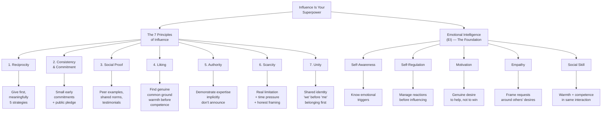
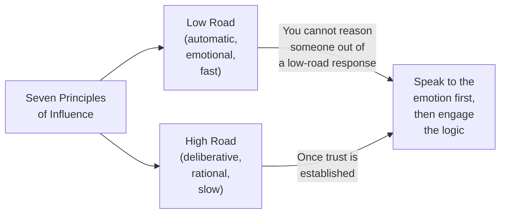
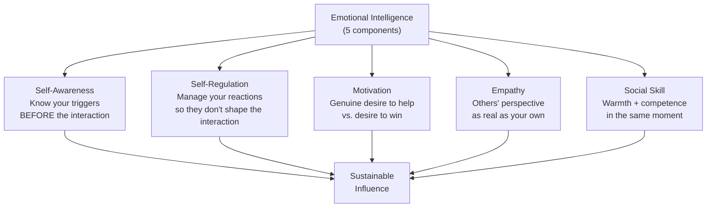
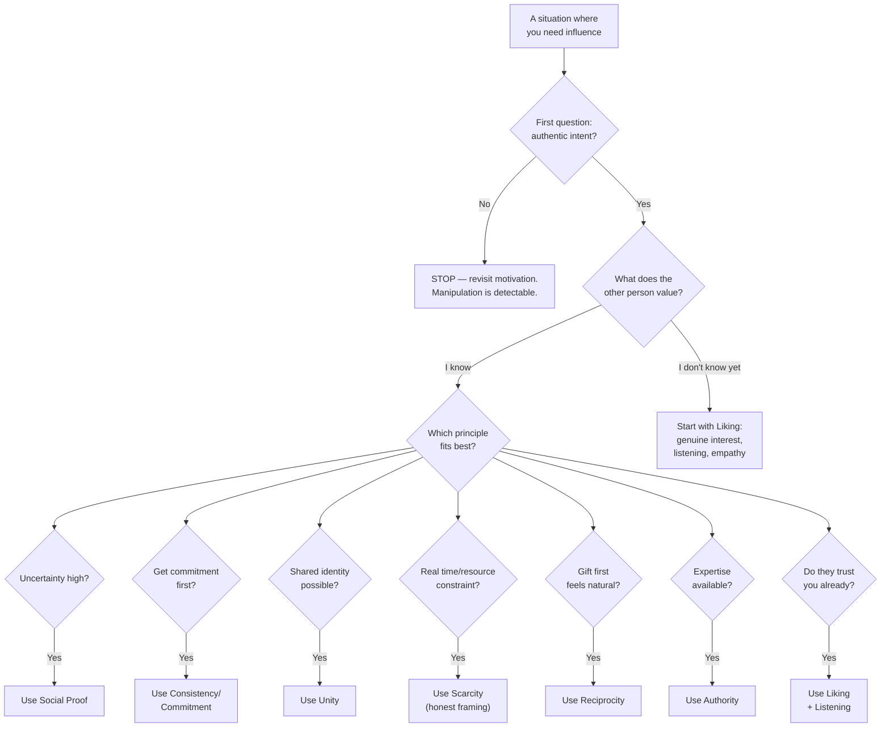
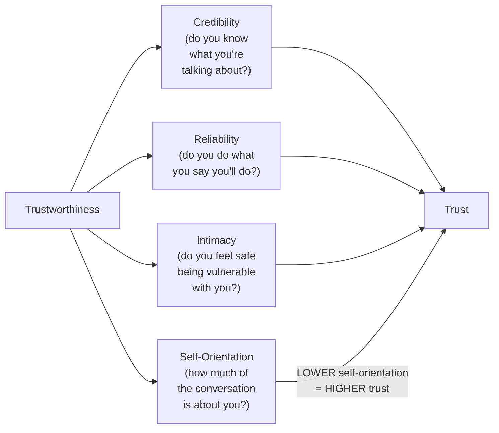

## The Seven Principles: Overview

Robert Cialdini's seven principles of influence, introduced in *Influence: The Psychology of Persuasion* (1984, updated 2021), are the structural backbone of Lederman's book. Lederman does not simply recount Cialdini — she re-frames each principle for the modern workplace, exposing its underlying neuroscientific mechanism, its ethical application, and the specific situations where it works or fails.

## Principle 1: Reciprocity

**The rule**: human beings are hardwired to return favors. When someone receives a gift, they experience an obligation to reciprocate — this is cross-cultural and appears in every studied society.

**Neuroscience**: giving activates fairness circuits in the brain's reward system. Unfair treatment triggers a negative response equivalent to physical pain.

**Practical application**: The workplace version of reciprocity is not "buy someone a coffee and ask for a favor." Done that way, it triggers detection and resistance. Lederman's five genuine reciprocity strategies:

1. **Be the first to give** — do so meaningfully, without strings visible. A handwritten note on someone's promotion. Sharing a relevant article for a colleague's project. Making an introduction to someone who can genuinely help them.
2. **Give what they value** — not what you would value. Learn what matters to the other person before giving. Time, access, recognition, and introductions are often more valuable than material gifts.
3. **Surprise them** — unexpected gifts have higher reciprocity weight than expected ones. A spontaneous acknowledgment during a team meeting outweighs a scheduled pep talk.
4. **Give publicly** — public recognition creates social reciprocity. When you acknowledge someone's contribution in front of peers, they feel the obligation to reciprocate in kind.
5. **Give without a closing ask** — no transaction in the same conversation. Let the gift stand alone. Pushing for an action in the same interaction converts a gift into a debt.

**When it fails**: if the recipient perceives manipulation (hidden strings, obvious quid pro quo), reciprocity becomes reactance — the subject pushes back harder.

## Principle 2: Consistency and Commitment

**The rule**: once people commit to something, they want to act consistently with that commitment — especially if the commitment was public.

**Neuroscience**: commitment activates identity-protection circuits. We experience inconsistency with our prior commitments as a threat to self-concept, and we resolve it by changing future behavior to match the commitment.

**Practical application**:
- **Start small**: get a small, voluntary commitment first. "Would you be open to a 15-minute call?" is a stronger opening than "Let me tell you about this opportunity." Small yeses lead to larger ones.
- **Make it public**: public commitments are up to 4x more durable than private ones. When someone has stated an intention to their team, they will act consistently with that statement.
- **Have them do the work**: the act of constructing an argument, creating a plan, or explaining a position makes the commitment their own. People who generate their own reasons are more committed than people who receive yours.

**When it fails**: if the commitment feels coerced, people experience reactance and deliberately act inconsistently to assert autonomy.

## Principle 3: Social Proof

**The rule**: when uncertain, people look to what others do to determine correct behavior. This is especially powerful in work environments where norms are shifting or invisible.

**Neuroscience**: social proof activates tribal belonging circuits — same neural pathways as physical pain when excluded, social reward when included.

**Practical application**:
- **Peer testimonials beat expert claims** — "Three teams in our division tried this approach and saw results" is more influential than "The research says this works."
- **Showcase early adopters** — identify respected, credible early adopters in the organization and make their adoption visible. Social proof depends on who the proof comes from as much as the facts.
- **Normalize the behavior you want** — if you want a culture where people speak up in meetings, start by publicly recognizing the first few who do. The norm shifts faster than you expect.
- **Create a "bandwagon feel"** — phrase invitations around others' participation: "35 people have already signed up." The framing of social proof is nearly as important as its truthfulness.

**When it fails**: if the audience feels manipulated ("they're just showing me the positives"), the effect reverses. Authenticity check: are you showing real evidence, or just the cherry-picked subset?

## Principle 4: Liking

**The rule**: we say yes to people we like more than to people we don't. Liking is a strong predictor of compliance independent of authority, expertise, or logic.

**Neuroscience**: liking activates oxytocin release, the bonding hormone. Warmth is processed faster than competence — people assess whether they like you in the first 30 seconds, before they evaluate your credentials.

**Practical application**:
- **Warmth first, competence second** — in first interactions, prioritize connection over credentials. Ask a genuine question about their work. Notice and acknowledge something specific about them.
- **Find genuine common ground** — not manufactured similarity. Shared interests outside work, mutual acquaintances, similar experiences. Lederman: "common ground must be real, or the interaction becomes a transaction."
- **Give sincere compliments** — not flattery. A specific, earned compliment ("You handled that client escalation with remarkable calm") builds more liking capital than a general one ("Great job!").
- **Remember names and details** — names are the most personal word in any language. Using someone's name signals they are seen as an individual, not a role.

**When it fails**: if warmth is perceived as manipulative or fake, the interaction deepens resistance rather than dissolving it.

## Principle 5: Authority

**The rule**: people comply more readily with requests from individuals perceived as knowledgeable, credible, and authoritative.

**Neuroscience**: authority activates hierarchical-processing circuits. People automatically defer to perceived experts — but this same circuit triggers resistance when authority is perceived as illegitimate or overbearing.

**Practical application**:
- **Demonstrate expertise implicitly** — share a relevant story, reference specific experience, cite specific data. Let others draw the conclusion rather than announcing credentials.
- **Share the story behind the expertise** — "I've seen this play out three times in similar situations, and here's what worked" is more authoritative than "I'm the expert, trust me."
- **Be authentic about the limits of your knowledge** — admitting uncertainty when you don't know something builds more long-term authority than bluffing through it.
- **Use third-party validation** — when you can't demonstrate expertise directly, reference respected sources. "Our VP of Product asked us to explore this" carries more weight than "I think we should do this."

**When it fails**: when authority is perceived as coercive or out of touch, it triggers resistance rather than compliance.

## Principle 6: Scarcity

**The rule**: people assign higher value to things that are less available, exclusive, or limited in time.

**Neuroscience**: scarcity activates loss-aversion circuits — Kahneman and Tversky's finding that losses hurt twice as much as equivalent gains feel good.

**Practical application**:
- **Use scarcity to help people make better decisions** — "This proposal is open for feedback through Friday" frames the ask around a real deadline, not a manufactured one.
- **Be honest about limitations** — if capacity or budget is genuinely constrained, say so. Honest scarcity framing raises perceived value without triggering reactance.
- **Create exclusivity through genuine access** — a small, engaged cohort produces more influence than a broadcast to many. "This is a pilot group" has real weight.
- **Avoid fake urgency** — manufactured deadlines ("offer expires in 24 hours!") that are routinely violated destroy trust.

**When it fails**: if scarcity is perceived as manipulative or if the offer is revealed as low-value, the effect is negative — people remember the pressure, not the value.

## Principle 7: Unity

**The rule**: the most powerful influence principle. Shared identity — "we're in the same group, we have the same goals, we belong to the same community" — produces influence that defies individual self-interest.

**Neuroscience**: unity activates in-group bonding circuits. Tribal belonging is one of the oldest and strongest drive systems in the human brain.

**Practical application**:
- **Use "we" before "me"** — frame ideas around shared goals first. "How does this help *us* achieve our targets?" before "I need you to do X."
- **Find a shared identity** — "We're both engineers who care about code quality" is more connective than "I need your sign-off."
- **Acknowledge shared context** — "I know we're both under pressure from the same deadline" creates immediate ground for collaboration.
- **Build genuine belonging** — unity cannot be faked long-term. It is built over time through consistent shared experience and mutual care.

**When it fails**: if unity is manufactured for a specific transaction, it will be detected and resented. Authentic belonging is a long-game investment.

## The Character Foundation: Emotional Intelligence

Lederman's distinct contribution is insisting that emotional intelligence is not supplementary to influence — it is the prerequisite. Without EI, the seven principles are tools that can be used for manipulation. With EI, they become habits of authentic connection.

The five EI components:
- **Self-awareness**: knowing your emotional triggers (what makes you defensive, what makes you shut down, what makes you overreact) before the interaction begins.
- **Self-regulation**: managing those reactions so they do not become the interaction. Influence requires emotional presence, not emotional reactivity.
- **Motivation**: genuinely wanting mutual benefit, not just personal gain. People detect motive within seconds of conversation.
- **Empathy**: understanding others' perspectives deeply enough that you can frame requests in terms of what matters to them — not just to you.
- **Social skill**: communicating warmth and competence simultaneously. Most people alternate between being too warm (not credible) or too competent (not likable).

## Influence in the Workplace: A Decision Framework

## Resistance as Relationship Data

One of the book's most actionable insights: resistance is not a dead end — it is information. When people hesitate, push back, or say "I'm not sure," they are signaling something important about their experience, their fears, or their values.

Lederman offers a three-step resistance framework:

1. **Stop pushing** — pushing through resistance is the most common mistake. Pressure creates reactance. When you encounter resistance, reduce pressure.
2. **Name the resistance** — "It seems like you have some concerns about this. What are you most worried about?" Naming resistance out loud often dissolves it because it shifts the interaction from fight to dialogue.
3. **Address the underlying need** — once you hear what's actually driving the resistance, you can address it directly. Often the objection dissolves once the underlying concern is acknowledged.

## Building Authentic Relationships: The Trust Equation

Lederman uses the Trust Equation as a unifying framework:

The highest-leverage variable is **self-orientation** — how much of the interaction focuses on you versus the other person. People with low self-orientation (who genuinely listen, ask about others, frame things in terms of the other person's concerns) are trusted far more than those with high self-orientation (who lead every conversation back to their own agenda).

## Key Lessons

1. Influence is not manipulation — the difference is in intent, outcome, and method
2. The 7 principles are automatic, low-road responses — reasoning cannot override them; you must speak to them directly
3. Warmth is assessed before competence — first impressions are hard to change
4. Emotional intelligence is the prerequisite for ethical influence — without it, principles become weapons
5. Resistance is data, not an obstacle — listen before you push
6. Small gestures compound — authentic relationship capital builds over months and years
7. Authenticity cannot be faked — people detect manufactured warmth within seconds
8. Shared identity ("we") is the most powerful influence lever of all
9. When to use each principle is as important as how — misapplied principles backfire
10. Influence is a learnable skill — but it requires deliberate, honest practice and honest self-assessment

## Action Plan

**Week 1: Self-awareness baseline** — Track every interaction this week. After each, rate: (a) was I authentic, (b) did I listen more than I talked, (c) did I frame my ask in terms of what the other person wanted. No judgment — just awareness.

**Week 2: Principle focus — Liking** — Every day, find one genuine, specific compliment or point of connection with each person you interact with professionally. Not flattery. Attention.

**Week 3: Principle focus — Reciprocity** — Do one unasked-for, genuinely helpful thing per day. No closing ask. Let the gift stand alone. Note how the relationship dynamic changes.

**Week 4: Principle focus — Listening** — In every meeting this week, practice 70/30 listening. Ask one more clarifying question before you offer your perspective. Resist the urge to solve the problem before they've finished describing it.

**Ongoing practice**: Once per month, review your EI baseline. Which principle are you overusing? Which are you underusing? What does your resistance data tell you about which situations make you feel least authentic? (End of file - total 193 lines)