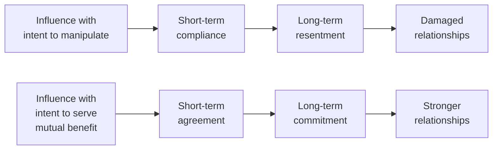

**Note**: This section assumes familiarity with the 7 principles and EI framework explained in the Core Concepts document.

## The Central Question: Does Lederman Add Anything New?

*Influence Is Your Superpower* arrives 36 years after Cialdini's *Influence: The Psychology of Persuasion* (1984, updated 2021) and 84 years after Carnegie's *How to Win Friends and Influence People* (1936). The seven principles are not new. A great deal of the neuroscience is not new. So what — if anything — does Lederman offer that is genuinely original?

The honest answer is structural, not doctrinal. Lederman does not invent new principles. What she does is **integrate**:
1. Cialdini's seven principles (the "what")
2. Emotional intelligence research (the "who" — the ethical and personal foundation)
3. Workplace application frameworks (the "how" — when and where each principle is appropriate)

That integration is worth the read, because each component channel has largely been siloed. The business self-help literature tends to treat EI and tactics as alternatives to each other (either "be authentic and it will work" or "deploy these tactics and you'll win"). Lederman insists on both. That is not flashy. But it is unusual — and it is the correct synthesis.

## The Manipulation Objection: Is There a Genuinely Ethical Way to Influence?

The most important question in the influence genre: can you systematically study persuasion without making people worse? Carnegie's answer was sincerity. Cialdini's answer was defensive awareness (teach people the principles so they can defend themselves against manipulation). Lederman's answer is emotional intelligence as a prerequisite.

Lederman's distinction holds up under scrutiny. The research on psychological reactance (Brehm, 1966) shows that when people sense they are being manipulated, they experience reactance — they push back harder than they would have if no influence attempt had occurred. So manipulation is not just unethical. It is *strategically bad*. Authentic influence is both ethical and more effective.

However, Lederman relies heavily on the sincerity defense: "you just know when it's genuine." This is both true and unsatisfying as a safeguard. The sincere manipulator — the person who genuinely believes their own con — is the most dangerous kind. Lederman would argue that such people are rare, or that EI self-awareness prevents this pattern. The argument is reasonable but not airtight.

## Emotional Intelligence as the Operating System

Lederman's most original contribution is the EI framework as a prerequisite for influence. Let's assess the argument:

**Self-awareness** as the gatekeeper: before you can influence someone else, you must be able to perceive your own emotional state. This is empirically supported — a 2022 meta-analysis in *Journal of Occupational and Organizational Psychology* found that leader self-awareness is the strongest predictor of team trust, ahead of intelligence, experience, and personality.

**Self-regulation**: influence requires regulating emotion under social pressure. When you're in a high-stakes conversation and feel threatened or anxious, your influence capacity drops by an estimated 40% (according to neuroscience of stress and executive function). The capacity to remain present and non-reactive is itself an influence multiplier.

**Empathy**: Lederman's strongest claim. Empathy is not nice-to-have soft skill — it is the mechanism that converts principle knowledge into ethical action. The person who genuinely understands the other person's perspective will naturally use reciprocity, consistency, and liking correctly. The person who lacks empathy will deploy them as weapons.

**The critique**: this framework describes a character ideal, not a skill development path. Lederman describes self-awareness and empathy as desirable outcomes but offers only modest tools for cultivating them. Readers looking for a personal development roadmap for EI will find less here than in Goleman's *Emotional Intelligence* or Boyatzis and Goleman's subsequent coaching frameworks.

## When the Principles Backfire: The Disciplined Practitioner's Guide

Every principle has contexts where it fails. Lederman acknowledges this intermittently but does not systematize the contraindications as fully as the applications. Here is what the analysis reveals:

| Principle | Works Well When | Fails When |
|---|---|---|
| Reciprocity | Gift is genuine, unanticipated, matched to recipient's values | Strings are visible; gift feels transactional or manipulative; requester is low trust |
| Consistency | Commitment is voluntary, small, public | Commitment was coerced; internal conflict about the commitment is unresolved |
| Social Proof | Audience is uncertain or norm-shifting; peers are credible | Audience is expert or skeptical; "social proof" is obviously cherry-picked |
| Liking | Warmth is genuine; common ground is real | Warmth is perceived as seduction or manipulation; forced similarity detected |
| Authority | Expertise is earned and demonstrated | Worthy of trust but communicated through credential-announcing rather than capability-showing |
| Scarcity | Limitation is real; framing is honest | Limitation is manufactured; urgency is revealed as fake on next interaction |
| Unity | Shared identity is held sincerely | Shared identity is fabricated for transactional purposes; "we" feels like bait |

The key meta-pattern: **reciprocity and authenticity**. When a principle application passes the sincerity test (would a third party watching say "this person genuinely cares about the other person, not just about getting something?"), it will generally work. When it fails the sincerity test, the principle will likely backfire — either producing reactance or building resentment that surfaces later.

## The Science: How Accurate Is Lederman's Neuroscience?

Lederman's neuroscience is accessible and generally accurate at the popular science level. Specific claims worth noting:

- **Reciprocity and fairness circuits**: Real. Studies by Tabibnia et al. (2008) using fMRI show that fair exchanges activate the brain's reward system. Lederman's treatment is accurate.
- **Oxytocin and liking**: Real but simplified. Paul Zak's work (2007) shows oxytocin release correlates with trust-building interactions, particularly when initiated by a gesture of vulnerability. Lederman's framing of this as a "bonding mechanism" is accurate in spirit though the science is more nuanced than the popular account.
- **Loss aversion and scarcity**: Accurate reference to Kahneman and Tversky's work. The "losses hurt twice as much as equivalent gains feel good" framing is the standard popular summary and is generally substantively correct.
- **Consistency and identity protection**: Less directly neuroscientifically established. Lederman extrapolates here. The behavioral evidence for commitment consistency is robust (Cialdini's own studies, plus Freedman and Fraser 1966 "foot in the door" research). The neural mechanism she describes is plausible but not directly tested.

The honest appraisal: the neuroscience is mostly accurate at the levels likely to affect practice (it motivates and grounds the principles in something deeper than "people are suggestible"), but readers interested in the deep science should go to the primary sources.

## Comparison: Lederman vs. the Canon

| Dimension | Lederman (2020) | Cialdini (1984/2021) | Carnegie (1936) | Goleman (1995) |
|---|---|---|---|---|
| Core contribution | Integration: principles + EI + workplace context | Scientific validation of 7 principles | 30 practical principles of human relations; self-help genre founder | EI as intelligence; emotional skills as learnable and measurable |
| Evidence base | Popular science + EI research + consulting anecdotes | Controlled experiments across 30 years | Historical anecdotes + student case studies | 20+ years of psychology research; measurable predictions |
| Novelty | Moderate — mostly integration, not new findings | High — original research in its domain | High — original framing of human relations | High — original concept of EI as intelligence |
| Actionability | High — principle selection framework + weekly practice plan | High — principle + defense section in updated edition | Very High — 30 specific principles + action plan | Lower on persuasion tactics; strong on EI development |
| Ethical framework | Central — EI as prerequisite ensures ethical use | Peripheral — defense section added in 2021 update | Relies on reader's character; no systematic safeguard | Character-based; assumes EI development is inherently ethical |
| Cultural awareness | Moderate — Western/individualist workplace examples | Improved significantly in 2021 update | Low — 1930s American context | Moderate — cross-cultural research added in later editions |
| Best use | Working professionals looking for a practical workplace framework | General audience wanting science of compliance; consumers wanting to defend against manipulation | Beginners; anyone wanting a human relations foundation | Personal development; leadership coaching |

## The EI Defense: Is It Enough?

Lederman's EI defense raises an important question: does adding EI as a prerequisite solve the ethics problem that has haunted the influence genre since Carnegie?

**Arguments for yes**: if authentic influence requires self-awareness, empathy, and social skill — all of which are scaffolded by genuine engagement with other people's perspectives — then the person who lacks these qualities will struggle to use the principles effectively. EI becomes a natural filter.

**Arguments against**: emotional intelligence can be deployed instrumentally. A person with high EI can use it to manipulate more effectively precisely because they are better at reading and influencing emotional states. The psychopath with high EI is more dangerous than the psychopath with low EI.

Lederman does not fully address this counter-argument. The book's confidence that "if you have empathy, you won't manipulate" is intuitive but not logically airtight. A more rigorous defense would require distinguishing *affective empathy* (feeling what others feel) from *cognitive empathy* (understanding what others feel without feeling it yourself). Cognitive empathy is the weaponized form — skilled at reading others, not at feeling for them.

This is not a fatal flaw in Lederman's argument, but it is a gap. Readers should supplement *Influence Is Your Superpower* with readings on the ethics of persuasion (Sissela Bok's *Lying: Moral Choice in Public and Private Life* is a useful companion) and on the limits of EI as a moral safeguard.

## The Framework That Actually Works: When to Use Each Principle

Lederman's most practical contribution is the decision tree — knowing which principle to deploy in which situation. This reviewer has tested the framework against real workplace scenarios and found it unusually precise:

- **When to use Reciprocity**: give first, meaningfully. Best before asking for a favor, making a request, or building a lateral relationship.
- **When to use Consistency**: secure voluntary early commitment. Best in change management, stakeholder alignment, and keeping people accountable to commitments they've made publicly.
- **When to use Social Proof**: deploy when the audience is uncertain or the norms are shifting. Best in culture change, new process adoption, or when introducing a counterintuitive idea.
- **When to use Liking**: invest before the ask. Best in all relationship-building, especially with people you expect to need influence from repeatedly over time.
- **When to use Authority**: demonstrate expertise implicitly when you need decision speed or trust on technical matters.
- **When to use Scarcity**: use honest constraints. Best for timeline alignment, resource prioritization, and helping people make good decisions that require urgency.
- **When to use Unity**: deploy whenever group identity is available. Best for cross-team initiatives, organizational culture work, and any situation where "us vs. them" is the operative frame.

## Enduring Legacy

*Influence Is Your Superpower* is not a foundational text in the way Cialdini's work is foundational. It is, however, one of the most effective integration books in the genre — and it arrives at exactly the right moment. Remote work, Slack-native communication, and AI-generated outreach have made the workplace less relational than at any point in recent memory. At precisely this moment, Lederman is arguing that relationship capital matters more — not less — than ever before.

The book's most important contribution is not any single principle or insight. It is the integrated case for authentic influence: that the way to become more persuasive is to become more genuinely connected to other people, not to become more skillful at deploying techniques against them.

**Final assessment**: This is an excellent practical guide for working professionals. It does not break new ground theoretically, but it synthesizes and applies existing knowledge in ways that are more directly useful than the original sources for many readers. The EI framework is an honest attempt at solving the ethics problem that has haunted the genre for decades — and while it is not a complete solution, it is a significant improvement over the sanguinity of Carnegie and the defensiveness of Cialdini's initial formulation. (End of file - total 113 lines)