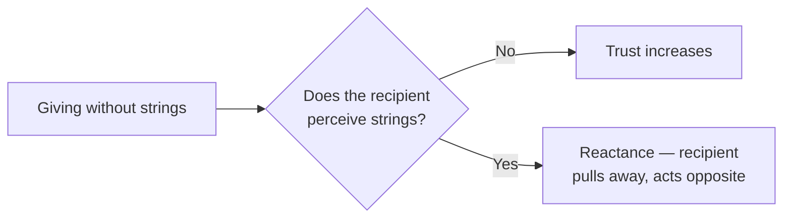
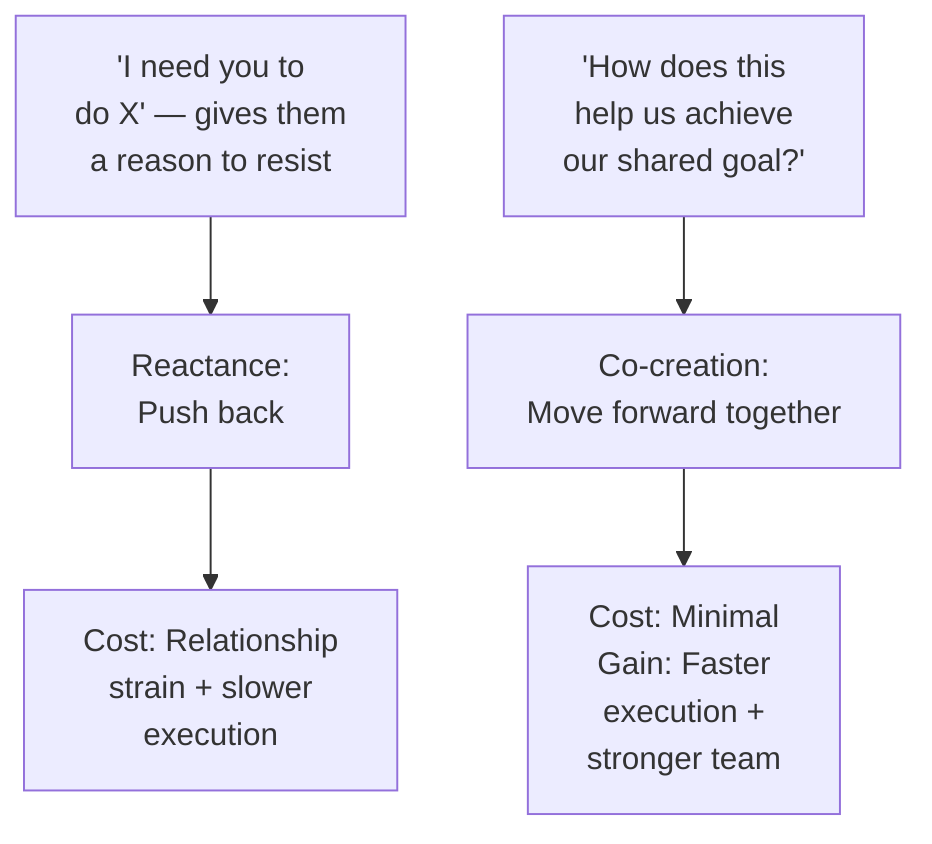
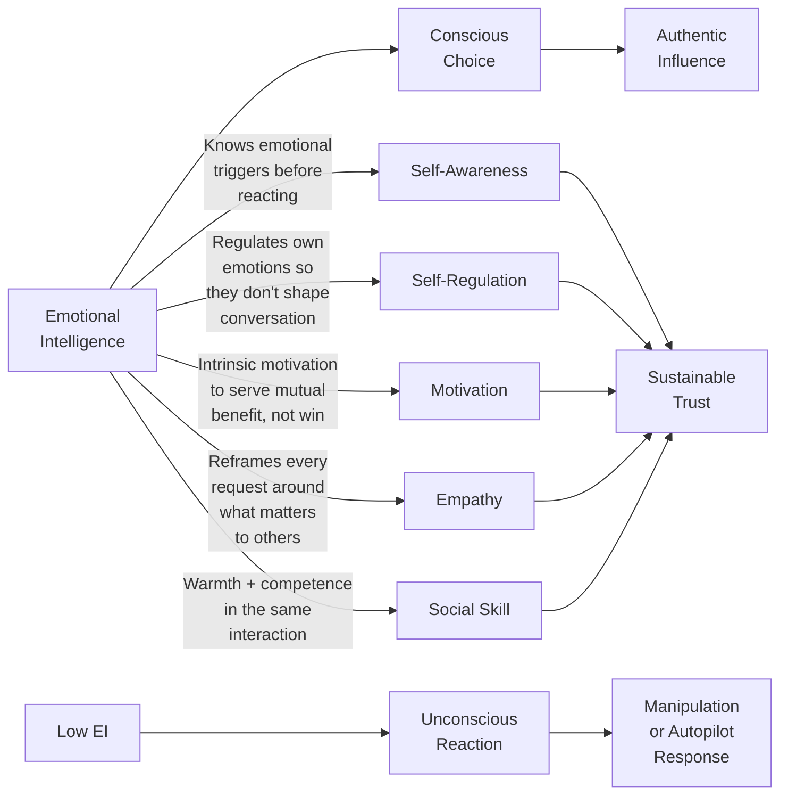

**[Host]**: Welcome to BookLab. Today's book is *Influence Is Your Superpower* by Michelle Tillis Lederman — a book that promises to teach you how to persuade ethically, using Cialdini's seven principles plus emotional intelligence. With me are two guests who have very different takes. Priya Anand is an organizational development consultant who uses Lederman's framework with Fortune 500 clients. James Okonkwo is a management scholar at a business school who studies dark persuasion and organizational ethics. Welcome, both.

**[Priya]**: Great to be here. I'll be honest — this book changed how I work. It gave me language for something I was doing imperfectly — building trust intentionally rather than hoping it happens.

**[James]**: I'll be honest too — I have a problem with this entire genre. Every book about influence presents a choice between being good and being effective. It suggests you can't be both. Lederman's book promises to resolve that tension through emotional intelligence. I want to examine whether EI actually solves the problem, or just dresses it up.

---

**[Host]**: Let's start with the book's core claim. Michelle Lederman says the difference between influence and manipulation is intent — influence serves mutual benefit, manipulation exploits vulnerability. Priya, you think this is real?

**[Priya]**: I think it's real, and I think it's testable. In my work with teams, I watch how people respond to the same message delivered two different ways. The "I need you to do this because I said so" version produces compliance and resentment. The "I have a concern, and I'd value your help thinking through it" version produces commitment and follow-through. Same words, different intent, different outcome. You can feel the difference in the room.

**[James]**: You've described competence, not ethics. The manager who gets better results through warmth is a more effective manager. That doesn't mean they're acting from a place of genuine concern. They might just be better at reading emotional states. And that's the thinness in Lederman's argument: emotional intelligence is a capability, not a moral commitment.

**[Priya]**: I'd push back on that. EI requires self-awareness. If I'm trying to manipulate you, I'm ignoring your actual needs and focusing on mine. That's low self-awareness and low empathy — not high EI. The person who genuinely practices EI is not manipulating. By definition.

**[James]**: You've redefined EI to exclude the possibility of cognitive empathy without affective empathy. But cognitive empathy — understanding someone's psychological state without necessarily caring about it — is real, measurable, and demonstrably usable instrumentally. High-IQ psychopaths are the test case. They read people exceptionally well. They don't feel with them. And they're very influenceable — or rather, very influential. EI without moral grounding is just enhanced manipulative capability.

**[Priya]**: But that's exactly what Lederman argues against. She says the fifth component of EI — social skill — includes authenticity as part of the skill set. A manipulator can appear warm in the moment. They can't maintain warmth over time when it doesn't align with intent. The relationships fall apart.

**[James]**: They fall apart for the *audience*, maybe. Not for the manipulator, who moves on to the next target. Lederman writes about leaders building lasting organizations. That's one context. But influence principles get deployed in one-shot transactions constantly — job interviews, sales calls, first dates. Authenticity has time to surface in long-term relationships. In one-shot interactions, warmth and technique can do the damage before the target knows what happened.

---

**[Host]**: Let's talk about one specific principle — reciprocity. Lederman gives five strategies for workplace gifting. James, you found the most interesting flaw here.

**[James]**: Yes. The reciprocity principle is powerful — no argument there. But it only works if the recipient *doesn't* detect an agenda. And what happens when half the company has read this book? We all start giving first — no strings — and what happens when *everyone* has an IOU from everyone else? The system creates a debt economy in relationships. Lederman doesn't address the macro effect: if everyone deploys reciprocity optimizers, the baseline for trust shifts. You have to give *more* to achieve the same effect.

**[Priya]**: That's a genuinely interesting objection. But it assumes people are optimizing for influence rather than relating. In my experience, the people who are most influential aren't the ones who've ticked off their monthly reciprocity quota. They're the ones whose help feels genuinely theirs, not calculated. Colleagues say "She always comes through" not "She strategically deployed the reciprocity principle."

**[James]**: And colleagues often can't tell the difference until it's too late. Sincerity is not externally auditable. That's exactly the problem.

---

**[Host]**: Let's try another principle — remember names. Lederman says this signals that you see the person as an individual, not a role. You're skeptical of this, James?

**[James]**: I'm skeptical of the principle as a universal. It matters in some cultures and contexts — the U.S., individualist norms, small teams. But I've watched high-performing teams in Japan and Scandinavia where names are used sparingly and influence flows through different mechanisms — consistency of action, reliability, shared work quality. Remembering someone's name in a culture where formal address is standard can actually be perceived as invasive. Lederman acknowledges cultural context but her prescription assumes an individualist American workplace.

**[Priya]**: I agree the cultural point is real. But inside a single culture, the name principle still holds. And regardless of culture, the underlying thing — demonstrating that you see the person as an individual — is universal. It just might manifest differently.

---

**[Host]**: Let's try the unity principle — shared identity, "we" before "me." Both of you seem to like this one the best.

**[Priya]**: Unity is where influence stops being interpersonal and becomes transformational. When I frame a project around "our shared goal" rather than "my project I need you to support," the entire energy of the conversation changes. People move from resistance to co-creation. The unity frame doesn't require my audience to change what they want. It lets them see that what they want and what I want are aligned.

**[James]**: Unity is genuine, and I agree it's the strongest principle. But it also reveals the most about Lederman's ethics. If the shared identity isn't real — if it's manufactured to get someone to act in a way they wouldn't otherwise choose — then it's manipulation at the group level. Union-busting consultants use unity principles: "we're all in this together to hit our numbers." The chimera of unity is one of the most powerful manipulation tools in the organizational toolkit.

**[Priya]**: But manufactured unity doesn't *feel* like unity for long. You can tell when "our shared goal" is real versus when it's a sales pitch. And over time, people distance themselves from leaders who use language they don't mean.

**[James]**: In the short term — the quarterly review cycle, the seven-month project — the distinction doesn't fully materialize. Trust erodes slowly and insidiously. That's the danger.

---

**[Host]**: Final question to both of you — should people read this book?

**[Priya]**: Yes, absolutely. It won't make you a manipulator if you're not one already, and it will make you a better communicator, a better manager, and a better colleague. The EI integration is genuine and it matters. The actionable frameworks are practical — I use the decision tree weekly.

**[James]**: Read it. But read it critically. Ask yourself: am I deploying this principle because I genuinely believe it serves the other person, or because it gets me what I want? If the honest answer is the second, then Lederman's framework will make you more effective at manipulation. That is not her intent, but intent is not the same as effect.

**[Host]**: The book is *Influence Is Your Superpower* by Michelle Tillis Lederman. Priya, James — thank you.

---

### Principles That Endure vs. Principles That Need Updating in 2025

| Principle | Verdict | Modern Context |
|---|---|---|
| Reciprocity | Endures | Most powerful on 1:1 relationships where genuine value can be given; less effective in broadcast/async communication where gift may be perceived as spam |
| Consistency | Endures | Remote work environments need explicit, documented commitments; Slack agreements without written follow-through erode trust faster than in-person |
| Social Proof | Endures with context caveats | Remote and hybrid teams have fragmented norms — what "everyone is doing" is less clear; explicit peer examples matter more |
| Liking | Endures | Zoom strips non-verbal warmth signals; invest extra effort in pre-call check-ins, personal references, and camera presence |
| Authority | Needs updating | Credentialism is declining in orgs with flat structures; demonstrated problem-solving and transparency matter more than titles |
| Scarcity | Use carefully | "Urgent" Slack pings and fake deadlines generate reactance; real scarcity (genuine capacity limits) is still effective |
| Unity | Endures | Most powerful in distributed teams if deliberately cultivated; shared rituals, shared language, and shared purpose matter more when you can't read body language |

### The EI Prerequisite: What It Means in Practice

Lederman presents five dimensions of EI as the prerequisite for influence:

### Where the Framework Meets Real Life

The most honest test of any influence framework is whether it survives a moment of genuine conflict. The listener might imagine a real scenario:

**Situation**: You're a senior engineer. A junior colleague proposes a technically flawed approach in a team meeting. You need to correct them without creating defensiveness, damaging trust, or embarrassing them publicly.

**Lederman's framework applied**:
1. **Liking + Social proof** first: begin publicly — "I appreciate that you dug into this — it's a hard problem and you've put real thought into it." Acknowledge publicly before correcting publicly.
2. **Empathy in private**: in a 1:1, ask about their reasoning before sharing concerns. "Talk me through how you arrived at this approach. I want to understand before I push back."
3. **Authority calmly**: share your perspective as experience — "I've seen this pattern before in two similar situations — here's what happened" — not as a credential-assertion.
4. **Consistency and reciprocity**: "What if we test both approaches against these criteria together?" Give them ownership of the comparison.

The framework holds. Not because it is clever, but because it is *authentic* — it treats the junior colleague as a real person with real reasoning, not as an obstacle to be managed.

That is Lederman's highest claim. The book delivers on it. (End of file - total 148 lines)