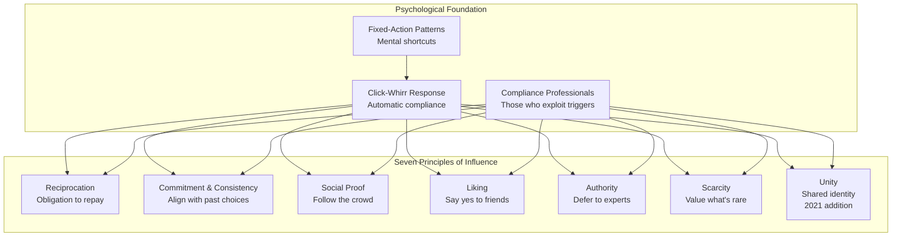

## Introduction: Weapons of Influence

Cialdini opens with a striking analogy: the mother turkey responds to the "cheep-cheep" sound of her chicks — even a stuffed polecat (her natural enemy) triggers maternal nurturing if it emits the right sound. Humans, Cialdini argues, are not so different. We have our own trigger features — specific pieces of information that activate predictable, automatic compliance sequences. He calls this the "click-whirr" response: a fixed-action pattern that runs automatically once triggered.

The problem is that the modern world overloads us with information and decisions. To cope, we rely on stereotypes and rules of thumb — usually accurate, sometimes catastrophically wrong. Compliance professionals — salespeople, fundraisers, advertisers, and con artists — learn which triggers produce which responses and exploit them with the efficiency of a jujitsu master: minimal force, maximum effect.

The chapter introduces the **contrast principle**: presenting two items in sequence so that the second seems more or less extreme than it actually is. A real estate agent shows a rundown house first, then a moderately priced one — the second looks like a bargain. A car salesman negotiates the price of the car first, then presents options — each add-on seems trivial compared to the large commitment already made. This principle, though simple, underlies many sophisticated influence campaigns.

## Chapter 1: Reciprocation — The Old Give and Take

The rule of reciprocation is universal across human cultures: we try to repay what another person has given us. This rule was essential to the development of human society — it allowed the division of labor, the exchange of goods, and the creation of mutual obligation networks.

Cialdini demonstrates its power through the story of the Hare Krishna募捐者. In the 1970s, the Krishnas were struggling to raise money in airports. Their breakthrough came when they began giving each passerby a flower — a small, inexpensive gift — before asking for a donation. Recipients who tried to refuse were told "It is our gift to you." Once someone accepted the flower, the obligation to reciprocate nearly compelled a donation. The technique transformed their fundraising.

**The Regan Coca-Cola experiment** (1971) provides the scientific evidence. Psychologist Dennis Regan had participants evaluate paintings with "Joe," a confederate. In one condition, Joe left the room and returned with two Cokes — one for himself, one for the participant. In another, he returned empty-handed. After the experiment, Joe asked participants to buy raffle tickets. Those who received the Coke bought nearly twice as many tickets. Crucially, this effect held even when participants disliked Joe — reciprocation overpowered liking.

**Reciprocal concession (the door-in-the-face technique)** is a powerful variant. Instead of giving something first, the persuader makes an extreme request that will be refused, then retreats to a smaller request. The retreat appears to be a concession, triggering the target's own obligation to reciprocate with a concession of their own — agreeing to the smaller request. Cialdini illustrates with a study where students were asked to chaperone juvenile delinquents on a zoo trip for two hours. Only 17% agreed. But when first asked to serve as a counselor for two years per week (universally refused), then the smaller request, 50% agreed.

**Defense**: Cialdini advises accepting initial favors or concessions as just that — not as obligations to repay with a larger one. If you recognize that a gift is a compliance tactic, you can reframe it: the person has exploited the rule, so you are under no genuine obligation. Accept the gift if you want it, but do not feel compelled to reciprocate on their terms.

## Chapter 2: Commitment and Consistency — Hobgoblins of the Mind

People have a deep desire to appear consistent. Once we make a choice or take a stand, we encounter both personal and interpersonal pressure to behave consistently with that commitment. This tendency is so strong that it can lead people to do things they would otherwise never consider.

Cialdini illustrates with the **Chinese prisoner-of-war brainwashing techniques** during the Korean War. Prisoners were asked to write mild pro-communist statements as part of "essay contests." Once committed on paper, they were pressured to elaborate and defend these views publicly. The small initial commitment — a trivial essay — snowballed into genuine attitude change as prisoners worked to align their beliefs with their public statements.

**The foot-in-the-door technique** is the purest application. Researchers asked homeowners to place a small, ugly "Drive Safely" sign in their front yard. Only 17% agreed. In a different neighborhood, they first asked homeowners to display a small 3-inch square sign that read "Be a Safe Driver" — nearly all agreed. Two weeks later, when asked for the large ugly sign, 76% agreed. The initial small commitment created a self-image as someone who cares about safe driving; the larger request was consistent with that self-image.

**Commitment is most powerful when it is active, public, effortful, and freely chosen.** Written commitments are stronger than verbal. Public pledges are stronger than private. Commitments that required effort create more internal justification. And commitments made without strong external pressure are most binding because the person attributes the choice to their own character, not to coercion.

**Defense**: Cialdini advises listening for signals of "consistency traps" — feeling pressure to go along with something simply because you said you would earlier. Ask yourself: "Knowing what I know now, if I could go back, would I make the same choice?" The key is distinguishing between genuine commitment and rigidity based on a sunk cost.

## Chapter 3: Social Proof — Truths Are Us

The principle of social proof holds that we determine what is correct by observing what other people think is correct. This is most powerful in ambiguous situations — when we are uncertain, we look to similar others for guidance.

**The canned laughter study** is a classic demonstration. Television producers discovered that adding laugh tracks increased the perceived humor of shows, even bad ones. Audiences laughed longer and more often when they heard others laughing — the laughter of strangers serves as social proof that something is funny.

Cialdini recounts the **Jonestown massacre** as a dark example: 900 people drank cyanide-laced Kool-Aid because they saw others doing it, in a context of extreme uncertainty and social pressure. The principle of social proof — "everyone else is doing it" — overrode individual survival instinct.

**The Werther effect** describes copycat suicides following highly publicized suicide stories. Researchers found that suicide rates increased measurably after front-page suicide stories, particularly when the deceased was portrayed as similar to the reader. The social proof was: "If someone like me chose to die, perhaps that is the correct response to my situation."

**Pluralistic ignorance** is a dangerous form of social proof. Cialdini describes the Kitty Genovese murder, where 38 witnesses watched from their apartments without calling police. Each witness saw others doing nothing and concluded that no intervention was needed — since no one else was acting, the situation must not be an emergency.

**Defense**: Cialdini warns against blindly following social proof from people who are not genuinely similar to us. Ask: "Are these people actually like me? Are they facing the same situation?" He also advises being suspicious when compliance professionals manufacture social proof (e.g., "fastest-growing company," "everyone is switching to our brand").

## Chapter 4: Liking — The Friendly Thief

People prefer to say yes to those they know and like. This seems obvious, but Cialdini reveals how systematically compliance professionals manufacture liking.

**Physical attractiveness** creates a powerful halo effect. Attractive people are judged as more talented, kind, honest, and intelligent — even on completely unrelated dimensions. Cialdini cites studies showing that attractive defendants receive lighter sentences, attractive job candidates are hired more often, and attractive students receive higher grades.

**Similarity** is another powerful trigger. We like people who are similar to us in background, opinions, dress, or lifestyle. Salespeople are trained to find and mirror similarity — "I grew up in that neighborhood too," "I also have kids that age." Even trivial similarities (same birthday, same taste in music) increase compliance.

**Compliments** increase liking dramatically. Cialdini cites a study where men received compliments from someone who wanted something from them: those who were flattered complied at significantly higher rates, even when the flattery was transparently manipulative.

**Contact and cooperation** — familiarity through repeated contact under positive conditions — builds liking. The Tupperware party is the ultimate example: the host (a friend) demonstrates products to friends in her home. The social bonds between host and attendees drive sales independent of product quality. People buy from friends because they like them.

**Association** — linking oneself or one's product with positive things — is the subtlest and most pervasive tactic. Car advertisers pair their vehicles with attractive models. Sports fans bask in reflected glory after their team wins ("we won") but distance themselves after a loss ("they lost"). The association principle transfers positive feelings from one thing to another.

**Defense**: Cialdini advises concentrating on the merits of the offer, not the person making it. He suggests asking: "Am I saying yes because I genuinely want what's offered, or because I like the person?" Separating feelings about the person from the decision itself is crucial.

## Chapter 5: Authority — Directed Deference

Humans are deeply conditioned to obey authority figures. This deference was adaptive — it allowed efficient social organization. But it can be triggered automatically by mere symbols of authority, independent of actual expertise.

The **Milgram shock experiments** are the definitive proof. Subjects were instructed by a researcher in a lab coat to administer increasingly severe electric shocks to a "learner" (who was actually an actor). Despite hearing cries of pain, 65% of subjects continued to the maximum voltage. The authority of science and the experimenter's confident demeanor overrode personal conscience.

Cialdini found that authority is triggered by **three key symbols**: titles, clothing, and trappings. Titles (Dr., Professor, CEO) signal superior knowledge and status, often without verification. Clothing — uniforms, business suits, lab coats — automatically commands deference. Trappings — expensive cars, elegant offices, fine jewelry — signal status and success.

**The actor-posing-as-physician study** showed that nurses would administer a clearly dangerous medication dosage when instructed over the phone by a man claiming to be a doctor — violating hospital policy in the process. The title "doctor" alone triggered compliance.

In another example, Cialdini describes how a con artist posing as a fire inspector convinced a hotel to evacuate and then burglarized empty rooms. The uniform and confident authority projection overrode all suspicion.

**Defense**: Cialdini suggests two questions: "Is this authority truly an expert in this specific area?" and "How honest can we expect this authority to be?" He advises questioning authority credentials, especially when the authority has something to gain from compliance. The key is to recognize that genuine authority provides expert information; fabricated authority merely uses the symbols of expertise.

## Chapter 6: Scarcity — The Rule of the Few

The scarcity principle: opportunities seem more valuable when their availability is limited. This is driven by the human tendency to want what we cannot have and to fear losing what we might gain.

Cialdini opens with the **cookie jar experiment**. Participants rated cookies as more attractive and desirable when there were only two cookies remaining compared to ten. But the most striking finding: cookies that became scarce because of demand (other people took the rest) were rated even higher than cookies that became scarce by accident.

**Limited-number and time-limited tactics** are everywhere: "Only three left in stock," "Offer expires today," "Exclusive limited edition." These create urgency by implying that others are competing for the same resource. Cialdini notes that this tactic is so effective that some retailers deliberately create artificial scarcity by advertising "limited quantities" when supply is plentiful.

**Psychological reactance** is the underlying mechanism. When our freedom to have something is limited or eliminated, we experience an unpleasant arousal state and work to reassert that freedom. This is why censored information becomes more desirable — the banned book effect. Cialdini cites the Romeo and Juliet effect: parental interference in a relationship intensifies romantic feelings.

**Scarcity and exclusive information**: Information that is rare or exclusive is perceived as more valuable and persuasive. Cialdini describes a study where beef customers were told that "information about a pending shortage" was confidential. Those told "exclusive" information found the beef more valuable and bought more.

**Defense**: Cialdini advises recognizing the emotional arousal that scarcity triggers — feeling rushed, excited, or fearful of missing out. He recommends asking: "Do I want this for what it does for me, or for the feeling of owning something rare?" The best defense is to pause and evaluate the intrinsic value of the item or opportunity independent of its availability.

## Chapter 7: Unity — The We Principle (2021 Edition)

Added in the New and Expanded edition, the unity principle holds that people are significantly more likely to comply with requests from those they perceive as sharing a meaningful social identity. Unity goes beyond liking — it creates a sense of merged identity where the other person's interests become your own.

Cialdini was inspired by the increased tribalism in modern society. He initially saw unity as an amplifier of other principles but came to see it as an independent force. "If you had unity, then scarcity or social proof were going to be more powerful. But then I started to see that it had a force that was independent of any of the others."

The **college fundraiser study** demonstrated unity dramatically: when a young woman began her pitch with "I'm a student," contributions increased by 450%. That single identity marker — shared student status — transformed a request from stranger to in-group member.

**Family and kinship** produce the strongest unity bonds. Cialdini discusses how shared last names, shared hometowns, and shared experiences (especially emotionally charged or synchronized ones like dancing, singing, or eating together) create feelings of "we-ness."

**Co-creation** — working together on a task — builds unity. The IKEA effect, where people value products they helped assemble more highly, is a form of this. Cialdini extends it to influence: asking someone to participate in creating a solution makes them feel part of the group, increasing compliance.

**Defense**: Cialdini suggests being alert to manufactured unity — claims of shared identity from strangers that feel premature or manipulative. Ask: "Are we genuinely in the same group, or is this a tactical attempt to create belonging?"

## Conclusion: Ethical Influence

Cialdini closes by emphasizing that the principles are morally neutral tools. They can be used to inform and educate — giving people honest, relevant information to make better decisions — or to manipulate and deceive.

**Ethical influence** is providing information that the target would genuinely want to know: "Other people who bought this product were satisfied" (social proof, honestly reported), "This expert reviewed the product and found it effective" (genuine authority), "This is a limited edition that won't be reproduced" (real scarcity).

**Unethical influence** is manufacturing false social proof, fabricating authority credentials, creating artificial scarcity, or using liking tactics to mask a defective product.

Cialdini argues that in the long run, ethical influence wins. Compliance professionals who deceive may succeed in the short term, but they destroy trust and cannot sustain their business. The most powerful influence is honest influence.

## Reading Guide

| Section | Chapters | Focus | Estimated Reading Time |
|---|---|---|---|
| Introduction | Weapons of Influence | The click-whirr response, contrast principle | 30 min |
| Part I | Ch 1: Reciprocation | The obligation to repay | 45 min |
| Part II | Ch 2: Commitment & Consistency | Aligning with past choices | 45 min |
| Part III | Ch 3: Social Proof | Following others in uncertainty | 40 min |
| Part IV | Ch 4: Liking | The power of friendship and similarity | 40 min |
| Part V | Ch 5: Authority | Deference to expertise and its symbols | 40 min |
| Part VI | Ch 6: Scarcity | The value of limited access | 35 min |
| Part VII | Ch 7: Unity (2021) | Shared identity as amplifier | 25 min |
| Conclusion | Ethical Influence | When and how to use the principles | 20 min |

**Reading path**: The book is best read sequentially — each chapter builds on the previous framework. The introduction and first two chapters (Reciprocation, Commitment/Consistency) are the most foundational. Chapters 3-6 (Social Proof, Liking, Authority, Scarcity) can be read in any order, though they reference earlier concepts. Chapter 7 (Unity) is only in the 2021 edition. For defense against manipulation, the "Defense" section at the end of each chapter is self-contained.

**Sufficiency**: This summary covers all seven chapters plus the introduction and conclusion. For complete depth, including the original full experimental data, field stories, and Cialdini's personal undercover anecdotes, the full book is recommended. The book is 320 pages (revised edition) and accessible to general readers with no psychology background.

**Chapters to prioritize**: Reciprocation (Ch 1) and Commitment/Consistency (Ch 2) are the most counterintuitive and have the strongest experimental support. Scarcity (Ch 6) has the most immediate practical application for marketing and sales readers. Unity (Ch 7) is the newest and least developed but provides insight into tribalism and polarization.
